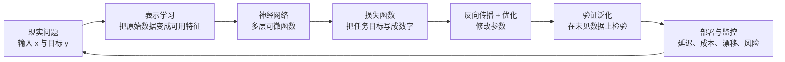
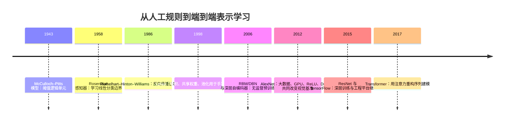
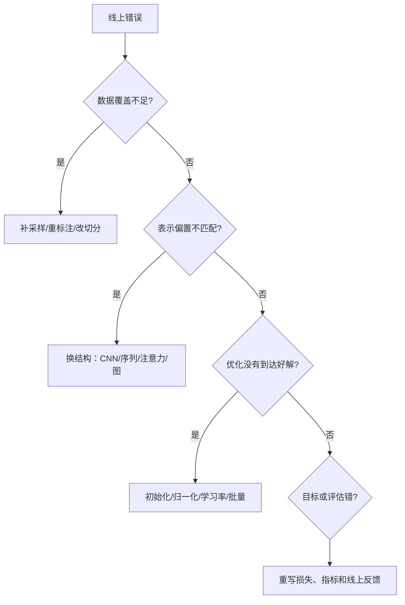

# 第1章 绪论

> 本章要回答的问题：为什么今天常常不再手工设计全部特征，而是让多层模型自己学出中间表示？

## 本章在全书中的位置

本章先建立一张地图：深度学习不是一组孤立的网络结构，而是表示学习、可微计算、数据与算力、优化工程的组合。第2章拆解神经元、层、损失函数和梯度；第3—5章展示视觉结构、概率生成结构和重构式表示学习；第6章处理泛化；第7章把数学落地到工具；第8章再回到应用和未来。

## 1.1 深度学习与机器学习

### 一句话理解

机器学习是“从数据中寻找能完成任务的规律”；深度学习是其中一类用很多可组合的参数层，同时学习任务规则和中间表示的方法。

### 第一性原理：真正的差别是“谁负责造特征”

设输入是 $x$，标签是 $y$。传统机器学习往往先人工构造特征 $\phi(x)$，再学习一个决策函数 $g$：

$$
\hat y=g_\theta(\phi(x))
$$

深度学习把 $\phi$ 也放进模型里，让它和 $g$ 一起从任务损失中学习：

$$
\hat y=g_{\theta_g}\bigl(\phi_{\theta_\phi}(x)\bigr)
$$

所以“深度”最重要的含义不是层数本身，而是表示变换可以被连续堆叠，并由最终目标统一校正。图像识别中，像素不是“猫”；边缘、纹理、局部部件和整体形状，是逐层形成的中间表示。

机器学习并不等于“浅层、人工特征”，深度学习也不等于“任何神经网络”。更稳妥的分类方式是看三个问题：监督信号是什么，表示由谁构造，架构对数据预先假设了什么规律。

| 维度 | 需要问的问题 | 工业含义 |
|---|---|---|
| 监督信号 | 标签、相似度、重构误差还是环境回报？ | 决定数据成本和训练目标 |
| 表示位置 | 特征由人写死，还是由模型学习？ | 决定迁移能力和维护成本 |
| 归纳偏置 | 模型预先假定局部性、平移性、序列性吗？ | 决定样本效率与模型结构 |

### 工业联系：人工经验没有消失，只是位置变了

在真实项目里，人工经验通常从“给每个样本写一堆特征”转向：设计标签和采样规则、选择匹配数据结构的模型、定义错误成本、约束输入输出和安全边界、设计离线指标与线上反馈。模型只在可学习部分负责表示与决策。

### 我的洞见

“深度学习自动学习特征”容易让人误以为模型不需要知识。更准确的说法是：**把知识从显式特征函数，迁移到数据、架构、损失和训练过程里**。知识没有消失，只是换了载体。

英文综述 [Deep learning（LeCun、Bengio、Hinton，Nature）](https://www.nature.com/articles/nature14539) 的价值不只是定义深度学习，而是把反向传播、卷积网络和大数据/算力放在同一条因果链上。读它时重点看“表示如何逐层抽象”，不要只记住“深度网络很强”。

## 1.2 深度学习的发展历程

### 时间线：多个瓶颈一起松动

- 阈值模型说明很多逻辑关系可以用参数化单元表达，但单个线性边界能力有限。
- 反向传播解决了“隐藏层应该怎么改”的信用分配问题。
- 卷积把视觉中的局部性和平移规律写进架构，减少参数并提高样本效率。
- RBM/自编码器让“没有标签也能学习表示”变成可操作的训练路线。
- GPU、数据集和激活/正则化技术让更大的模型真正训练得动、泛化得好。

英文原始论文 [Learning representations by back-propagating errors](https://doi.org/10.1038/323533a0) 有一个值得慢读的观点：反向传播不只是降低输出误差，还会让隐藏单元形成对任务有用的特征。英文论文 [Gradient-based learning applied to document recognition](https://leon.bottou.org/papers/lecun-98h) 则把卷积结构放进实际文档识别流水线，说明结构归纳偏置比单纯增加层数更重要。

AlexNet 的意义也不是“某个网络赢了比赛”，而是大规模数据、GPU 并行卷积、非饱和激活、Dropout 和足够大的模型同时凑齐。[原论文](https://papers.nips.cc/paper_files/paper/2012/hash/c399862d3b9d6b76c8436e924a68c45b-Abstract.html) 记录了 1.3 百万张图像、1000 类分类任务和 6000 万参数的规模。它告诉工业界：当数据、计算和训练技巧一起改善时，模型能力会出现非线性跃迁。

### 我的洞见

历史更像四个旋钮逐步被拧到可用区间：

$$
\text{可用能力}\approx
\text{表示能力}\times\text{数据覆盖}\times\text{计算预算}\times\text{优化稳定性}
$$

其中任何一项接近零，整体都很难落地。遇到“模型不行”，优先检查这四项，而不要立刻换一个更时髦的网络。

## 1.3 为什么是深度学习

### 第一性原理：复杂规律常常是简单变换的组合

许多任务不是一个复杂公式直接映射出来的，而是多个相对简单的步骤叠加。例如识别街景图，可以粗略拆为：像素 → 边缘 → 纹理 → 物体部件 → 物体类别。

深度网络表达的是复合函数：

$$
f(x)=f_L\circ f_{L-1}\circ\cdots\circ f_2\circ f_1(x)
$$

如果每层只做一点转换，整个系统可以用较少的局部规则表达高阶结构。深度的价值是分解复杂性，而不是盲目堆层。

### 深度的三个现实收益

1. **层次化表示**：低层保留通用局部模式，高层组合任务相关结构。
2. **参数共享与复用**：卷积核在不同位置复用，同一个特征检测器不必为每个位置重学一遍。
3. **端到端校正**：中间表示对最终任务没有帮助时，最终损失可以沿计算图修正它。

### 为什么不是越深越好

加深网络会带来梯度消失或爆炸、优化困难、内存和延迟上升、数据不足导致过拟合，以及训练/部署不一致。现代工程用残差连接、合适初始化、归一化、学习率策略和预训练来降低代价。[Deep Residual Learning for Image Recognition](https://openaccess.thecvf.com/content_cvpr_2016/html/He_Deep_Residual_Learning_CVPR_2016_paper.html) 的关键不是“152 层很深”，而是把学习目标改成残差 $F(x)$，让网络更容易从恒等映射开始逐步增加有用变化：

$$
y=F(x)+x
$$

### 工业实践：先问“信息瓶颈在哪里”

### 我的洞见

深度学习最常被高估的是拟合能力，最常被低估的是分解任务的能力。真正值得学习的不是“网络越深越先进”，而是判断某种结构是否把问题拆成了更容易学习的子问题。

## 1.4 什么是深度学习

### 一个可操作的定义

深度学习可以定义为：用多层参数化函数把输入变成输出，并通过可微目标函数的梯度，利用数据更新参数，以获得可泛化的表示和预测。

典型训练目标是：

$$
\theta^\* = \arg\min_\theta
\frac{1}{N}\sum_{i=1}^{N}\mathcal{L}\bigl(f_\theta(x_i),y_i\bigr)+\lambda\Omega(\theta)
$$

这里 $f_\theta$ 是多层网络，$\mathcal L$ 量化预测错误，$\Omega(\theta)$ 约束模型复杂度，$\lambda$ 控制拟合与泛化的权衡。

### 训练和推理不是一回事

训练时需要保存中间激活来算梯度，还可能使用 Dropout、数据增强和 BatchNorm 的批量统计；推理时只做前向计算，并追求稳定、低延迟、低成本。

| 阶段 | 主要目标 | 常见风险 |
|---|---|---|
| 训练 | 找到能泛化的参数 | 过拟合、数据泄漏、梯度不稳定 |
| 验证 | 选模型与超参数 | 反复调参把验证集也“用熟” |
| 推理 | 稳定服务新样本 | 分布漂移、预处理不一致、延迟超标 |

“端到端”也不等于“不需要系统设计”。它通常只表示主要输入到输出的映射由一个联合目标训练；数据清洗、标签定义、阈值策略、人工复核、检索、缓存和监控仍然属于工程系统。

### 我的洞见：深度学习是两次压缩

1. 用参数把大量样本压缩成一个可复用的函数；
2. 用隐藏表示把高维输入压缩成与任务有关的坐标。

因此模型好不好不能只看训练损失，还要问：**它压缩掉了什么、保留了什么、在什么分布上仍然有效？** 这个问题会在第5章的自编码器、第6章的泛化和第8章的应用中反复出现。

## 1.5 本书结构

| 章节 | 表面主题 | 在主线中解决的问题 |
|---|---|---|
| 第1章 | 绪论 | 为什么表示学习和深层组合值得研究 |
| 第2章 | 神经网络 | 一个可训练的多层函数由什么组成 |
| 第3章 | 卷积神经网络 | 如何把视觉局部性、共享和降采样写进结构 |
| 第4章 | 受限玻尔兹曼机 | 如何从概率和能量角度学习数据分布 |
| 第5章 | 自编码器 | 没有标签时怎样逼迫模型学出表示 |
| 第6章 | 泛化能力 | 为什么训练集好不等于现实表现好 |
| 第7章 | 深度学习工具 | 如何把数学变成可复现实验和工程系统 |
| 第8章 | 现在和未来 | 方法如何进入应用，又会遇到什么边界 |

建议始终追踪这条主线：

$$
\text{数据}\rightarrow\text{表示}\rightarrow\text{预测/生成}\rightarrow\text{损失}\rightarrow\text{优化}\rightarrow\text{泛化}\rightarrow\text{部署}
$$

第3章改变的是表示的归纳偏置，第6章的 Dropout 改变的是训练时看到的模型族，第7章的自动微分改变的是梯度实现方式；它们最终都服务于同一个目标：用有限数据学到在真实世界仍然有用的函数。

## 本章小结：带走三句话

1. 深度学习的核心不是层数，而是让表示也参与学习。
2. 深度网络成功依赖表示、数据、算力和优化四者共同到位。
3. 读完整本书时，始终追问一个方法改变了数据、表示、目标、优化还是泛化中的哪一环。

## 练习：把概念变成判断力

1. 对“商品图片分类”任务，分别写出人工特征方案与深度表示学习方案，并指出维护成本。
2. 解释为什么增加网络深度可能提升表达能力，却也可能降低可训练性。
3. 任选一个线上模型，画出从数据采集到推理监控的闭环，并标注最可能发生分布漂移的位置。

## 延伸阅读

- [Deep learning（Nature, 2015）](https://www.nature.com/articles/nature14539)：理解深度表示、反向传播和典型应用如何连成一体。
- [Learning representations by back-propagating errors（Nature, 1986）](https://doi.org/10.1038/323533a0)：理解隐藏层为什么能够学出任务相关特征。
- [ImageNet Classification with Deep Convolutional Neural Networks（NeurIPS, 2012）](https://papers.nips.cc/paper_files/paper/2012/hash/c399862d3b9d6b76c8436e924a68c45b-Abstract.html)：理解数据、GPU、激活和正则化如何共同形成拐点。

---

**下一章**：[[第2章-神经网络]] —— 把“可学习的表示”拆成神经元、层、损失与梯度。
