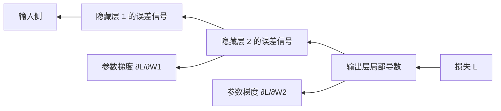
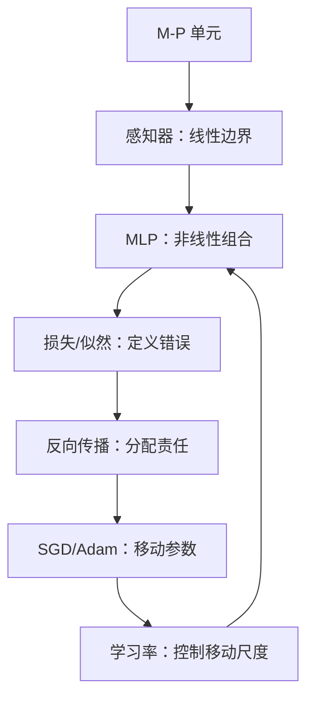

# 第2章 神经网络

> 本章主线：把“学习一个复杂函数”拆成可计算的神经元，再用损失函数和链式法则把误差传回每个参数。

## 本章在全书中的位置

第1章说深度学习的本质是学习表示；本章回答“表示是怎样被学出来的”。后面第3章的卷积层、第4章的概率模型、第5章的自编码器，都可以看成在本章训练闭环上替换了结构或目标：

$$
\text{前向计算}\rightarrow\text{得到预测}\rightarrow\text{计算损失}\rightarrow\text{反向传播}\rightarrow\text{更新参数}
$$

## 2.1 神经网络的历史

### 从“像神经元”到“能优化的函数”

神经网络的历史可以分成三条线：

1. **生物启发线**：用阈值单元抽象神经元的“加权输入—放电”行为。
2. **函数逼近线**：用层和非线性组合更复杂的输入输出关系。
3. **优化工程线**：找到能计算梯度、处理大数据、使用 GPU 的训练方式。

M-P 模型给出单元，感知器给出学习权重的思路，多层感知器提供组合能力，反向传播解决隐藏层的信用分配。真正让深度学习普及的，不是某一个历史节点，而是这三条线最终汇合。

### 一条需要纠正的叙事

不要把“神经网络”理解成对大脑的精确模拟。工程上的神经元是一个可微参数化函数；它借用了神经科学的隐喻，但训练目标、计算方式和生物神经系统并不相同。这个区分很重要：我们学习的是数学和工程机制，而不是从“像大脑”直接推出正确性。

英文经典论文 [Learning representations by back-propagating errors](https://doi.org/10.1038/323533a0) 的历史意义在于，它把隐藏层从“不可解释的中间节点”变成了可以通过最终误差学习的表示。读这篇论文时，重点不是背诵年代，而是观察“隐藏特征是如何被任务目标塑造的”。

### 我的洞见

神经网络史真正反复出现的问题只有一个：**一个参数对最终结果负责多少，如何把这份责任算出来？** 感知器只能直接调整输出层，多层网络需要反向传播，现代框架则用自动微分把这个过程变成可靠的软件基础设施。

## 2.2 M-P 模型

### 模型是什么

McCulloch–Pitts 模型把神经元抽象成加权求和加阈值：

$$
z=\sum_{i=1}^{d}w_i x_i+b=w^\top x+b
$$

$$
y=\begin{cases}
1,&z\ge 0\\
0,&z<0
\end{cases}
$$

它本质上是一个线性判别器。权重决定输入的重要性，偏置决定“需要多大的总刺激才触发”。

### 用它表达逻辑门

以 $x_1,x_2\in\{0,1\}$ 为例：

- AND：取 $w=(1,1)$、$b=-1.5$；
- OR：取 $w=(1,1)$、$b=-0.5$；
- NOT：取 $w=(-1)$、$b=0.5$。

这些参数不是魔法，只是在平面上移动一条直线，使正确样本落在阈值的两侧。

### 为什么需要激活函数

如果多层都只有线性变换：

$$
W_3(W_2(W_1x+b_1)+b_2)+b_3
=W'x+b'
$$

无论堆多少层，整体仍然只是一次线性变换。非线性激活的作用，是让“层的组合”产生真正新的函数形状。第2.6节会详细讨论这件事。

### 工业联系

M-P 模型在今天对应的不是一个要单独部署的算法，而是每个 Dense、Conv、Attention 投影层的最基本骨架：先做线性/仿射变换，再做非线性或归一化。理解这个最小单元，才能读懂参数量、矩阵形状和梯度流。

### 我的洞见

阈值本身不是神经网络的核心；核心是**把复杂决策拆成可组合的局部计算，并让局部参数能被目标函数校正**。实际网络常用平滑或分段连续的激活，是因为“可优化”比“像放电一样硬阈值”更重要。

## 2.3 感知器

### 感知器在学什么

感知器学习一个线性决策边界：

$$
\hat y=\operatorname{step}(w^\top x+b)
$$

对一个被错误分类的样本 $(x_i,y_i)$，经典更新可以写为：

$$
w\leftarrow w+\eta(y_i-\hat y_i)x_i,
\qquad
b\leftarrow b+\eta(y_i-\hat y_i)
$$

如果真实标签是 1 而模型预测 0，就沿着 $x_i$ 方向增加权重；反过来则减小。它是一种“犯错才更新”的在线学习算法。

### 感知器收敛定理告诉了什么

当数据是线性可分的，并且学习率合适，感知器最终可以找到一个把两类分开的超平面。这里的关键词是**线性可分**，不是“任何分类都能学”。

XOR 是经典反例：四个点中，$(0,0)$ 和 $(1,1)$ 属于一类，$(0,1)$ 和 $(1,0)$ 属于另一类，单条直线无法把它们分开。

### 第一性原理：模型能力由决策边界决定

把输入空间想象成一张地图，感知器只能画一条直线/平面。它即使参数很多，只要输出形式仍是一个线性组合，决策边界仍然受限。模型失败不是“训练不够久”，而是**假设空间根本没有目标函数**。

### 工业联系

感知器对应今天分类器最后的线性头，也对应线性 probe：冻结一个预训练表示，只训练一个线性层，看表示是否已经把任务变得线性可分。这个小实验很有价值：如果线性头都做不好，问题可能在表示；如果线性头很好而复杂头没有提升，增加模型容量可能没有必要。

### 我的洞见

遇到模型效果差，必须区分两种情况：

1. **不可表达**：模型的函数族没有包含正确答案；
2. **可表达但没学到**：优化、数据或超参数出了问题。

感知器是第一个让这两类问题清晰分开的模型。

## 2.4 多层感知器

### 结构

多层感知器（MLP）把线性变换和非线性激活交替堆叠：

$$
h^{(1)}=\sigma(W^{(1)}x+b^{(1)})
$$

$$
h^{(l)}=\sigma(W^{(l)}h^{(l-1)}+b^{(l)})
$$

$$
\hat y=g(W^{(L)}h^{(L-1)}+b^{(L)})
$$

隐藏层把原始坐标变换到一个新的表示空间，使原来像 XOR 这样的问题可能在新空间中变成线性可分。

### 表达能力与参数量

一个全连接层从 $d_{in}$ 个输入到 $d_{out}$ 个输出，参数量为：

$$
P=d_{in}d_{out}+d_{out}
$$

其中第二项是偏置。堆叠层会增加表达能力，但也增加内存、计算和过拟合风险。通用近似定理说明足够宽的单隐藏层网络可以逼近很多连续函数；它没有保证训练容易，也没有保证样本效率，更没有保证部署成本合理。

### 工业实践：MLP 常见的三种位置

1. 表格数据的主模型或基线；
2. CNN/Transformer 后的分类、回归头；
3. 推荐、广告和多模态系统中的特征交互模块。

真正做项目时，不要只报“有几层”，还要记录输入维度、隐藏宽度、激活、归一化、参数量、FLOPs 和延迟。

### 我的洞见

多层不是把同一种计算重复很多次，而是在不断改变“问题的坐标系”。好的隐藏层让后续决策更简单；这就是表示学习的几何含义。

## 2.5 误差反向传播算法

### 为什么需要反向传播

假设网络有百万个参数。我们想知道“每个参数稍微变动一点，最终损失会变多少”。逐个试探需要极其昂贵的前向计算；反向传播利用链式法则，一次反向遍历就能得到所有参数的梯度。

对第 $l$ 层定义：

$$
z^{(l)}=W^{(l)}a^{(l-1)}+b^{(l)},
\qquad
a^{(l)}=\sigma(z^{(l)})
$$

令 $\delta^{(l)}=\partial\mathcal L/\partial z^{(l)}$，则输出层和隐藏层的递推为：

$$
\delta^{(L)}=\frac{\partial\mathcal L}{\partial a^{(L)}}\odot\sigma'(z^{(L)})
$$

$$
\delta^{(l)}=\bigl((W^{(l+1)})^\top\delta^{(l+1)}\bigr)\odot\sigma'(z^{(l)})
$$

参数梯度是：

$$
\frac{\partial\mathcal L}{\partial W^{(l)}}=\delta^{(l)}(a^{(l-1)})^\top,
\qquad
\frac{\partial\mathcal L}{\partial b^{(l)}}=\delta^{(l)}
$$

一句话：**后一层传回“责任信号”，当前层再乘上自己的局部斜率**。

### 链式法则的直觉

如果一个参数影响了很多后续运算，它的影响就沿每条路径相乘并相加。反向传播不是另一种神秘的学习法，而是计算复合函数导数的高效组织方式。

### 反向传播与自动微分

现代框架不是把每个网络的导数都手写一遍，而是记录计算图，对基本算子应用链式法则。TensorFlow 的 [自动微分指南](https://www.tensorflow.org/guide/autodiff) 和 PyTorch 的 [autograd 文档](https://docs.pytorch.org/docs/main/autograd.html) 都体现了同一个工程思想：模型作者只描述前向计算，框架负责构建和遍历梯度图。

### 常见实现坑

- 忘记清空梯度，导致不同 batch 的梯度累加；
- 把 logits 先手工 softmax 再送进已包含 softmax 的损失，造成数值不稳定或重复计算；
- 训练时关闭了梯度，或验证时忘记切换到推理模式；
- 广播维度不符合预期，梯度形状看似正确但语义错误；
- 原地修改需要梯度的张量，破坏计算图。

### 我的洞见：反向传播本质是信用分配

把网络看作一条生产线，最终产品不合格时，反向传播不是简单说“所有机器都坏了”，而是计算每台机器对最终损失的边际贡献。深度学习之所以能端到端训练，靠的是这套可扩展的信用分配机制。

## 2.6 误差函数和激活函数

### 损失函数：把“错”定义清楚

回归常用均方误差：

$$
\mathcal L_{MSE}=\frac{1}{N}\sum_{i=1}^{N}(\hat y_i-y_i)^2
$$

二分类常用二元交叉熵，令 $p=\sigma(z)$：

$$
\mathcal L_{BCE}=-\bigl[y\log p+(1-y)\log(1-p)\bigr]
$$

多分类用 softmax 得到 $p_k$，交叉熵为：

$$
\mathcal L_{CE}=-\sum_{k=1}^{K}y_k\log p_k
$$

分类中更推荐“logits + 稳定的交叉熵实现”，因为它可以把 softmax 与 log 合并计算，避免概率极小时下溢。

### 激活函数：让层的组合不再是线性

| 函数 | 公式 | 优点 | 风险/用法 |
|---|---|---|---|
| Sigmoid | $1/(1+e^{-z})$ | 输出可解释为概率 | 深层容易饱和，常用于二分类输出 |
| Tanh | $(e^z-e^{-z})/(e^z+e^{-z})$ | 零中心 | 仍可能梯度消失 |
| ReLU | $\max(0,z)$ | 计算简单，正区间梯度稳定 | 负区间可能“死亡” |
| Leaky ReLU | $\max(\alpha z,z)$ | 负区间保留小梯度 | $\alpha$ 需选择 |
| GELU/SiLU | 平滑门控 | 现代 Transformer/视觉模型常用 | 计算略复杂 |

ReLU 的导数在正区间为 1，能缓解 sigmoid/tanh 的梯度衰减。 [Delving Deep into Rectifiers](https://openaccess.thecvf.com/content_iccv_2015/html/He_Delving_Deep_into_ICCV_2015_paper.html) 把激活函数和初始化一起研究，说明激活不是孤立的超参数：它改变了信号和梯度的尺度。

### 工业实践：输出层由任务决定

- 单标签多分类：$K$ 个 logits + softmax/交叉熵；
- 多标签分类：每个标签一个 sigmoid + BCE；
- 回归：线性输出，必要时对目标做缩放；
- 计数/概率：根据分布选择 Poisson、Gaussian、Beta 等似然目标；
- 检测/分割：分类、位置、置信度通常是多个损失的加权和。

### 我的洞见

损失函数不仅是“训练按钮”，而是在定义系统认为什么错误最严重。一个模型可以数学上优化得很好，却因为损失与业务目标不一致而上线失败。激活函数则决定这条优化通道是否足够通畅。

## 2.7 似然函数

### 从“误差”到“概率模型”

如果我们假设标签来自条件分布 $p(y\mid x;\theta)$，最大似然估计就是选择让观测数据最可能的参数：

$$
\theta^*=\arg\max_\theta\prod_{i=1}^{N}p(y_i\mid x_i;\theta)
$$

取负对数后，乘法变成加法：

$$
\theta^*=\arg\min_\theta -\sum_{i=1}^{N}\log p(y_i\mid x_i;\theta)
$$

这就是负对数似然（NLL）。

### 常见对应关系

- Bernoulli 分布 $leftrightarrow$ sigmoid + 二元交叉熵；
- Categorical 分布 $leftrightarrow$ softmax + 多类交叉熵；
- 方差固定的 Gaussian 分布 $leftrightarrow$ MSE；
- 不同的分布假设会导出不同的损失和不确定性表达。

因此交叉熵不是凭经验凑出来的，它是在问：**模型给真实标签分配了多大的概率？** 预测错且自信时，惩罚会很大。

### 工业联系：概率不等于可信度

softmax 的数值是模型在所假设分布下的相对分数，不天然等于现实世界的可靠概率。风控、医疗和自动驾驶往往还需要校准曲线、可靠性图、拒答/人工复核阈值和 OOD 检测。

### 我的洞见

选择损失时，可以反过来问：“我愿意相信标签来自什么随机过程？” 这会比机械记忆 MSE、BCE、CE 的公式更稳健，也能自然连接到第4章的能量模型和第5章的重构概率解释。

## 2.8 随机梯度下降法

### 从全量梯度到小批量梯度

全量梯度是：

$$
\nabla_\theta J(\theta)=\frac{1}{N}\sum_{i=1}^{N}\nabla_\theta\mathcal L_i(\theta)
$$

小批量 SGD 用 batch $B$ 估计它：

$$
g_B=\frac{1}{|B|}\sum_{i\in B}\nabla_\theta\mathcal L_i(\theta),
\qquad
\theta\leftarrow\theta-\eta g_B
$$

若 batch 是随机抽样，通常有 $\mathbb E[g_B]=\nabla J$；但它带有噪声。这个噪声一方面让训练不必每次扫描全部数据，另一方面可能帮助跳出尖锐或较差的区域。

### Momentum 的直觉

$$
v_t=\mu v_{t-1}+g_t,
\qquad
\theta_t=\theta_{t-1}-\eta v_t
$$

可以把 $v_t$ 看作带惯性的方向：在稳定方向上累积速度，在来回摆动的方向上相互抵消。

### 工业实践

训练日志至少应记录 batch size、每步/每 epoch 的 loss、学习率、梯度范数、吞吐、显存和验证指标。单看最后准确率，无法区分是数据问题、优化问题还是计算资源问题。

### 我的洞见

SGD 不是“粗糙版梯度下降”。小批量的随机性本身改变了优化轨迹，也改变了泛化行为；batch size、学习率和数据顺序是一个联动系统，不能孤立调一个数。

## 2.9 学习率

### 学习率是每次相信梯度多少

更新公式：

$$
\theta_{t+1}=\theta_t-\eta_t g_t
$$

学习率太小，模型移动得慢甚至停在不良区域；太大，可能在谷底两侧跳来跳去，甚至数值爆炸。它的作用不是“越大越快”，而是控制优化轨迹的尺度。

### 常用策略

1. **固定学习率**：适合小实验，但对不同阶段不够灵活。
2. **阶梯衰减/余弦衰减**：训练后期逐步减小步长。
3. **预热（warmup）**：大模型或大 batch 训练开始时先用小学习率，减少初始不稳定。
4. **自适应优化器**：Adam 用一阶矩和二阶矩估计调整每个参数的有效步长：

$$
m_t=\beta_1m_{t-1}+(1-\beta_1)g_t,
\qquad
v_t=\beta_2v_{t-1}+(1-\beta_2)g_t^2
$$

偏差修正后进行更新。[Adam: A Method for Stochastic Optimization](https://arxiv.org/abs/1412.6980) 的核心是对不同参数使用不同尺度的步长，而不是消除调参。

### 如何实用地调

先用小范围学习率扫描找到“能下降但不爆炸”的区间，再配合 batch size 和 schedule 调整。观察曲线比迷信某个默认值更可靠：

- loss 一开始就 `NaN`：学习率、数据尺度或数值稳定性有问题；
- loss 大幅震荡：学习率可能过大，或 batch 太小/数据分布不均；
- loss 降得极慢：学习率可能过小，或梯度在深层衰减；
- 训练 loss 降而验证 loss 升：这更像泛化问题，不只是学习率问题。

### 我的洞见

学习率不是“优化器里的一个旋钮”，而是连接模型尺度、输入尺度、batch size、初始化和训练时长的总开关。改变输入归一化或网络深度后，原来的学习率常常就不再合理。

## 2.10 小结

### 本章主线回收

真正的训练系统不是某一个公式，而是闭环：模型结构决定能表达什么，损失决定学什么，反向传播决定如何知道参数责任，优化器和学习率决定能否走到一个好的解。

### 章节之间的连接

- 第3章把 MLP 的“全连接”换成带局部性和共享权重的卷积；
- 第4章把确定性前向网络换成用能量和概率描述数据的生成模型；
- 第5章把监督损失换成重构损失，探索无标签表示学习；
- 第6章讨论如何让上述训练闭环在未见样本上仍然有效；
- 第7章解释自动微分、GPU 和训练框架如何实现这套闭环。

### 练习

1. 用一个二维 XOR 数据集画出感知器不能分开的原因，并说明 MLP 需要哪一个非线性步骤。
2. 手算一个两层网络中某个权重的梯度，明确每一个链式法则因子。
3. 比较“softmax + 交叉熵”和“每类独立 sigmoid + BCE”分别适用于什么标签语义。
4. 训练一个小网络时同时画 loss、学习率和梯度范数，解释三条曲线的因果关系。

## 延伸阅读

- [Learning representations by back-propagating errors（Nature, 1986）](https://doi.org/10.1038/323533a0)：反向传播与隐藏表示的经典原始论文。
- [Adam: A Method for Stochastic Optimization](https://arxiv.org/abs/1412.6980)：理解自适应步长的动机和边界。
- [Delving Deep into Rectifiers（ICCV, 2015）](https://openaccess.thecvf.com/content_iccv_2015/html/He_Delving_Deep_into_ICCV_2015_paper.html)：把 ReLU、PReLU 和初始化联系起来。
- [TensorFlow 自动微分指南](https://www.tensorflow.org/guide/autodiff)：把链式法则映射到实际计算图。

---

**上一章**：[[第1章-绪论]]  
**下一章**：[[第3章-卷积神经网络]] —— 给神经网络加入视觉世界的局部性、共享和层次结构。
