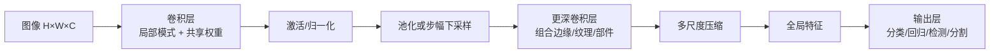
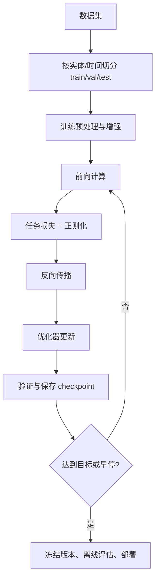

# 第3章 卷积神经网络

> 本章主线：把“图像具有局部性、平移规律和多尺度结构”写进网络结构，让模型少学很多本来就应该共享的东西。

## 本章在全书中的位置

第2章的 MLP 对每个输入维度一视同仁，参数量随输入尺寸迅速膨胀。CNN 的突破是把先验知识放进连接方式：局部连接、权重共享和降采样。这样网络不是从一张白纸开始学习图像，而是在合理的假设空间里学习。

## 3.1 卷积神经网络的结构

### 三个结构假设

1. **局部性**：一个像素附近的邻域通常比远处像素更有直接关系。
2. **平移等变性**：同一种局部模式出现在不同位置时，应该由同一个检测器识别。
3. **层次组合性**：边缘可以组合成纹理，纹理可以组合成部件，部件可以组合成物体。

卷积层通过局部感受野和共享权重实现前两个假设，多层堆叠实现第三个假设。注意“等变”和“不变”要区分：卷积特征图随输入平移而平移，是等变；池化、全局聚合和数据增强才逐渐引入对位置变化的不变性。

### 从张量形状读懂网络

常用图像张量形状为 $B\times H\times W\times C$ 或 $B\times C\times H\times W$：

- $B$：batch size；
- $H,W$：空间尺寸；
- $C$：通道数；
- 每层要同时追踪形状、参数量和计算量。

### 工业联系

视觉项目里常见骨干网络（ResNet、MobileNet、EfficientNet 等）都是在这套结构假设上做取舍：精度、感受野、参数量、内存访问和端侧延迟之间没有免费的午餐。 [Gradient-based learning applied to document recognition](https://leon.bottou.org/papers/lecun-98h) 展示了卷积网络从像素到字符识别的端到端路线；它的启发是结构与任务应共同设计。

### 我的洞见

CNN 的核心不是“滑动窗口”这个动作，而是**把应该共享的知识共享起来**。如果同一个模式不论出现在左上角还是右下角都意味着相似的局部证据，那么为每个位置学习独立参数就是浪费数据。

## 3.2 卷积层

### 二维卷积的本质

对单通道输入 $X$ 和核 $K$，工程框架通常计算互相关：

$$
Y_{i,j}=\sum_{u=0}^{k_h-1}\sum_{v=0}^{k_w-1}K_{u,v}X_{i+u,j+v}+b
$$

在多通道情况下，输出通道 $c_{out}$ 会汇总所有输入通道：

$$
Y_{i,j,c_{out}}
=\sum_{u,v,c_{in}}
K_{u,v,c_{in},c_{out}}X_{i+u,j+v,c_{in}}+b_{c_{out}}
$$

这就是一个局部加权模板在整张图上的重复应用。

### 输出尺寸与参数量

设输入高宽为 $H,W$，核大小为 $K_h,K_w$，padding 为 $P_h,P_w$，stride 为 $S_h,S_w$：

$$
H_{out}=\left\lfloor\frac{H+2P_h-K_h}{S_h}\right\rfloor+1,
\qquad
W_{out}=\left\lfloor\frac{W+2P_w-K_w}{S_w}\right\rfloor+1
$$

输入通道 $C_{in}$、输出通道 $C_{out}$ 时，参数量为：

$$
K_hK_wC_{in}C_{out}+C_{out}
$$

相比把 $HWC_{in}$ 全连接到输出，卷积的参数与空间位置无关，因此通常节省巨大。

### 感受野：看到了多大范围

一层 $3\times3$ 卷积只看局部，但两层堆叠的有效感受野可以达到 $5\times5$，三层达到 $7\times7$；中间的非线性也更多。stride、pooling 和 dilation 会进一步改变感受野和分辨率。感受野大不代表模型一定利用了全部上下文，还要看有效梯度和数据是否提供了相关证据。

### 工业中常用的卷积变体

| 变体 | 改变 | 典型目的 |
|---|---|---|
| stride convolution | 用步幅做下采样 | 减少特征图尺寸和计算 |
| dilated convolution | 核元素有间隔 | 增大感受野而不立即降采样 |
| group convolution | 通道分组计算 | 降低计算、引入分组结构 |
| depthwise separable | depthwise + pointwise | 端侧模型降 FLOPs |
| $1\times1$ convolution | 只混合通道 | 调整通道数、增加非线性 |

TensorFlow 对 [二维卷积的张量语义](https://tensorflow2.readthedocs.io/en/latest/tensorflow/g3doc/api_docs/python/nn.html) 有一个很实用的提醒：很多库名义上叫 convolution，实际实现的是 cross-correlation。读实现和复现论文时，必须以数据布局、padding 和 kernel 定义为准。

### 我的洞见

卷积核可以看成“可学习的局部测量仪”。训练不是让它记住某一张图片，而是让它找到在许多位置、许多样本中都能解释误差的局部证据。

## 3.3 池化层

### 两种基本池化

最大池化在窗口内取最大值：

$$
Y_{i,j,c}=\max_{(u,v)\in\mathcal W}X_{i+u,j+v,c}
$$

平均池化取平均：

$$
Y_{i,j,c}=\frac{1}{|\mathcal W|}\sum_{(u,v)\in\mathcal W}X_{i+u,j+v,c}
$$

最大池化强调“局部是否出现过强响应”，平均池化强调“局部整体激活水平”。两者都通常没有可学习参数，但会改变空间分辨率和信息保留方式。

### 第一性原理：池化是在丢信息换稳定性

下采样会丢掉精细位置信息，却换来：

- 对小范围平移、形变和噪声更不敏感；
- 后续层计算更便宜；
- 更大的有效感受野。

这不是免费不变性。目标检测、医学影像和细粒度识别可能非常依赖精确位置，过早池化会删除关键证据。

### 工业实践

现代网络有时用 stride convolution、patch merging 或 learned pooling 替代显式池化。语义分割常在编码器下采样后使用跳跃连接恢复细节；检测模型会保留多尺度特征。选择池化方式时，应该从任务的空间精度要求出发，而不是因为“经典 CNN 都有池化”。

### 我的洞见

池化层可以理解为一个信息瓶颈：它在问“这个局部区域里，什么信息值得传给更高层？” 这与第5章自编码器的瓶颈、第6章预处理/增强中的信息扰动，本质上是同一个问题。

## 3.4 全连接层

### 作用

经过若干卷积和下采样后，网络得到包含空间和通道信息的特征图。全连接层把所有特征组合起来，做最终的全局决策：

$$
y=Wh+b
$$

如果直接 flatten 一个 $7\times7\times512$ 的特征图，再接 4096 个单元，参数量约为 $7\times7\times512\times4096\approx 1.0\times10^8$，很容易成为内存和过拟合瓶颈。

### 全局平均池化

可以对每个通道做空间平均：

$$
h_c=\frac{1}{HW}\sum_{i=1}^{H}\sum_{j=1}^{W}X_{i,j,c}
$$

再接一个小的线性分类器。它减少参数，也让“每个通道代表某种全局证据”的解释更清楚，但会牺牲部分精细空间信息。

### 工业联系

现代视觉骨干通常尽量压缩全连接头，使用 global average pooling、attention pooling 或轻量 MLP head。部署时，全连接层的内存访问有时比理论 FLOPs 更影响延迟，所以不能只看算术运算数量。

### 我的洞见

卷积层更像“发现证据”，全连接层更像“组合证据”。当数据量小或部署资源有限时，减少全连接头常常比盲目减少前面的卷积更划算。

## 3.5 输出层

### 分类输出

网络最后通常输出 logits $z\in\mathbb R^K$。多分类概率为：

$$
p_k=\frac{e^{z_k}}{\sum_{j=1}^{K}e^{z_j}}
$$

实践中优先把 logits 直接交给数值稳定的交叉熵函数，而不是手工先算 softmax。

二分类可以只输出一个 logit：

$$
p=\sigma(z)=\frac{1}{1+e^{-z}}
$$

多标签任务则对每个类别独立使用 sigmoid，因为一张图片可以同时属于多个标签。

### 不要把输出层当作任务本身

一个“分类准确率”模型真正上线时还需要：阈值、拒答、类别映射、版本兼容、后处理、人工审核和监控。输出层只给出模型的原始证据，业务系统要负责把证据转换成行动。

### 其他视觉任务

- 检测：类别 logits + 边界框参数 + 目标置信度；
- 语义分割：每个像素一个类别分布；
- 实例分割：类别、位置和实例掩码组合；
- 回归：深度、关键点、姿态、质量分数等连续量。

### 我的洞见

输出层的形状应由“标签语义”决定，而不是由网络方便程度决定。先明确一张样本能有一个标签、多个标签、还是每个位置都有标签，输出层自然就清楚了。

## 3.6 神经网络的训练方法

### 一个可复现的训练闭环

### 数据增强

对图像做翻转、裁剪、颜色扰动、Mixup/CutMix 等，相当于告诉模型：这些变化不应改变标签。但增强必须符合任务语义：医疗图像的左右翻转未必安全，文字识别随意翻转可能改变类别。增强的本质是扩大训练分布中“合理变化”的覆盖，而不是制造随机噪声。

### 归一化与初始化

输入尺度差异过大，会让不同方向的梯度尺度不平衡。常见做法是按训练集统计量标准化：

$$
x'=(x-\mu_{train})/(\sigma_{train}+\epsilon)
$$

参数初始化要与激活函数匹配。ReLU 网络常用 He 初始化；饱和激活和深层网络则更依赖合适的方差控制。 [Delving Deep into Rectifiers](https://openaccess.thecvf.com/content_iccv_2015/html/He_Delving_Deep_into_ICCV_2015_paper.html) 的价值就在于把这两件事统一看待。

### BatchNorm 与训练/推理差异

BatchNorm 在 batch 上计算均值和方差，再用可学习的 $\gamma,\beta$ 变换：

$$
\hat x=\frac{x-\mu_B}{\sqrt{\sigma_B^2+\epsilon}},
\qquad
y=\gamma\hat x+\beta
$$

训练与推理使用的统计量不同，部署必须正确切换模式。 [Batch Normalization](https://proceedings.mlr.press/v37/ioffe15.html) 展示了它如何帮助使用更高学习率并改善深层训练；但小 batch、分布变化或跨设备同步时，需要谨慎检查统计量是否可靠。

### 迁移学习与微调

数据量不足时，常见路线是加载在大数据集上预训练的骨干，先冻结骨干只训练新头，再用很小学习率逐步解冻微调。[TensorFlow 的迁移学习指南](https://www.tensorflow.org/guide/keras/transfer_learning) 给出的顺序非常实用：先冻结、训练新头，收敛后再低学习率微调；否则随机初始化的新头会产生大梯度，破坏预训练表示。

### 评估与错误分析

不要只看 top-1 accuracy。根据业务选择 precision、recall、F1、ROC-AUC、PR-AUC、mAP、IoU、延迟、内存和每次推理成本。更要按光照、设备、地域、类别、用户群和时间切片看错误。平均指标可能掩盖一个关键子群体的系统性失败。

### 我的洞见

CNN 的训练不是“模型结构完成后再跑 fit”。数据切分、预处理、增强、损失、优化和评估共同定义了模型学到的世界。如果预处理与训练不一致，最先进的骨干也只是一个高效地产生错误的函数。

## 3.7 小结

### 本章结论

1. 卷积用局部连接和权重共享把视觉先验写进模型。
2. 池化和步幅用信息损失换取更大的感受野与更低计算。
3. 全连接层负责全局组合，但现代网络通常通过全局池化降低其成本。
4. 输出层、损失函数和标签语义必须匹配。
5. 实际效果来自数据、结构、训练、评估和部署的一致性。

### 与前后章节的连接

- 与第2章：CNN 仍然是“线性变换 + 非线性 + 反向传播”，只是把连接方式改成了局部共享。
- 与第4章：CNN 学的是判别式特征；RBM 试图直接描述数据分布。
- 与第5章：卷积编码器也可以接解码器做重构和自监督预训练。
- 与第6章：数据增强、归一化、Dropout 和初始化决定 CNN 是否能泛化。
- 与第8章：OCR、检测、分割、医学影像和自动驾驶都可以看成 CNN 结构对不同输出约束的延伸。

### 练习

1. 计算输入 $224\times224\times3$ 经过 $7\times7$、stride 2、padding 3、64 个输出通道后的形状和参数量。
2. 解释为什么卷积是平移等变，而最大池化会引入一定平移不变性。
3. 设计一个小数据集实验，对比“从头训练”和“冻结预训练骨干 + 微调”的数据效率。
4. 对一个分类模型按设备和光照分组统计混淆矩阵，找出平均准确率掩盖的失败场景。

## 延伸阅读

- [Gradient-based learning applied to document recognition（LeCun 等，1998）](https://leon.bottou.org/papers/lecun-98h)：理解卷积结构如何进入真实文档识别。
- [ImageNet Classification with Deep Convolutional Neural Networks（AlexNet, NeurIPS 2012）](https://papers.nips.cc/paper_files/paper/2012/hash/c399862d3b9d6b76c8436e924a68c45b-Abstract.html)：理解 GPU、ReLU、Dropout 和大数据的协同作用。
- [Batch Normalization（PMLR, 2015）](https://proceedings.mlr.press/v37/ioffe15.html)：理解归一化如何改变优化条件。
- [Transfer learning & fine-tuning（TensorFlow 官方指南）](https://www.tensorflow.org/guide/keras/transfer_learning)：把预训练模型变成工程工作流。

---

**上一章**：[[第2章-神经网络]]  
**下一章**：[[第4章-受限玻尔兹曼机]] —— 从确定性判别网络转向能量和概率。
