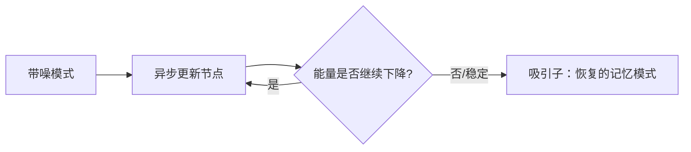
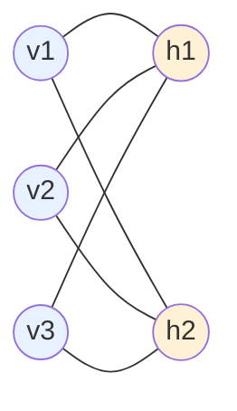
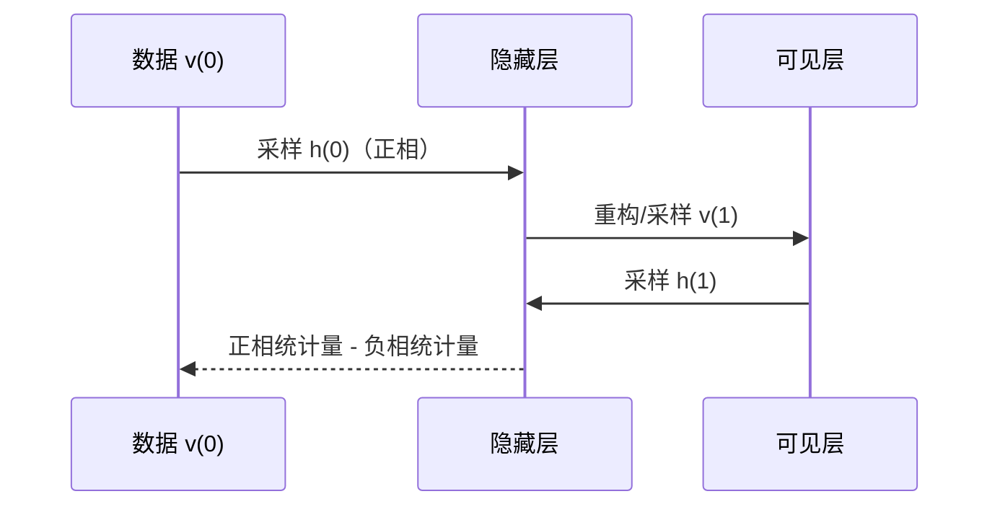
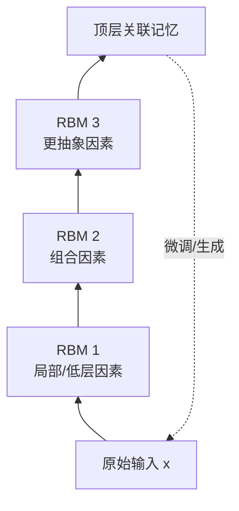

# 第4章 受限玻尔兹曼机

> 本章主线：如果不直接学习“输入到标签”的判别边界，而是先学习“什么样的数据看起来像真的”，能否得到有用表示？

## 本章在全书中的位置

第2章的神经网络把样本映射到预测；本章换一个视角：给每个可见状态分配能量和概率，让模型学习数据分布。RBM 是一种结构受限的玻尔兹曼机，它用“可见层—隐藏层”的二部图换取条件独立性，从而让采样和学习变得可行。

```mermaid
flowchart TB
    V[可见单元 v\n观测数据] <-->|权重 W\n无同层连接| H[隐藏单元 h\n潜在因素]
    V --> E[能量 E(v,h)]
    H --> E
    E --> P[概率 p(v,h) ∝ exp(-E)]
    P --> S[Gibbs 采样\n重建数据]
    S --> CD[对比散度\n正相 - 负相]
    CD --> V
```

## 4.1 Hopfield 神经网络

### 关联记忆的基本想法

Hopfield 网络是一种循环网络，节点状态通常为 $s_i\in\{-1,+1\}$ 或 $\{0,1\}$，连接权重对称：

$$
w_{ij}=w_{ji},\qquad w_{ii}=0
$$

它不把输入映射成一个新标签，而是把若干模式存进网络。给一个带噪或不完整的输入，网络通过反复更新，收敛到最相近的记忆模式。这就是关联记忆：不是查表，而是从局部线索恢复整体。

### 能量函数

对二值状态，可以定义：

$$
E(s)=-\frac12\sum_{i\ne j}w_{ij}s_is_j-\sum_i b_i s_i
$$

异步更新一个节点时，若更新让能量下降，系统就更接近某个吸引子。因为对称权重保证了单节点更新下能量不会无限上升，网络最终可能落入局部极小值。



### 第一性原理：记忆就是能量地形

把所有可能的状态想象成一片地形，已存模式是低谷。输入状态相当于把小球放在某个位置，网络更新让它滚向附近低谷。这个比喻同时解释了能力和限制：低谷太多会互相干扰，低谷太少又无法存储足够模式；不在任何低谷附近的输入可能收敛到错误记忆。

### 工业联系

经典 Hopfield 网络今天较少作为图像分类主模型，但“能量地形、吸引子、从不完整观测恢复结构”的思想仍影响联想检索、组合优化、记忆模块和现代能量模型。它适合用来训练一种系统直觉：模型不只是计算一个分数，也可以定义整个状态空间的偏好。

### 我的洞见

Hopfield 网络与第2章的前馈网络代表两种不同的建模方向：前馈网络追求一次计算得到预测，能量网络追求通过迭代找到一个稳定状态。前者适合低延迟推理，后者更自然地表达“相容性”和“记忆”。

## 4.2 玻尔兹曼机

### 从确定性更新到概率状态

玻尔兹曼机把节点更新改成随机采样，使系统不一定每次都走向当前最陡的低谷，而是按照能量定义的概率分布探索状态：

$$
p(s)=\frac{e^{-E(s)}}{Z},
\qquad
Z=\sum_{s}e^{-E(s)}
$$

$Z$ 是配分函数，负责归一化。低能量状态概率更高，但高能量状态仍有机会被采样。

### 为什么需要隐藏变量

可见变量是观测到的像素、评分或词；隐藏变量表示解释这些观测的潜在因素。模型通过边连接学习变量之间的相容性，让一个观测可以由多个潜在因素共同解释。

典型能量形式为：

$$
E(v,h)=-\sum_i a_i v_i-\sum_j b_j h_j-\sum_{i,j}w_{ij}v_i h_j
$$

联合分布是 $p(v,h)\propto e^{-E(v,h)}$。对比“联合概率”和“观测概率”时要注意：训练数据只有 $v$，隐藏状态 $h$ 需要边际化或采样。

### 最大似然的两个相位

对参数 $\theta$，最大化观测数据的对数似然，需要计算：

$$
\frac{\partial\log p(v)}{\partial\theta}
=\underbrace{\mathbb E_{p(h\mid v)}\left[-\frac{\partial E(v,h)}{\partial\theta}\right]}_{\text{正相：让数据更可能}}
-\underbrace{\mathbb E_{p(v,h)}\left[-\frac{\partial E(v,h)}{\partial\theta}\right]}_{\text{负相：防止所有状态都变得可能}}
$$

直觉是：正相降低真实样本能量，负相抬高模型自己生成的“竞争样本”能量。只做正相会让模型把所有权重推大，最后所有状态都被偏爱，失去分布建模能力。

### 难点：配分函数和采样

配分函数要对所有状态求和，状态数随变量数指数增长；负相期望也需要从模型分布采样。理论目标清楚，但计算代价很高，这正是 RBM“受限”的原因。

### 我的洞见

能量模型的学习不是“把正确答案分数调高”这么简单，而是同时要把错误或不自然的状态压低。它天然包含一种竞争机制，后来很多对比学习方法也可以用“正样本拉近、负样本推远”的语言理解。

## 4.3 受限玻尔兹曼机

### 结构限制带来条件独立

RBM 去掉可见层内部和隐藏层内部的连接，只保留跨层连接：



给定 $v$ 时，所有隐藏单元条件独立；给定 $h$ 时，所有可见单元条件独立。因此可以并行采样：

$$
p(h_j=1\mid v)=\sigma\left(b_j+\sum_iw_{ij}v_i\right)
$$

$$
p(v_i=1\mid h)=\sigma\left(a_i+\sum_jw_{ij}h_j\right)
$$

这两条 sigmoid 公式是 RBM 工程可行性的核心。

### 自由能

把隐藏变量求和掉，可以得到可见向量的自由能：

$$
F(v)=-a^\top v-\sum_j\log\left(1+e^{b_j+W_{:,j}^\top v}\right)
$$

并有 $p(v)\propto e^{-F(v)}$。自由能给每个输入一个“自然程度”分数，也让 RBM 可以用于表示学习或异常检测的概念演示。

### 工业联系

RBM 的重要工业价值更多是历史性的：它证明了潜在变量、分层表示和无监督预训练可以在深层网络中工作。如今如果要做异常检测，通常会选择自编码器、扩散/生成模型、密度估计或判别式方法，并仔细验证异常分数是否与业务风险相关，而不会直接默认 RBM 的自由能就是可靠概率。

### 我的洞见

RBM 的“受限”不是削弱，而是把不可计算的全连接概率模型改造成一个能做并行条件采样的局部结构。好的模型设计经常不是追求最完整的表达能力，而是选择一个可计算且足够有用的假设空间。

## 4.4 对比散度算法

### 为什么不能直接算负相

最大似然需要从模型的平衡分布 $p(v,h)$ 采样。完整 Gibbs 链可能需要很长时间才接近平衡，实际训练常用短链近似：对比散度（Contrastive Divergence, CD）。

### CD-k 的步骤

以 CD-1 为例：

1. 从真实样本 $v^{(0)}$ 开始；
2. 按 $p(h\mid v^{(0)})$ 采样 $h^{(0)}$；
3. 按 $p(v\mid h^{(0)})$ 采样重构样本 $v^{(1)}$；
4. 再按 $p(h\mid v^{(1)})$ 得到 $h^{(1)}$；
5. 用正相统计量减去负相统计量更新权重：

$$
\Delta w_{ij}=\eta\left(
v_i^{(0)}h_j^{(0)}-v_i^{(1)}h_j^{(1)}
\right)
$$

一般 CD-k 用 $k$ 次交替采样。$k$ 越大通常更接近真实负相梯度，但计算越慢。



### CD 的偏差与实践取舍

CD-k 不是精确的最大似然梯度，短链会产生偏差；但它通常比每步跑到平衡更便宜。训练时要监控重构误差、自由能、隐藏单元激活和样本质量，不能只看一条损失曲线。初始权重、学习率、采样温度和稀疏约束也会影响结果。

### 我的洞见

CD 的思想可以概括为“从真实数据附近出发，走几步后比较变化”。它把一个难以全局计算的问题变成局部对比。优点是便宜，代价是目标被近似；任何使用 CD 的系统都应该明确这笔计算—统计偏差的交易。

## 4.5 深度信念网络

### 逐层预训练

深度信念网络（DBN）把多个 RBM 堆叠起来，采用贪心的逐层训练：第一层学习输入的潜在表示，第二层把第一层的表示当作“数据”继续建模，以此类推。高层 RBM 建立更抽象的因素，之后再把整个网络用于分类、生成或联合微调。



### 为什么当时有用

深层 sigmoid 网络在随机初始化下可能遇到梯度消失和糟糕的局部区域。无监督预训练先把参数放到一个有数据意义的位置，再用监督梯度微调，改善了早期深度学习的可训练性。 [A fast learning algorithm for deep belief nets](https://www.stats.ox.ac.uk/~teh/research/unsup/nc2006.pdf) 解释了逐层贪心训练与顶层无向模型的关系；[Reducing the dimensionality of data with neural networks](https://pubmed.ncbi.nlm.nih.gov/16873662/) 展示了预训练如何帮助深层自编码器获得低维表示。

### 与现代预训练的关系

今天的大规模预训练仍然遵循“先从大量未标注数据学通用表示，再针对任务微调”的大逻辑，但目标和结构常换成掩码预测、对比学习、自回归预测、扩散建模或跨模态对齐。RBM/DBN 不是现代预训练的直接实现，却是理解“表示可迁移、无监督信号能降低标签依赖”的重要历史桥梁。

### 工业联系

工业系统不会只因为“预训练”三个字就受益。要检查预训练数据与目标场景的覆盖、表示是否保留业务所需信息、微调是否过拟合、数据授权和隐私是否合规。迁移失败时，问题可能不是优化，而是源域和目标域的条件分布差异太大。

### 我的洞见

DBN 给出一条很有生命力的工程原则：**先学习可复用的结构，再学习具体任务的决策**。结构可以是层级表示，也可以是今天的基础模型；变化的是预训练目标，不变的是数据复用与微调的经济性。

## 4.6 小结

### 本章结论

1. Hopfield 网络把记忆看成能量地形中的吸引子。
2. 玻尔兹曼机用能量定义概率，但配分函数和采样使训练困难。
3. RBM 用二部结构换取条件独立，从而可以交替采样。
4. 对比散度用短链近似负相梯度，在计算成本和统计偏差之间取舍。
5. DBN 通过逐层预训练把无监督表示带入深层网络，连接了早期生成模型与现代预训练。

### 与前后章节的连接

- 与第2章：RBM 仍然有参数、概率输出和优化，只是目标从判别损失转成能量/似然。
- 与第3章：可见层不一定是向量，也可以结合局部结构形成卷积 RBM。
- 与第5章：自编码器提供了另一条更直接、确定性的无监督表示学习路线。
- 与第6章：稀疏、噪声和正则化同样影响 RBM 学到的表示。
- 与第8章：能量模型、对比目标和生成式建模会以新的形式继续出现。

### 练习

1. 写出一个两可见、两隐藏单元 RBM 的能量函数，并推导 $p(h_j=1\mid v)$。
2. 解释为什么 RBM 去掉同层连接后，给定一层时另一层的单元可以并行采样。
3. 比较 CD-1 和更长 Gibbs 链的计算成本、梯度偏差和训练稳定性。
4. 用“能量低谷”的图像解释 Hopfield 网络为什么可能把一个新输入恢复成错误记忆。

## 延伸阅读

- [A fast learning algorithm for deep belief nets（Hinton、Osindero、Teh, 2006）](https://www.stats.ox.ac.uk/~teh/research/unsup/nc2006.pdf)：理解 DBN 的逐层预训练。
- [Reducing the dimensionality of data with neural networks（Science, 2006）](https://pubmed.ncbi.nlm.nih.gov/16873662/)：理解深层自编码器预训练的历史动机。
- [A Practical Guide to Training Restricted Boltzmann Machines](https://www.cs.toronto.edu/~hinton/absps/guideTR.pdf)：把能量、采样和训练诊断连接到实践。

---

**上一章**：[[第3章-卷积神经网络]]  
**下一章**：[[第5章-自编码器]] —— 用重构任务学习潜在表示。
