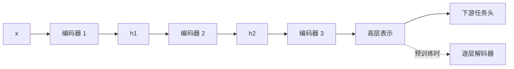
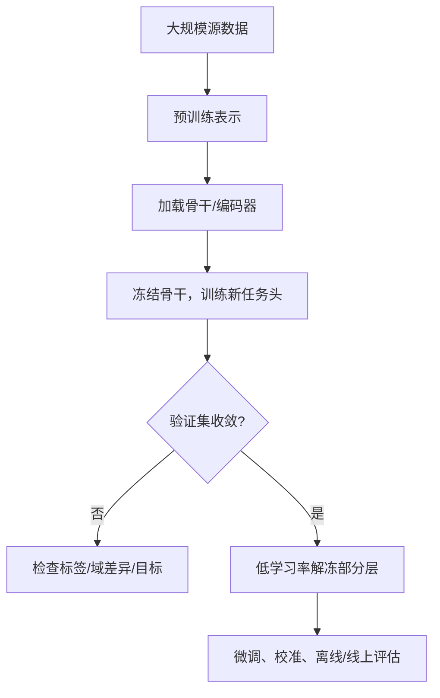

# 第5章 自编码器

> 本章主线：没有人工标签时，让模型先学会“用较短的内部表示还原输入”，再从这个瓶颈中获得可迁移的结构。

## 本章在全书中的位置

第4章的 RBM 通过概率和采样学习数据分布；自编码器采用更直接的确定性路线：编码器把输入压缩成潜在向量，解码器再重构输入。降噪、稀疏和堆叠版本的共同点，是阻止模型简单复制输入，迫使表示抓住更稳定、更有结构的信息。

```mermaid
flowchart LR
    X[输入 x] --> C[编码器 fθ\n压缩/变换]
    C --> Z[潜在表示 z]
    Z --> D[解码器 gφ\n重构]
    D --> XH[重构 x̂]
    XH --> L[重构损失 L(x,x̂)]
    L --> U[更新 θ,φ]
    U --> C
```

## 5.1 自编码器

### 基本结构

编码器和解码器分别为：

$$
h=f_\theta(x)=\sigma(W_ex+b_e)
$$

$$
\hat x=g_\phi(h)=\rho(W_dh+b_d)
$$

训练目标是让重构尽量接近输入：

$$
\min_{\theta,\phi}\frac{1}{N}\sum_{i=1}^{N}
\mathcal L\bigl(x_i,g_\phi(f_\theta(x_i))\bigr)
$$

最简单的损失是 MSE；若输入是归一化到 $[0,1]$ 的二值/像素概率，也可以使用逐元素 BCE。

### 第一性原理：瓶颈迫使模型选择信息

如果 $h$ 的维度远小于 $x$，模型不能把所有细节原样搬运，只能保留对重构最有帮助的因素。这个过程像把一篇很长的文章压缩成提纲：提纲不是原文的逐字复制，而是保留结构的摘要。

但如果潜在维度很大、编码器和解码器足够强，模型可能学到近似恒等映射：

$$
g_\phi(f_\theta(x))\approx x
$$

这时重构误差很低，却不代表 $h$ 对分类、检索或解释有用。

### 线性自编码器与 PCA

在线性、平方误差、适当瓶颈和优化到全局最优等条件下，线性自编码器学习到的子空间与 PCA 主子空间相关。这说明自编码器并不是“神奇地超越一切”，而是把经典降维放进可扩展的神经网络框架。加入非线性、卷积、噪声或稀疏约束后，模型可以表达比线性 PCA 更复杂的流形结构，但也更依赖训练和验证。

### 工业联系

自编码器常见用途包括：

- 无标签数据的特征预训练；
- 压缩和可视化；
- 异常检测的候选分数；
- 去噪、修复和缺失值重建；
- 作为下游模型的初始化或特征提取器。

异常检测时尤其要小心：正常样本重构好、异常样本重构差只是一个假设；高容量模型可能把异常也重构得很好，必须用真实异常和时间外数据验证阈值。

### 我的洞见

自编码器学习到的不是“信息最多的表示”，而是**在指定扰动、容量和损失下，对重构最有用的表示**。表示的好坏永远相对于任务和评价标准而言。

## 5.2 降噪自编码器

### 训练目标的关键变化

普通自编码器输入和目标相同；降噪自编码器（DAE）先对输入加扰动：

$$
\tilde x\sim q(\tilde x\mid x)
$$

再要求模型从损坏的 $\tilde x$ 恢复干净的 $x$：

$$
\min_{\theta,\phi}
\mathbb E_{x,\tilde x}
\left[\mathcal L\bigl(x,g_\phi(f_\theta(\tilde x))\bigr)\right]
$$

模型不能只复制输入，因为输入本身已经被破坏；它必须学习哪些局部变化属于噪声，哪些结构应当被保留。

### 常见扰动

| 扰动 | 适合模拟 | 需要注意 |
|---|---|---|
| masking noise | 缺失特征、遮挡 | 遮挡比例过高会使目标不可恢复 |
| Gaussian noise | 测量噪声、连续信号 | 噪声尺度应接近现实传感器 |
| salt-and-pepper | 像素坏点 | 不适合所有自然图像 |
| crop/blur/color | 视觉增强 | 要与任务不变性一致 |

### 几何直觉

如果真实数据集中在高维空间的一张低维流形附近，轻微扰动会把样本推离流形。DAE 学习的是把邻域中的点拉回数据流形的方向，因而比普通复制更可能得到稳定的局部结构。[Stacked Denoising Autoencoders](https://www.jmlr.org/beta/papers/v11/vincent10a.html) 的实验显示，降噪目标能够学出类似边缘检测器和笔画检测器的特征；它的关键不是“加噪声更强”，而是让模型学习数据的稳定结构。

```mermaid
flowchart TD
    X[干净样本 x] --> N[随机腐蚀 q(x̃|x)]
    N --> XT[损坏样本 x̃]
    XT --> E[编码器]
    E --> Z[稳定表示 z]
    Z --> D[解码器]
    D --> R[还原干净 x]
```

### 工业联系

DAE 的现代对应物包括遮挡图像预训练、掩码语言建模、传感器缺失恢复和鲁棒表征学习。增强应模拟线上真正会发生的变化：如果训练噪声和线上噪声无关，模型可能学会抵抗错误的扰动，却在真实故障上失效。

### 我的洞见

降噪不是为了制造一个“更干净的输入”，而是通过设计不可避免的信息缺口，让模型暴露出自己是否真正理解了数据结构。**好的预训练任务不是让模型容易重构，而是让它必须利用可迁移的规律才能重构。**

## 5.3 稀疏自编码器

### 为什么要稀疏

普通自编码器可能让大量隐藏单元同时激活，得到冗余、难解释的表示。稀疏自编码器希望对每个样本只有少数单元活跃：不同隐藏单元像不同的“字典原子”，一个样本只调用其中一小部分。

设第 $j$ 个隐藏单元在训练集上的平均激活为：

$$
\hat\rho_j=\frac{1}{N}\sum_{i=1}^{N}h_j(x_i)
$$

希望它接近一个很小的目标稀疏率 $\rho$。可以加入 KL 惩罚：

$$
\Omega_{KL}=\sum_j\left[
\rho\log\frac{\rho}{\hat\rho_j}
+(1-\rho)\log\frac{1-\rho}{1-\hat\rho_j}
\right]
$$

也可以直接对激活或权重加 $L_1$ 惩罚：

$$
\mathcal L=\mathcal L_{recon}+\lambda\sum_j|h_j|
$$

### 第一性原理：稀疏是容量分配策略

如果所有单元都对所有样本有反应，表示空间的区分度可能被浪费；稀疏约束把“可用激活预算”集中到少数因素上。它类似一座图书馆只为每本书挑最相关的索引，而不是让每个关键词都出现在每本书里。

### 风险与调参

- 稀疏率太强：表示容量不足，重构和下游任务都下降；
- 稀疏率太弱：模型退化成普通自编码器；
- 只惩罚平均激活：某些单元可能长期死亡，其他单元承担过多任务；
- 稀疏不等于解耦，也不自动带来语义可解释性。

### 工业联系

稀疏表示可用于压缩、检索和可解释性探索，也能启发稀疏激活的路由模型。但生产系统更关心端到端的内存访问、硬件支持和延迟；数学上稀疏的张量如果导致不规则访问，未必比稠密矩阵更快。

### 我的洞见

稀疏约束不是简单“让数字变小”，它是在告诉模型：**一个样本不应该同时依赖所有解释因素**。不过如果现实任务确实需要多个因素共同作用，强行稀疏会把重要信息删掉；先了解数据的组合结构，再选稀疏强度。

## 5.4 栈式自编码器

### 逐层堆叠

一个栈式自编码器可以先训练一层编码器 $f_1$，得到表示 $h_1$；再把 $h_1$ 作为输入训练第二层编码器 $f_2$，得到 $h_2$，不断向上：

$$
h_1=f_1(x),\qquad h_2=f_2(h_1),\qquad h_L=f_L(h_{L-1})
$$

每层可以配一个局部解码器做预训练，最后把编码器堆起来、接任务头，再进行全网络微调。



### 逐层预训练解决了什么

早期深层网络使用 sigmoid 时，随机初始化可能导致梯度在多层传播中衰减。逐层无监督训练给每一层一个相对容易的局部目标，相当于先把网络放到数据结构附近，再用监督任务统一调整。

### 今天如何理解

现代优化、初始化、归一化和大规模预训练已经减少了逐层自编码器的必要性，但“局部目标学习—全局微调”的思想仍然存在于分阶段训练、冻结/解冻、蒸馏、掩码预训练和模块化适配中。

### 我的洞见

栈式结构的价值不只在于多加几层，而在于建立了一个“从局部可学到全局可用”的训练课程。好的课程会先让模型掌握稳定的低级规律，再要求它组合成高层任务。

## 5.5 在预训练中的应用

### 历史路线

第4章的 DBN 和本章的栈式自编码器都试图解决同一个问题：标签少、网络深、随机初始化不可靠。预训练先利用无标签数据学习表示，随后在有标签任务上微调。 [Reducing the dimensionality of data with neural networks](https://pubmed.ncbi.nlm.nih.gov/16873662/) 说明了预训练对深层低维编码的历史作用。

### 现代迁移学习工作流



实践上要区分三种用法：

1. **特征提取**：冻结编码器，离线抽取表示，训练轻量模型；成本低、稳定，但不能适应新数据增强。
2. **端到端微调**：解冻全部或部分层，让表示适应目标域；效果潜力更高，也更容易过拟合。
3. **继续预训练**：在目标域的无标签数据上继续重构/掩码/自回归训练，再做监督微调；适合领域差异较大但有大量无标签数据的场景。

### 预训练是否成功的判断

- 下游指标是否提升，而不是只看重构误差；
- 线性 probe 或少量标注下是否有优势；
- 表示是否保留了目标任务需要的信息；
- 源数据是否存在授权、隐私或分布泄漏问题；
- 微调后是否在时间外、设备外和子群体上稳定。

### 我的洞见

预训练的经济学本质是：**把昂贵的标签监督，换成便宜但不完美的自监督信号，再把通用表示摊销到许多下游任务**。因此预训练最重要的指标不一定是单个任务的峰值准确率，也包括迁移任务数量、标注节省、训练成本和失败率。

## 5.6 小结

### 本章结论

1. 自编码器用重构目标学习压缩表示，但必须防止简单恒等映射。
2. 降噪自编码器通过输入损坏，迫使模型学习稳定结构而不是复制噪声。
3. 稀疏自编码器把激活预算集中到少数因素，但稀疏不自动等于可解释。
4. 栈式自编码器提供了逐层预训练和全局微调的历史路线。
5. 今天的迁移学习仍延续“先学通用表示，再适配任务”的主线。

### 与前后章节的连接

- 与第2章：自编码器仍由前向、损失、反向传播和优化构成，变化的是监督信号。
- 与第3章：编码器可以是 CNN，解码器可以恢复空间细节。
- 与第4章：RBM 是概率式表示学习，AE 是确定性重构式表示学习。
- 与第6章：噪声、稀疏、容量约束都是防止表示走捷径的泛化手段。
- 与第8章：预训练、生成和多模态学习会继续把“表示复用”推向更大规模。

### 练习

1. 解释为什么一个过宽的自编码器可以得到很低重构误差，却不一定得到好表示。
2. 为传感器缺失场景设计一个降噪自编码器的腐蚀分布，并说明为什么这样设计。
3. 推导稀疏自编码器中 KL 惩罚对平均激活 $\hat\rho_j$ 的梯度方向。
4. 在同一数据集上比较随机初始化、冻结预训练编码器和端到端微调三种路线。

## 延伸阅读

- [Stacked Denoising Autoencoders（JMLR, 2010）](https://www.jmlr.org/beta/papers/v11/vincent10a.html)：理解降噪目标如何学习局部稳定结构。
- [Reducing the dimensionality of data with neural networks（Science, 2006）](https://pubmed.ncbi.nlm.nih.gov/16873662/)：理解深层自编码器预训练的历史动机。
- [Transfer learning & fine-tuning（TensorFlow 官方指南）](https://www.tensorflow.org/guide/keras/transfer_learning)：把预训练和微调变成可执行工作流。

---

**上一章**：[[第4章-受限玻尔兹曼机]]  
**下一章**：[[第6章-提高泛化能力的方法]] —— 让学到的表示和决策在未见数据上仍然可靠。
