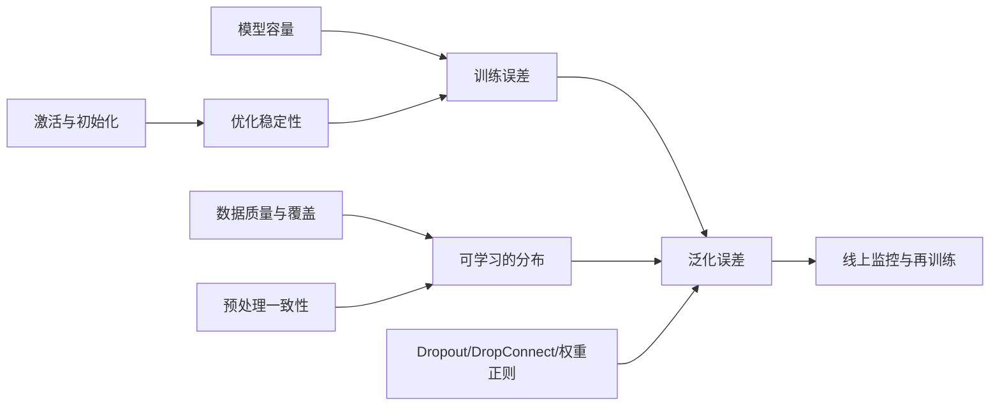
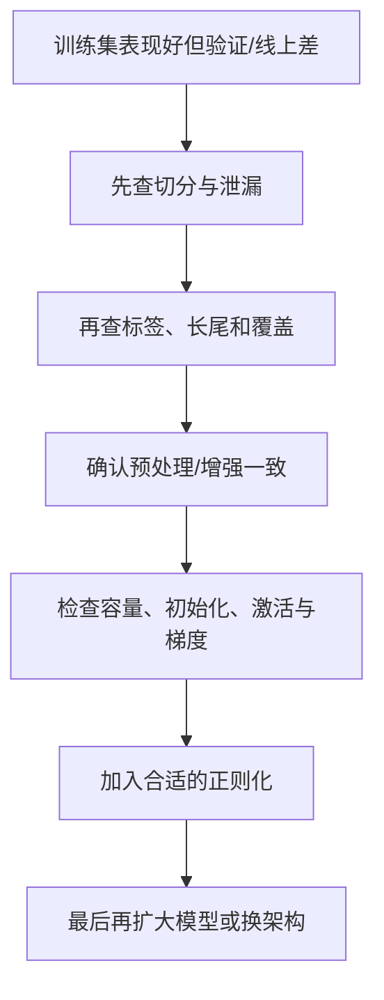

# 第6章 提高泛化能力的方法

> 本章主线：训练集上的低损失只是“记住了已知样本”；泛化能力要求模型学到跨样本、跨时间、跨环境仍然成立的规律。

## 本章在全书中的位置

前面几章主要回答“模型怎样表达和学习”；本章回答“为什么它在现实中会失败，以及如何减少这种失败”。泛化不是训练结束后再补的一层技巧，而是由数据覆盖、预处理、激活、模型容量、随机化和评估方式共同决定的系统性质。

## 6.1 训练样本

### 第一性原理：泛化是对未来分布的下注

设训练样本来自分布 $P_{train}(x,y)$，线上样本来自 $P_{test}(x,y)$。理想目标是最小化未来风险：

$$
R_{test}(f)=\mathbb E_{(x,y)\sim P_{test}}
\left[\mathcal L(f(x),y)\right]
$$

训练时只能用有限样本估计它：

$$
\hat R_{train}(f)=\frac1N\sum_{i=1}^{N}
\mathcal L(f(x_i),y_i)
$$

泛化的难点不只是样本数量，而是训练数据是否覆盖了部署时会遇到的变化。大量重复的近似样本，不如少量覆盖关键边界的样本有价值。

### 数据切分

基本的 train/validation/test 切分必须符合数据生成过程：

- 同一用户、同一设备、同一患者或同一视频序列不能随意跨集合；
- 时间预测应优先用时间切分，不能随机打乱未来信息；
- 调参使用验证集，测试集只在最终报告时使用；
- 如果标签有延迟，切分点要尊重标签产生时间。

数据泄漏会让离线指标虚高：例如把同一人的不同帧分别放入训练和测试，模型可能只是记住身份、背景或设备指纹。

### 样本质量比样本数量更早成为瓶颈

要检查：标签一致性、边界样本、长尾类别、重复样本、异常标注、缺失标签和标签定义的时间变化。对于分类任务，类别比例不均时，accuracy 可能掩盖少数类完全失败；可以使用 class weight、重采样、分层指标和阈值优化，但不要把重新采样当作修复标签问题的替代品。

### 数据增强与主动采样

数据增强把已知样本变成一组合理变体：

$$
\tilde x\sim T(x),\qquad y(\tilde x)=y(x)
$$

这个等式中的标签不变假设必须成立。主动学习则优先选择模型最不确定、最能改变决策边界或最具业务价值的样本进行标注。

### 工业联系：数据版本比模型版本更容易被忽略

生产流程应记录数据快照、过滤规则、标注指南、增强配置、采样种子、切分逻辑和标签版本。模型指标下降时，先比较数据分布与标签政策是否变化，再决定是否换网络。

TensorFlow 的 [Overfit and underfit 指南](https://www.tensorflow.org/tutorials/keras/overfit_and_underfit) 把一个实用优先级讲得很清楚：先争取覆盖更完整的数据；数据再加不动时，再用降低容量、权重正则、Dropout 和增强等方式约束模型。

### 我的洞见

“更多数据”不是一条无条件正确的建议。真正有价值的是**更多独立信息**：新场景、新设备、新用户、新时间段和边界案例。把重复样本再复制一万次，只会让训练集看起来更大。

## 6.2 预处理

### 预处理的目的

预处理不是把数据“变漂亮”，而是把输入坐标变得适合优化，并在训练、验证、推理之间保持同一语义。常见标准化为：

$$
x'_{j}=\frac{x_j-\mu_j}{\sigma_j+\epsilon}
$$

其中 $\mu_j,\sigma_j$ 必须只用训练集估计，然后固定应用到验证和线上数据。

### 常见做法

| 数据 | 常见预处理 | 关键风险 |
|---|---|---|
| 图像 | resize、归一化、颜色通道转换 | 训练/部署通道顺序不一致 |
| 文本 | tokenizer、截断、padding、词表版本 | 截断丢掉关键信息，词表漂移 |
| 表格 | 缺失填充、数值标准化、类别编码 | 用全量数据统计导致泄漏 |
| 时间序列 | 窗口化、去趋势、时间对齐 | 使用未来窗口信息 |
| 音频 | 采样率统一、频谱变换、响度处理 | 设备差异造成分布偏移 |

### 预处理与模型层的边界

把必要的预处理放进可导的模型图中，能减少训练/推理不一致，例如使用模型内的 normalization layer；但统计量、词表、类别映射仍需版本化并随模型一起发布。对于线上系统，预处理代码本身就是模型的一部分。

### 工业实践：建立“单一真相”

离线训练脚本、批量推理和线上服务应共享同一套预处理实现或同一组明确的契约测试。上线前用固定样本比较三者的：输入张量、形状、数值范围、预测 logits 和最终后处理结果。

### 我的洞见

很多“模型上线后突然变差”不是参数错，而是坐标系错：训练时的 $x$ 和推理时的 $x$ 根本不是同一种数。预处理要像模型权重一样被审查、测试和版本化。

## 6.3 激活函数

### 为什么激活影响泛化和可训练性

深度网络的梯度包含各层激活函数的导数乘积。若导数在很多层都小于 1，梯度会快速衰减；若尺度过大，则可能爆炸。sigmoid 的导数为：

$$
\sigma'(z)=\sigma(z)(1-\sigma(z))\le\frac14
$$

当 $|z|$ 很大时，导数接近 0。tanh 也会饱和。ReLU：

$$
\operatorname{ReLU}(z)=\max(0,z)
$$

在正区间提供恒定梯度，因此成为深层视觉网络的重要基础。

### 常见选择

- ReLU：简单、快，但负半轴单元可能长期不激活；
- Leaky ReLU/PReLU：负区间保留斜率；
- ELU/SELU：更平滑地处理负值；
- GELU/SiLU：现代序列和视觉架构常用的平滑门控。

激活选择应与初始化和归一化共同考虑。 [Delving Deep into Rectifiers](https://openaccess.thecvf.com/content_iccv_2015/html/He_Delving_Deep_into_ICCV_2015_paper.html) 的启发是：激活函数改变了方差传播，所以初始化不能脱离激活单独讨论。

### 工业诊断

训练时可以统计每层：激活均值、方差、零值比例、梯度范数和异常值数量。若某层几乎全零，可能是学习率过大、偏置不合适、输入尺度错误或 ReLU 死亡；若激活分布不断漂移，需检查归一化、数据批次和模型模式。

### 输出层例外

隐藏层追求梯度通畅，输出层追求正确的任务语义：概率输出常用 sigmoid/softmax，回归常用线性或有界函数。不能因为 ReLU 在隐藏层有效，就把所有输出都换成 ReLU。

### 我的洞见

激活函数是一个“信息闸门”：它不仅增加非线性，还决定哪些信号能继续传播、哪些方向被截断。激活选择实际上是在设计模型的可学习几何。

## 6.4 Dropout

### 机制

训练时，对隐藏激活采样 Bernoulli 掩码：

$$
m_j\sim\operatorname{Bernoulli}(p),
\qquad
\tilde h_j=\frac{m_j}{p}h_j
$$

这种 inverted dropout 使得：

$$
\mathbb E[\tilde h_j\mid h_j]=h_j
$$

推理时不再随机丢弃，直接使用完整网络。不同实现可能采用“保留率 $p$”或“丢弃率 $1-p$”命名，配置时必须确认。

### 第一性原理：阻止共同作弊

如果两个神经元总是共同出现，网络可能依赖某个脆弱组合记忆训练样本。Dropout 每个 batch 随机删除一部分单元，使网络不能过度依赖任何一个伙伴；从另一个角度看，它训练了大量共享权重的稀疏子网络，并在推理时近似平均这些子网络。

经典论文 [Dropout: A Simple Way to Prevent Neural Networks from Overfitting](https://www.jmlr.org/beta/papers/v15/srivastava14a.html) 把 Dropout 解释为阻止单元过度共适应，并展示了它在视觉、语音、文档和计算生物学任务中的效果。今天读这篇论文，最值得保留的是“随机化模型族”的思想，而不是把 0.5 当成万能默认值。

### 用在哪里

- 全连接层通常比较容易过拟合，Dropout 价值明显；
- 卷积层可使用 spatial/channel dropout，但空间结构使掩码设计更谨慎；
- Transformer 中常对注意力、残差分支或前馈层使用 dropout；
- 小数据微调时，过强 Dropout 可能破坏有用的预训练表示。

### 工业实践

验证 Dropout 的效果必须用固定验证集和多次种子实验，因为随机性会带来方差。上线前确保推理模式关闭随机掩码，否则同一个请求可能产生不一致结果，也会影响缓存、审计和用户体验。

### 我的洞见

Dropout 不是真正“减少了模型参数”，而是改变了训练时每一步所使用的子网络。它的核心是增加训练任务的难度，让模型学习更可组合的证据；如果数据已经极少，增加难度可能反而让模型学不够。

## 6.5 DropConnect

### 机制

Dropout 随机丢弃激活；DropConnect 随机丢弃连接/权重。设权重矩阵为 $W$，掩码为：

$$
M_{ij}\sim\operatorname{Bernoulli}(p),
\qquad
\tilde W=M\odot W
$$

层输出为：

$$
y=\sigma((M\odot W)x+b)
$$

DropConnect 的随机性作用在参数连接上，同一个输出单元每次可能接收来自不同输入子集。

### 与 Dropout 的比较

| 方法 | 随机化对象 | 直觉 | 常见代价 |
|---|---|---|---|
| Dropout | 激活单元 | 不依赖某个中间特征 | 对结构化特征需谨慎 |
| DropConnect | 权重连接 | 不依赖某条固定连接 | 实现和硬件效率更复杂 |
| L2/weight decay | 参数幅度 | 抑制过大的权重 | 不直接产生随机子网络 |
| 数据增强 | 输入样本 | 学习对合理变化不敏感 | 增强语义可能出错 |

论文 [Regularization of Neural Networks using DropConnect](https://proceedings.mlr.press/v28/wan13.html) 将 DropConnect 视为 Dropout 的推广，并研究了通过多个随机网络聚合预测的效果。工程上它并没有取代 Dropout，原因之一是稀疏随机矩阵在通用硬件上不一定高效，收益也高度依赖任务和层类型。

### 工业联系

如果瓶颈是大规模全连接层的共适应，可以把 DropConnect 作为实验候选；如果目标是移动端速度或简单可维护性，通常先尝试数据质量、增强、权重衰减、Dropout、早停和迁移学习。不要为了使用更复杂的正则化而增加系统复杂度。

### 我的洞见

Dropout 和 DropConnect 体现同一原则：泛化可以通过训练时注入结构性不确定性来改善。但正则化的价值取决于扰动是否破坏了任务不变量；随机并不自动等于有益。

## 6.6 小结

### 本章结论

1. 泛化的对象是未来分布，不是训练集本身。
2. 数据切分、标签质量和覆盖范围往往比换模型更重要。
3. 预处理必须在训练、验证和推理之间保持同一坐标语义。
4. 激活函数、初始化和归一化共同决定梯度能否稳定传播。
5. Dropout 和 DropConnect 通过随机化子网络/连接抑制共适应，但都不是万能药。

### 一套实战优先级

### 与前后章节的连接

- 第2章的损失和学习率决定训练集能否拟合；本章关注训练集之外的风险。
- 第3章的卷积先验本身就是一种泛化偏置：它用结构减少需要学习的自由度。
- 第5章的降噪/稀疏自编码器是把正则化直接写进表示学习目标。
- 第7章要把数据、预处理、随机种子、checkpoint 和评估日志固化成可复现工具链。
- 第8章的应用会把泛化问题扩大到分布漂移、鲁棒性、安全和公平性。

### 练习

1. 构造一个会产生数据泄漏的图像切分方案，再改成按实体或时间切分。
2. 推导 inverted dropout 为什么在推理时不需要再乘保留率。
3. 对同一模型比较无正则、L2、Dropout、数据增强四种方案，并按训练/验证曲线解释差异。
4. 统计每层 ReLU 的零值比例，判断一个“死神经元”问题到底来自激活、初始化还是输入尺度。

## 延伸阅读

- [Overfit and underfit（TensorFlow 官方教程）](https://www.tensorflow.org/tutorials/keras/overfit_and_underfit)：把数据、容量、权重正则和 Dropout 放进同一个诊断框架。
- [Dropout（JMLR, 2014）](https://www.jmlr.org/beta/papers/v15/srivastava14a.html)：理解随机子网络与共适应。
- [DropConnect（PMLR, 2013）](https://proceedings.mlr.press/v28/wan13.html)：理解随机连接正则化的取舍。
- [Batch Normalization（PMLR, 2015）](https://proceedings.mlr.press/v37/ioffe15.html)：理解归一化对深层优化和正则化的影响。

---

**上一章**：[[第5章-自编码器]]  
**下一章**：[[第7章-深度学习工具]] —— 把这些数学与训练原则落到实际开发环境。
