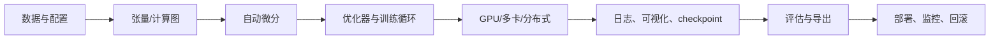
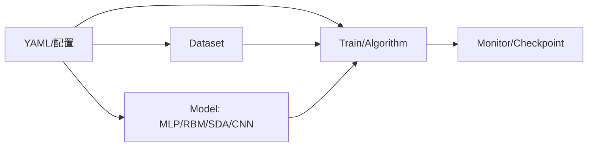
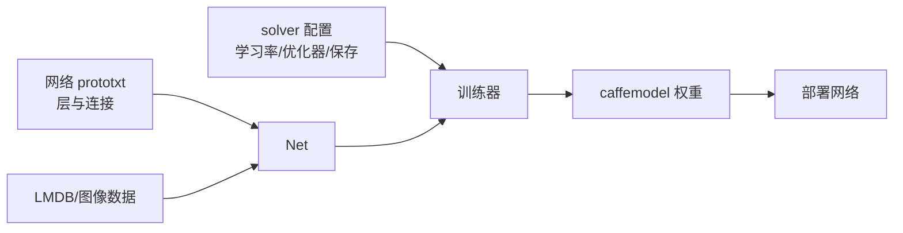
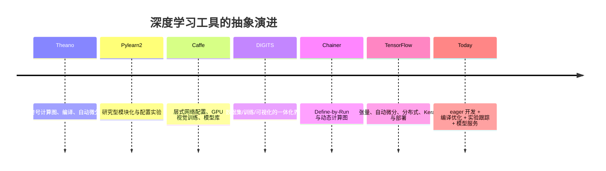

# 第7章 深度学习工具

> 本章主线：算法只有变成可复现、可调试、可扩展的软件，才可能从论文实验进入真实系统。

## 本章在全书中的位置

前6章讲模型、目标和泛化；本章讲“如何把这些东西可靠地跑起来”。书中的工具大多代表深度学习发展史上的重要阶段，今天有些已经进入维护或停止支持状态。因此阅读本章要同时做两件事：理解它们曾经解决的工程问题；把这些问题映射到今天仍然存在的框架、编译器、分布式训练和 MLOps。



## 7.1 深度学习开发环境

### 环境不是“装个库”

一个可工作的深度学习环境至少包含：

1. Python/系统运行时和依赖版本；
2. 数值库、深度学习框架和自动微分；
3. GPU 驱动、CUDA/cuDNN 或其他加速后端；
4. 数据读取、增强、日志、可视化和评估工具；
5. 模型权重、配置、随机种子和实验记录。

模型能否运行，取决于这些组件的兼容矩阵，而不只是 Python 代码是否正确。

### 训练环境的四层

| 层 | 负责什么 | 需要固定的东西 |
|---|---|---|
| 数据层 | 读取、切分、增强、批处理 | 数据快照、索引、预处理版本 |
| 数值层 | 张量、矩阵、自动微分 | dtype、设备、算子实现 |
| 模型层 | 网络结构和前向计算 | 配置、权重初始化、模型版本 |
| 实验层 | 优化、日志、评估、导出 | 超参数、种子、checkpoint、指标 |

### 可复现性清单

- 保存代码提交号、依赖锁定文件和容器/镜像版本；
- 固定随机种子，但知道 GPU 算子和并行顺序仍可能产生非确定性；
- 记录数据 hash、切分规则和标签版本；
- 每隔固定步数保存 checkpoint，并保存优化器状态；
- 将训练曲线、硬件利用率、显存、吞吐和验证指标写入日志；
- 用一个小数据集做单元测试：前向形状、损失下降、梯度非空、保存/加载一致。

### 工业联系

研发环境和生产环境不必完全相同，但必须共享模型格式、预处理契约和数值验收样本。训练时用 GPU，推理时可能用 CPU、移动端 NPU 或专用加速器；模型导出、量化和算子支持应在早期验证，而不是训练完成后才发现不能部署。

### 我的洞见

深度学习工程的最小可交付物不是一个 `.py` 文件，而是：数据版本 + 配置 + 代码 + 权重 + 指标 + 环境 + 可重复运行命令。缺一个，别人就难以判断结果究竟来自算法还是环境偶然性。

## 7.2 Theano

### 它解决的核心问题

Theano 把数学表达式写成符号计算图，再编译为高效的 CPU/GPU 代码。它的基本思路是：

```python
# 示意：先声明符号，再编译函数
x = symbolic_vector("x")
w = symbolic_vector("w")
y = dot(x, w)
f = compile(inputs=[x, w], outputs=y)
```

这对应“define-and-run”：先定义图，再给图喂数据执行。自动求导和图优化可以复用第2章的链式法则，避免手写梯度。

### 优势

- 数学表达与执行分离，便于全局优化；
- 能把同一图编译到 CPU/GPU；
- 适合研究人员检查梯度、共享变量和符号关系；
- 为后来的计算图框架提供了重要思想。

### 限制

- 动态控制流和调试体验不如命令式执行直观；
- 编译时间、错误信息和生态兼容会增加开发成本；
- 复杂动态模型需要额外的图表达技巧。

Theano 官方文档把它定义为用于定义、优化和评估数学表达式的 Python 库；相关论文 [Theano: A Python framework for fast computation of mathematical expressions](https://arxiv.org/abs/1605.02688) 展示了它如何成为 CPU/GPU 数值计算编译器。它今天更适合作为理解“符号图、图优化和自动微分”的历史教材，而不是新项目的默认生产框架。

### 工业联系

Theano 留下的思想仍在今天出现：图编译、算子融合、静态 shape、自动微分、设备放置和计算图导出。现代框架常让用户先用命令式方式开发，再通过 tracing/编译把热点路径优化成图。

### 我的洞见

Theano 的价值在于把“神经网络训练”还原为编译器问题：前向计算是一张图，反向传播是图上的另一种遍历，优化器可以对整张图做变换。理解这一点，就能看懂为什么框架要区分 eager、graph、trace 和 compile。

## 7.3 Pylearn2

### 设计取向

Pylearn2 是建立在 Theano 之上的研究型机器学习库，强调灵活、可组合和实验可配置。它把 dataset、model、algorithm、training loop 和 monitoring 分开，常用 YAML 描述实验配置。



### 适合学习什么

- 如何把模型和数据接口解耦；
- 如何让研究实验通过配置复现；
- 如何把训练监控、保存和验证做成框架能力；
- 为什么研究库需要暴露比“黑盒 fit”更多的内部控制。

Pylearn2 [官方文档](https://pylearn2.readthedocs.io/en/latest/) 明确强调它追求研究灵活性，而不是像 scikit-learn 那样主要提供黑盒式便捷接口；这对理解实验框架很有帮助。

### 局限与今天的对应物

Pylearn2 的生态和维护状态已经不适合新生产项目。它提醒我们：研究代码要有模块边界、配置记录、序列化和监控，否则即使论文结果很好，也难以被别人复现。今天可以在 PyTorch Lightning、Keras 自定义训练循环、JAX/Flax 等系统中寻找类似的分层思想，但选择工具要看团队维护能力和部署链路。

### 我的洞见

“灵活”不是让所有东西都可变，而是让真正需要研究的部分可插拔，同时把数据、日志、保存和评估这些重复工作标准化。研究框架的抽象边界，本身就是科学生产力。

## 7.4 Caffe

### 网络配置与训练分离

Caffe 以层为中心，用配置文件描述网络结构，用 solver 配置优化器、学习率和 checkpoint。数据在 Blob 中按张量流动，卷积、池化、全连接等层由框架实现。



### 为什么 Caffe 影响大

Caffe 以清晰、速度和可部署性为卖点，网络由简单配置文件描述，CPU/GPU 切换相对直接，并提供 Model Zoo。[Caffe 官方教程](https://tutorial.caffe.berkeleyvision.org/tutorial_index.html) 仍然能很好地展示 LeNet、ImageNet 和 fine-tuning 的经典工作流。

### 结构性优点

- CNN 常用层已经工程化；
- 配置与代码分离，实验更容易复现；
- C++/GPU 实现适合当时的视觉生产场景；
- 预训练模型和模型交换推动了迁移学习。

### 局限

- 动态控制流、复杂递归结构和新型研究模型不够自然；
- 配置文件表达能力有限，调试常要跨配置、C++ 和日志；
- 生态逐渐被更灵活的自动微分框架取代。

### 工业联系

Caffe 的经验今天仍适用于模型部署：训练框架的灵活性和推理引擎的稳定性可以分离；模型应该有明确的输入输出契约、可导出的中间格式、版本化权重和回归测试。不要把“训练代码可运行”误认为“模型可运营”。

### 我的洞见

Caffe 的核心贡献是把网络结构变成一种可读的“模型配置语言”。这提示我们：当模型规模变大时，结构、超参数、权重和数据必须成为可审查的工件，而不能藏在一段不可追踪的脚本里。

## 7.5 训练系统——DIGITS

### 它是什么

DIGITS（Deep Learning GPU Training System）是面向视觉训练的交互式平台，提供数据集管理、模型配置、训练监控、可视化和测试入口，曾主要围绕 Caffe，也支持 TensorFlow 等后端。目录中的“DIGITS137”应理解为“DIGITS + 页码 137”，不是另一个工具。

### 典型工作流

1. 创建或导入图像数据集；
2. 选择分类、检测或分割任务；
3. 选择网络和训练参数；
4. 观察 loss、准确率、学习率和 GPU 状态；
5. 对验证图片做推理；
6. 导出模型或继续 fine-tuning。

### 它解决了什么工程摩擦

早期深度学习中，很多人卡在数据格式、GPU 训练命令、日志可视化和模型测试，而不是算法本身。DIGITS 把这些步骤放进一个可视化界面，降低了视觉原型的入门门槛。

### 当前状态与阅读方式

NVIDIA 的 [DIGITS 官方文档](https://docs.nvidia.com/deeplearning/digits/index.html) 明确说明该软件不再新增功能、修复 bug 或提供支持，并建议开发者考虑新的工具链。因此今天不应把 DIGITS 当新项目的默认选择；应把它看成“数据集—训练作业—实时日志—可视化—导出”这一实验平台形态的历史例子。

### 现代对应物

今天相同的需求通常由训练脚本/Notebook + 实验跟踪平台 + 模型注册表 + 可视化工具 + CI/CD 组合完成。平台是否有 GUI 不是关键，关键是每次实验能否追踪数据、配置、代码、权重和指标。

### 我的洞见

工具的生命周期本身也是工程事实。一个项目不能只记录“模型效果”，还要记录框架是否维护、驱动是否兼容、模型格式是否可迁移、团队是否能接手。可视化界面解决了入门问题，但可审计和可自动化才决定生产寿命。

## 7.6 Chainer

### Define-by-Run

Chainer 的标志是 Define-by-Run：计算图在实际前向执行时动态生成，反向传播沿这次执行记录的计算历史进行。网络定义因此可以直接使用 Python 的条件、循环和递归。

```python
# 示意：每次 forward 都可以根据输入动态决定路径
def forward(x):
    h = encoder(x)
    if h.shape[0] > threshold:
        h = block_a(h)
    else:
        h = block_b(h)
    return decoder(h)
```

### 与 define-and-run 的比较

| 维度 | Define-and-Run | Define-by-Run |
|---|---|---|
| 图生成 | 先定义、后执行 | 执行时生成 |
| 调试 | 需要理解静态图 | 接近普通 Python |
| 动态结构 | 表达较绕 | 自然 |
| 优化/部署 | 可提前全局优化 | 需要 tracing/编译等机制 |
| 典型历史代表 | Theano、早期 TensorFlow、Caffe | Chainer、PyTorch、TF eager |

Chainer [官方文档](https://docs.chainer.org/en/stable/) 说明它支持 feed-forward、CNN、RNN 和递归网络，并以 Define-by-Run 为核心；同一页面也注明它已进入 maintenance phase。它对今天的影响主要体现在动态计算图、命令式自动微分和研究友好的调试体验。

### 工业联系

动态计算图适合快速研究和复杂模型，但生产部署仍需要考虑图捕获、算子融合、批处理、序列化和跨设备执行。现代框架通常让开发者用 eager/imperative 方式写模型，再把稳定路径编译或导出。

### 我的洞见

Chainer 说明“易调试”和“高性能”并不是只能二选一：可以先用命令式语义获得正确性，再用编译器把热路径优化。开发阶段和部署阶段的抽象不必相同。

## 7.7 TensorFlow

### 从计算图到端到端平台

TensorFlow 把张量计算、自动微分、GPU/TPU 执行、数据管道、分布式训练、可视化和部署连接起来。今天常见入口是 Keras：

```python
model = keras.Sequential([
    keras.layers.Input(shape=(28, 28, 1)),
    keras.layers.Conv2D(32, 3, activation="relu"),
    keras.layers.GlobalAveragePooling2D(),
    keras.layers.Dense(num_classes),  # 输出 logits
])
model.compile(
    optimizer=keras.optimizers.Adam(1e-3),
    loss=keras.losses.SparseCategoricalCrossentropy(from_logits=True),
    metrics=["accuracy"],
)
```

### 核心组件

- `tf.Tensor`：统一的多维数组抽象；
- 自动微分：根据前向运算求梯度；
- `tf.data`：读取、打乱、批处理、预取和分布式数据流水线；
- Keras：模型、层、损失、指标、优化器和训练接口；
- `tf.function`/图执行：把 Python 函数捕获为可优化的计算图；
- SavedModel/部署工具：保存模型结构、权重和签名。

TensorFlow 的 [Keras 官方指南](https://www.tensorflow.org/guide/keras) 强调它覆盖数据处理、训练、超参数调优到部署；[图和 `tf.function` 指南](https://www.tensorflow.org/guide/intro_to_graphs) 说明 Python 代码如何被捕获和优化。今天选择框架时，关键不是背 API，而是理解 eager 调试、图编译、自动微分、数据吞吐和部署格式之间的边界。

### 现代实践建议

1. 先用 Keras 或另一套高层 API 写出可验证的最小模型；
2. 用自定义训练循环处理梯度累积、混合精度、复杂损失或多任务；
3. 用 profile 工具确认瓶颈在输入、算子、显存还是通信；
4. 训练时保存最佳 checkpoint、完整配置和预处理资产；
5. 用固定样本比较训练框架输出和生产推理引擎输出；
6. 对部署模型做量化、批处理、并发和异常输入测试。

### TensorFlow 与其他框架的选择

本书列出的是历史主流工具，今天还应比较 PyTorch、JAX、Keras 等。框架选择可按以下问题，而不是按流行度：

| 问题 | 关注点 |
|---|---|
| 研究迭代 | 动态调试、自动微分、社区模型 |
| 大规模训练 | 分布式策略、通信、混合精度、检查点 |
| 生产部署 | 导出格式、服务框架、移动/边缘支持 |
| 团队协作 | 代码规范、监控、人才和维护周期 |

### 我的洞见

框架把第2章的数学变成“可组合的软件”。但框架不会替你选择正确标签、切分数据或业务指标；它只会让错误的目标跑得更快。工具能力越强，越需要测试和审计。

## 7.8 小结

### 工具演进的主线



### 本章结论

1. 计算图和自动微分是把数学可靠实现的核心抽象。
2. 配置、日志、checkpoint 和数据版本决定实验能否复现。
3. 视觉框架曾优先优化 CNN 训练，动态框架后来改善了研究灵活性。
4. 工具会过时，但数据契约、模型导出、回归测试和监控不会过时。
5. 新项目的选择应以维护周期、部署路径和团队能力为准，而不是只看论文年代。

### 与前后章节的连接

- 第2章的反向传播对应框架的自动微分；
- 第3章的 CNN 对应 Caffe/DIGITS 等视觉工具的历史优势；
- 第4、5章的 RBM/自编码器要求框架允许自定义采样、重构和多阶段训练；
- 第6章的泛化要求工具记录数据增强、随机种子、验证和 checkpoint；
- 第8章的应用要求把训练工件转换成可部署、可监控、可回滚的服务。

### 练习

1. 为一个小型图像分类项目写出环境、数据、配置、日志、checkpoint 和导出清单。
2. 用静态计算图和动态计算图两种思路画出同一个两层 MLP 的前向与反向过程。
3. 解释为什么一个框架的训练结果不能直接假设在另一个推理引擎中数值完全一致。
4. 对比 Caffe 的配置式网络和 Chainer/TensorFlow eager 的模型定义，分别列出适合与不适合的任务。

## 延伸阅读

- [Theano: A Python framework for fast computation of mathematical expressions](https://arxiv.org/abs/1605.02688)：理解符号图与编译式数值计算。
- [Pylearn2 官方文档](https://pylearn2.readthedocs.io/en/latest/)：理解研究型模块化实验框架。
- [Caffe 官方教程](https://tutorial.caffe.berkeleyvision.org/tutorial_index.html)：理解层式网络配置和视觉训练流程。
- [NVIDIA DIGITS 官方文档](https://docs.nvidia.com/deeplearning/digits/index.html)：了解其历史工作流及当前停止支持的状态。
- [Chainer 官方文档](https://docs.chainer.org/en/stable/)：理解 Define-by-Run。
- [Keras 官方指南](https://www.tensorflow.org/guide/keras)：理解现代高层 API 如何覆盖训练到部署。

---

**上一章**：[[第6章-提高泛化能力的方法]]  
**下一章**：[[第8章-深度学习的现在和未来]] —— 看这些结构如何进入真实应用，并面对新的边界。
