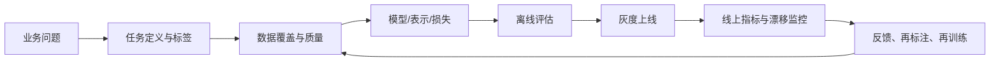
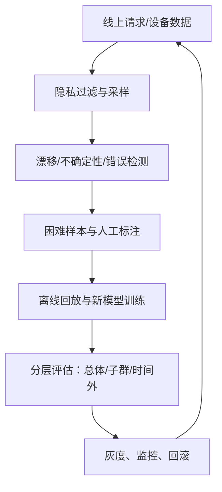

# 第8章 深度学习的现在和未来

> 本章主线：深度学习的价值不在于“网络看起来像大脑”，而在于它能否把数据中的结构转化为可靠、可衡量、可部署的决策能力。

## 本章在全书中的位置

前7章分别讲了表示、结构、概率、预训练、泛化和工具；本章把这些因素放回真实世界。一个模型只有同时满足任务效果、数据合规、成本约束、可解释/可审计要求和线上稳定性，才算应用成功。

## 8.1 深度学习的应用案例

### 8.1.1 计算机视觉与 OCR

CNN 最早大规模成功的场景之一是手写数字和文档识别。输入图像经过卷积层提取局部特征，经过层次组合得到字符或物体类别。 [Gradient-based learning applied to document recognition](https://leon.bottou.org/papers/lecun-98h) 记录了从像素到文档识别的完整思想；[AlexNet 论文](https://papers.nips.cc/paper_files/paper/2012/hash/c399862d3b9d6b76c8436e924a68c45b-Abstract.html) 则展示了大数据、GPU 和深层卷积如何把视觉识别推进到新的规模。

工业流程通常不是“训练一个分类器”这么简单：

1. 检测/定位文本或物体；
2. 做裁剪、矫正、去噪和尺寸归一化；
3. 识别字符、词或结构化字段；
4. 用语言模型、词典、版面规则或业务校验纠错；
5. 对低置信度结果进入人工复核。

评价指标也要分层：检测用 precision/recall、IoU 或 mAP，识别用字符错误率/词错误率，最终还要看字段级准确率、人工复核率、延迟和每页成本。只优化平均字符准确率，可能无法减少关键金额或身份证号的错误。

### 8.1.2 语音识别与音频

音频可以转成频谱图输入 CNN，也可以用 RNN、Transformer 或混合结构处理时间上下文。语音识别把连续声学信号映射为文字，核心难点包括说话人、口音、噪声、设备和领域词汇的变化。

工业系统常见组合是：声学/表示模型 + 解码器 + 语言约束 + 领域词表 + 后处理。评估要按场景切片统计 WER/CER，而不是只报一个平均数；客服电话中的专业名词、姓名和数字通常比普通句子的错误代价更高。

### 8.1.3 自然语言处理

第2章的 MLP 可以处理固定向量，第5章的表示学习可以把词或句子变成向量，第8章要进一步面对序列顺序、长距离依赖和多任务迁移。 [Attention Is All You Need](https://papers.neurips.cc/paper/7181-attention-isall-you-need.pdf) 提出的 Transformer 用注意力机制在序列位置之间直接建立依赖，成为后来大规模语言和多模态模型的重要基础。

在生产中，语言模型经常不是独立回答问题，而是嵌入检索、分类、摘要、信息抽取、客服、代码辅助或流程自动化。系统应把模型输出视为候选证据，并配合：

- 检索/数据库校验，减少凭空生成；
- 结构化输出和 schema 校验；
- 敏感信息过滤和权限控制；
- 事实性、拒答、延迟和成本监控；
- 人工审核和可追溯日志。

### 8.1.4 推荐、广告和搜索排序

推荐系统常用深度网络把用户、物品、上下文和行为编码成向量，再预测点击、转化、停留或购买。一个简化目标可能是：

$$
\mathcal L=\mathcal L_{click}+\alpha\mathcal L_{conversion}
+\beta\mathcal L_{ranking}+\lambda\Omega(\theta)
$$

但离线 AUC 提升不保证线上长期价值提升，因为曝光会改变用户行为，存在反馈回路、位置偏差、热门偏置和探索不足。工业系统通常分候选召回、粗排、精排和策略层，并通过在线实验观察长期留存、收入、投诉和多样性。

### 8.1.5 医疗、制造和异常检测

自编码器、CNN 和时序网络都可以用于缺陷检测、设备预测性维护、医学影像辅助和传感器异常识别。此类场景的关键不只是平均准确率，而是漏检和误报的不同成本、样本稀缺、标签延迟、设备迁移和人机协同。

自编码器的异常分数常写成：

$$
s(x)=\mathcal L\bigl(x,\hat x\bigr)
$$

但阈值必须在代表真实故障的验证集上设定，并定期随设备状态更新。一个模型如果把未见过的正常工况也判成异常，运维人员会产生告警疲劳；如果把新型故障重构得很好，则会漏检。

### 8.1.6 强化学习与控制

强化学习的目标不是直接拟合标签，而是通过与环境交互最大化折扣回报：

$$
J(\pi)=\mathbb E_\pi\left[\sum_{t=0}^{\infty}\gamma^t r_t\right]
$$

Deep Q-Network 用深度网络近似动作价值函数，连接了高维感知和决策。[Human-level control through deep reinforcement learning](https://www.nature.com/articles/nature14236) 展示了从像素输入学习游戏控制的代表性路线。

工业控制比游戏更谨慎：探索可能有真实代价，环境可能不可逆，奖励函数容易被钻空子，离线日志存在分布偏差。因此常采用模拟器、离线策略评估、约束优化、保守策略和人工接管，不会直接让随机探索进入高风险系统。

### 8.1.7 应用选择表

| 场景 | 主要输入/监督 | 常见模型方向 | 关键工业约束 |
|---|---|---|---|
| 图像分类/检测 | 图像 + 标签/框 | CNN、Vision Transformer | 长尾、延迟、误报/漏报 |
| OCR | 图像 + 文本/框 | CNN/Transformer + 解码 | 字段级错误、版面、人工复核 |
| 语音 | 音频 + 文本 | CNN/RNN/Transformer | 噪声、口音、词表、隐私 |
| NLP/检索 | 文本 + 标签/相似度 | Transformer、向量检索 | 事实性、权限、成本 |
| 推荐排序 | 行为日志 + 转化 | embedding + ranking | 反馈回路、公平、多样性 |
| 异常检测 | 正常数据/少量故障 | AE、密度模型、判别模型 | 漂移、告警疲劳、阈值 |
| 控制决策 | 状态、动作、回报 | RL、规划、混合系统 | 安全、探索、可逆性 |

### 第一性原理：应用成功取决于错误的经济意义

模型输出一个概率或分数，业务系统要把它转换成行动。不同任务的损失函数、阈值和人工复核流程不同；同样的 95% 准确率，在推荐、医疗和支付风控中代表完全不同的风险。

### 我的洞见

“深度学习适用于图像、语音、文本”只是输入模态层面的描述。真正决定能否落地的是：是否有稳定的预测目标、足够覆盖的反馈数据、可接受的错误成本，以及能否把预测嵌入现有流程。

## 8.2 深度学习的未来

### 8.2.1 从任务模型到通用表示

第4、5章已经给出了预训练的雏形：先从无标签数据学习结构，再微调到下游任务。未来路线会继续减少每个任务从零训练的成本，通过自监督、跨模态对齐、掩码预测和生成目标学习更通用的表示。

但通用表示不等于通用正确性。源数据中的偏差、授权限制和领域缺口会被一起迁移；微调也可能让模型忘记原本有用的能力。真正的工程问题是如何测量迁移收益、负迁移、数据污染和模型遗忘。

### 8.2.2 更深、更大与更高效之间的平衡

ResNet 说明残差连接可以帮助训练更深网络；[Deep Residual Learning for Image Recognition](https://openaccess.thecvf.com/content_cvpr_2016/html/He_Deep_Residual_Learning_CVPR_2016_paper.html) 还展示了更深表示对检测和分割的迁移价值。但深度和规模会增加训练算力、内存、能源、延迟和供应链成本。

未来工程会更多关注：

- 蒸馏、剪枝、量化和低秩分解；
- 稀疏/条件计算，只激活需要的模块；
- 端侧和边缘推理，减少数据传输和隐私风险；
- 更高效的数据管道、编译器、加速器和分布式通信；
- 以质量、成本、延迟和能耗组成的多目标评价。

### 8.2.3 多模态与工具协同

图像、文本、音频、视频和结构化数据可以在共享表示空间中对齐。注意力机制提供了在不同位置、不同模态之间选择相关信息的通用方式，但多模态系统的难点会从“看不懂”扩展到：模态时间对齐、检索权限、来源追踪、矛盾信息和输出可验证性。

生产系统可能采用“模型 + 检索 + 工具 + 规则”的组合，而不是要求一个网络把所有事实都记在参数里。第1章的端到端并不排斥系统边界；恰当的模块化可以提升可控性。

### 8.2.4 数据中心与持续学习

当模型架构逐渐标准化，差异会更多来自数据闭环：哪些样本被采集、如何标注、如何发现困难案例、如何处理长尾和漂移。持续学习要解决新数据到来后如何更新模型，同时避免灾难性遗忘和旧版本回归。

一个可靠闭环是：

### 8.2.5 可靠性、安全与治理

未来系统不能只追求平均指标，还要回答：

- 输入分布改变时，模型何时应该拒答或转人工？
- 预测置信度是否经过校准？
- 哪些子群体系统性更差？
- 数据和预训练模型是否有合法来源？
- 如何复现某次线上输出？
- 发生事故时能否快速回滚？

可解释性也要区分用途：特征可视化有助于调试，局部解释有助于审计，因果证据则需要更强的实验设计。一个热力图看起来合理，不等于模型真的依据了正确因果因素。

### 8.2.6 理论边界：拟合能力不等于理解

深度网络可以在高维数据中找到复杂规律，但训练损失低不自动推出因果理解、常识推理或分布外可靠性。第6章已经提醒我们，泛化需要数据覆盖和结构先验；未来还需要更好的不确定性估计、因果表示、可验证约束和交互式学习。

### 我的洞见

深度学习的未来不是简单地“越来越大”。更可能是三条线同时推进：

$$
\text{未来能力}
\approx
\text{更强表示}
\times\text{更便宜计算}
\times\text{更可靠反馈闭环}
$$

如果只提高模型规模而没有更好的数据、验证和安全边界，系统可能只是更昂贵地放大错误。

## 8.3 小结

### 全书主线回收

### 最重要的八个认识

1. 深度学习学习的不只是预测规则，还包括中间表示。
2. 神经网络的核心计算是线性变换、非线性和可微目标。
3. CNN 的力量来自把局部性、共享和层级组合写进结构。
4. RBM 和自编码器说明无标签数据也能塑造表示。
5. 泛化取决于数据分布、模型容量、优化过程和正则化的共同作用。
6. 工具链决定实验能否复现、模型能否部署和问题能否定位。
7. 应用成功取决于错误成本、业务流程和反馈闭环，而不是单一离线指标。
8. 未来的关键不是“更深”这一口号，而是更强、更便宜、更可控、更可验证。

### 一套从零到上线的学习/实践路线

1. 用第2章的 MLP 在小数据上手算并实现前向、损失和梯度；
2. 用第3章 CNN 做一个可解释的图像分类基线；
3. 用第5章自编码器完成无标签预训练或异常检测实验；
4. 用第6章的数据切分、增强、正则化和错误分析改进泛化；
5. 用第7章的工程原则记录环境、配置、checkpoint 和指标；
6. 选择一个真实应用，定义错误成本、线上约束、监控和回滚；
7. 最后再比较更大模型、更先进架构或多模态方案带来的增益。

### 练习

1. 为一个你熟悉的业务问题画出“数据—模型—决策—反馈”闭环，并说明其中最昂贵的错误。
2. 对一个视觉、文本或推荐任务，分别设计离线指标、线上指标和安全指标。
3. 解释为什么一个预训练模型可能在目标领域产生负迁移，并给出验证方案。
4. 设计一个灰度上线与回滚方案，至少包含模型版本、数据漂移、延迟、错误率和人工兜底。

## 延伸阅读

- [Deep learning（Nature, 2015）](https://www.nature.com/articles/nature14539)：从表示学习视角回顾深度学习的应用基础。
- [Deep Residual Learning for Image Recognition（CVPR, 2016）](https://openaccess.thecvf.com/content_cvpr_2016/html/He_Deep_Residual_Learning_CVPR_2016_paper.html)：理解更深网络如何通过残差结构变得可训练。
- [Attention Is All You Need（NeurIPS, 2017）](https://papers.neurips.cc/paper/7181-attention-isall-you-need.pdf)：理解注意力和序列建模路线的转折。
- [Human-level control through deep reinforcement learning（Nature, 2015）](https://www.nature.com/articles/nature14236)：理解深度表示如何与决策和环境交互结合。
- [Transfer learning & fine-tuning（TensorFlow 官方指南）](https://www.tensorflow.org/guide/keras/transfer_learning)：把表示迁移和微调落实到工程操作。

---

**上一章**：[[第7章-深度学习工具]]  
**回到开头**：[[第1章-绪论]]
