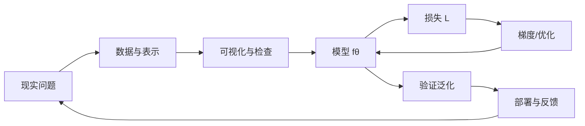

# 《用Python动手学机器学习》阅读地图

> 这不是对原书的逐页转录，而是围绕原书目录重新组织的学习地图：解释每章在回答什么问题、依赖什么知识、下一章为什么自然出现，并补充当前英文资料与工业视角。

## 一句话主线

机器学习可以先压缩成一个可反复检查的闭环：

- [[01-学习前的准备]]：把问题、环境和实验习惯搭起来。
- [[02-Python基础知识]]：学会让数据进入程序，并保持形状、类型、内存语义清楚。
- [[03-数据可视化]]：把“程序运行了”提升为“我能看见数据和模型在做什么”。
- [[04-机器学习中的数学]]：补齐向量、矩阵、导数、概率函数这套共同语言。
- [[05-有监督学习-回归]]：从最简单的连续值预测，理解模型、损失、优化和过拟合。
- [[06-有监督学习-分类]]：把输出从数值扩展到概率与类别，并理解交叉熵。
- [[07-神经网络与深度学习]]：把线性模型组合成可学习的非线性函数，理解反向传播。
- [[08-深度学习应用-MNIST]]：把图像的空间结构写入模型，理解卷积、池化、Dropout。
- [[09-无监督学习]]：没有标签时，用硬分配或概率分配寻找潜在结构。
- [[10-本书小结]]：把整本书重新压缩成一套可迁移的建模检查表。

## 我对本书结构的理解

本书真正的主角不是某一个算法，而是“数学式 → NumPy 代码 → 图形 → 可解释结论”的往返。第 5、6、7、8、9 章表面上是不同算法，底层却共享四个对象：

| 对象 | 统一问题 | 在不同章节中的形式 |
|---|---|---|
| 数据 | 输入和目标如何表示？ | 向量、矩阵、图像张量、无标签点 |
| 模型 | 用什么函数表达规律？ | 直线、逻辑函数、神经网络、混合高斯 |
| 损失/似然 | 什么叫“拟合得好”？ | 平方误差、交叉熵、对数似然、失真度 |
| 优化/推断 | 如何找到参数或隐藏分配？ | 梯度下降、解析解、EM 交替更新 |

## 第一性原理：什么叫“理解”

读完一个概念后，不要只问“公式是什么”，而要能回答：

1. 它要解决什么不可避免的困难？例如分类输出不是连续实数，所以需要概率模型。
2. 它做了什么假设？例如线性回归假设目标可以由特征的线性组合近似。
3. 它优化的量是什么？优化目标决定模型会偏爱什么样的答案。
4. 参数改变时，输出沿什么方向改变？这就是导数/梯度的意义。
5. 这个假设在真实业务中何时会失效？失效模式比漂亮的训练分数更重要。

## 资料版本说明

用户提供的目录与翔泳社第 2 版的章节结构一致；第 3 版于 2022 年出版，原书目录仍保持同一条主线，但运行环境和 API 会继续变化。官方页面明确说明本书把数学知识和 Python 程序连接起来，也提供配套数据与勘误信息。参见：[翔泳社第 2 版目录与勘误](https://www.shoeisha.co.jp/book/detail/9784798161419)、[O’Reilly 第 3 版书目页](https://www.oreilly.com/library/view/pythondedong-kasitexue-bu-atarasiiji-jie-xue-xi-nojiao-ke-shu-di-3ban/9784798177519/)。

英文补充建议按这个顺序使用：

- [Python Tutorial](https://docs.python.org/3/tutorial/)：查语法和标准库，不把 Python 当成黑盒。
- [NumPy Quickstart](https://numpy.org/doc/stable/user/quickstart.html)：理解 `ndarray`、`shape`、切片、广播与 `@`。
- [Dive into Deep Learning](https://d2l.ai/)：用“数学 + 代码 + 讨论”的方式补齐线性模型和神经网络。
- [Stanford CS229 handouts](https://see.stanford.edu/Course/CS229)：补线性回归、逻辑回归、K-means、混合高斯和 EM。
- [Google Machine Learning Crash Course](https://developers.google.com/machine-learning/crash-course)：补泛化、数据切分、过拟合和生产系统思维。

## 建议的实践节奏

每章至少做一次“最小可运行实验”：固定随机种子；打印输入、输出和形状；画一张关键图；故意改变一个假设；记录模型在哪些数据上失败。这样得到的不是一套只能背诵的笔记，而是一套可以迁移到价格预测、风控、质量检测和推荐系统的推理方法。

