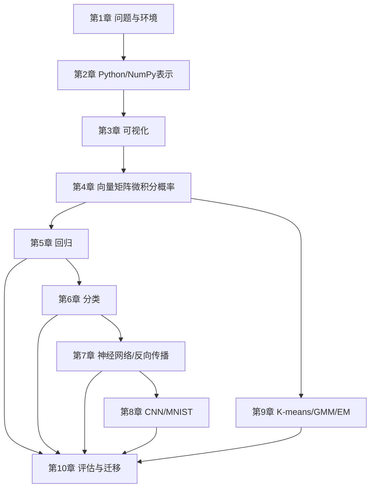

# 第10章 本书小结

## 要点的总结

这一章不是把术语重新抄一遍，而是把整本书压缩成一套可以带到新问题中的检查表。机器学习的算法表面不同，底层都在做三件事：

1. 用数据表示对象；
2. 用模型表达假设；
3. 用目标函数和证据判断假设是否值得保留。

## 1. 全书知识脉络



## 2. 一张表看懂各章在解决什么

| 章节 | 核心对象 | 学到的动作 | 最容易犯的错 |
|---|---|---|---|
| [[01-学习前的准备]] | 问题、环境、实验 | 定义任务并可复现 | 把能运行当成正确 |
| [[02-Python基础知识]] | `ndarray`、shape、dtype | 表示、切片、矩阵计算 | 混淆 `*` 和 `@`、view 和 copy |
| [[03-数据可视化]] | 曲线、曲面、等高线 | 观察数据和错误 | 轴、单位、范围不清 |
| [[04-机器学习中的数学]] | 向量、矩阵、梯度、概率 | 推导变化方向 | 忽略数值稳定性 |
| [[05-有监督学习-回归]] | 连续目标 | 最小二乘与模型选择 | 只看训练误差 |
| [[06-有监督学习-分类]] | 概率与类别 | 最大似然、交叉熵、阈值 | 把准确率当全部 |
| [[07-神经网络与深度学习]] | 复合函数 | 反向传播、自动求导 | 不验证梯度、只会调参 |
| [[08-深度学习应用-MNIST]] | 图像空间结构 | CNN、池化、Dropout | 训练集泄漏、忽略错误样本 |
| [[09-无监督学习]] | 潜在分配与密度 | K-means、GMM、EM | 把簇号当真类别 |

## 3. 统一的建模公式

### 3.1 监督学习

$$
\theta^*=\arg\min_\theta
\frac1n\sum_i L(f_\theta(x_i),y_i).
$$

回归使用平方误差等连续损失；分类使用负对数似然/交叉熵；神经网络只是把 $f_\theta$ 换成更强的复合函数。

### 3.2 无监督学习

没有 $y_i$，目标改成解释输入本身：K-means 最小化簇内失真，GMM 最大化观测数据的似然。算法的“好坏”依赖于相似度、概率假设和业务验证，不是由聚类图的颜色决定。

### 3.3 优化与推断

- 解析解：直接求目标函数的最优参数，速度快但适用条件窄；
- 梯度下降：沿损失下降方向迭代，适合大规模和复杂模型；
- 反向传播：高效计算复合网络的梯度；
- EM：在隐藏变量和模型参数之间交替更新。

它们都是在“当前假设下寻找更好解释”的方法，不保证模型假设本身正确。

## 4. 从零做一个新项目的检查表

### 4.1 问题定义

- 预测对象、时间点和使用者是谁？
- 输出是连续值、概率、类别、排序还是分组？
- 错误的成本是否对称？
- 预测会不会改变后续数据，形成反馈回路？

### 4.2 数据检查

- 每一行代表什么，标签何时产生？
- 训练、验证和测试是否按现实时间/实体隔离？
- 是否有重复样本、标签泄漏、缺失值和异常值？
- 训练数据是否代表线上数据，未来是否会漂移？

### 4.3 表示与可视化

- `X.shape`、`y.shape`、`dtype`、单位和取值范围是什么？
- 特征是否需要标准化、编码、裁剪或变换？
- 先画分布、散点、残差、错误样本和训练曲线。

### 4.4 模型与损失

- 模型假设的归纳偏置是什么？
- 损失与业务错误是否一致？
- 有没有足够简单的基线？
- 预测概率是否需要校准，阈值由谁决定？

### 4.5 训练与评估

- 随机种子、依赖、数据版本和代码版本是否记录？
- 训练损失和验证损失是否同时监控？
- 是否只在最终阶段使用测试集？
- 指标是否覆盖总体、关键子群和极端样本？

### 4.6 部署与监控

- 线上预处理和训练时是否完全一致？
- 输入 schema、延迟、资源和回滚策略是什么？
- 监控数据漂移、预测分布、错误率、延迟和业务结果。
- 新数据何时触发重训，谁负责确认标签质量？

## 5. 第一性原理的三条洞见

### 洞见一：模型不是答案，是压缩假设

直线、逻辑函数、神经网络和混合高斯都在压缩数据中的规律。模型越复杂，能表达的关系越多，也越容易把偶然噪声当规律。选择模型其实是在选择“允许哪些解释”。

### 洞见二：表示往往比算法名称更重要

同一个分类器，用不同的特征、尺度、空间结构和时间切分，结果可能完全不同。第 2 章的 `shape`、第 8 章的卷积和第 9 章的距离，本质都在说明：**你如何表示对象，就决定了模型能看见什么**。

### 洞见三：训练是实验，部署是另一场实验

离线测试集只是在有限条件下模拟未来。线上数据会漂移，用户会适应系统，模型会改变业务流程。高质量机器学习不是一次性找到最高分，而是建立“数据—模型—反馈—再验证”的闭环。

## 6. 贯穿全书的最小代码骨架

```python
# 1. 读入并检查数据
X, y = load_data()
assert len(X) == len(y)

# 2. 按现实场景切分数据
X_train, X_val, X_test, y_train, y_val, y_test = split_data(X, y)

# 3. 只用训练集拟合预处理
transformer = fit_transformer(X_train)
X_train = transformer.transform(X_train)
X_val = transformer.transform(X_val)
X_test = transformer.transform(X_test)

# 4. 训练基线与候选模型
model = build_model()
model.fit(X_train, y_train, validation_data=(X_val, y_val))

# 5. 最后一次使用测试集
report = evaluate(model, X_test, y_test)
```

即使使用 Keras、scikit-learn 或其他框架，这个骨架仍然成立。框架隐藏的是计算细节，不应隐藏数据边界和决策责任。

## 7. 建议的复习项目

1. **回归项目**：用公开的房价、能耗或自行记录的消费数据，比较线性回归、基函数回归和正则化。
2. **分类项目**：做一个带类别不平衡的欺诈/流失模拟，比较阈值、precision、recall、PR-AUC 和成本。
3. **反向传播项目**：用 NumPy 写一隐藏层 MLP，用数值梯度逐参数验证。
4. **视觉项目**：在 MNIST 上比较 MLP 与 CNN，展示错误样本和置信度，而不是只报准确率。
5. **无监督项目**：对客户或传感器数据做 K-means 与 GMM，报告簇稳定性、画像和业务动作。

## 8. 最后要记住的顺序

```text
先定义问题
→ 再确认数据和表示
→ 再画图发现假设
→ 再选择最简单的模型
→ 再选择与业务一致的损失和指标
→ 再训练并验证泛化
→ 再分析错误与不确定性
→ 最后部署、监控、复训
```

如果某一步说不清，继续加深网络或增加迭代次数通常不会解决根因。先回到问题定义、数据契约和模型假设。

## 英文补充

- [Google：Dividing datasets](https://developers.google.com/machine-learning/crash-course/overfitting/dividing-datasets)
- [Google：Overfitting](https://developers.google.com/machine-learning/crash-course/overfitting/overfitting)
- [Google：Production ML monitoring](https://developers.google.com/machine-learning/crash-course/production-ml-systems/monitoring)
- [scikit-learn：Model selection and evaluation](https://scikit-learn.org/stable/model_selection.html)
- [D2L：Preliminaries and linear networks](https://d2l.ai/chapter_preliminaries/index.html)

