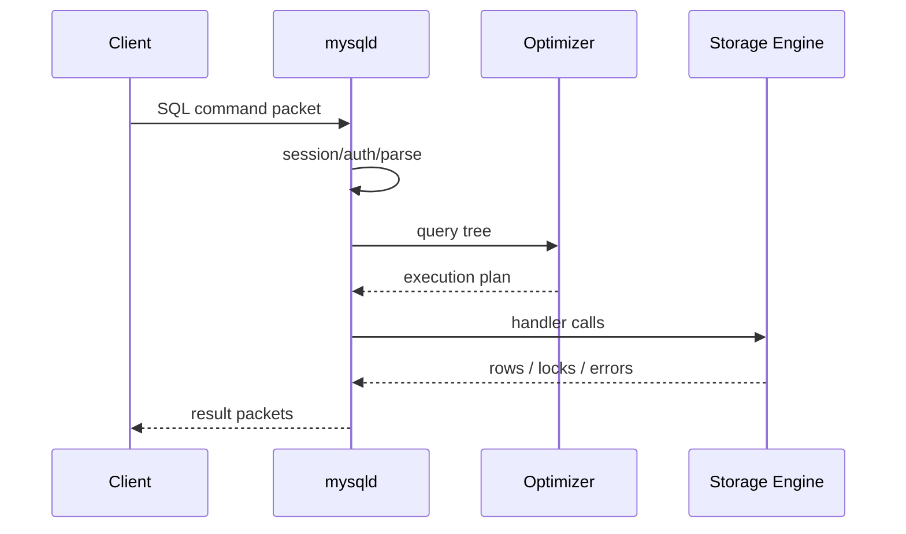

# 第1章 装作自己是个小白——初识 MySQL

## 本章主线

一条 SQL 并不是“发给一个黑盒子然后得到结果”。它要经过客户端、通信协议、服务器层、优化器、执行器和存储引擎。


最重要的心智模型是：**MySQL Server 是协调者，存储引擎是数据真正如何落盘、如何加锁和如何恢复的执行者**。后面的记录、页、索引、表空间、缓存、日志、MVCC 和锁，都可以沿着这条链串起来。

## 1.1 MySQL 的客户端/服务器架构

客户端负责表达意图，服务器负责解释意图并维护共享状态。命令行、Connector/J、Go driver 和 ORM 都只是不同客户端；真正访问数据的是 mysqld。

第一性原理是“把不可信的请求和受保护的状态分开”。如果每个应用进程都直接读写数据文件，权限、并发、缓存和崩溃恢复会被重复实现，且彼此冲突。服务器进程把这些工作集中起来，才能统一执行权限检查、事务和存储引擎规则。

工业实践中，应用通常使用连接池。连接池解决建立连接昂贵和并发连接受控两个问题，但会带来会话状态泄漏：上一个请求设置的 sql_mode、时区、隔离级别或临时表，可能影响下一个请求。因此连接归还池子前要重置会话，或使用驱动的 reset 机制。

## 1.2 MySQL 的安装

安装同时准备三类东西：

1. **控制面**：mysqld、客户端、服务注册和配置文件；
2. **数据面**：数据目录、系统表、InnoDB 表空间和 redo 日志；
3. **运维面**：错误日志、备份工具、监控和权限。

建议把安装版本、配置和初始化方式写进可复现脚本或容器镜像。安装完成后至少验证：

```sql
SELECT VERSION(), @@datadir, @@port, @@default_storage_engine;
```

真正的验收标准是服务器能启动、客户端能连接、数据目录正确、默认引擎和字符集符合预期、错误日志可读，而不是“命令能运行”。

## 1.3 启动 MySQL 服务器程序

启动 mysqld 的本质，是让一个进程读取启动选项，初始化数据目录、内存结构、日志和后台线程，然后监听连接。进程存在不等于服务可用：服务还可能正在恢复 redo、创建临时文件，或端口被别的实例占用。

诊断顺序通常是：

```text
配置文件 → 数据目录权限 → 端口/套接字 → 错误日志 → 客户端握手
```

可以用 mysqld --verbose --help 查看可识别选项；运行中的值则用 SHOW VARIABLES 查看。启动参数中的连字符形式和 SQL 变量中的下划线形式通常对应同一概念。

### 1.3.1 在类 UNIX 系统中启动服务器程序

Linux 生产环境优先使用 systemd 服务，而不是在 shell 中手工后台运行。systemd 可以统一处理用户身份、文件描述符、自动重启、启动顺序和日志。

开发或排障时可以直接启动：

```bash
mysqld --defaults-file=/etc/my.cnf
```

数据目录应由运行 mysqld 的专用用户拥有；配置和密钥文件不应对普通用户可写；套接字目录必须同时满足服务器创建和客户端访问权限。启动失败时优先看错误日志，不要反复盲调参数。

### 1.3.2 在 Windows 系统中启动服务器程序

Windows 可以把 MySQL 注册为服务，也可以使用 mysqld --console 前台运行。前台运行适合学习和排障，服务方式适合长期运行。

路径、服务账户、数据目录和防火墙是常见差异点。命名管道和共享内存是本机连接选项，但不会消除认证、解析、优化、锁等待和磁盘 I/O 成本，是否更快应由压测决定。

## 1.4 启动 MySQL 客户端程序

最小连接示例：

```bash
mysql -h 127.0.0.1 -P 3306 -u app_user -p
```

localhost 在不同客户端和配置下可能触发 UNIX 域套接字或命名管道，而 127.0.0.1 明确要求 TCP。排查连接问题时，显式指定协议：

```bash
mysql --protocol=TCP -h 127.0.0.1 -P 3306 -u app_user -p
```

客户端启动后保存一个会话，包含当前数据库、字符集、时区、自动提交、事务隔离级别和临时表等状态。因此同一条 SQL 在不同连接上可能有不同结果。

## 1.5 客户端与服务器连接的过程

连接大致经过：找到地址和通信方式；建立底层连接；服务器发送握手和能力位；客户端提交认证信息；服务器完成账号、主机、密码插件和权限检查；双方进入命令请求—响应循环。

“网络可达”只完成了连接早期步骤，不等于认证成功，也不等于有执行某条 SQL 的权限。

### 1.5.1 TCP/IP

TCP/IP 可以连接本机或远程主机，是工业部署的默认方式。远程连接必须限制监听地址和防火墙范围，使用 TLS，避免把 root 暴露给应用。

TCP 是字节流，没有消息边界；MySQL 协议自己编码数据包长度、序号和命令。抓包看到的是协议包，不一定是一条完整 SQL。

### 1.5.2 命名管道和共享内存

命名管道和共享内存适合 Windows 本机进程间通信。它们减少了网络栈参与，但只改变请求到达路径，不改变服务器如何解析、优化、加锁和读写数据。

### 1.5.3 UNIX 域套接字

UNIX 域套接字通过文件系统路径连接本机服务器，通常比 TCP loopback 少一些网络层开销。它不适合跨主机，也容易因为路径或目录权限不一致而失败。

排查时同时查看：

```sql
SHOW VARIABLES LIKE 'socket';
SHOW VARIABLES LIKE 'port';
```

## 1.6 服务器处理客户端请求



### 1.6.1 连接管理

连接管理负责握手、认证、权限、线程或线程池、会话变量和错误返回，还要处理断开、超时、最大连接数和资源回收。

连接数是容量预算，不是越大越好。每个连接会消耗线程栈、会话内存和临时对象；连接过多会造成上下文切换和内存压力。连接池上限应由数据库并发能力、查询耗时和业务流量共同决定。

### 1.6.2 解析与优化

解析器把 SQL 文本变成结构化表达式；优化器把“想得到什么”转换为“先访问哪张表、用哪个索引、按什么顺序连接、何时排序或分组”。数据分布、统计信息和系统变量变化都可能改变计划。

优化器只是基于信息做成本估计。工程上要用 EXPLAIN、版本支持时的 EXPLAIN ANALYZE 和慢查询样本验证，而不是凭 SQL 文字猜执行方式。

### 1.6.3 存储引擎

服务器层负责 SQL 语义，存储引擎负责记录、索引、事务、锁、缓存和恢复。引擎接口带来可插拔性，也意味着同一条 SQL 在不同引擎上可能有不同事务和锁行为。

InnoDB 的关键能力包括事务、行级锁、MVCC、崩溃恢复和聚簇索引；第 4—9 章会把这些能力落到字节、页和表空间。

## 1.7 常用存储引擎

| 引擎 | 核心场景 | 特征 | 主要代价 |
| --- | --- | --- | --- |
| InnoDB | OLTP、绝大多数业务表 | ACID、MVCC、行锁、聚簇索引、崩溃恢复 | 结构复杂，日志和写放大更高 |
| MyISAM | 老系统、特定只读/读多写少场景 | 表级锁、数据与索引文件分离 | 没有 InnoDB 式事务与 MVCC |
| MEMORY | 短生命周期、非关键临时数据 | 内存存储，查找快 | 重启丢失，容量受内存限制 |
| NDB | MySQL Cluster 专用场景 | 分布式集群模型 | 运维和模型约束复杂 |

MySQL 8.4 默认存储引擎是 InnoDB；官方文档把 InnoDB 描述为通用、事务安全的默认选择（[Storage Engine Architecture](https://dev.mysql.com/doc/refman/8.4/en/storage-engines.html)）。选择引擎时先问需要什么正确性和故障语义，再问能否更快。

## 1.8 关于存储引擎的一些操作

### 1.8.1 查看当前服务器程序支持的存储引擎

```sql
SHOW ENGINES;
SELECT ENGINE, SUPPORT, TRANSACTIONS, XA, SAVEPOINTS
FROM information_schema.ENGINES;
```

Support 为 DEFAULT 表示当前默认引擎，YES 表示可用。还要检查事务、锁和备份工具是否满足业务。

### 1.8.2 设置表的存储引擎

建表时显式写出引擎：

```sql
CREATE TABLE orders (
    id BIGINT PRIMARY KEY,
    customer_id BIGINT NOT NULL,
    created_at TIMESTAMP NOT NULL
) ENGINE = InnoDB;
```

已有表可以转换：

```sql
ALTER TABLE legacy_table ENGINE = InnoDB;
```

这通常会重建表和索引，产生大量 I/O、锁等待和临时空间。线上变更要评估在线 DDL、复制延迟、回滚方案和备份。

## 1.9 总结

- 客户端表达请求，服务器维护会话和执行流程；
- 解析与优化决定“怎么做”，存储引擎决定“怎么存、怎么锁、怎么恢复”；
- 连接协议只改变到达路径，不改变核心执行成本；
- InnoDB 主线是：记录 → 页 → B+ 树 → 表空间 → Buffer Pool → redo/undo → MVCC/锁。

英文延伸阅读：

- [mysqld — The MySQL Server](https://dev.mysql.com/doc/refman/8.4/en/mysqld.html)
- [InnoDB Introduction](https://dev.mysql.com/doc/refman/8.4/en/innodb-introduction.html)
- [MySQL Client/Server Protocol](https://dev.mysql.com/doc/dev/mysql-server/latest/PAGE_PROTOCOL.html)

