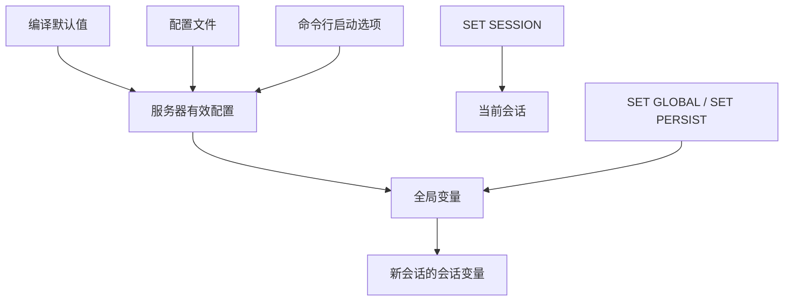

# 第2章 MySQL 的调控按钮——启动选项和系统变量

## 本章主线

MySQL 的行为由启动选项、配置文件和运行时系统变量共同决定。把它们混为一谈，会出现“重启后失效”“只改了当前连接”“配置写了但服务器没读到”等问题。



第一性原理是：**配置是控制平面，系统变量是控制平面在服务器内存中的投影，状态变量是运行结果的观测面**。

## 2.1 启动选项和配置文件

启动选项决定服务器如何初始化；配置文件把这些选项变成可审计、可复用的文本。生产环境应把配置变更纳入版本控制或配置管理，并记录变更原因。

### 2.1.1 在命令行上使用选项

命令行适合临时实验和一次性排障：

```bash
mysqld --datadir=/srv/mysql/data --port=3307
```

优点是显式；缺点是难以持久化，可能进入进程列表，也容易和服务管理器的参数不一致。不要在命令行写密码或密钥。

查看服务器可识别的选项：

```bash
mysqld --verbose --help
mysqld --no-defaults --verbose --help
```

前者会合并默认值和已读取的配置文件，后者只看编译默认值，是定位“哪个配置生效”的低成本方法。

### 2.1.2 配置文件中使用选项

配置文件用组区分使用者：

```ini
[mysqld]
datadir=/srv/mysql/data
port=3306
innodb_buffer_pool_size=8G
character-set-server=utf8mb4

[client]
default-character-set=utf8mb4
```

[mysqld] 影响服务器，[client] 影响支持该配置文件的客户端。不要把客户端选项误写到服务器组，也不要假设所有客户端都读取同一组。

配置文件的工程要求是路径明确、权限最小、参数有注释、能区分默认值和环境值，并在升级后重新检查废弃或改名的变量。

### 2.1.3 在命令行和配置文件中启动选项的区别

可以把启动过程看成覆盖链：

$$
\text{effective value}
=\text{compiled default}
\oplus\text{option files}
\oplus\text{command line}
$$

其中 $\oplus$ 表示后出现的有效选项覆盖前面的同名选项；实际读取顺序与发行版、启动参数有关。生产环境建议使用明确的 defaults-file，让实例只读取指定配置。

有些变量只能在启动时确定，例如 InnoDB 页大小；有些可以运行时动态改变；还有些改变后只影响新连接。判断方法是看变量文档中的 Scope、Dynamic 和启动选项说明（[Server System Variables](https://dev.mysql.com/doc/refman/8.4/en/server-system-variables.html)）。

## 2.2 系统变量

### 2.2.1 系统变量简介

系统变量描述服务器当前行为。常见维度有 Global、Session、Dynamic 和 Persisted。

典型陷阱是 SET GLOBAL x = ... 往往只改变全局值，不改变已有连接的会话值；新连接才从新的全局值初始化。

### 2.2.2 查看系统变量

```sql
SHOW VARIABLES LIKE 'innodb%';
SHOW GLOBAL VARIABLES LIKE 'max_connections';
SELECT @@SESSION.sql_mode, @@GLOBAL.sql_mode;
```

SHOW VARIABLES 默认显示当前会话范围；排查时要明确写 GLOBAL，否则容易把当前连接值误当成服务器值。

建议同时记录：

```sql
SELECT
  @@version, @@version_comment, @@datadir, @@port,
  @@global.time_zone, @@session.time_zone,
  @@global.character_set_server, @@session.character_set_client;
```

### 2.2.3 设置系统变量

当前会话临时设置：

```sql
SET SESSION sql_mode = 'STRICT_TRANS_TABLES,NO_ZERO_DATE';
```

改变全局默认：

```sql
SET GLOBAL max_connections = 500;
```

持久化设置（版本和权限允许时）：

```sql
SET PERSIST max_connections = 500;
```

持久化会改变下一次启动行为，应和配置文件一样经过审计、压测和回滚演练。全局变量修改通常需要 SYSTEM_VARIABLES_ADMIN 等权限。

工程上的调参顺序：定义症状；找到指标；只改一个相关变量；观察足够长的窗口；记录收益、副作用和回滚值。

## 2.3 状态变量

状态变量不是配置，而是运行过程中的计数器或测量值：

```sql
SHOW GLOBAL STATUS LIKE 'Threads%';
SHOW GLOBAL STATUS LIKE 'Innodb_buffer_pool%';
SHOW SESSION STATUS LIKE 'Handler%';
```

很多状态变量是累计计数，真正有意义的是窗口内的变化率：

$$
\text{rate}
=\frac{C(t_2)-C(t_1)}{t_2-t_1}
$$

单看 Queries=100000000 无法判断现在是否繁忙；比较 60 秒前后的差值，才可以估算 QPS。第一性原理洞见：**系统变量告诉你打算怎么运行，状态变量告诉你实际上发生了什么**。

## 2.4 总结

- 启动选项解决实例如何出生；
- 全局变量解决实例如何运行和新会话如何初始化；
- 会话变量解决当前连接如何解释请求；
- 状态变量解决实例究竟做了多少工作。

英文延伸阅读：

- [Using System Variables](https://dev.mysql.com/doc/refman/8.4/en/using-system-variables.html)
- [Server System Variables](https://dev.mysql.com/doc/refman/8.4/en/server-system-variables.html)
- [Server Status Variables](https://dev.mysql.com/doc/refman/8.4/en/server-status-variables.html)

