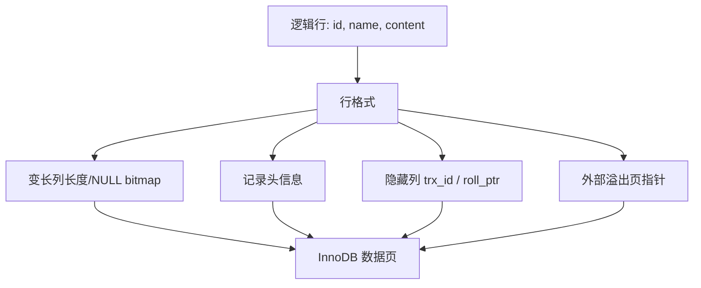

# 第4章 从一条记录说起——InnoDB 记录存储结构

## 本章主线

SQL 看到的是列，InnoDB 保存的是“记录 + 记录头信息 + 隐藏事务信息 + 可能的外部列”。记录必须适应固定大小的数据页；记录格式越紧凑，一个页能放的行越多，索引树的扇出越大，磁盘和缓存压力越小。



粗略地说：

$$
\text{page density}
\approx
\frac{\text{page usable bytes}}
{\text{record bytes}+\text{directory/overhead}}
$$

这不是精确布局公式，但说明了列类型、字符集和行格式最终会影响查询性能。

## 4.1 准备工作

先建立一个观察表：

```sql
CREATE TABLE demo_record (
  id BIGINT PRIMARY KEY,
  c1 VARCHAR(100) NOT NULL,
  c2 VARCHAR(1000),
  c3 TEXT,
  created_at TIMESTAMP NOT NULL
) ENGINE=InnoDB ROW_FORMAT=DYNAMIC;

SHOW CREATE TABLE demo_record;
SELECT NAME, SPACE, SPACE_TYPE, ROW_FORMAT
FROM information_schema.INNODB_TABLES
WHERE NAME LIKE '%demo_record%';
```

学习时分开三个层次：SQL 层的列和约束；记录层的长度、NULL、隐藏列和外部指针；页层的记录顺序、删除标记和页目录。

如果直接从 .ibd 文件猜字段，容易把版本差异、页压缩和字节序误当成固定规则。低层观察应结合分析工具、官方文档和对应版本源码。

## 4.2 InnoDB 页简介

InnoDB 以页为磁盘和 Buffer Pool 的基本 I/O 单位。默认页大小通常是 16 KiB；页里不只放用户记录，还包含页头、文件头、文件尾和目录结构。

不按行直接读磁盘，是因为磁盘随机 I/O 的固定成本很高。把相邻记录打包成页，可以一次搬运多条记录并在内存中复用。页也为 B+ 树提供节点边界：叶子页放记录，非叶子页放子页指针和分隔键。

页大小是实例级设计选择。页越大，顺序读和 B+ 树扇出可能更有利；但单次 I/O、锁竞争、内存碎片和大行处理也可能变重。已经初始化的实例不能轻易改变页大小。

## 4.3 InnoDB 行格式

行格式决定记录如何编码，以及长列何时移到外部页。它影响空间、I/O、Buffer Pool 命中率和更新代价。MySQL 8.0 时代通常使用 DYNAMIC，老系统可能仍有 COMPACT 或 REDUNDANT。

### 4.3.1 指定行格式的语法

```sql
CREATE TABLE t (
  id BIGINT PRIMARY KEY,
  payload JSON
) ENGINE=InnoDB ROW_FORMAT=DYNAMIC;

ALTER TABLE t ROW_FORMAT=COMPACT;
SHOW TABLE STATUS LIKE 't';
```

ALTER TABLE 改行格式往往需要重建表。线上修改前要确认 DDL 算法、锁级别、复制延迟和临时空间。

### 4.3.2 COMPACT 行格式

COMPACT 的目标是减少记录头和变长字段的额外空间。概念上，一条记录包含记录头、变长列长度信息、NULL 列位图、用户列、隐藏事务列，以及可能的外部页指针。

记录不是字段简单首尾相接。为了定位变长列，InnoDB 需要记录字段边界；为了实现事务版本，需要保留创建事务和 undo 链指针。第 20、21 章会把隐藏信息和 undo/MVCC 连接起来。

### 4.3.3 REDUNDANT 行格式

REDUNDANT 是早期 InnoDB 的兼容格式，记录头和字段长度组织方式更老，空间利用通常不如现代格式。它的学习价值在于：逻辑表结构长期稳定，物理格式会为更好的空间效率、长列处理和版本能力演进。

生产上除非需要兼容历史数据，否则不应主动选择它。迁移时还要观察空间、索引高度和查询计划。

### 4.3.4 溢出列

如果一条记录太长，InnoDB 会把部分长列移到外部页，在行内保留指针。TEXT、BLOB、大 VARCHAR 和多字节字符集都可能使记录变大。

这带来取舍：短列查询可能因更高页密度而受益；真正读取长列时需要额外访问外部页；更新长列可能产生更多页写入和 undo/redo；过大的行会降低页密度，增加回表和缓存压力。

不要用 TEXT 代替所有未知长度字段。应把高频过滤、排序、展示列和低频大对象分开建模，必要时将对象放到对象存储，只在 MySQL 保存元数据和地址。

### 4.3.5 DYNAMIC 行格式和 COMPRESSED 行格式

DYNAMIC 更积极地把长列放到外部页，行内保留前缀或指针，通常改善大字段表的页密度。COMPRESSED 还会压缩页，以空间换 CPU，并受压缩比、更新模式和存储设备影响。

官方文档指出，更多记录装入单页可能减少 I/O 和 Buffer Pool 需求（[InnoDB Row Formats](https://dev.mysql.com/doc/refman/8.4/en/innodb-row-format.html)）。但压缩总成本可粗略写为：

$$
\text{总成本}
\approx
\text{I/O 成本}
\,+\,
\text{压缩/解压 CPU}
\,+\,
\text{页重组成本}
$$

读多写少、存储昂贵的场景可能受益；高频随机更新则要用真实工作负载验证。

## 4.4 总结

- InnoDB 的物理组织基本单元是页，记录必须适应页；
- 行格式决定变长列、NULL、隐藏事务信息和溢出列的编码；
- 记录更紧凑通常意味着更高页密度，但大字段读取可能需要额外 I/O；
- DYNAMIC 是现代默认思路，REDUNDANT 更多是历史兼容；
- 字符集、索引列类型、行格式和后续 B+ 树高度是一条链。

英文延伸阅读：

- [InnoDB Row Formats](https://dev.mysql.com/doc/refman/8.4/en/innodb-row-format.html)
- [InnoDB Physical Record Structure](https://dev.mysql.com/doc/refman/8.4/en/innodb-record-structure.html)
- [InnoDB On-Disk Structures](https://dev.mysql.com/doc/refman/8.4/en/innodb-on-disk-structures.html)

