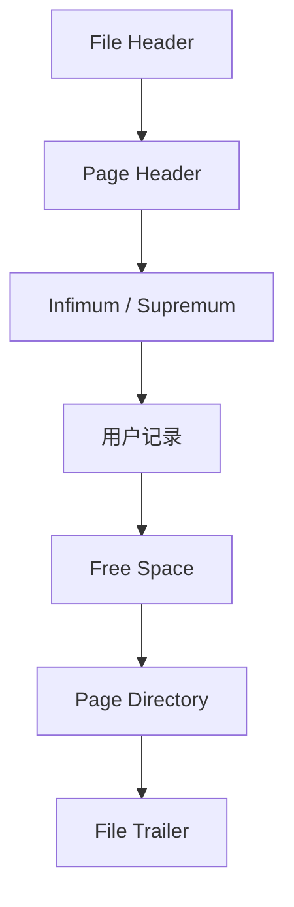

# 第5章 盛放记录的大盒子——InnoDB 数据页结构

## 本章主线

上一章把镜头放到一条记录，本章把镜头拉远到一个页。页是 InnoDB 在内存和磁盘之间搬运数据的基本单位，也是 B+ 树的节点。一个页要同时承担三件事：保存记录、支持页内查找、记录自身的身份和校验信息。

## 5.1 不同类型的页简介

InnoDB 中页不只有数据页。常见概念包括索引页、undo 页、系统页、事务系统页、段管理页和日志相关页。不同页用途不同，但通常共享文件头和文件尾等通用结构。

第一性原理是：**页类型是资源管理的标签**。共享通用头部可以让引擎知道这个页属于哪个表空间、哪个页号和哪种类型，从而统一校验、恢复和空间管理。

## 5.2 数据页结构快览

一个典型数据页可以粗略分成：

| 区域 | 作用 |
| --- | --- |
| File Header | 页号、表空间、前后页关系、校验/LSN 等 |
| Page Header | 页内记录数、空闲空间、插入位置和页状态 |
| 系统记录 | Infimum 和 Supremum，定义记录链边界 |
| 用户记录 | 按索引键顺序组织的真实记录 |
| Page Directory | 页内二级目录，帮助快速定位 |
| File Trailer | 页尾校验，用于发现半页写入或损坏 |

这些结构让页内搜索和页在文件中的身份解耦。页面头部描述局部状态，文件头和文件尾帮助跨页、跨重启识别。

## 5.3 记录在页中的存储

记录进入页后不是按插入时间简单追加，而是按索引键维持逻辑顺序。页内记录通常通过记录头中的指针形成有序链；物理字节位置可以不连续，但逻辑遍历仍然有序。

删除往往先做删除标记，再由后续清理回收空间。这样并发事务和 MVCC 仍可能看到旧版本，也避免每次删除都立即搬动大量记录。

页内插入可以理解为：找到适合的页；找到键值位置；分配空间写入记录；更新记录链、页头和页目录；若空间不足则触发页分裂或记录迁移。

页分裂会影响索引树父节点、redo 日志、锁和 Buffer Pool 脏页。随机主键比递增主键更容易在树的不同位置插入，从而带来更多分裂和随机 I/O。

## 5.4 Page Directory（页目录）

记录链适合顺序遍历，但若每次查找都从第一条记录逐条比较，页内查找仍接近线性。Page Directory 保存若干槽位，每个槽位指向一组记录的代表位置，使查找可以先二分缩小范围，再在小范围内线性比较。

粗略复杂度是：

$$
T_{\text{page search}}
\approx O(\log s)+O(k)
$$

其中 $s$ 是目录槽位数，$k$ 是槽位覆盖的少量记录。目录不是另一个完整索引，而是对页内记录链的稀疏导航。

B+ 树解决跨页导航，Page Directory 解决页内导航。两者层层组合，才形成低成本查找。

## 5.5 Page Header（页面头部）

Page Header 保存页内管理信息，例如记录数量、已删除空间、空闲空间边界、最后插入方向和页目录相关状态。它让引擎不必每次扫描整个页才能知道是否还能放一条记录。

页频繁插入、删除、更新时，头部统计会驱动页重组和分裂。页面内部碎片不等于文件系统碎片：前者是页内空间利用率，后者是文件块在设备上的布局，处理手段不同。

## 5.6 File Header（文件头部）

File Header 记录页面在表空间中的身份和邻接关系。对索引页而言，前后页指针帮助叶子层形成双向链；对恢复而言，页号、表空间标识和 LSN 让引擎判断这个页属于谁、是否需要重放日志。

可以把它看成页面的身份证，而 Page Header 更像页面内部的目录。身份证错误时，数据即使看似能读，也不能安全地归入正确表空间。

## 5.7 File Trailer（文件尾部）

页尾通常保存校验或与页头对应的信息。写页时若发生半页写入、设备故障或内存损坏，页头和页尾可能不一致，启动恢复或校验工具就能发现异常。

校验不能保证数据永远正确，只能提高发现概率。生产环境还需要备份、校验和、磁盘健康监控以及定期恢复演练。

## 5.8 总结

- 页是 I/O、缓存和 B+ 树节点的共同边界；
- Page Directory 把页内线性记录链变成近似对数定位；
- Page Header 管理页内空间与记录状态；
- File Header/Trailer 负责页的身份、关联和校验；
- 记录、页目录、B+ 树和日志共同组成从键值到磁盘页的路径。

英文延伸阅读：

- [InnoDB Physical Structure of an Index](https://dev.mysql.com/doc/refman/8.4/en/innodb-physical-structure.html)
- [InnoDB On-Disk Structures](https://dev.mysql.com/doc/refman/8.4/en/innodb-on-disk-structures.html)

