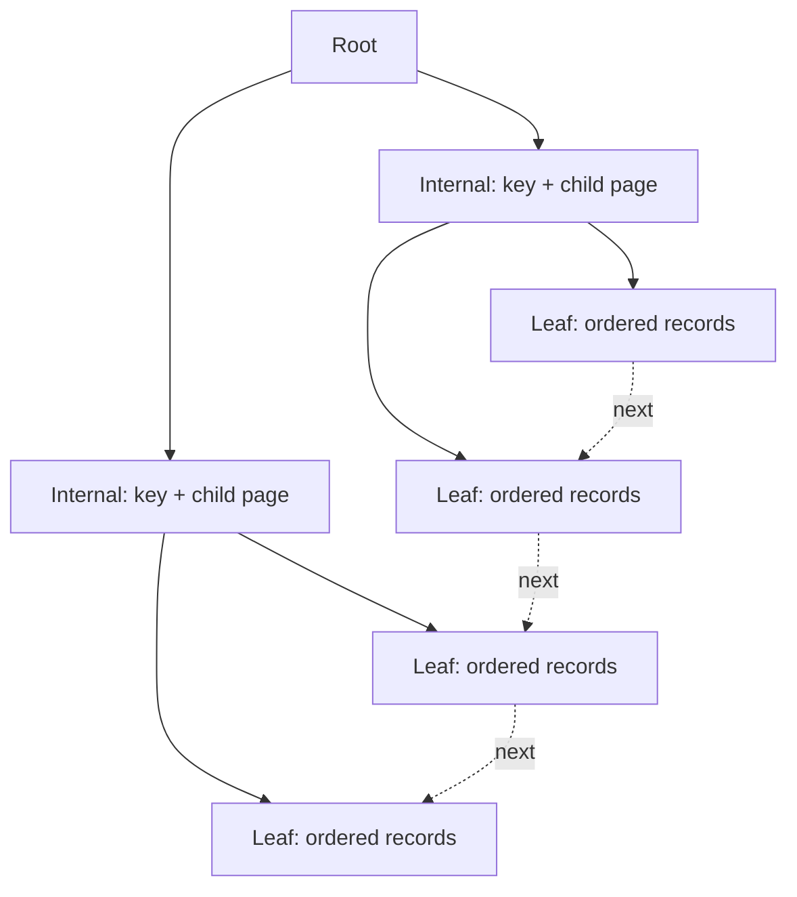

# 第6章 快速查询的秘籍——B+ 树索引

## 本章主线

索引不是给列加一个加速开关，而是额外维护的一份有序数据结构。它用更多写入和存储空间，换取更少候选记录和更少随机 I/O。



## 6.1 没有索引时进行查找

### 6.1.1 在一个页中查找

一个页内可以沿记录链查找，也可以借助 Page Directory 缩小范围。即使数据量只有一个页，页内排序和目录仍然影响定位。

### 6.1.2 在很多页中查找

没有索引时，服务器需要扫描多个数据页，检查每条记录是否满足条件。代价可粗略看成：

$$
\text{scan cost}
\approx N_{\text{pages}}\times\text{page read cost}
$$

Buffer Pool 可以让重复扫描少读磁盘，但不能消除 CPU 比较和内存带宽成本。

## 6.2 索引

### 6.2.1 一个简单的索引方案

最简单的索引是将目标列排序，并为每个值保存数据位置。查找可以二分定位，再跳到数据记录。

但真实数据库不能只保存物理地址：记录会移动，页会分裂，事务需要版本，删除需要标记。因此索引必须和页管理、事务日志和表结构共同设计。

### 6.2.2 InnoDB 中的索引方案

InnoDB 的主键索引是聚簇索引，叶子节点保存完整行。二级索引叶子节点保存索引列和主键值；若查询需要其他列，再用主键回到聚簇索引，这就是回表。

一个 B+ 树节点通常对应一个页。非叶子页保存分隔键和子页号，叶子页保存数据或索引记录；叶子层按键顺序连接，所以范围扫描天然适合 B+ 树。

树高的直觉估计是：

$$
h\approx\log_F(N)
$$

其中 $F$ 是非叶子页扇出，$N$ 是叶子记录数量。主键和索引键越短，$F$ 越大，树可能越矮。

### 6.2.3 InnoDB 中 B+ 树索引的注意事项

- 主键过长会复制进每个二级索引，放大所有二级索引；
- 没有显式主键时，InnoDB 会选择合适的唯一键或生成隐藏列，最好主动设计主键；
- 复合索引按最左前缀组织，列顺序决定能否做定位和范围；
- 随机插入可能触发更多页分裂；
- 删除标记和旧版本意味着看不见的记录也可能暂时占空间；
- 低选择性索引不一定比全表扫描便宜；
- 索引列的字符集和 collation 会影响索引字节数和比较语义。

官方文档说明，InnoDB 索引默认使用 B-tree，页大小由实例初始化时的 innodb_page_size 决定（[Physical Structure of an InnoDB Index](https://dev.mysql.com/doc/refman/8.4/en/innodb-physical-structure.html)）。

### 6.2.4 MyISAM 中的索引方案简介

MyISAM 的数据和索引文件分离，索引叶子通常保存数据文件位置。它不像 InnoDB 聚簇索引那样把主键组织成完整行，因此物理布局和回表语义不同。

这说明索引不是 SQL 层统一的黑盒概念。换引擎后，主键、更新、锁和缓存行为都可能改变。

### 6.2.5 MySQL 中创建和删除索引的语句

```sql
CREATE INDEX idx_orders_customer_time
ON orders(customer_id, created_at);

ALTER TABLE orders ADD INDEX idx_status (status);
DROP INDEX idx_status ON orders;
```

生产创建索引要评估表大小、在线 DDL、临时空间、redo 生成、复制延迟和失败恢复。索引完成后还要用实际查询确认优化器是否采用。

## 6.3 总结

- 没有索引，查找主要是页扫描；
- B+ 树用少量层级把键值导航到叶子页；
- InnoDB 聚簇索引保存整行，二级索引通常保存二级键和主键；
- 索引减少读取，也会增加写入、空间和维护成本；
- 设计索引必须同时理解数据分布、查询条件和物理页结构。

英文延伸阅读：

- [Clustered and Secondary Indexes](https://dev.mysql.com/doc/refman/8.4/en/innodb-index-types.html)
- [Primary Key Optimization](https://dev.mysql.com/doc/refman/8.4/en/optimizing-primary-keys.html)

