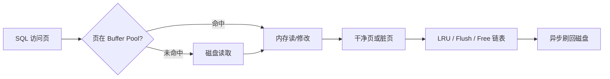

# 第17章 调节磁盘和 CPU 的矛盾——InnoDB 的 Buffer Pool

## 本章主线

磁盘容量大但慢，CPU 和内存快但有限。Buffer Pool 把磁盘页缓存在内存中，让读写尽量变成内存操作；同时它还承担脏页、淘汰、刷盘和并发保护。



## 17.1 缓存的重要性

如果每次访问都读磁盘，随机 I/O 会成为主导成本。缓存命中可以把一次访问从设备延迟降低到内存延迟：

$$
\text{average latency}
\approx
p_{\text{hit}}L_{\text{memory}}
+(1-p_{\text{hit}})L_{\text{disk}}
$$

当磁盘延迟远大于内存时，提高命中率很有价值；但不是把全部内存给缓存就一定好，因为连接、排序、临时表、操作系统和其他服务也需要内存。

## 17.2 InnoDB 的 Buffer Pool

### 17.2.1 啥是 Buffer Pool

Buffer Pool 以页为单位缓存表数据、索引、undo 等 InnoDB 页。读页时先查缓存，未命中才从表空间文件加载；修改页时先改内存并标记为脏页，再由后台线程刷盘。

这使事务提交不必同步把所有数据页写回数据文件，但也要求 redo 日志先保护内存修改。

### 17.2.2 Buffer Pool 内部组成

Buffer Pool 由多个缓冲页和控制块组成。控制块保存页号、表空间、脏状态、访问链表指针、锁和 LSN 等信息；哈希表负责按页身份快速定位控制块。

一个页通常同时出现在多种管理结构中：free 链表、LRU 链表、flush 链表和可能的其他链表。链表表达不同问题，不是重复存储页内容。

### 17.2.3 free 链表的管理

free 链表保存尚未装载有效页的缓冲框。读取新页时优先从 free 链表取位置；若没有空闲框，就要从 LRU 尾端淘汰干净页，或等待脏页被刷出。

free 链表过短说明缓存压力大，但不能只看瞬时值，要观察读请求、淘汰、刷盘和延迟是否同步升高。

### 17.2.4 缓冲页的哈希处理

按表空间 ID 和页号构成页的身份键，哈希表可以把 O(N) 的缓存查找降为接近 O(1)。哈希冲突由桶结构处理；哈希表本身解决定位，不决定页应该淘汰谁。

### 17.2.5 flush 链表的管理

被修改但尚未写回磁盘的页进入 flush 链表，通常按首次变脏时的 LSN 组织。刷盘时要遵守 WAL：包含某次修改的 redo 必须先安全落盘，才能让对应数据页落盘。

flush 链表变长意味着脏页积压，可能造成 checkpoint age 增大、刷盘压力升高和写入延迟抖动。

### 17.2.6 LRU 链表的管理

LRU 链表维护冷热页。新读入的页不一定直接放到最热端，否则一次大范围扫描会把真正热的 OLTP 页全部挤出。InnoDB 使用 young/old 区域和中点插入等思想，降低扫描污染。

LRU 的目标不是完美预测未来，而是在有限信息下尽量保留复用概率高的页。

### 17.2.7 其他的一些链表

还可能有 unzip LRU、压缩页相关链表、脏页刷新队列和实例内部的等待结构。它们服务于压缩、刷盘和并发管理，具体名称随版本实现变化。

### 17.2.8 刷新脏页到磁盘

刷盘由后台线程、检查点、空闲页需求和关闭流程共同触发。批量小步刷盘可以平滑 I/O，避免一次性刷新整个缓存造成长暂停。

刷盘速度低于产生脏页速度时，最终会出现脏页水位过高，用户线程被迫参与刷盘或被限速。这就是写入吞吐与恢复时间之间的矛盾。

### 17.2.9 多个 Buffer Pool 实例

大内存实例可以拆成多个 Buffer Pool 实例，减少不同工作线程竞争同一个实例的内部锁。实例数过多会增加管理开销，且不能解决数据本身的热点。

### 17.2.10 innodb_buffer_pool_chunk_size

chunk 是调整 Buffer Pool 大小的扩展粒度。它影响动态扩容/缩容的对齐方式和内存布局。改变 chunk 前要确认实例版本、总大小、实例数和在线调整限制。

### 17.2.11 配置 Buffer Pool 时的注意事项

不要套用“物理内存的固定百分比”作为答案。应为操作系统、连接峰值、排序/临时表、监控代理、备份和容器限制预留空间。

观察指标包括：

- Buffer Pool read requests 与 physical reads；
- dirty pages 和 checkpoint age；
- LRU 淘汰、free pages；
- I/O capacity、刷盘延迟；
- 进程 RSS、swap 和 OOM。

命中率公式可以作粗略趋势指标：

$$
\text{hit ratio}
\approx
1-\frac{\Delta\text{innodb\_buffer\_pool\_reads}}
{\Delta\text{innodb\_buffer\_pool\_read\_requests}}
$$

### 17.2.12 查看 Buffer Pool 的状态信息

```sql
SHOW GLOBAL STATUS LIKE 'Innodb_buffer_pool%';
SELECT * FROM information_schema.INNODB_BUFFER_POOL_STATS;
SELECT * FROM performance_schema.memory_summary_global_by_event_name
WHERE EVENT_NAME LIKE 'memory/innodb/%';
```

指标要按时间采样，单个快照无法说明趋势。

## 17.3 总结

- Buffer Pool 用内存换磁盘 I/O；
- free、LRU、flush 和 hash 结构分别解决分配、冷热、刷盘和定位；
- 脏页必须通过 redo 保护后再刷入数据文件；
- 大缓存不等于无限缓存，要给连接和操作系统留余量；
- 命中率、脏页、刷盘延迟和内存压力要一起看。

英文延伸阅读：

- [InnoDB Buffer Pool](https://dev.mysql.com/doc/refman/8.4/en/innodb-buffer-pool.html)
- [Configuring InnoDB Buffer Pool Size](https://dev.mysql.com/doc/refman/8.4/en/innodb-buffer-pool-resize.html)
- [InnoDB Standard Monitor](https://dev.mysql.com/doc/refman/8.4/en/innodb-enabling-monitors.html)

