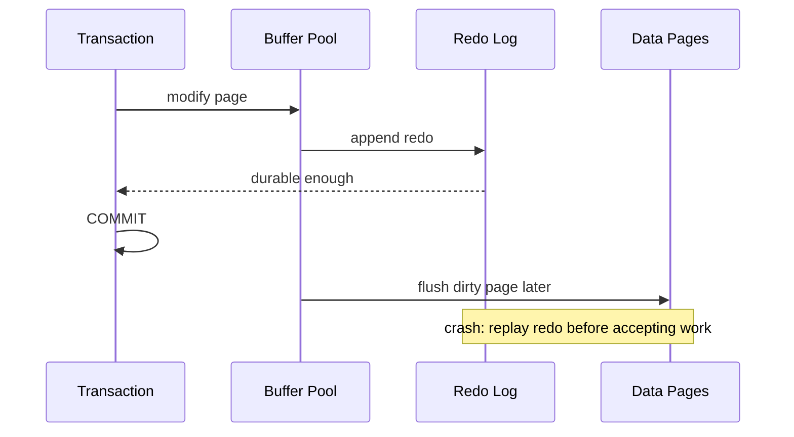

# 第19章 说过的话就一定要做到——redo 日志

## 本章主线

Buffer Pool 允许 InnoDB 先修改内存页、稍后再写数据文件。如果此时机器崩溃，内存中的修改会丢失。redo 日志解决的是：**即使数据页还没写回，也能在重启时重放已经承诺的物理修改**。

这是一种写前日志（WAL）思想：



## 19.1 事先说明

redo 记录的是物理层或接近物理层的修改，不是用户 SQL 的自然语言。它依赖页号、偏移、空间 ID、日志类型和版本实现，因此不能把某个版本的字节布局当作永久 API。

redo 主要保护 InnoDB 数据页和内部结构；MySQL 的 binary log 服务于复制和逻辑时间点恢复，两者用途不同，但分布式提交时需要协调。

## 19.2 redo 日志是啥

redo 是“如何把一个旧页推进到新状态”的日志。数据页可能先在 Buffer Pool 中变脏，redo 先记录变化；宕机后从 checkpoint 开始把 redo 应用到表空间页。

WAL 的关键不变量是：

$$
\text{flushed\_redo\_lsn}
\ge
\text{page\_lsn}
$$

只有当保护该页修改的 redo 已经安全落盘，数据页才可以安全刷入数据文件。否则先写数据页、redo 尚未落盘，崩溃后无法解释半完成页。

## 19.3 redo 日志格式

### 19.3.1 简单的 redo 日志类型

简单类型可以表示在某个页的某个偏移写入若干字节、增加某个计数或修改固定字段。它通常包含空间/页身份、偏移、长度和新值或操作信息。

### 19.3.2 复杂一些的 redo 日志类型

页分裂、记录插入、段分配、索引目录更新和事务系统变化会修改多个位置，可能产生一组相互关联的 redo。日志必须足够表达恢复顺序，并能处理重复重放或部分完成。

### 19.3.3 redo 日志格式小结

理解格式时先抓三件事：修改对象是谁；修改前进到什么状态；恢复时怎样判断已经应用。不要把 redo 当成 undo：redo 向前重放，undo 沿版本链向后恢复。

## 19.4 Mini-Transaction

### 19.4.1 以组的形式写入 redo 日志

一个逻辑操作可能修改多个页，例如 B+ 树分裂要修改新页、旧页和父页。相关 redo 记录要以一个组组织，恢复时不能随意打乱顺序。

### 19.4.2 Mini-Transaction 的概念

Mini-Transaction 是 InnoDB 内部将一组紧密相关的页修改和 redo 记录绑定起来的机制。它不是用户可见事务，也不承担业务原子性；它保证内部操作在日志和页锁层面有一致边界。

这解释了两个层次的原子性：用户事务保证业务修改集合，Mini-Transaction 保证一次页结构操作。两者嵌套但职责不同。

## 19.5 redo 日志的写入过程

### 19.5.1 redo log block

redo 先被编码到日志块中。块通常包含头部、有效日志字节和尾部校验/结束信息，并有序列号帮助检测连续性。块大小和字段位布局是版本实现细节。

### 19.5.2 redo 日志缓冲区

log buffer 是内存中的循环或分段缓冲，用户线程把 redo 追加进去。缓冲区太小会增加频繁写入，太大则增加崩溃时尚未落盘的风险窗口和内存占用。

### 19.5.3 redo 日志写入 log buffer

修改页时，InnoDB 先在内存中生成 redo，分配 LSN，并把相关日志追加到 log buffer。只有日志持久化达到提交策略要求，事务才能对外报告提交成功。

## 19.6 redo 日志文件

### 19.6.1 redo 日志刷盘时机

刷盘受事务提交、日志缓冲区压力、后台线程、检查点和配置共同影响。innodb_flush_log_at_trx_commit 常见语义是：

| 值 | 直觉 | 崩溃风险 |
| --- | --- | --- |
| 1 | 每次提交写入并 flush redo | 持久性最强，提交 I/O 更敏感 |
| 2 | 每次提交写入文件，周期性 flush | 操作系统崩溃/断电风险不同 |
| 0 | 周期性写入并 flush | 可能丢失最近一小段事务 |

具体行为要以版本文档、文件系统和硬件 flush 能力为准。不能用它替代备份和复制。

### 19.6.2 redo 日志文件组

redo 文件组提供循环空间。新日志覆盖旧日志前，必须确认旧 LSN 对应的脏页已经刷出并推进 checkpoint，否则恢复所需的日志会被覆盖。

日志空间太小会频繁阻塞写入等待刷脏页；太大则可能增加恢复扫描时间和故障后的恢复窗口。应按写入速率、脏页速度、恢复目标和磁盘能力规划。

### 19.6.3 redo 日志文件格式

文件通常包含文件头、日志块和检查点标记，具体名称与格式在 MySQL 版本间会变化。MySQL 8.4 对 redo 日志管理已有改进，排障时应以当前版本 Performance Schema、官方手册和错误日志为准，不要直接操作日志文件。

## 19.7 log sequence number

LSN 是 redo 日志逻辑位置的单调递增序列。它把内存修改、日志文件偏移、脏页和检查点放进同一条时间轴。

### 19.7.1 flushed_to_disk_lsn

flushed_to_disk_lsn 表示某个 LSN 之前的 redo 已经刷到持久化介质可见的日志文件。它是判断提交耐久进度的重要指标，但最终语义仍受操作系统和硬件 flush 影响。

### 19.7.2 lsn 值和 redo 日志文件组中的偏移量的对应关系

日志文件组是循环空间，LSN 与文件偏移之间不是简单永久的一对一地址。可以用：

$$
\text{offset}
\approx
(\text{LSN}-\text{group base})\bmod\text{log capacity}
$$

实际还要扣除文件头、块头、对齐和循环边界。不要手工根据简单模运算修改生产日志。

### 19.7.3 flush 链表中的 lsn

脏页第一次被修改时会带有一个 page LSN；flush 链表通常按页最早需要保护的 LSN 组织。最老的脏页 LSN 决定检查点能推进到哪里。

## 19.8 checkpoint

Checkpoint 表示某个时间点之前的修改已经反映到数据文件，恢复时可以从该点之后扫描 redo。InnoDB 使用 fuzzy checkpoint，分批刷脏页，不必停顿整个实例。

$$
\text{checkpoint age}
=\text{current LSN}-\text{checkpoint LSN}
$$

年龄接近 redo 容量时，系统必须加快刷脏页或限制新写入。

## 19.9 用户线程批量从 flush 链表中刷出脏页

后台刷新跟不上时，执行用户修改的线程可能参与刷脏页，以防 redo 空间耗尽。这会把平滑的后台 I/O 变成前台延迟，常见于突发写入、redo 太小、存储设备慢或脏页积压。

## 19.10 查看系统中的各种 lsn 值

排障时要同时看当前 LSN、flushed LSN、checkpoint LSN、最老脏页 LSN 和 redo 文件状态：

```sql
SHOW ENGINE INNODB STATUS;
SELECT * FROM performance_schema.innodb_redo_log_files;
```

不同版本可用表和字段会变化。观察重点是 LSN 是否持续前进、checkpoint age 是否积压、日志是否接近满以及刷盘是否成为瓶颈。

## 19.11 innodb_flush_log_at_trx_commit 的用法

生产默认通常优先选择值 1，尤其是金融、订单和不可丢失写入。值 0 或 2 可能提高吞吐、降低提交延迟，但要把可接受的数据丢失窗口写进业务协议。

不要只在数据库层做压测。必须同时测试断电、进程崩溃、文件系统挂载、容器重启和复制链路，否则测到的只是正常运行吞吐。

## 19.12 崩溃恢复

### 19.12.1 确定恢复的起点

InnoDB 查找最近可用的 checkpoint 标记，从 checkpoint LSN 开始扫描 redo。检查点之前对应的数据页应处于足够一致状态。

### 19.12.2 确定恢复的终点

恢复终点取决于日志中最后一个完整、连续、校验通过的 redo。损坏或不完整的尾部不能被当成已提交修改。

### 19.12.3 怎么恢复

恢复大致是：发现表空间；校验并扫描 redo；把日志修改应用到页；处理未完成事务的回滚；启动服务并允许连接。官方文档描述了 redo application 和未提交事务回滚的崩溃恢复流程（[InnoDB Recovery](https://dev.mysql.com/doc/refman/8.4/en/innodb-recovery.html)）。

恢复不是备份。若表空间本身损坏，redo 只能修复日志覆盖的变化，不能代替一份干净备份。

## 19.13 遗漏的问题：LOG_BLOCK_HDR_NO 是如何计算的

LOG_BLOCK_HDR_NO 用于把日志块放入可验证的逻辑序列。它通常由 LSN 换算出的块序号、循环日志空间中的位置和用于区分循环轮次的位组成，帮助恢复检测块是否连续、是否来自正确日志位置。

具体位宽、掩码、对齐和高位标志属于版本实现细节。学习重点不是死记一个公式，而是理解它要解决的问题：**循环文件中同一个物理偏移可能承载不同时间的日志，块号必须携带足够信息识别新旧和连续性**。需要精确调试时应对照对应版本源码和官方工具。

## 19.14 总结

- redo 把先改内存、后写数据页变成可恢复的 WAL；
- LSN 把日志、脏页和 checkpoint 放到一条时间轴；
- Mini-Transaction 保护内部页结构操作，不等于用户事务；
- checkpoint 控制日志可回收边界，脏页速度决定写入是否被反压；
- flush 策略是持久性、吞吐和可接受丢失窗口的工程选择；
- 崩溃恢复从 checkpoint 重放 redo，再处理未完成事务。

英文延伸阅读：

- [InnoDB Redo Log](https://dev.mysql.com/doc/refman/8.4/en/innodb-redo-log.html)
- [InnoDB Checkpoints](https://dev.mysql.com/doc/refman/8.4/en/innodb-checkpoints.html)
- [InnoDB Recovery](https://dev.mysql.com/doc/refman/8.4/en/innodb-recovery.html)

