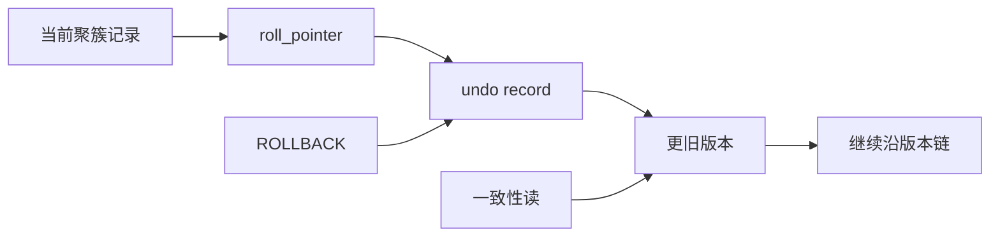

# 第20章 后悔了怎么办——undo 日志

## 本章主线

redo 让数据库在崩溃后向前重放，undo 让事务在回滚时向后恢复，也让一致性读能够重建旧版本。undo 不是一条反向 SQL，而是与物理记录修改对应的版本信息。

## 20.1 事务回滚的需求

事务执行到一半时可能遇到约束错误、业务异常、死锁或客户端主动取消。若没有 undo，数据库只能保留已经写入的一半，原子性就无法成立。

回滚的目标不是恢复执行前整个数据库快照，而是撤销当前事务做过的每个逻辑修改。只要记录了旧值、插入/删除身份和必要的索引信息，就能按相反顺序恢复。

## 20.2 事务 id

### 20.2.1 分配事务 id 的时机

读事务不一定马上需要事务 ID；读写事务在第一次修改 InnoDB 记录时通常需要获得事务身份。这样可以避免只读操作无谓地参与版本管理。

### 20.2.2 事务 id 是怎么生成的

事务 ID 需要单调可比较，使 InnoDB 能判断哪个版本更新、哪个事务在 ReadView 之前或之后。它不是业务订单号，也不保证与提交时间严格相同。

### 20.2.3 trx_id 隐藏列

InnoDB 记录通常带有隐藏的 trx_id，表示最近修改该聚簇记录的事务；还会有 roll_ptr，指向 undo 版本链。没有显式主键时，InnoDB 还可能生成隐藏的行标识，进一步说明为什么主动设计短主键很重要。

## 20.3 undo 日志的格式

### 20.3.1 INSERT 操作对应的 undo 日志

插入记录的 undo 需要记录如何标记或删除这条新记录。回滚插入时通常不需要保存一个完整旧行，因为旧状态是不存在；但 MVCC 和并发锁仍要处理这条记录的可见性。

### 20.3.2 DELETE 操作对应的 undo 日志

删除通常先做删除标记，undo 保存恢复记录所需的信息。旧版本在仍有事务可能看到时不能马上物理清除；purge 会在安全时机回收。

### 20.3.3 UPDATE 操作对应的 undo 日志

更新要保存被覆盖的旧值、字段位置和版本链信息。若更新的是变长列或索引列，undo 还要支持恢复记录布局和二级索引可见性。

更新不是简单地原地覆盖一个字节。它可能引起页内移动、外部列变化、二级索引删除标记和多条 redo/undo。

### 20.3.4 增删改操作对二级索引的影响

二级索引不保存完整事务版本信息。修改索引列时，旧二级索引记录可能被删除标记，新索引记录被插入；一致性读必要时根据聚簇索引和 undo 判断可见性。

这也是二级索引查询有时需要回到聚簇索引的原因：索引命中不等于版本可见性已经确定。

## 20.4 通用链表结构

InnoDB 使用链表把页面、段、回滚段和 undo 记录串起来。链表节点常包含前后指针和所属空间信息，支持快速插入、删除和遍历。

链表是一种工程折中：不要求所有页面物理连续，却能以少量指针维护逻辑顺序；代价是指针损坏或链表状态不一致会影响恢复。

## 20.5 FIL_PAGE_UNDO_LOG 页面

undo 日志存放在专用 undo 页中，页头标记类型，页内保存多个 undo 记录和链表信息。页面仍有通用文件头和文件尾，因此可以被表空间管理和校验。

## 20.6 Undo 页面链表

### 20.6.1 单个事务中的 Undo 页面链表

一个事务可能产生多个 undo 页。它们按写入顺序串成链，事务回滚时从最近记录向前处理，保证撤销顺序与修改顺序相反。

### 20.6.2 多个事务中的 Undo 页面链表

不同事务的 undo 不能混成一个业务链。回滚段为不同事务提供 undo slot 和 segment，purge 再按全局最老 ReadView 判断哪些版本可以回收。

## 20.7 undo 日志具体写入过程

### 20.7.1 段的概念

Undo Log Segment 是为一个事务或一类操作分配的逻辑空间。它从回滚段获取页面，在页面中追加 undo 记录。

### 20.7.2 Undo Log Segment Header

Segment Header 记录该 undo 段使用的页面链表、状态和所属回滚段。它把事务正在产生 undo 连接到表空间中的实际页。

### 20.7.3 Undo Log Header

Undo Log Header 记录事务 ID、undo 类型、上一条记录位置和事务结束状态等。它让回滚、版本读取和 purge 能区分不同事务的日志。

### 20.7.4 小结

写入路径可概括为：事务获得回滚段和 undo slot；创建 undo log segment；写入 undo header；追加记录；更新聚簇记录的 roll_pointer；同时为这些物理修改生成 redo。

注意 undo 自身也需要 redo 保护，否则崩溃恢复时既无法恢复数据页，也无法找到回滚信息。

## 20.8 重用 Undo 页面

事务结束后，undo 页不能立即全部回收，因为其他事务的 ReadView 可能仍需要旧版本。只有 purge 确认没有活跃快照需要它，页面才可以重用。

长事务的危险不仅是持锁，还会拖住 undo 回收，使表空间膨胀和版本链变长。

## 20.9 回滚段

### 20.9.1 回滚段的概念

回滚段管理多个 undo slot 和 undo 页面链表，是事务获得 undo 空间的中间层。它将事务并发数与具体页面分配解耦。

### 20.9.2 从回滚段中申请 Undo 页面链表

事务选择可用回滚段，申请 undo slot，再创建或重用页面链表。申请失败可能表现为 undo 空间不足或事务无法继续。

### 20.9.3 多个回滚段

多个回滚段把 undo 分配和并发压力分散到不同结构，减少单点争用。数量不是越多越好，实际受页大小、事务类型和版本限制影响。

### 20.9.4 回滚段的分类

InnoDB 可区分普通用户表 undo 与临时表 undo。临时表 undo 不一定需要为崩溃恢复保留相同 redo 语义，因为临时对象本身不跨重启保存。

### 20.9.5 roll_pointer 的组成

roll_pointer 可看成一份紧凑地址，包含 undo 类型、回滚段标识、undo 页号和页内偏移等信息。它不是操作系统指针，而是可持久化、可恢复的逻辑地址。

### 20.9.6 为事务分配 Undo 页面链表的详细过程

流程可概括为：确定事务读写类型；选择回滚段；申请 slot；初始化 undo segment；分配 undo 页；写入 header；把新记录挂入链表；在聚簇记录中写入 roll_pointer。

## 20.10 回滚段相关配置

### 20.10.1 配置回滚段数量

innodb_rollback_segments 控制每个 undo 表空间使用的回滚段数量。调整前要根据事务并发、页大小和 undo 生成速率评估，不要只按连接数设置。

### 20.10.2 配置 undo 表空间

undo 表空间可以把高频 undo I/O 从系统表空间分离，并支持截断和独立空间治理。生产调整要检查现有事务、purge 进度、磁盘位置和恢复流程。

## 20.11 undo 日志在崩溃恢复时的作用

崩溃恢复先用 redo 把已记录的物理修改向前重放，再识别崩溃时未完成的事务并回滚。undo 也为恢复中的未提交事务提供反向信息。

| 日志 | 方向 | 主要问题 |
| --- | --- | --- |
| redo | 向前 | 已承诺修改如何在崩溃后重做 |
| undo | 向后 | 未完成修改如何回滚、旧版本如何读取 |

## 20.12 总结

- undo 支持回滚，也支持 MVCC 的旧版本读取；
- trx_id 标识修改者，roll_pointer 串起版本链；
- undo 通过回滚段、undo 段和 undo 页组织；
- purge 决定何时可以回收和重用旧版本；
- 长事务会阻塞 undo 回收，导致空间、版本链和查询成本上升；
- redo 保护 undo 自身，崩溃恢复先向前重做，再回滚未完成事务。

英文延伸阅读：

- [InnoDB Undo Logs](https://dev.mysql.com/doc/refman/8.4/en/innodb-undo-logs.html)
- [Undo Tablespaces](https://dev.mysql.com/doc/refman/8.4/en/innodb-undo-tablespaces.html)
- [InnoDB Multi-Versioning](https://dev.mysql.com/doc/refman/8.4/en/innodb-multi-versioning.html)

