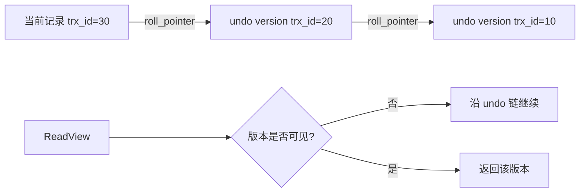

# 第21章 一条记录的多副面孔——事务隔离级别和 MVCC

## 本章主线

并发事务不可能让每个读都停下来等所有写完成，否则吞吐会很差；也不能让读到任意中间状态，否则结果不可解释。MVCC 的核心是：**一条逻辑记录保留多个事务版本，读请求按照自己的 ReadView 选择一个可见版本**。



## 21.1 事前准备

用两个会话观察同一行：

```sql
CREATE TABLE account (
  id BIGINT PRIMARY KEY,
  balance DECIMAL(12,2) NOT NULL
) ENGINE=InnoDB;
INSERT INTO account VALUES (1, 100.00);
```

记录每个会话的：

```sql
SELECT CONNECTION_ID(), @@autocommit, @@transaction_isolation;
```

实验时区分普通 SELECT、SELECT ... FOR UPDATE、UPDATE/DELETE；它们的读语义和锁语义不同。

## 21.2 事务隔离级别

### 21.2.1 事务并发执行时遇到的一致性问题

- 脏读：读到另一个未提交事务的修改；
- 不可重复读：同一事务两次读到同一行的不同已提交版本；
- 幻读：同一范围两次读取，第二次多出或少了满足条件的行；
- 丢失更新：两个事务基于旧值写回，后写覆盖前写。

这些现象不是简单的“数据库 bug”，而是并发下不同可见性和锁策略的结果。隔离级别是在性能和可重复性之间选择规则。

### 21.2.2 SQL 标准中的 4 种隔离级别

| 隔离级别 | 允许看到的现象 | 直觉 |
| --- | --- | --- |
| READ UNCOMMITTED | 允许脏读 | 最少等待，结果最不稳定 |
| READ COMMITTED | 不读未提交，语句间快照可变 | 常用于高并发业务 |
| REPEATABLE READ | 同一事务普通读保持快照 | 更强的可重复性 |
| SERIALIZABLE | 读写更接近串行 | 一致性强，并发代价高 |

标准描述的是可观察语义，具体实现可以用锁、MVCC 或二者结合。

### 21.2.3 MySQL 中支持的 4 种隔离级别

InnoDB 支持四种级别，默认通常是 REPEATABLE READ（[Transaction Isolation Levels](https://dev.mysql.com/doc/refman/8.4/en/innodb-transaction-isolation-levels.html)）。可以设置：

```sql
SET SESSION TRANSACTION ISOLATION LEVEL READ COMMITTED;
SET GLOBAL transaction_isolation = 'REPEATABLE-READ';
```

MySQL 的 REPEATABLE READ 通过一致性读快照和范围锁等机制处理幻读，但普通读和锁定读可能看到不同时间点的状态。不要在同一事务里随意混合两种读，再把结果当成同一个快照。

## 21.3 MVCC 原理

### 21.3.1 版本链

更新一条记录后，当前版本保留最近修改事务 ID，并通过 roll_pointer 指向 undo 中的旧版本。多次更新形成链：

$$
V_{\text{current}}
\rightarrow V_{n-1}
\rightarrow V_{n-2}
\rightarrow\cdots
$$

一致性读从当前记录开始检查可见性；当前版本不可见，就沿链重建更旧版本，直到找到可见版本或确认记录不存在。

### 21.3.2 ReadView

ReadView 可以看成一次一致性读的“世界快照”。它记录创建时仍活跃的事务集合，以及边界事务 ID。对版本事务 ID 的判断可抽象为：

1. 版本由当前事务自己创建：可见；
2. 版本事务 ID 早于活跃事务范围：通常可见；
3. 版本事务 ID 晚于快照边界：不可见；
4. 处于边界之间：只有不在活跃事务集合中才可见。

用变量表达：

$$
\text{visible}(v)=
\begin{cases}
\text{true}, & v=\text{creator\_trx\_id}\\
\text{true}, & v<\text{up\_limit\_id}\\
\text{false}, & v\ge\text{low\_limit\_id}\\
\text{true}, & \text{otherwise }v\notin m\_ids\\
\text{false}, & \text{otherwise}
\end{cases}
$$

不同版本的字段命名可能略有差异，但“边界 + 活跃集合 + 当前事务例外”的思想稳定。

READ COMMITTED 通常每次一致性读建立新快照；REPEATABLE READ 通常在事务第一次一致性读时建立并复用快照。这就是两者在同一事务中第二次 SELECT 可能不同或相同的根源。

### 21.3.3 二级索引与 MVCC

二级索引记录的版本信息不完整。读取二级索引时，如果删除标记、索引列变化或事务可见性无法直接确定，InnoDB 可能回到聚簇索引，根据主记录和 undo 判断版本。

因此覆盖二级索引消除回表，主要减少数据访问；它不意味着所有 MVCC 判断都完全不需要聚簇记录。

### 21.3.4 MVCC 小结

MVCC 用空间和 undo 维护版本，用 ReadView 把并发读映射到一个可解释的时间点。它把读写冲突从“所有人排队”变成“读旧版本、写当前版本”，但版本链和 purge 也会产生空间与 CPU 成本。

## 21.4 关于 purge

purge 负责清理不再被任何活跃 ReadView 需要的旧版本、删除标记和相关 undo。它不能简单按“事务已经提交”判断，因为更老的长事务仍可能需要版本。

purge 落后常见原因：

- 长时间未提交的事务；
- 大批量更新生成大量 undo；
- purge 线程或磁盘 I/O 跟不上；
- 大事务和长查询让最老 ReadView 长时间不结束。

排查要看活跃事务、历史列表长度、undo 表空间和查询连接，而不是只执行 OPTIMIZE TABLE。

## 21.5 总结

- 隔离级别定义并发事务可以看到的世界；
- MVCC 用版本链和 ReadView 支持一致性读；
- 当前记录、undo 版本和事务 ID 共同构成一条记录的多副面孔；
- 二级索引可见性必要时需要回到聚簇索引；
- purge 只有在最老快照不再需要旧版本时才能回收；
- 长事务会同时伤害锁、undo 空间、版本链长度和查询性能。

英文延伸阅读：

- [InnoDB Multi-Versioning](https://dev.mysql.com/doc/refman/8.4/en/innodb-multi-versioning.html)
- [Consistent Nonlocking Reads](https://dev.mysql.com/doc/refman/8.4/en/innodb-consistent-read.html)
- [Transaction Isolation Levels](https://dev.mysql.com/doc/refman/8.4/en/innodb-transaction-isolation-levels.html)

