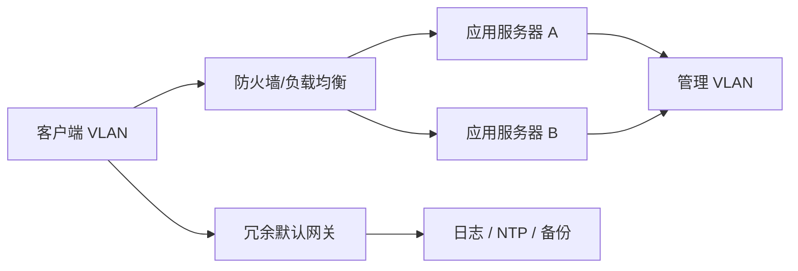

# 第0章　本书的用法

> 这不是把目录改写成摘要，而是把“服务器端网络架构”当成一门工程学来学习：先定义要交付的业务，再把业务约束翻译成链路、地址、路由、安全、冗余和运行证据。

## 本章主线

服务器网络不是“把几台交换机接起来”。它是一条从业务目标到可验证系统的推理链：

本书后续章节正好沿着这条链展开：第1章处理“信号怎样可靠地到达”；第2章处理“设备怎样找到下一跳”；第3章处理“哪些通信允许通过，以及请求怎样分摊”；第4章处理“坏一条链路、坏一台设备时怎样继续”；第5章处理“怎样知道系统正在发生什么，并且能够恢复”。

## 0.1　网络架构的流程

### 0.1.1　网络架构分为六个阶段

#### 0.1.1.1　需求定义

网络的第一性原理是：网络存在的价值不是吞吐率，而是让某种业务在约束下完成。需求至少要回答五件事：谁访问谁、什么时候访问、访问量有多大、允许多长时间不可用、哪些数据不能被谁看到。

把“系统要快一点”改写成可计算的约束，例如：峰值并发连接数、每秒新建连接数、请求延迟的 P95/P99、可用性目标、故障恢复时间（RTO）和数据恢复点（RPO）。容量不要只写一个平均值，可以先用一个保守模型：

$$
R_{peak}=R_{avg}\times K_{burst},\qquad C_{required}=C_{peak}\times K_{headroom}
$$

其中 $K_{burst}$ 描述突发流量，$K_{headroom}$ 是为增长、重试和测量误差保留的余量。没有这些变量，后面所有“买多大的设备”都只是猜测。

**工程落地。** 用一页《网络需求清单》固定输入：业务流矩阵、用户/服务清单、地址数量、带宽与连接模型、合规要求、维护窗口、故障假设。把“不能停机”拆成“允许中断几秒、哪些路径不能同时失效”。

**我的洞见。** 需求定义其实是在定义“失败的代价”。如果一次连接失败只是重试，和一次支付扣款后无响应，网络设计的取舍完全不同。先写失败语义，再写性能指标，才能避免把所有预算浪费在不影响业务的峰值上。

#### 0.1.1.2　基础设计

基础设计回答“系统由哪些边界和原则组成”，而不是回答每个端口插在哪。它应形成物理拓扑、逻辑分区、地址与路由策略、安全边界、负载均衡模型、高可用模型、管理与交付标准。

基础设计的关键是控制耦合：把服务器、用户、存储、管理和外部访问划成可说明的域；让每个域有清晰的入口、出口、信任级别和故障边界。Linux 内核文档把 VLAN、network namespace 与 VRF 描述为不同层次的隔离手段，这提醒我们：隔离不是一个开关，而是 L2、L3、进程和策略多个层次的组合（见 [Linux VRF documentation](https://docs.kernel.org/networking/vrf.html)）。

**工程落地。** 先画通信流，再画设备。每条流写出源、目的、协议、端口、方向、带宽、是否有状态、失败后是否可重试。之后才能决定 VLAN、子网、防火墙规则和负载均衡位置。

#### 0.1.1.3　详细设计

详细设计把原则变成可执行的配置对象：设备型号与端口、线缆与光模块、VLAN ID、IP 前缀、路由协议、策略顺序、监控阈值、命名规则、变更步骤和回滚步骤。

第一性原理是“每一个抽象决策都必须有一个可观测的落点”。例如“高可用”必须落为两条独立物理路径、两个电源域、一个收敛目标和一个故障演练；“安全”必须落为允许列表、日志、证书生命周期和审计证据。

**工程落地。** 使用 IPAM、配置模板、版本控制和变更评审。详细设计文档应能让第二个工程师按照步骤复现拓扑，并能在故障时快速比较“设计值、当前值、观测值”。

#### 0.1.1.4　架构

这里的“架构”是实施阶段：机柜、设备、模块、线缆、配置和服务按设计组装。实施不是简单照抄，因为现场会暴露机柜空间、光纤路由、运营商交付、设备版本和端口兼容性等新事实。

**工程落地。** 采用小批量变更：先在实验环境或一组非关键节点验证，再分批上线；每次变更记录前置条件、影响面、验证命令、观察窗口和回滚条件。

**我的洞见。** 架构阶段真正交付的是“可重复的改变能力”。手工一次性改成功不等于工程完成；能自动、可审计、可回滚地重做，才是可运营的网络。

#### 0.1.1.5　测试

测试不是只执行 `ping`。它至少要覆盖四个维度：功能（能否通）、性能（在什么负载下通）、故障（坏了是否按预期切换）、安全（不该通的是否真的不通）。

可以把一次测试看作假设检验：

$$
H_0: \text{设计满足目标};\qquad H_1: \text{设计不满足目标}
$$

每个测试必须有输入、预期、观测证据和判定标准。例如，关闭一条 LACP 成员链路后，业务不应中断，聚合带宽下降应与设计一致，交换机日志应能定位事件。

**工程落地。** 形成测试矩阵：VLAN 连通性、跨网段路由、NAT、策略命中、TLS 证书、健康检查、链路/设备切换、NTP 偏差、日志到达、备份恢复。把抓包、接口计数器和应用日志一起保存，避免只留下“测试通过”的口头结论。

#### 0.1.1.6　运行

运行阶段的对象不是“设备”，而是服务等级。日常工作包括容量趋势、配置漂移、补丁与证书、备份、告警降噪、故障响应、问题复盘和架构演进。

**工程落地。** 建立四类基线：拓扑基线、配置基线、性能基线、故障基线。任何告警都应能回答“影响哪个业务、发生在哪一层、下一步观察什么、谁有权改变什么”。

**我的洞见。** 运行是设计的最后一部分，不是设计之后的附属工作。一个无法被监控、验证和恢复的设计，在真实世界里等同于没有设计。

### 0.1.2　网络架构的重点是基础设计

基础设计处在需求与配置之间，是“复杂度预算”的分配点。过早进入具体命令，会把厂商默认值误认为架构原则；只谈原则又会无法实施。基础设计要使以下五个面互相对齐：物理承载、逻辑寻址、安全控制、故障切换、运行观测。

#### 0.1.2.1　物理设计

物理设计回答：信号走什么介质、设备放在哪里、端口如何连接、供电和散热如何保证、单条链路或单个机架失效时影响多大。物理层的错误往往最难通过软件弥补：光模块不匹配、线缆超距、气流相反、配电过载，都会让上层协议看起来像“随机故障”。

**工程落地。** 先做机柜、端口、线缆和电源的资产图，再做逻辑拓扑。容量计算要包含端口速率、包速率、收发方向、光模块预算和增长余量。

#### 0.1.2.2　逻辑设计

逻辑设计回答：哪些节点属于同一广播域、哪些网段可以互通、路由如何收敛、地址如何扩展、故障域如何划分。VLAN 解决的是二层广播边界，子网和路由解决的是三层转发边界；二者不能互相替代。

**工程落地。** 用“域—前缀—网关—路由—策略”五列表管理逻辑设计，并给每个域写出允许的通信流。优先可汇总的地址规划，以减少路由表和策略的复杂度。

#### 0.1.2.3　安全设计与负载均衡设计

安全设计在问“最小允许集合是什么”；负载均衡在问“同一项服务如何被多个实例共同提供”。二者相交于状态：防火墙要识别连接状态，负载均衡器要维护会话、健康状态、NAT 映射和证书状态。

**工程落地。** 先定义服务暴露面，再选防火墙、反向代理、四层或七层负载均衡。规则和健康检查都应以业务语义为单位，而不是只测一个 TCP 端口。

#### 0.1.2.4　高可用性设计

高可用不是“设备数量乘二”，而是减少共同原因故障，并让切换过程可测量。若两个设备共享同一电源、同一上联、同一软件缺陷或同一配置错误，它们在统计上仍然接近一个故障点。

串联系统的可用性近似为：

$$
A_{series}=\prod_{i=1}^{n}A_i
$$

两个真正独立的并联系统则近似为：

$$
A_{parallel}=1-\prod_{i=1}^{n}(1-A_i)
$$

公式的前提是失效独立；现实里共同电源、共同机房和共同配置会破坏这个前提，所以设计必须显式检查“共享什么”。

#### 0.1.2.5　管理设计

管理设计回答：发生故障时，工程师怎样知道、怎样定位、怎样改变、怎样恢复。NTP 给事件排序，SNMP 给设备指标，Syslog 给事件上下文，CDP/LLDP 给拓扑事实，备份给恢复能力；它们共同构成运行证据链。

**全书学习方法。** 每读一个协议都问四个问题：

1. 它解决的最小问题是什么？
2. 它维护了什么状态？状态由谁创建、何时过期、怎样失效？
3. 它失败时，上层看到的现象是什么？
4. 在生产环境中，用什么命令、计数器、抓包或日志验证它？

## 跨章实验主线

可以用一个小型“三层服务”实验贯穿全书：客户端 VLAN、应用 VLAN、管理 VLAN；两台三层交换机、两台应用服务器、一个防火墙/反向代理和一台日志/NTP 主机。先以单路径跑通，再逐步加入 VLAN、路由、NAT、TLS、健康检查、链路聚合、网关冗余和监控。

## 本章参考资料

- [RFC 1812: Requirements for IP Version 4 Routers](https://www.rfc-editor.org/rfc/rfc1812.html)：把路由器理解为连接多个逻辑网络、维护转发数据库的系统，而不是“会转发包的黑盒”。
- [NIST SP 1800-16: Securing Web Transactions](https://csrc.nist.gov/pubs/sp/1800/16/final)：把证书、密钥、清单、责任人、监控和恢复放入完整的运行体系，适合作为“设计必须包含运营”的现实参照。
- [Cloudflare: How does the Internet work?](https://www.cloudflare.com/learning/network-layer/how-does-the-internet-work/)：用 DNS、TCP、TLS、HTTP 的实际访问链路串起不同层次，适合作为本书主线的快速复习。
