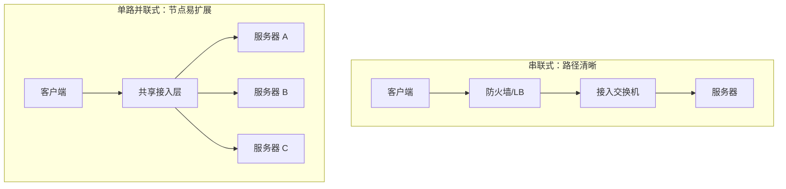

# 第1章　物理设计

> 物理设计的核心不是“挑一根好线”，而是让电信号或光信号在规定距离、误码率、温度、供电和维护条件下可重复地到达。上层协议所有的可靠性，最终都建立在这个承载事实之上。

## 1.1　物理层的技术

### 1.1.1　物理层里有多种规格

物理层把比特变成可传播的能量变化：铜缆里是电压/电流的差分变化，光纤里是光强的变化。所谓“规格”，实际是在约束四个变量：速率、编码方式、介质、距离。速率越高，单位比特可容忍的时间窗口越短；距离越长，衰减、反射、串扰和色散就越显著。

因此不能只问“这是几类线”，还要问“它和什么 PHY、什么收发器、什么距离、什么环境一起使用”。IEEE 802.3 的公开资料把 10BASE-T、100BASE-TX、1000BASE-T、1000BASE-X 等不同 PHY 与介质组合区分开来（见 [IEEE 802.3 machine-readable extracts](https://www.ieee802.org/3/publication/index.html)）。

**第一性原理洞见。** 物理链路不是一个静态属性，而是端点能力、介质能力和环境共同决定的“可用通信窗口”。标称速率只是上限，工程速率还要减去协议开销、重传、突发和故障余量。

#### 1.1.1.1　规格整理好后物理层就会水落石出

整理规格时建议做一张“端到端链路表”：

| 项目 | 必须记录的内容 | 典型风险 |
|---|---|---|
| 端点 | 网卡/交换机端口速率、接口形态、双工 | 一端支持 10G，另一端只有 1G |
| 收发器 | 速率、波长、单模/多模、连接器、编码 | 光模块与光纤类型不匹配 |
| 介质 | Cat 类别、芯数、OM/OS、屏蔽、阻燃 | 现场替换成了低规格线缆 |
| 距离 | 水平布线、跳线、盘纤、余量总长度 | 只量机柜间直线距离而忽略盘纤 |
| 环境 | 温度、弯曲半径、电磁干扰、配电 | 机房外强电/电机造成误码 |
| 验证 | 光功率、误码、接口计数器、认证测试 | “Link up” 被误当成质量合格 |

只要把这些字段填完整，许多争论会从“经验”变成“哪一个约束不满足”。

**工程实践。** 采购和实施阶段冻结兼容矩阵；变更线缆、光模块、跳线长度或端口速率时，必须重新检查矩阵，而不是只看插头能不能插进去。

#### 1.1.1.2　双绞线电缆有两大要素——类和传输距离

双绞线把两根导线绞在一起，并以差分方式传输。接收端主要观察两根线的电压差：外界同时耦合到两根线上的噪声会被抵消，绞距不同又能降低相邻线对的耦合。它的性能主要被两件事决定：类别/结构定义的电气指标，以及实际链路长度。

常见工程判断可以这样记：

- Cat5e 常用于 1G 铜缆接入，结构化布线通常按 100 m 信道边界设计；
- Cat6 可以提供更好的串扰余量，10GBASE-T 的可用距离依安装、串扰和认证结果而定；
- Cat6A 通常用于把 10GBASE-T 的 100 m 目标做得更稳定；
- 速度、类别和距离必须按具体 PHY/标准确认，不能把“类别更高”理解成无限升级。

10GBASE-T 的标准化讨论明确把不同类别铜缆与 55–100 m、100 m 等距离目标联系起来（见 [IEEE 10GBASE-T cabling objectives](https://www.ieee802.org/3/an/public/jul04/flatman_2_0704.pdf)）。

可以用一个粗略的信号预算理解“为什么会超距”：

$$
SNR_{end}=SNR_{start}-L_{attenuation}(d)-L_{connector}-L_{noise}
$$

当 $SNR_{end}$ 低于接收判决阈值时，链路可能仍然偶尔亮灯，但误码和重传会显著增加。长度越长，衰减越大；连接器越多，插入损耗和接触故障越多。

**实践检查。** 不把配线架、跳线、水平线分开“各自合格”当作端到端合格；使用认证仪测试永久链路/信道，观察 CRC/FCS、符号错误、丢包和协商结果。

**我的创新理解。** 线缆类别可以看成“噪声预算”，距离可以看成“预算消耗速度”。在高密度机房里，真正要优化的不是某一根最贵的线，而是让一整束线缆的弯曲、串扰、散热和可识别性都在预算内。

#### 1.1.1.3　光纤光缆是用玻璃制成的

光纤用玻璃纤芯和包层形成全反射，光在纤芯中传播。工程上最重要的不是“玻璃比铜快”这种口号，而是三件事：

1. **单模与多模。** 单模纤芯小，适合更长距离和更高的距离预算；多模纤芯大，常用于数据中心内较短距离，配合不同 OM 等级和波长。
2. **损耗与色散。** 光功率沿距离衰减，色散会让脉冲展宽；接头、弯曲、污染和不匹配会增加损耗。
3. **端到端光预算。** 收发器发射功率减去链路总损耗后，仍应高于接收灵敏度并保留工程余量：

$$
P_{rx}=P_{tx}-\alpha L-N_cL_c-N_sL_s-M
$$

其中 $\alpha$ 是每公里衰减，$L$ 是距离，$N_c/N_s$ 是连接器与熔接点数量，$M$ 是安全余量。

光纤的优势通常是长距离、抗电磁干扰和高带宽；代价是端面清洁、弯曲半径、光模块兼容和维护工具要求更高。

**工程实践。** 对每条光纤记录两端端口、模块序列号/型号、波长、纤芯类型、长度和光功率。插拔前清洁并检查端面；不要用“红光笔能亮”代替功率和误码测试。

**第一性原理洞见。** 光纤不是“更快的电缆”，而是把主要故障从电气噪声转移到光预算、端面和机械管理。设计应把“可测量”写进交付条件。

## 1.2　物理设计

### 1.2.1　服务器端有两种结构类型

服务器端结构的选择，本质上是选择“故障影响范围”和“扩展方式”。一种把服务路径上的设备串起来，路径直观；另一种把多个服务节点并列挂到共享承载上，新增节点相对容易。两者都能工作，区别在于故障域、布线、扩容和排障成本。

#### 1.2.1.1　采用串联式结构管理起来更方便

串联式把通信路径做成有顺序的链：入口控制点、转发设备、服务器侧网络。它的优点是边界明确、策略集中、路径容易画出来，适合服务规模小、变更频率低或必须经过固定安全设备的场景。

它的风险也正来自“集中”：任意中间设备、模块或配置错误都可能成为单点；流量必须经过同一路径时，横向扩展和带宽扩容会受到最窄环节限制。

**工程做法。** 给每个串联节点定义明确职责（例如 TLS 终止、四层转发、过滤、路由），不要让一个设备同时承担无法独立验证的多种状态。为每个节点写入口/出口计数器和切换方式。

#### 1.2.1.2　采用单路并联式结构更容易扩展

单路并联式把多个服务器作为同一服务池的成员，新增服务器主要是增加端口、地址、健康检查和应用实例，而不必重新改变整条路径。负载均衡器按连接、请求或哈希将流量分发；接入层是共享资源，因此要特别关注广播域、端口密度、上联带宽和东西向流量。

**工程做法。** 扩容前先检查四个“共同瓶颈”：接入交换机上联、负载均衡器连接表、服务器端口/CPU、后端存储或数据库。把服务池成员设计为可摘除、可替换，配合连接排空和健康检查。

**我的洞见。** “容易扩展”不是端口多，而是加入一个节点不会让已有节点重新学习一套拓扑状态。把成员状态、配置模板和健康判定标准化，扩展才不会变成手工复制风险。

### 1.2.2　选用设备时应参考考查项的最大值

设备选型不能拿一个“平均吞吐率”盖住所有工作负载。至少要分别看：包转发率、吞吐率、并发连接数、新建连接数、规则/路由/VLAN 表规模、缓存、功耗和散热。不同包长会让同样的 Gbit/s 产生完全不同的 pps 压力。

对一个接口，粗略的包速率关系是：

$$
pps\approx \frac{R_{bit/s}}{8(L_{payload}+L_{overhead})}
$$

小包场景的 pps 可能远高于大文件传输场景。选型表必须使用“业务最坏组合”，而非营销页面上单一测试值。

#### 1.2.2.1　应用程序不同吞吐率也就不同

文件传输更接近大包顺序吞吐；API、DNS、支付或数据库代理更接近小包、高 PPS、短连接或大量状态查表。加密、压缩、日志、内容检查和 NAT 都会改变设备的有效吞吐。

**工程做法。** 从访问日志和流量镜像得到包长分布、协议比例、P95/P99 峰值和东西向比例，使用接近生产的混合流量测试。容量应按“转发 + 加密 + 策略 + 日志”组合测量。

#### 1.2.2.2　新增连接数和并发连接数都要考虑

并发连接数描述“同时占用多少状态”；新建连接数描述“状态表每秒变化多快”。一个设备即使有足够的并发容量，也可能在 TLS 握手、TCP SYN 洪峰或大量短连接下先被 CPU/加密引擎打满。

可以把状态表粗略看成排队系统：

$$
N_{active}\approx CPS\times T_{avg}
$$

其中 $CPS$ 是每秒新建连接数，$T_{avg}$ 是平均连接存活时间。长连接增大并发状态，短连接增大建连压力，两者必须分别压测。

**实践提醒。** 选型时确认厂商的测试条件（包长、规则数、TLS 版本、是否启用日志），把预留容量写成数值，而不是“留有余量”。

### 1.2.3　选择稳定可靠的 OS版本

“最新”不等于“适合生产”。稳定的 OS 版本应同时满足：厂商支持周期、内核/驱动兼容、网卡/光模块支持、漏洞修复渠道、自动化工具兼容、回滚方案和团队熟悉度。

**工程做法。** 维护黄金镜像与版本清单；新版本先在同硬件实验环境验证网卡协商、bond/LACP、MTU、路由、时间同步、日志和重启恢复。生产升级采用分批、可回滚、可观测的变更窗口。

### 不懂就问是捷径

物理设计的很多故障无法从配置文件推理出来：光模块的 DOM 指标、线缆的认证等级、机架的承重、设备的风向、运营商的交付边界，都需要向厂商、机房或现场工程师确认。

**第一性原理洞见。** 提问不是降低专业性，而是降低不确定性。好的问题带着上下文和验证方式，例如“这根 OM4 链路在 850 nm、总长 70 m、四个连接器时的设计光预算是多少？”而不是“这个能不能用？”

### 1.2.4　根据实际配置和使用目的选择线缆

线缆设计的目标是“在全生命周期中可识别、可维护、可验证”。不要仅按当前端口速率采购；要同时考虑距离、升级路线、环境、布线密度、弯曲半径、备件和现场施工能力。

#### 1.2.4.1　远距离传输选择光纤光缆

跨机房、跨楼层或超出铜缆结构化布线边界时，光纤通常更合适；它不受地电位差和大部分电磁干扰影响。选择时先确定单模/多模和收发器波长，再按距离和总损耗核算光预算。

#### 1.2.4.2　追求宽频带和高可靠性时选择光纤

光纤的“高可靠”不是绝对不会坏，而是对电磁干扰、雷击感应和地环路更不敏感。可靠性仍依赖端面清洁、连接器锁紧、光纤保护和备件。

**实践提醒。** 高带宽场景优先选择标准化、可替换的模块化光链路；将模块、跳线和端口作为一个兼容单元测试，避免只采购“速度一样”的不同厂商器件。

#### 1.2.4.3　通过大小分类决定使用哪种双绞线电缆

“大小”既可以指外径/线规，也可以指线缆类别和芯数。外径影响走线槽、配线架密度、散热和弯曲；类别影响频率、串扰和可支持的 PHY。高密度机柜中，过粗的高规格线可能让物理空间先成为瓶颈。

**工程做法。** 把“可支持的最小规格”和“现场施工可接受的最大外径”同时写入标准；按固定长度预制跳线，减少现场绕线和标签不一致。

#### 1.2.4.4　预先决定好使用线缆的颜色

颜色是给人看的低成本元数据：可以区分生产、管理、存储、互联、外部、备用或不同安全域。但颜色不是访问控制，不能把安全责任寄托在颜色上。

**工程做法。** 建立颜色字典并固化到施工规范，例如“红色=外部边界、蓝色=管理、黄色=存储、绿色=集群心跳”。颜色不足时用两端标签、编号和资产系统补充；更换线缆必须保留端口映射。

### 1.2.5　端口的物理设计出乎意料地重要

端口表是物理世界与逻辑世界的索引。没有端口设计，排障只能从“这根线去哪儿”开始猜，配置审计也无法确认实际链路。

#### 1.2.5.1　必须统一规划连接到哪里

为每个端口定义本端、远端、用途、速率、VLAN/聚合成员、线缆编号和变更责任。端口命名要可读，描述要写业务对象，例如 `APP-A eth1 -> TOR-01 Eth1/17`，不要只写“server”。

**工程做法。** 使用配线架和设备端口的双向映射；实施后用 LLDP/CDP、光模块信息和接口计数器反查，确认“设计连接”和“实际连接”一致。

#### 1.2.5.2　速率和双工、Auto MDI/MDI-X 的设置也要统一规划

现代以太网通常依靠自动协商决定速率与双工；强制一端、自动另一端可能导致双工不匹配、碰撞和吞吐下降。Auto MDI/MDI-X 解决了许多直通/交叉线缆差异，但不能修复坏线、错误的速率上限或不兼容收发器。

**工程做法。** 默认使用双方一致的自动协商策略；只有在设备兼容性或特定运营商要求下才固定参数，而且两端必须成对记录。排障先看协商结果、FCS/CRC、丢包、接口 flap 和错误计数器，不要一上来就强制 1000/full。

### 1.2.6　巧妙地配置设备

设备摆放要同时优化三条路径：数据路径、空气路径、电力路径。任何一条被忽略，都会把一个看似高可用的网络变成现场单点。

#### 1.2.6.1　将核心交换机和汇聚交换机置于中央部位

中央位置可以缩短平均线缆长度、减少跨区跳线、提高端口复用和故障定位效率。这里的“中央”首先是拓扑中央，其次才是机房几何中央；必须结合链路距离、光预算、维护通道和故障域。

**工程做法。** 让核心/汇聚靠近主要互联区域，把接入层靠近服务器或用户；为跨机柜上联预留光纤和端口，避免扩容时重新穿线。

#### 1.2.6.2　要考虑设备中空气吸入和排出的方向

设备的进风口应位于冷通道，排风口朝向热通道；同一机柜内的风向要一致。Cisco 的硬件安装指南明确要求确认 port-side intake/exhaust，并提醒进风方向错误会造成过热关机（见 [Cisco Nexus airflow requirements](https://www.cisco.com/c/en/us/td/docs/switches/datacenter/nexus9000/hw/n93180ycfx_hig/guide/b_n93180ycFX_nxos_hardware_installation_guide/b_n93180ycFX_nxos_hardware_installation_guide_chapter_010.pdf)）。

**实践检查。** 记录风扇/电源模块的风向型号；检查盲板、机柜门、地板送风和温度传感器；把“热通道温度”和设备进风温度纳入监控。

#### 1.2.6.3　从两套系统获取电源

双电源设备应分别接入 A/B 两个独立供电域，最好跨越不同 UPS、PDU、配电柜和维护路径。只把两根电源线插到同一排插上，电源数量是双份，故障独立性仍是一份。

功率预算可以先用：

$$
P_{rack}=\sum_i P_i\times K_{peak}+P_{loss},\qquad I\approx\frac{P_{rack}}{V\times PF}
$$

按峰值功耗和功率因数核算，而不是按铭牌的平均值；为启动浪涌和未来设备预留容量。

#### 1.2.6.4　切莫超过最大承重

机柜承重不只由设备总重决定，还受安装高度、重心、滑轨和地板承载影响。重设备应放低，避免抽拉多台设备时重心前移。机房承重、机柜额定承重和运输路径必须分别确认。

**我的洞见。** 物理故障常常是“慢变量”：线缆越拉越乱、风道逐渐堵塞、电源余量逐渐耗尽、标签逐渐失真。物理设计的真正产物是让这些慢变量可见、可测、可维护。

## 章末：物理设计验收清单

- 端到端链路规格、距离、模块和介质已形成兼容矩阵；
- 铜缆/光纤已按信道或链路完成认证、光功率和误码检查；
- 端口、线缆、配线架、远端设备双向可追溯；
- 速率、双工、自动协商策略两端一致；
- 核心/汇聚、接入和服务器的拓扑故障域清晰；
- 风向、温度、功耗、A/B 电源和机柜承重有现场记录；
- 关键物理变更有回滚、备件和再次验证方式。

## 本章参考资料

- [IEEE 802.3 publication resources](https://www.ieee802.org/3/publication/index.html)：核对 Ethernet PHY 与介质的标准边界。
- [IEEE 10GBASE-T cabling objectives](https://www.ieee802.org/3/an/public/jul04/flatman_2_0704.pdf)：理解 10G 铜缆类别与距离之间的约束。
- [Cisco Ethernet cable specifications](https://www.cisco.com/c/en/us/support/docs/routers/10000-series-routers/46792-ethbase.html)：用厂商兼容表把标准映射到设备和线缆选择。
- [Cisco hardware airflow requirements](https://www.cisco.com/c/en/us/td/docs/switches/datacenter/nexus9000/hw/n93180ycfx_hig/guide/b_n93180ycFX_nxos_hardware_installation_guide/b_n93180ycFX_nxos_hardware_installation_guide_chapter_010.pdf)：把风向和机房物理条件纳入设备设计。
