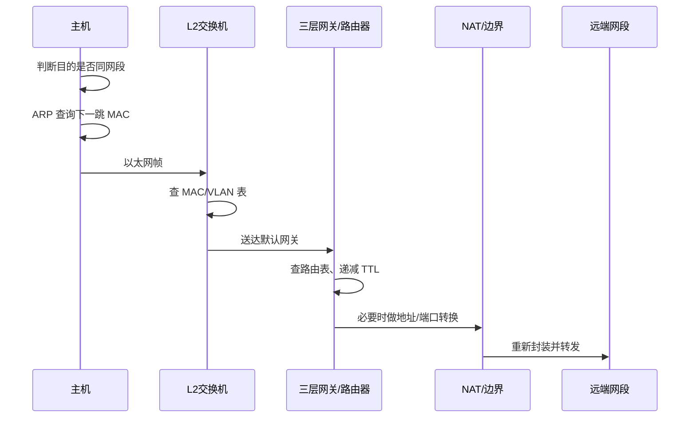
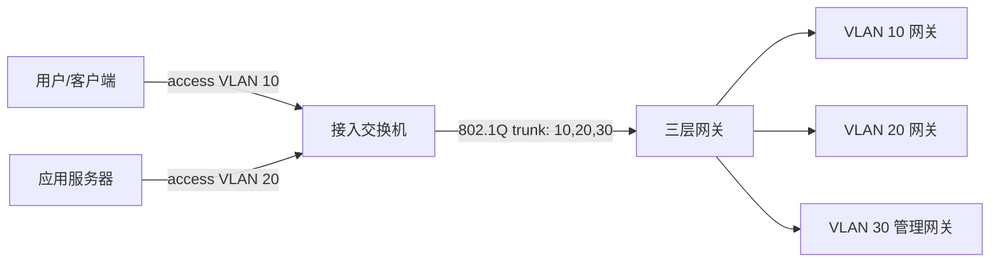
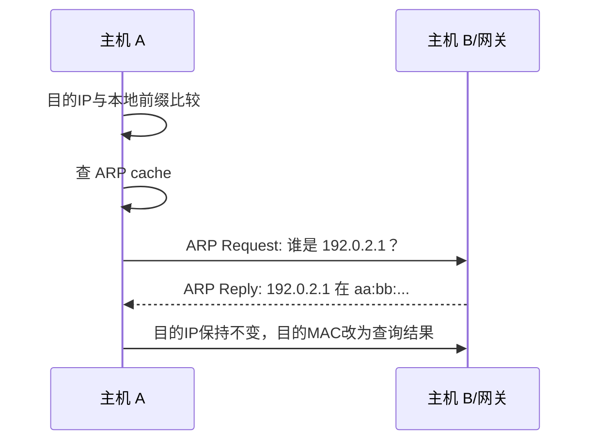
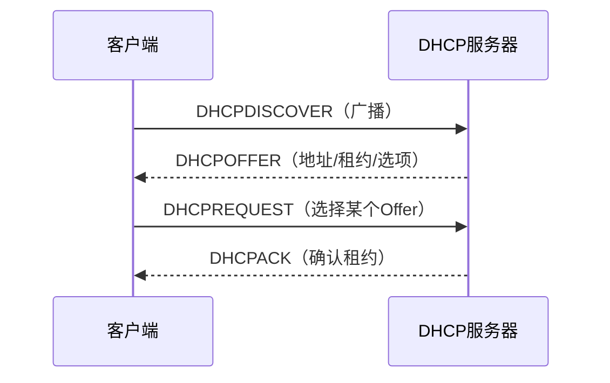

# 第2章　逻辑设计

> 物理设计解决“信号能不能到达”；逻辑设计解决“一个帧/一个包应该交给谁”。它把共享的物理承载切成可管理的广播域、网段和路由域，再用地址、MAC、ARP、DHCP 与 ICMP 让这些抽象真正运行起来。

## 本章主线：从一段比特到一条端到端路径



## 2.1　数据链路层的技术

### 2.1.1　数据链路层是物理层的帮手

物理层只知道“有一串信号”，不知道这串信号从哪里来、给谁、是否完整。数据链路层在同一个直接连接的网络里建立帧边界、携带源/目的链路地址并做差错检测。它把一段物理信号变成交换机和网卡可以处理的“局部快递单”。

#### 用以太网标准进行成帧处理

一个典型 Ethernet II 帧可以抽象为：

```text
前导码 | 目的 MAC | 源 MAC | EtherType | Payload | FCS
```

- 目的 MAC 决定本地链路上的接收者；
- 源 MAC 让交换机能够学习“这个地址从哪个端口来”；
- EtherType 告诉上层这是 IPv4、IPv6、ARP 等哪一种载荷；
- Payload 受最小/最大帧和 MTU 约束；
- FCS 用 CRC 发现帧在传输中是否损坏，但通常不能纠正错误。

**第一性原理洞见。** 帧是“一个局部广播域里的投递单位”，不是端到端单位。每经过一个路由器，旧帧会被拆掉，IP 包被重新封装成下一条链路所需要的新帧。因此抓包时看到 MAC 地址逐跳变化，而端到端 IP 地址通常保持不变（NAT 除外）。

**工程实践。** 排查链路问题时同时看 FCS/CRC、巨帧、丢帧、接口 flap 和协商结果；只看到“端口 up”只能证明物理层有信号，不代表帧能稳定通过。IEEE 802.3 的公开资料是核对具体 Ethernet PHY、编码和介质边界的入口（见 [IEEE 802.3 resources](https://www.ieee802.org/3/publication/index.html)）。

### 2.1.2　数据链路层的关键在于 L2交换机的运作

L2 交换机的基本工作是：从帧的源 MAC 学习入口，从目的 MAC 查出口，在同一 VLAN 内转发、泛洪或丢弃。它不需要理解应用，也不需要知道远端网络的完整拓扑。

#### 2.1.2.1　交换 MAC地址

交换机维护一张近似如下的表：

| VLAN | MAC 地址 | 学习端口 | 状态/老化 |
|---|---|---|---|
| 10 | `aa:...:01` | Gi1/0/3 | 动态，剩余 280 s |
| 20 | `bb:...:02` | Gi1/0/8 | 动态，剩余 190 s |

收到帧后通常经历：

1. 学习源 MAC 与入口端口；
2. 在对应 VLAN 查目的 MAC；
3. 已知单播只从目标端口转发；
4. 未知单播、广播和部分组播在 VLAN 内泛洪；
5. 根据端口/VLAN 策略决定是否丢弃。

MAC 表必须老化，否则设备移动后旧路径会永久错误；但老化过快会造成更多泛洪。链路环路会让同一个 MAC 在不同端口来回抖动，形成 MAC flapping，严重时广播风暴耗尽带宽和交换机 CPU。

**我的创新理解。** MAC 表不是“地址簿”，而是交换机对世界的局部记忆。它的可信度来自最近观察，而不是配置文件；排障要问“交换机最近从哪里看到这个源 MAC”，而不是只问“这台主机理论上接在哪里”。

#### 2.1.2.2　通过 VLAN将广播域分隔开

VLAN 把一台物理交换机逻辑切成多个二层广播域。广播、未知单播和组播不会默认跨 VLAN；不同 VLAN 之间要经过三层网关才能通信。802.1Q 标签把 VLAN 标识带进 trunk 链路，接入端口通常向终端提供不带标签的帧，trunk 端口在交换设备之间承载多个 VLAN。



VLAN 的收益是缩小广播域、分离故障与安全策略、便于按角色管理；它不是加密，也不是自动防止横向移动。trunk 放行过多 VLAN、native VLAN 不一致、VLAN ID 复用错误，都会产生跨域或黑洞。

**工程实践。** 明确 access/trunk 的边界、允许 VLAN 列表、native VLAN 策略、未使用端口处理、广播抑制和 VLAN 间的安全策略。不要用 VLAN 数量代替威胁建模；对于需要真正隔离的租户或合规域，结合 VRF、防火墙和身份策略。

### 2.1.3　ARP 将逻辑和物理关联到一起

IPv4 应用使用 IP 地址，局域网发送帧却需要 MAC 地址。ARP 是两者之间的动态映射机制：在一个广播域内，主机用“谁拥有这个 IPv4 地址”询问，拥有者用自己的 MAC 回复。

#### 2.1.3.1　ARP 通过IP地址查询MAC地址

发送主机先判断目的 IP 是否属于本地网段：

- 同网段：ARP 查询目的主机 MAC；
- 非同网段：ARP 查询默认网关接口的 MAC，之后把目的 IP 仍写成远端 IP，让路由器负责下一跳。

ARP 缓存把查询结果保留一段时间，避免每个数据包都广播。抽象流程如下：



ARP 没有内建强认证，所以同一广播域中的伪造回复可以造成流量劫持或黑洞。生产网络常用 DHCP snooping、动态 ARP 检测、静态绑定、端口隔离和更高层的 TLS 来降低风险。

RFC 826 的原始设计把 ARP 定义为“把网络协议地址转换为以太网地址”的机制，阅读它能看出 ARP 解决的是链路投递问题，而不是路由问题（见 [RFC 826](https://www.rfc-editor.org/rfc/rfc826.html)）。

#### 2.1.3.2　抓取 ARP包，观察它的写法

抓包时重点看：硬件类型、协议类型、操作码（request/reply）、发送方 MAC/IP、目标 MAC/IP，以及帧的广播/单播属性。一次完整观察最好包含“缓存为空时的请求”“收到回复后发送的数据帧”“缓存过期后的再次请求”。

**工程练习。** 在实验网执行 `ip neigh` 或 `arp -a` 记录缓存，再用 Wireshark 过滤 `arp`。把抓包字段和操作系统邻居表、交换机 MAC 表对照：三者分别回答“主机认为谁是谁”“交换机从哪里看到谁”“线上的消息说了什么”。

#### 2.1.3.3　有几个特殊的 ARP

常见特殊行为包括：

- **Gratuitous ARP（免费 ARP）**：主机主动宣布自己的 IP/MAC，常用于地址冲突检测、接口切换后刷新邻居缓存；
- **ARP Probe**：发送方字段使用特殊值来探测地址是否已被占用；
- **Proxy ARP**：路由器代替另一台主机回答 ARP，使主机把流量交给代理设备；
- **反向/跨协议辅助机制**：在特殊链路或虚拟化环境中由设备代理邻居解析。

**第一性原理洞见。** 特殊 ARP 都是在修补“缓存分布在很多终端上”的代价：一旦网关、虚拟机或地址归属发生变化，必须主动让旧记忆失效。排障不能只看当前 ARP 表，还要问“谁应该触发刷新、刷新是否被安全策略挡住”。

## 2.2　网络层的技术

### 2.2.1　网络是由网络层拼接起来的

数据链路层只负责一个广播域，网络层用逻辑地址和路由把多个广播域拼起来。路由器收到一个 IP 包后，依据目的前缀选择出口和下一跳，递减 TTL，并在下一条链路上重新封装。

#### 2.2.1.1　添加 IP报头，进行分组化处理

IPv4 报头常见字段包括版本、首部长度、服务类别、总长度、标识/分片字段、TTL、上层协议、首部校验和、源/目的地址。它的核心工作是让每个分组能够独立被转发，即使同一应用数据被拆成多个包，也不要求中间路由器保存完整会话。

路由转发会改变 TTL 和首部校验和；分片会引入重组复杂度，因此生产设计倾向于使用路径 MTU 发现、合理 MSS 和避免中间设备随意分片。RFC 1812 对路由器的转发、接口 MTU 和链路封装要求有系统描述（见 [RFC 1812](https://www.rfc-editor.org/rfc/rfc1812.html)）。

#### 2.2.1.2　IP 地址由32位构成

IPv4 地址由 32 位组成，分成网络前缀和主机部分。CIDR 用 `/n` 表示前 $n$ 位是前缀，例如 `/24` 有 $2^{32-24}=256$ 个地址，其中通常可用主机地址少于 256 个。

子网容量估算：

$$
N_{usable}=2^{32-prefix}-N_{reserved}
$$

$N_{reserved}$ 取决于网络、广播、网关、保留地址、冗余地址和平台约定，不能机械套用“减 2”。CIDR 的真正价值是让地址前缀与路由聚合可以独立于传统 A/B/C 类别，RFC 4632 详细说明了无类别分配和聚合（见 [RFC 4632](https://www.rfc-editor.org/rfc/rfc4632.html)）。

### 2.2.2　将网段连接起来

连接网段的最小动作是：路由器在每个接口上属于一个网段，在路由表里知道到其他前缀的下一跳，并能在出口链路解析下一跳 MAC。三层连通性因此依赖“地址、掩码、网关、路由、ARP、ACL”共同正确。

#### 2.2.2.1　利用 IP地址进行路由选择

路由选择的第一原则是最长前缀匹配：如果路由表同时有 `10.0.0.0/8` 和 `10.20.0.0/16`，去 `10.20.3.4` 时选择 `/16`。没有更具体的路由时使用默认路由 `0.0.0.0/0`，若没有匹配则丢弃并可能返回 ICMP Destination Unreachable。

路由器的转发动作可以表示为：

$$
next\_hop=\arg\max_{r\in R}\;prefix\_length(r)\quad s.t.\quad dst\in r
$$

**工程实践。** 区分控制平面（学习/计算路由）和数据平面（按 FIB 转发包）。出现“路由存在但不通”时，分别检查 RIB、FIB、出口接口、邻居解析、策略和返回路径。

#### 2.2.2.2　建立路由表

路由表来源主要有：直连路由、静态路由、默认路由和动态路由协议。动态协议的价值是让设备根据邻居可达性和拓扑变化自动更新，但它也引入邻居状态、度量、收敛、过滤和环路控制。

路由表的一条记录应能解释为：目的前缀、下一跳、出口接口、来源、管理距离/优先级、度量、有效时间。OSPF 等链路状态协议通过拓扑数据库计算最短路径；BGP 更偏向策略控制和域间路径选择。阅读 [RFC 2328: OSPF Version 2](https://www.rfc-editor.org/rfc/rfc2328.html) 时，重点不是背报文字段，而是理解“邻居关系—链路状态—最短路径树—路由安装”的状态链。

#### 2.2.2.3　整理路由表

路由表越大，设备内存、收敛、策略审计和排障成本越高。整理的主要方法是：

- 用 CIDR 聚合连续前缀；
- 在边界过滤不需要传播的明细路由；
- 统一默认路由策略，避免到处复制静态路由；
- 明确汇总路由的黑洞风险，必要时配置 Null0/拒绝路由；
- 保留真正需要的更具体路由。

**我的洞见。** 路由汇总的本质是用一点“精度”换取整体“可控性”。汇总过大可能把不存在的地址吸进错误路径；汇总过小则把拓扑细节泄漏到每一层。最好的汇总边界通常与故障域、业务域和组织边界重合。

### 2.2.3　转换 IP地址

NAT 通过修改 IP 地址，常常同时修改 TCP/UDP 端口，并维护映射状态。它可以节省 IPv4 公网地址、隐藏内部拓扑、实现重叠地址互联或把一个公网入口映射到内部服务，但也会破坏端到端可见性，增加排障与协议兼容成本。

#### 2.2.3.1　转换 IP地址

典型出站 SNAT/PAT：

```text
内网 10.0.10.21:51514 -> 公网服务 203.0.113.10:443
边界 198.51.100.7:40001 -> 203.0.113.10:443
```

设备保存五元组映射：源 IP、源端口、目的 IP、目的端口、协议。返回流量依赖该状态找到内部目标；超时、端口耗尽、非对称路径、协议内嵌地址和日志缺失都会造成难以解释的故障。

**工程实践。** 记录 NAT 前后地址、端口、时间戳和策略 ID；对高并发出站服务做源端口池与连接追踪容量评估；明确是否需要保留真实客户端地址（例如通过代理头或 PROXY protocol）。

#### 2.2.3.2　私网 IP地址

RFC 1918 定义了常用私网 IPv4 地址空间：`10.0.0.0/8`、`172.16.0.0/12`、`192.168.0.0/16`。这些地址不会在公共 Internet 中被全局路由，通常需要 NAT、VPN、专线或代理才能与外部通信（见 [RFC 1918](https://www.rfc-editor.org/rfc/rfc1918.html)）。

**工程实践。** 私网不等于安全网。私网地址仍需 ACL、防火墙、身份与日志；跨组织互联时提前规划不重叠地址，否则会被迫使用 NAT、VRF 或复杂代理。

### 2.2.4　自动设置 IP地址的DHCP

DHCP 把地址分配、租约、默认网关、DNS、NTP、域名等参数集中下发。它的第一性原理是“把主机启动所需的状态变成可租借的资源”，而不是永久写死在每台主机上。

#### 2.2.4.1　DHCP 的消息部分中包含着诸多的信息

DHCP 报文包含客户端标识、事务 ID、请求地址、服务器标识、租约时间以及 options。工程上最重要的是确认：地址池范围、租约时间、网关、DNS、NTP、PXE/自动装机参数、保留地址策略和审计记录。

#### 2.2.4.2　DHCP 的原理非常简单

经典 DORA 流程是 Discover、Offer、Request、ACK：



租约过期、续租失败、地址冲突或服务器不可达时，客户端可能丢失地址或继续使用旧地址。地址分配系统必须考虑服务器冗余、池耗尽、冲突检测和未授权 DHCP。

#### 2.2.4.3　对 DHCP报文作中继处理

DHCP 初始广播通常不会跨路由器。DHCP relay 在客户端网段接收广播，把它单播到服务器，并在报文中携带接收接口/网段信息，使服务器知道从哪个地址池分配。这样可以集中部署 DHCP，但 relay 自己变成需要冗余和监控的中间状态。

**工程实践。** 每个 VLAN 明确 relay 地址、服务器列表、giaddr/Option 相关策略；排障沿“客户端广播—relay 接收—服务器选择池—ACK 返回—客户端安装”逐段抓证据。

### 2.2.5　用于故障排除的 ICMP

ICMP 是 IP 的控制与错误报告伙伴，不是“只为 ping 服务”。它告诉发送方目的不可达、TTL 到期、需要调整参数或回显是否到达。防火墙完全阻断 ICMP 会让路径诊断和 PMTUD 变得困难。

#### 2.2.5.1　ICMP 的关键在于类型和代码

类型描述大类，代码描述更具体原因。例如 Type 3 Destination Unreachable 下面还区分网络不可达、主机不可达、端口不可达、需要分片但设置了 DF 等。排障必须记录类型和代码，不能只写“ICMP 报错”。

#### 2.2.5.2　常见的类型和代码有四种组合

可以先掌握四类高频组合：

| 组合 | 含义 | 常见排障提示 |
|---|---|---|
| Echo Request / Echo Reply | `ping` 的请求/回复 | 路径基本可达，不等于应用端口可用 |
| Destination Unreachable / Network 或 Host | 路由或下一跳不可达 | 查看路由表、接口、ACL、返回路径 |
| Destination Unreachable / Port | 主机到了但端口没有服务或被拒绝 | 区分服务未监听和策略拒绝 |
| Time Exceeded / TTL | 路由环路或 traceroute 探测 | 检查路由递归、默认路由和路径变化 |

#### 2.2.5.3　出现问题时先尝试用 ping去排除故障

`ping` 适合做分层阶梯，而不是最终验收：

1. ping 本机接口/默认网关，验证本地协议栈与 ARP；
2. ping 同 VLAN 另一主机，验证二层与邻居解析；
3. ping 下一跳/远端网关，验证路由；
4. 用指定源地址测试返回路径；
5. 对真实服务使用 TCP/UDP 探测、TLS 握手或应用请求。

ping 失败可能是 ICMP 被策略丢弃，ping 成功也可能是应用端口、TLS、认证或后端依赖失败。每一步要结合 `traceroute`、路由表、邻居表、抓包和应用日志。

## 2.3　逻辑设计

### 2.3.1　整理出所需的 VLAN

VLAN 规划不是按部门简单切分，而是按通信关系、故障域、地址与策略边界切分。常见角色包括用户、应用、数据库、存储、管理、备份、集群心跳、DMZ 和设备未使用端口。

#### 2.3.1.1　实际所需的 VLAN会因为诸多因素而变化

需要综合考虑：

- 广播规模与广播抑制；
- 安全等级和东西向访问；
- 设备迁移/虚拟化/容器调度；
- 二层延伸的范围与 STP 故障域；
- 网关、DHCP relay、VRRP/FHRP 的部署方式；
- 监控、备份和带外管理的独立性；
- 未来扩容和跨机房互联。

**第一性原理洞见。** VLAN 是“谁能在二层直接听到谁”的定义。安全边界不是越多 VLAN 越安全，而是广播域、路由策略、身份和应用授权一起形成最小可达集合。

#### 2.3.1.2　规定 VLAN的ID

VLAN ID 应有稳定的编码规则，例如按环境、区域、角色或租户分段，并保留扩展区。不要只依赖数字含义，因为设备/平台可能有保留 VLAN、默认 VLAN 和不同的合法范围；名字、IP 前缀、业务标签和资产系统必须互相映射。

**工程做法。** 建立 VLAN 注册表：ID、名称、用途、网段、网关、DHCP relay、允许的 trunk、STP 实例、责任人、变更工单和下线日期。

### 2.3.2　在考虑数量增减的基础上分配 IP地址

地址规划的成本具有路径依赖：早期把地址打散，后期很难汇总；早期不留余量，后期只能重新编号或引入 NAT。地址块应与故障域、VLAN、机房和环境边界对齐。

#### 2.3.2.1　IP 地址的估算数量应高于当前所需数量

估算不只数“今天有多少主机”，还要加上网关、冗余、虚拟 IP、容器/虚机波动、测试、临时扩容和未来迁移。可先按：

$$
N_{planned}=N_{current}+N_{reserved}+N_{growth}+N_{failure\_surge}
$$

再选择最小能容纳的前缀，并明确什么时候需要扩充下一个块。

#### 2.3.2.2　按顺序排列网段，使之更容易汇总

把同一机房、环境或服务域的子网放在连续前缀中。例如给生产应用预留一个 `/20`，再划分多个 `/24`，上游只发布 `/20` 汇总，内部保留更具体路由。汇总必须与真实可达边界一致，否则一条汇总路由可能把流量吸到错误设备。

#### 2.3.2.3　必须统一规定从何处开始分配 IP地址

统一约定网络地址、网关、设备、服务器、VIP、保留、动态池和广播地址的分配区间，可以显著降低人工错误。例：`.1` 网关、`.2-.19` 网络基础设施、`.20-.199` 固定服务器、`.200-.239` VIP/保留、`.240-.254` 临时/排障；实际规则可按组织调整，但必须一致并在 IPAM 中执行。

### 2.3.3　路由选择以简为上

路由设计的“简”不是少配置，而是少状态、少例外、少依赖。优先清晰的层次、可聚合前缀、有限的协议边界和可解释的默认路由；复杂策略只有在业务确实需要时引入。

#### 2.3.3.1　考虑在路由选择中使用哪些协议

可按范围选择：

- 小型、稳定、边界明确的网络：直连 + 静态/默认路由；
- 企业内部动态拓扑：OSPF/IS-IS 等 IGP；
- 多组织、多出口、强策略控制：BGP；
- 终端默认网关冗余：VRRP/HSRP/FHRP；
- 数据中心多路径：结合 ECMP、链路状态或 BGP underlay。

协议选择应看故障检测、收敛、规模、策略、团队能力和自动化能力，而不是“哪个最先进”。

#### 2.3.3.2　考虑采用哪种路由选择方法

明确是静态、动态、默认、策略路由还是 ECMP。策略路由可以按源地址、入口接口或标记改变下一跳，但它会增加非对称路径和排障复杂度；ECMP 能利用多条等价路径，但应用会话通常需保持同一流的哈希一致性。

**实践问题。** 设计时写出返回路径。很多“单向通、双向不通”不是目标方向没有路由，而是回程路由、状态防火墙或 NAT 看到的源地址不一致。

#### 2.3.3.3　将路径汇总以减少路径数量

汇总能减少路由条目、协议更新、策略匹配和人脑负担。其代价是故障定位的精度下降，必须配合具体路由、黑洞路由、可达性监测和清晰的汇总边界。

### 2.3.4　NAT 要按入站和出站分别考虑

入站 NAT 的问题是“外部如何找到内部服务，并且返回流量怎样回到同一状态”；出站 NAT 的问题是“内部大量连接如何共享有限的外部地址，并保留审计能力”。两者的方向、地址池、端口耗尽风险、日志字段和安全策略都不同。

#### 2.3.4.1　NAT 是在系统边界进行的

NAT 应放在地址域、信任域或管理边界上，明确哪一侧看到转换前地址，哪一侧看到转换后地址。边界位置越多，地址语义越复杂；尽量让一个流只经过必要的 NAT，避免多层 NAT 叠加。

#### 2.3.4.2　通过入站通信转换地址

入站 DNAT/端口映射把公网 VIP/端口映射到内部服务器。必须同时设计：入口 ACL、服务监听地址、返回路径、健康检查、真实客户端地址传递、日志和证书名称。只写一条“443 转 10.0.20.10”不能构成完整设计。

#### 2.3.4.3　通过出站通信转换地址

出站 SNAT/PAT 让多个内部主机共享公网地址。要评估端口池、长连接、短连接洪峰、不同出口、审计与合规；当应用需要对端看到稳定源地址时，要用地址池或专用出口，而不是默认随机共享。

## 章末：逻辑设计验收清单

- VLAN、子网、网关、路由和安全域一一对应；
- access/trunk/native VLAN/允许列表已固定；
- MAC、ARP、路由、NAT、DHCP 的状态和老化/超时可观测；
- 地址计划包含增长、VIP、冗余、临时和故障涌入余量；
- 路由来源、优先级、汇总边界和回程路径可解释；
- NAT 前后五元组、日志与连接追踪容量已验证；
- ICMP 错误不会被无差别屏蔽，故障排除链路可用。

## 本章参考资料

- [RFC 826: ARP](https://www.rfc-editor.org/rfc/rfc826.html)：理解 IPv4 地址如何映射到 Ethernet MAC。
- [RFC 1812: IPv4 Router Requirements](https://www.rfc-editor.org/rfc/rfc1812.html)：理解路由器的接口、转发、MTU 与 ICMP 责任。
- [RFC 1918: Private Internets](https://www.rfc-editor.org/rfc/rfc1918.html)：理解私网地址的边界和 NAT 前提。
- [RFC 2131: DHCP](https://www.rfc-editor.org/rfc/rfc2131.html)：核对 DHCP 租约、消息与 relay 的协议语义。
- [RFC 4632: CIDR](https://www.rfc-editor.org/rfc/rfc4632.html)：理解无类别地址分配和路由聚合。
- [RFC 2328: OSPF Version 2](https://www.rfc-editor.org/rfc/rfc2328.html)：从邻居、链路状态和 SPF 计算理解动态路由。
- [Linux VRF documentation](https://docs.kernel.org/networking/vrf.html)：把 VLAN、network namespace 与 L3 VRF 的隔离层次联系起来。
