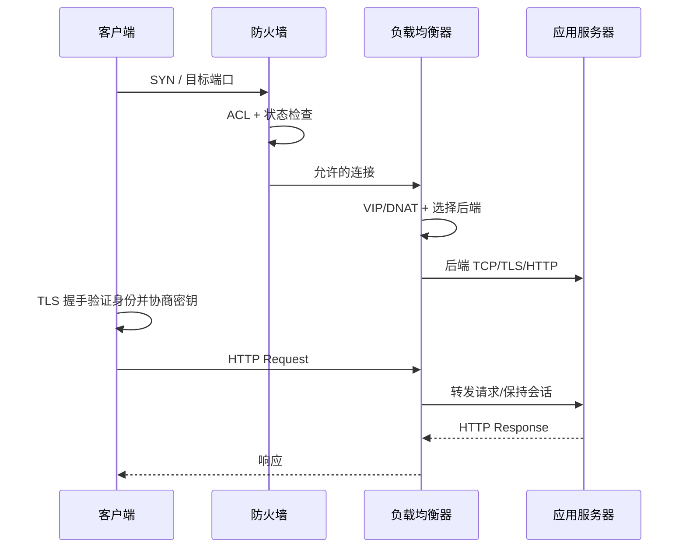
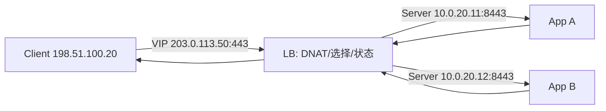

# 第3章　数据安全设计和负载均衡设计

> 第2章回答“包怎样到达”；本章进一步回答“什么通信可以到达、到达哪个服务实例、服务是否真的能工作”。安全与负载均衡共同管理状态：连接状态、NAT 状态、健康状态、TLS 会话状态和应用会话状态。

## 本章主线：一条 HTTPS 请求经过了什么

## 3.1　数据安全设计和负载均衡设计

### 3.1.1　通过端口号划分服务器进程

IP 地址定位一台主机，端口号把到达主机的数据交给某个传输层端点。一个 TCP 监听通常由协议、本地地址、本地端口和进程绑定；连接建立后再由源/目的地址与端口组成的五元组区分不同会话。

**第一性原理洞见。** 端口不是安全边界，只是“送给哪个接收队列”的索引。是否允许访问必须由防火墙、身份认证、应用授权和加密共同决定；打开 443 不代表应用就安全。

#### 3.1.1.1　传输层使用 TCP和UDP两种协议

TCP 提供面向连接的可靠字节流：序号、确认、重传、流量控制和拥塞控制共同让应用看到有序字节。UDP 只提供无连接的数据报发送，不保证到达、顺序或唯一性，但延迟更低、状态更少、可由应用自行定义重传/冗余/拥塞策略。

| 需求 | 更适合的起点 | 设计问题 |
|---|---|---|
| 文件、数据库、传统 Web | TCP | 连接数、窗口、重传、队头阻塞 |
| DNS 查询、实时媒体、探测 | UDP 或应用自定义 | 丢包、放大、重放、限速 |
| 现代 HTTP/3 | QUIC/UDP | 加密、拥塞控制、连接迁移 |

不能把 UDP 当成“无状态且安全”，也不能把 TCP 当成“应用一定收到”。RFC 9293 是当前整合后的 TCP 基础规范，强调 TCP 的基本可靠性与拥塞控制仍要和实现细节、补充算法一起理解（见 [RFC 9293: TCP](https://www.rfc-editor.org/rfc/rfc9293.html)）。

#### 3.1.1.2　TCP 的工作原理比较复杂

TCP 的复杂来自它要在不可靠网络上模拟可靠字节流。典型连接经历：

1. 三次握手交换初始序号和能力；
2. 发送方按序号发送数据，接收方用 ACK 确认已收到的连续区间；
3. 丢包可能由超时或重复 ACK 触发重传；
4. 接收窗口限制接收方缓存，拥塞窗口限制网络当前可承受的量；
5. FIN/RST 等状态完成有序关闭或异常终止。

发送速度近似受多个“闸门”共同限制：

$$
Throughput\lesssim\frac{min(cwnd,rwnd)}{RTT}
$$

其中 `cwnd` 是拥塞窗口，`rwnd` 是接收窗口。带宽高但 RTT 大时，窗口不足仍会限制吞吐；丢包重传又会降低有效吞吐。

**工程实践。** 看到“连接慢”要拆为 DNS、SYN、TLS、首字节、传输、服务处理；看 `SYN-SENT/SYN-RECV/ESTABLISHED/TIME-WAIT` 数量、重传、RTT、窗口和 RST 来源。不要只看 CPU 或接口利用率。

**我的创新理解。** TCP 连接不是一根永久的“管道”，而是双方和网络共同维护的动态信用额度。拥塞窗口表示网络暂时允许你占用多少资源；在高并发系统里，连接数、窗口、队列和重试会互相放大，必须把它们作为一个反馈系统调节。

#### 3.1.1.3　MTU 和MSS的差异在于对象层不同

MTU 是链路层一次可以承载的最大 IP 包大小；MSS 是 TCP 在建立连接时愿意接收的单个 TCP 负载大小。对典型 IPv4、无选项的 1500-byte Ethernet：

$$
MSS=MTU-IP\ Header-TCP\ Header=1500-20-20=1460\ bytes
$$

但 IPv6、TCP options、隧道、VPN、VXLAN 和不同链路会改变结果。MSS 只约束 TCP 数据段，不解决 UDP、ICMP 或路径中非 TCP 流量；MTU 不匹配还可能导致分片、黑洞或 ICMP Packet Too Big/Fragmentation Needed 被丢弃。

**工程做法。** 在端到端路径验证 PMTUD/PLPMTUD、隧道开销、ICMP 放行和 TCP MSS clamping；避免“全网随便改 MTU”。对大包传输和小包请求分别测试。

### 3.1.2　用防火墙守卫系统

防火墙把通信流映射为规则与决策：允许、拒绝、丢弃、记录或转发到代理/检测模块。好的防火墙设计首先定义信任边界和最小允许流，再选择状态跟踪、应用识别、认证和日志能力。

#### 3.1.2.1　基于连接进行控制

状态防火墙不仅看单个包，而是维护连接跟踪表。例如，内部主机发出的 TCP SYN 建立一个“期待回包”的状态，返回方向的 SYN/ACK 可以匹配；外部伪造一个没有对应状态的 ACK，则应被拒绝。UDP 没有握手，设备通常用五元组和超时建立伪状态。

状态表设计要考虑：

- 最大并发连接与每秒新建连接；
- TCP/UDP/TLS/应用各自的超时；
- 非对称路由和状态同步；
- NAT 映射与状态表的一致性；
- 连接关闭、RST、半开连接和资源耗尽。

#### 3.1.2.2　状态检测和包过滤之间的区别

无状态包过滤只根据源/目的地址、协议、端口、接口、方向等字段逐包判断，性能和可预测性好，但无法知道一个包是否属于合法已建立连接。状态检测会维护连接上下文，能更准确地放行返回流量，但会消耗状态内存、引入超时和同步问题。

**工程选择。** 基础 ACL 适合边界反欺骗、管理网限制和简单分段；状态防火墙适合有明确连接语义的服务边界；应用代理/WAF 适合需要理解 HTTP、身份、请求方法和内容的风险。每增加一层状态，就增加一个需要监控和排障的状态机。

#### 3.1.2.3　防火墙在不断进步

现代防火墙可能结合应用识别、TLS 解密、URL/内容策略、身份、入侵防御、沙箱、DNS 安全、微分段、云安全组和集中策略管理。能力越多，越要关注吞吐测试条件、证书私钥保护、误报、旁路、升级兼容和日志成本。

**第一性原理洞见。** 防火墙不是“越聪明越安全”，而是把“允许什么”变成可验证的决策。应用识别若无法解释命中原因、策略若无人维护、日志若无法关联到资产，额外功能反而会放大不确定性。

### 3.1.3　通过负载均衡器分散服务器的负荷

负载均衡器对外提供一个稳定的服务入口，把请求/连接映射到多个后端实例。它解决两类问题：并行处理能力和实例故障隔离。它不能自动解决数据库一致性、会话状态、慢依赖、容量不足或错误配置。

#### 3.1.3.1　目的 NAT是服务器负载均衡技术的基础

客户端访问 VIP，负载均衡器把目的地址转换为某个后端地址，再把返回流量转换回 VIP。根据模式不同，源地址可能保持，也可能被 SNAT 成负载均衡器地址；这会影响后端看到的客户端 IP、回程路由和状态对称性。

选择算法包括轮询、最少连接、加权、源地址/会话哈希、URL/请求路由等。算法应匹配请求成本和会话语义：请求成本差异很大时，简单轮询会让“看似均匀”变成延迟不均；有状态会话时要么共享会话，要么使用粘性/一致性哈希。

#### 3.1.3.2　通过健康检查监控服务器的状态

健康检查是负载均衡器做路由决策的证据。它可以是 TCP 连接、TLS 握手、HTTP 状态码、专用 `/healthz`、gRPC health 或业务依赖检查。端口能接受连接只证明进程还活着，不证明它能访问数据库、读取配置或正确返回用户请求。

健康判定通常有 interval、timeout、healthy/unhealthy threshold、draining 等状态。AWS ALB 文档明确说明：目标通过初始检查后才接收流量，注销目标会进入 draining 以完成在途请求（见 [AWS target group health checks](https://docs.aws.amazon.com/en_en/elasticloadbalancing/latest/application/target-group-health-checks.html) 和 [target groups](https://docs.aws.amazon.com/elasticloadbalancing/latest/application/load-balancer-target-groups.html)）。

**工程做法。** 把健康检查分为 liveness（进程是否活着）和 readiness（是否准备好接流量）；避免检查接口本身触发昂贵查询或级联依赖；记录失败原因、后端地址、状态转移和排空时间。

#### 3.1.3.3　熟练掌握可选功能

常用可选功能包括 TLS 终止/透传、HTTP 路由、连接复用、压缩、缓存、限流、WAF、会话保持、连接排空、主动/被动健康检查、PROXY protocol、日志采样和跨可用区分发。

每个选项都要问：它改变了哪一层的状态？谁负责证书/密钥？后端能否看到真实客户端？失败时是 fail-open 还是 fail-closed？是否改变重试次数？例如自动重试可能把一次后端失败放大成两次写操作，必须与幂等性一起设计。

## 3.2　从会话层到应用层的技术

### 3.2.1　HTTP 支撑着互联网

HTTP 把资源表示成请求与响应，并用方法、状态码、头字段和内容语义表达应用意图。它尽量保持无状态，使每个请求的语义可以独立理解；会话、认证和幂等性由 Cookie、Token、应用数据库或其他机制实现。

#### 3.2.1.1　HTTP/1.0 和HTTP/1.1的TCP连接用法大相径庭

HTTP/1.0 时代常见“一次请求一个 TCP 连接”，连接建立成本高；HTTP/1.1 默认支持 persistent connection，可复用一条 TCP 连接，并通过 `Host`、`Content-Length`、chunked 等机制区分消息边界。现代 HTTP/2 在一条 TCP 连接上多路复用，HTTP/3 则运行在 QUIC/UDP 上，减少 TCP 层队头阻塞并支持连接迁移。

工程上不要把“HTTP/1.1 keep-alive”与“应用一定无状态”混为一谈；连接复用是传输优化，会话状态仍是应用问题。HTTP 语义的现代统一描述见 [RFC 9110](https://www.rfc-editor.org/rfc/rfc9110.html)，QUIC 的基础规范见 [RFC 9000](https://www.rfc-editor.org/rfc/rfc9000.html)。

#### 3.2.1.2　HTTP 因请求和响应而得以成立

请求至少包含方法、目标、头字段和可选内容；响应包含状态码、头字段和可选内容。排障时把一次请求拆为：DNS、连接、TLS、请求是否到达、路由选择、应用处理、后端依赖、响应返回。

**实践分类。** `4xx` 通常提示客户端请求、认证或授权问题，但不能机械归因；`5xx` 通常提示服务端或依赖故障，也可能是代理把后端异常翻译出来。要将 HTTP 状态码、负载均衡日志、应用 trace ID 和后端日志关联。

### 3.2.2　用 SSL保护数据

“SSL”是历史名称，生产设计应以 TLS 1.2/1.3 和安全密码套件为准。TLS 的目标是机密性、完整性和端点认证；它不保证应用本身授权正确，也不防止已认证用户滥用。

#### 3.2.2.1　防止窃听、篡改和冒充

三类威胁对应三种能力：

- 加密保护机密性，旁观者无法直接读懂内容；
- AEAD/认证标签保护完整性，篡改会被发现；
- 证书链、域名验证和握手签名认证服务端身份，降低中间人冒充。

证书过期、域名不匹配、信任链缺失、私钥泄露和错误的终止点都会破坏目标。NIST 的 TLS 证书管理指南把证书库存、责任人、自动化、审计和过期监控视为生产体系的一部分（见 [NIST SP 1800-16](https://csrc.nist.gov/pubs/sp/1800/16/final)）。

#### 3.2.2.2　通过 SSL可以给各种各样的应用程序协议加密

TLS 是可承载协议之上的安全层：HTTPS 是 HTTP over TLS，数据库、LDAP、SMTP、消息队列等也可以使用 TLS。设计时要明确 TLS 终止位置：客户端端到负载均衡器、负载均衡器到后端，还是端到端透传；每一段的证书、信任、真实客户端地址和审计含义不同。

#### 3.2.2.3　SSL 使用混合加密方式进行加密

TLS 使用非对称密码做身份认证/密钥协商，再使用对称 AEAD 保护大量应用数据。非对称运算适合小量握手但成本高；对称加密适合高速数据流。TLS 1.3 的规范见 [RFC 8446](https://www.rfc-editor.org/rfc/rfc8446.html)，其中的握手和密钥派生设计也说明了为什么现代配置应优先支持前向保密。

#### 3.2.2.4　消息摘要是消息的概要

哈希函数把任意长度输入映射到固定长度摘要。它适合完整性比较、签名输入、密钥派生和内容寻址，但“哈希”本身不等于保密，也不等于认证；攻击者可以重新计算未认证的摘要。密码存储应使用专门的慢哈希/KDF，而不是直接使用通用 SHA。

#### 3.2.2.5　SSL 中执行着大量的处理

一次 TLS 连接涉及证书链验证、签名验证、密钥协商、随机数、密码套件、扩展、会话恢复、记录分片和 AEAD 加解密。高并发短连接会把握手成本放大，长连接会占用连接状态和内存。

**工程做法。** 监控握手失败原因、证书剩余有效期、协商版本/套件、TLS CPU、会话恢复率和后端重新加密成本；使用标准化配置与自动续期，不在业务高峰临时手工换证书。

#### 3.2.2.6　用客户端证书对客户端进行认证

双向 TLS（mTLS）要求客户端也提交证书，服务端通过信任 CA、证书用途、主题/SAN、吊销策略和映射规则认证客户端机器或服务身份。它适合服务到服务、设备接入和高敏感管理面，但证书签发、轮换、吊销和私钥保护成本高。

**我的洞见。** mTLS 解决的是“持有某个私钥的实体是谁”，不自动回答“它今天能做什么”。必须把证书身份映射到授权策略、租户和审计主体，并设计密钥轮换失败时的恢复路径。

### 3.2.3　用 FTP传输文件

FTP 把控制连接与数据连接分开，这个设计使它在 NAT、防火墙和负载均衡环境中比“单端口协议”更难处理。若业务没有强制兼容 FTP，现代系统通常优先考虑 SFTP、HTTPS 或对象存储，但遇到遗留系统仍要理解 FTP 的端口与方向。

#### 3.2.3.1　主动模式使用特定的端口

主动模式下，客户端通过控制连接连接服务器，服务器再从数据端口主动连接客户端指定的端口。这对客户端位于 NAT/防火墙之后很不友好，因为入站连接方向与用户直觉相反。

#### 3.2.3.2　被动模式改变使用的端口

被动模式下，客户端在控制连接中请求服务器提供一个数据端口，再由客户端主动连接服务器该端口。服务器需要配置可用端口范围，防火墙/NAT/负载均衡器要放行并正确改写地址。RFC 959 是 FTP 的基础规范（见 [RFC 959](https://www.rfc-editor.org/rfc/rfc959.html)）。

#### 3.2.3.3　FTP 就应该当作FTP去处理

不能只放行 TCP/21 就认为 FTP 已通；还要处理控制通道中的地址/端口协商、主动/被动模式、数据端口范围、TLS（FTPS）以及超时。深度检测设备若解析协议并改写端口，必须验证大文件、并发传输、断点续传和错误恢复。

**工程建议。** 对外文件交换优先迁移到有明确单连接语义和现代认证/加密的协议；若必须保留 FTP，隔离其网络、限制源地址、固定被动端口范围、全量审计并明确退出计划。

### 3.2.4　用 DNS解析名称

DNS 把人和应用使用的名称映射为地址及其他资源记录。它采用分层委派、缓存和 TTL，把一个全球问题拆成很多局部权威。DNS 设计的核心不是“查一条 A 记录”，而是缓存一致性、委派边界、故障转移和安全验证。

#### 3.2.4.1　用 UDP进行名称解析

普通查询通常使用 UDP 53，延迟低、无连接开销；响应过大、截断、DNSSEC 或特定实现需要时可能切换 TCP。客户端通常先问递归解析器，解析器再利用缓存、根、TLD 和权威服务器完成递归/迭代查询。

#### 3.2.4.2　用 TCP进行区域传输

权威 DNS 之间的区域传输通常使用 TCP，以可靠地传送完整区域数据；AXFR/IXFR、SOA 序列号和刷新策略共同保证从服务器跟上主服务器。DNS 的概念/设施和实现细节分别见 [RFC 1034](https://www.rfc-editor.org/rfc/rfc1034.html) 与 [RFC 1035](https://www.rfc-editor.org/rfc/rfc1035.html)。

**工程实践。** 递归解析器与权威服务器分离；限制区域传输来源；监控 TTL、SERVFAIL、NXDOMAIN、缓存命中、权威健康和 DNSSEC/证书状态。DNS 负载均衡要考虑缓存带来的滞后，不能把低 TTL 当成瞬时切换保证。

## 3.3　数据安全设计与负载均衡设计

### 3.3.1　数据安全设计

安全设计的产物应是“允许集合 + 证据 + 处理失败的方式”，而不是一堆设备功能名称。

#### 3.3.1.1　整理出真正需要的通信

用通信流矩阵记录源、目的、协议、端口、方向、环境、数据敏感度、是否需要双向、是否需要固定源地址和责任人。先以默认拒绝为基线，再逐条证明允许的必要性；对临时放行设置过期时间。

#### 3.3.1.2　通过多级防御提高安全系数

多级防御包括边界过滤、网络分段、状态防火墙、应用认证授权、TLS、主机防火墙、最小权限、日志检测、备份和演练。NIST 的证书管理示例把 DMZ、应用区和更高信任的安全区作为不同层次，说明“分区 + 责任 + 监控”比单一边界设备更接近现实（见 [NIST logical architecture](https://www.nccoe.nist.gov/publication/1800-16/VolD/index.html)）。

**我的创新理解。** 防御层次的价值不在于每层都能挡住攻击，而在于每层提供不同的失败证据：网络层告诉你流量从哪里来，TLS 告诉你身份和完整性，应用层告诉你是否有权执行，日志告诉你时间线。

#### 3.3.1.3　默认启动的服务应控制在最小范围内

关闭不需要的监听端口、管理协议、默认账户和调试接口；管理面走独立网络并限制源 IP/身份。任何“默认开放”都应有责任人、用途、风险和下线日期。

### 3.3.2　负载均衡设计

负载均衡设计要同时满足分发效率、故障隔离、会话语义、可观测性和可恢复性。

#### 3.3.2.1　要高效地均衡负载

先按请求成本选择算法：均匀短请求可轮询，连接存活时间差异大可最少连接，后端能力不同可加权，必须保持会话时用一致性哈希或共享状态。跨可用区分发要把网络成本和故障域纳入目标函数。

有效容量不是后端实例数量简单相加：

$$
C_{service}=min(C_{LB},\sum_i C_{backend,i},C_{dependency},C_{network})
$$

任何一个依赖成为瓶颈，新增服务器都不会线性提升服务能力。

#### 3.3.2.2　启用哪些可选功能

按业务选择 TLS 终止、HTTP 路由、连接复用、缓存、压缩、限流、WAF、会话保持、连接排空、自动扩缩和故障转移。每个功能都应有测试：正常、后端摘除、证书轮换、连接中断、重试、慢请求、全后端不健康。

## 章末：安全与负载均衡验收清单

- TCP/UDP/QUIC 的适用边界、超时和容量已说明；
- MTU、MSS、隧道、ICMP 和 PMTUD 已端到端验证；
- 防火墙规则以通信流为单位，默认拒绝、状态、日志和回滚清晰；
- NAT 前后地址、回程路径、连接追踪、源端口和真实客户端地址可解释；
- 健康检查能区分 liveness/readiness，包含阈值、排空和失败原因；
- TLS 证书、私钥、信任链、终止点、续期和 mTLS 授权有负责人；
- HTTP、FTP、DNS 的特殊连接/端口行为已在策略和测试中体现；
- 负载均衡算法与会话、请求成本、故障域和依赖容量匹配。

## 本章参考资料

- [RFC 9293: TCP](https://www.rfc-editor.org/rfc/rfc9293.html)：TCP 状态、可靠性、拥塞控制与实现边界。
- [RFC 8446: TLS 1.3](https://www.rfc-editor.org/rfc/rfc8446.html)：现代 TLS 握手、密钥与记录保护。
- [RFC 9110: HTTP Semantics](https://www.rfc-editor.org/rfc/rfc9110.html)：HTTP 请求/响应、无状态语义和连接使用。
- [RFC 9000: QUIC](https://www.rfc-editor.org/rfc/rfc9000.html)：现代 UDP-based、加密且具拥塞控制的传输。
- [RFC 959: FTP](https://www.rfc-editor.org/rfc/rfc959.html)：控制连接/数据连接模型。
- [RFC 1034](https://www.rfc-editor.org/rfc/rfc1034.html) 与 [RFC 1035](https://www.rfc-editor.org/rfc/rfc1035.html)：DNS 分层、查询与区域传输基础。
- [AWS Elastic Load Balancing health checks](https://docs.aws.amazon.com/en_en/elasticloadbalancing/latest/application/target-group-health-checks.html)：把健康判定、阈值与 connection draining 落到生产行为。
- [NIST SP 800-41 firewall guidance](https://csrc.nist.gov/pubs/sp/800/41/r1/final)：防火墙策略、部署与管理的安全实践。
