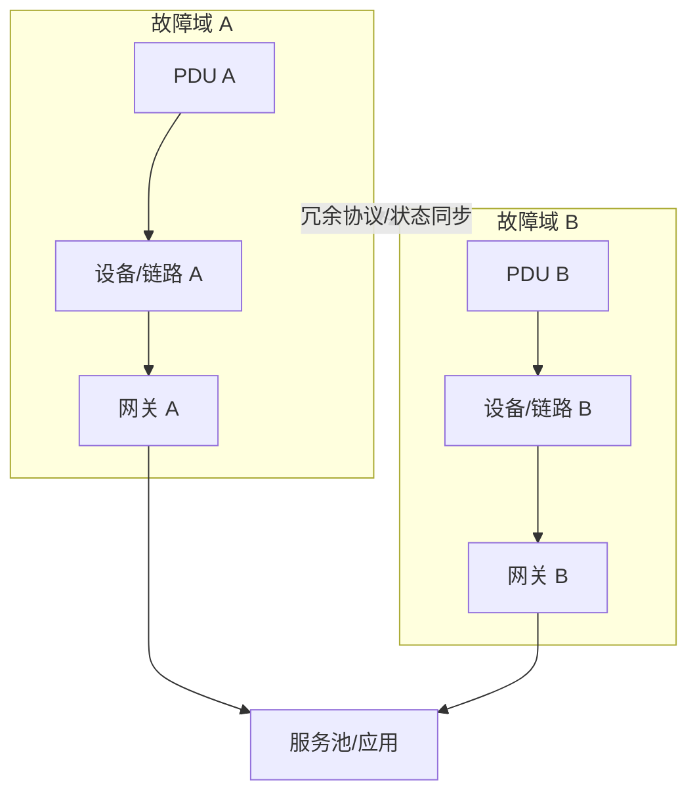

# 第4章　高可用性设计

> 高可用性不是“复制设备”，而是让系统在明确的故障假设下继续提供业务，并在可接受的时间内收敛。第1章提供物理独立性，第2章提供多路径，第3章提供状态与服务池，本章把它们组合成可演练的故障处理系统。

## 本章主线：从单点到故障域

高可用设计先写故障模型：单端口、单光纤、单网卡、单交换机、单上行、单电源、单机房、软件升级、配置错误、状态同步中断，哪些必须无感，哪些允许短暂中断，哪些由人工介入。没有故障模型，“双机”只是一种外观。

## 4.1　冗余技术

### 4.1.1　物理层的冗余技术

物理冗余的目标是避免单一物理组件成为业务路径的唯一承载。链路、网卡、设备和电源需要尽可能跨越不同的故障域；但冗余组件越多，协商、状态同步和配置一致性越复杂。

#### 4.1.1.1　将多条物理链路集结成一条逻辑链路

链路聚合（LAG/EtherChannel/LACP）把多条物理链路对上层呈现为一个逻辑接口。它同时提供成员链路故障容忍和一定的总带宽扩展。

关键限制是：多数实现按流哈希选择成员，单个五元组通常不会同时使用多条成员链路。因此两条 10G 链路的聚合容量可能是 20G，但一个大 TCP 流仍可能被限制在单条 10G 上。

LACP 的价值还在于协商两端成员关系，减少把两条独立链路错误接成环路的风险。Linux bonding 文档强调要配置链路监测（如 `miimon` 或 ARP monitoring），否则成员故障可能造成严重性能退化（见 [Linux Ethernet Bonding](https://docs.kernel.org/networking/bonding.html)）。

**工程做法。** 统一两端模式、系统 ID、速率/双工、哈希策略、最小活动成员数和故障告警；验证单成员断开、对端设备重启、流量重新哈希、满负载与回切。

#### 4.1.1.2　将多个物理网卡集结成一个逻辑网卡

服务器 NIC teaming/bonding 把多个网卡交给操作系统或驱动管理。常见模式包括 active-backup、LACP、负载分担等。选择取决于交换机是否跨设备支持聚合、是否追求带宽、是否允许 MAC 漂移以及应用对源 MAC/路径的假设。

active-backup 的单链路吞吐通常不叠加，但跨交换机故障域比较容易；LACP 可提供聚合带宽，但要求交换机端的聚合语义正确。不能只在服务器上创建 bond，而不检查交换机的 LAG 状态和故障探测。

**第一性原理洞见。** NIC 聚合同时解决两个不同问题：路径冗余和容量聚合。前者关心“坏一条还能不能活”，后者关心“多个独立流能否共享”；用一个模式同时追求两者，常常会忽略跨交换机、哈希和检测盲区。

#### 4.1.1.3　将多台物理设备集结成一台逻辑设备

设备级冗余可以通过堆叠、虚拟机箱、MLAG/vPC/MC-LAG、双机热备或控制面集群实现。上层看到一个逻辑设备或一个逻辑端点，物理故障由系统自动切换。

设计必须区分：

- **控制面是否合并**：一台主控还是双主控；
- **数据面是否 active-active**：两台是否同时转发；
- **状态是否同步**：MAC、ARP、NAT、会话、策略和配置是否同步；
- **故障如何判定**：链路、心跳、BFD、管理面还是业务探针；
- **脑裂如何避免**：仲裁、优先级、保留机制和人工恢复。

设备“逻辑合一”降低管理复杂度，但也可能形成共同的软件升级点、共同配置错误点和共同控制面故障点。高可用不等于把所有组件塞进一个更大的逻辑盒子。

#### 4.1.1.4　当上行链路中断时，让下行链路也随之中断

如果接入交换机失去所有上行，但下行端口仍保持 up，服务器会继续把包交给一个实际上没有出口的设备，形成黑洞。上行链路跟踪（link/object tracking）可以在失去必要上行时关闭或降级下行端口，让服务器/NIC 触发切换到另一条路径。

**工程做法。** 定义“必要上行”的最小集合，而不是任意一条上行；测试只断上行、只断心跳、只断管理面和同时断多条链路，观察服务器是否真的切换，而不是只看交换机端口状态。

### 4.1.2　数据链路层的冗余技术

二层冗余最危险的对象是环路。广播和未知单播会在环里持续复制，MAC 学习会来回抖动，最终耗尽链路与设备资源。STP 用控制协议在冗余拓扑中选出一棵无环转发树，故障后重新计算。

#### 4.1.2.1　STP 的关键在于根网桥和阻塞端口

STP 通过 BPDU 选出根桥，再让每个非根交换机选择到根桥的最佳路径；多余路径进入阻塞/非转发状态。根桥的位置决定流量的树形方向，根桥选错会让所有 VLAN 的流量绕远或集中到不合适的链路。

**工程做法。** 显式规划根桥与备根，调整桥优先级和端口成本；画出每个 VLAN/实例的根端口、指定端口和阻塞端口；不要只依赖默认优先级。

#### 4.1.2.2　STP 有三种

从学习重点看，可以区分：

- **传统 STP（802.1D）**：收敛较慢，兼容性广；
- **RSTP（802.1w）**：通过端口角色、握手和快速状态迁移缩短收敛；
- **MSTP（802.1s）**：把多个 VLAN 映射到较少的生成树实例，降低实例数量并可做路径分担。

厂商还可能提供 PVST/RPVST 等实现。选择时关注 VLAN 数量、互操作、收敛目标、边缘端口类型和运维能力。高可用并非把所有生成树实例都开满；实例越多，CPU、状态和排障成本越高。

#### 4.1.2.3　同时启用多项可选功能

常见保护包括 PortFast/edge（终端端口快速进入转发）、BPDU Guard（边缘端口收到 BPDU 就保护性关闭）、Root Guard（阻止下游抢根）、Loop Guard（防止单向 BPDU 丢失导致错误转发）、UDLD（检测单向光纤）和 storm control。

这些功能有前提：PortFast 只能给真正的终端边缘口，BPDU Guard 误用在交换机互联口会造成大范围中断；storm control 阈值过低会误伤正常组播/广播。所有保护都要配套告警、恢复流程和变更审计。

#### 4.1.2.4　利用 BPDU切断桥接环路

BPDU 是 STP 的控制消息。交换机通过比较根桥 ID、路径成本、发送桥/端口 ID 来决定拓扑角色；当收到更优 BPDU，会重新选择路径。BPDU 保护机制利用“某个端口本应是边缘端口”这一假设，把异常控制消息当作可能的环路信号。

**我的创新理解。** STP 的本质不是“阻塞一条线”，而是给二层广播域建立一个可证明无环的转发不变量。冗余链路的带宽在稳定状态可能被闲置，但它换来的是拓扑改变时的可恢复路径；如果业务需要全部链路同时转发，应优先考虑三层 ECMP 或经过验证的多机聚合。

### 4.1.3　网络层的冗余技术

三层冗余可以把故障切换交给终端默认网关协议和动态路由协议。与二层 STP 不同，三层多路径可以让多条路径同时参与转发，但需要处理路由收敛、邻居、ECMP、非对称和状态设备。

#### 4.1.3.1　FHRP

FHRP（First Hop Redundancy Protocol）让多个路由器共同提供一个虚拟默认网关地址/MAC。终端只配置虚拟网关；主设备负责转发，备设备在检测到故障后接管。VRRP 的标准描述了 Master/Backup 选举、虚拟 IP 和故障转移目标（见 [RFC 5798: VRRPv3](https://www.rfc-editor.org/rfc/rfc5798.html)）。

切换不只取决于网关接口是否 up。主设备可能还活着，但上游已断；因此应结合对象跟踪、BFD、路由可达性或业务探针降低黑洞风险。ARP/GARP 刷新、MAC 学习和状态防火墙也会影响实际中断时间。

#### 4.1.3.2　利用路由协议确保通往上层设备的路径

通过 OSPF/IS-IS/BGP、静态备路由、ECMP 或 BFD，可以让下游知道上层设备的多个路径。设计时明确路由优先级、收敛计时器、探测层级和路径是否真正物理独立。

**工程做法。** 对“链路断但接口仍 up”“远端黑洞”“单向故障”“控制面存活但业务不通”分别测试；把收敛时间拆成检测、协议计算、FIB 安装、邻居刷新、应用重试五段，而不是只给一个模糊秒数。

### 4.1.4　从传输层到应用层的冗余技术

越靠近应用，冗余越依赖状态和业务语义。复制一个 IP 很容易，复制 NAT 会话、TLS 会话、连接、Cookie、缓存和事务却不容易。

#### 4.1.4.1　防火墙的冗余技术

防火墙 HA 常见 active/standby 或 active/active。切换时需要同步配置、连接状态、NAT 表、ARP/MAC 归属、策略版本和健康状态。若只同步配置而不同步连接状态，已有长连接可能中断；若双活设备共享状态不完整，非对称流量会被误判为异常。

**工程做法。** 设计心跳链路与状态同步链路的独立性；给出选主、脑裂、强制切换、升级和回切步骤；监控同步延迟、状态差异和两端策略版本。

#### 4.1.4.2　负载均衡器的冗余技术

负载均衡器冗余涉及 VIP、ARP/GARP、连接表、会话保持、TLS 证书、健康检查和后端选择状态。active/standby 简单易解释，但切换时连接可能重建；active/active 可利用资源，却更依赖一致性哈希、状态同步和流量对称。

**工程提醒。** 负载均衡器切换后的“服务可用”必须由真实请求验证：DNS、TCP、TLS、HTTP、登录、写入和长连接各自可能表现不同。

## 4.2　高可用性设计

### 4.2.1　高可用性设计

可用性目标必须翻译成故障覆盖范围和切换时间。常用近似关系是：

$$
Availability=\frac{MTBF}{MTBF+MTTR}
$$

提升可用性不仅靠提高 MTBF，也靠缩短检测、定位、切换和恢复的 MTTR。若切换依赖人工确认，自动协议再快也不能把人工时间消掉。

#### 4.2.1.1　串联式结构

串联式结构把防火墙、负载均衡、核心/汇聚、接入和服务器放在明确的前后路径上。优点是通信流容易解释，安全策略集中，适合边界清晰的服务；缺点是每个中间层都可能成为串联可用性乘法项。

**设计方法。** 对每个串联节点做双机、双电源、双上联和状态同步；用可用性公式识别真正最脆弱的环节；如果某层无法提供独立冗余，就把它作为明确的风险接受项，而不是藏在图里。

#### 4.2.1.2　单路并联式结构

单路并联式把多个服务器/服务实例挂在共享的二层/三层接入上，由负载均衡或客户端选择实例。扩容容易，单实例故障可以摘除；但共享交换机、网关、存储、数据库和负载均衡器仍可能是共同故障点。

**工程做法。** 为服务实例规定可加入、可摘除、可排空、可回滚生命周期；将状态外置或复制；把共享组件按故障域分散，并为每个依赖设置独立健康检查与容量预算。

### 4.2.2　理清通信流

高可用设计的审查对象不是设备图，而是每一条通信流在故障前后经过什么路径、源/目的地址是否变化、状态是否仍匹配、返回路径是否一致。

#### 4.2.2.1　串联式结构

以客户端访问 HTTPS 为例，稳定路径可能是：客户端 VLAN → 默认网关 → 防火墙 A/B → 负载均衡 A/B → 应用 VLAN → 服务器。逐项写出：

1. 默认网关如何选主、故障如何 GARP；
2. 防火墙如何建立状态、切换是否同步 NAT；
3. 负载均衡如何选择后端、是否 TLS 终止；
4. 服务器返回包走哪一个网关；
5. 日志在哪一层记录原始客户端地址和转换后地址。

**故障演练。** 分别断客户端上联、网关主机、防火墙状态同步、负载均衡主机、应用节点和返回路径，记录每一段的检测时间、切换时间、连接结果、应用重试和日志关联。

#### 4.2.2.2　单路并联式结构

并联服务的流量图要写清楚“每个流属于哪个实例”：负载均衡按五元组/请求选择，连接生命周期内通常保持同一实例；实例被标记不健康后，新流不再进入，已有流进入排空或失败；客户端重试可能被分配到另一个实例。

需要特别审查：

- Cookie/Token/会话是否可跨实例验证；
- 数据库写入是否幂等、是否存在重复重试；
- 长连接/WebSocket/gRPC stream 如何迁移；
- 全部实例不健康时是 fail-open、fail-closed 还是降级页；
- 共享缓存、消息队列、DNS 和证书是否也是冗余的。

**我的洞见。** 可用性是端到端属性，不是网络设备属性。一个“切换成功”的 VIP，如果 TLS 证书错误、应用没有会话、数据库连接池耗尽或返回路径被防火墙丢弃，用户仍然认为服务中断。

## 章末：高可用性验收清单

- 故障模型、RTO/RPO、业务中断容忍度明确；
- LAG/NIC/设备冗余分别验证成员、状态、脑裂和回切；
- STP 根、阻塞端口、边缘保护和 BPDU 行为可解释；
- FHRP、动态路由、BFD/跟踪与上游可达性联动；
- 防火墙/LB 的 NAT、连接、会话、证书和健康状态同步已测试；
- 物理冗余跨越不同链路、设备、电源和机房故障域；
- 每条关键通信流有正常、单故障、双故障和恢复后的验证记录；
- 演练测量的是用户请求成功率与恢复时间，而不只是端口状态。

## 本章参考资料

- [Linux Ethernet Bonding documentation](https://docs.kernel.org/networking/bonding.html)：理解 bonding 模式、成员检测与 LACP 相关运行约束。
- [RFC 5798: VRRPv3](https://www.rfc-editor.org/rfc/rfc5798.html)：理解虚拟默认网关、Master/Backup 与故障接管。
- [RFC 2328: OSPF Version 2](https://www.rfc-editor.org/rfc/rfc2328.html)：理解动态路由邻居、链路状态和路径收敛。
- [Cisco Catalyst switching guide](https://www.cisco.com/c/en/us/td/docs/switches/lan/catalyst2960/software/release/12-2_40_se/configuration/guide/scg.pdf)：查阅 RSTP/MSTP、BPDU 防护、HSRP 与链路聚合等厂商落地实践。
- [AWS load balancer health and draining behavior](https://docs.aws.amazon.com/en_en/elasticloadbalancing/latest/application/load-balancer-target-groups.html)：把“不健康摘除”和“已有连接排空”区分开。
