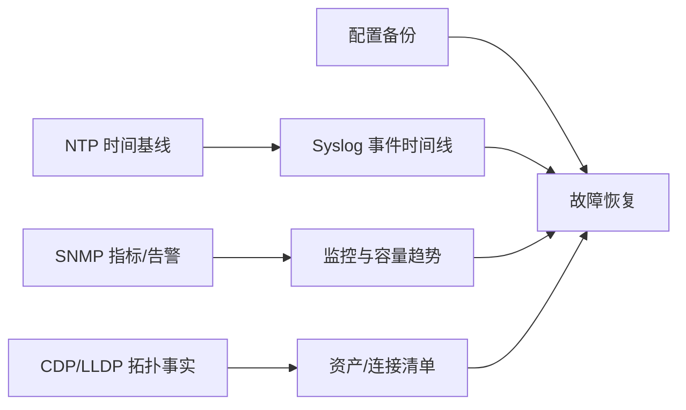
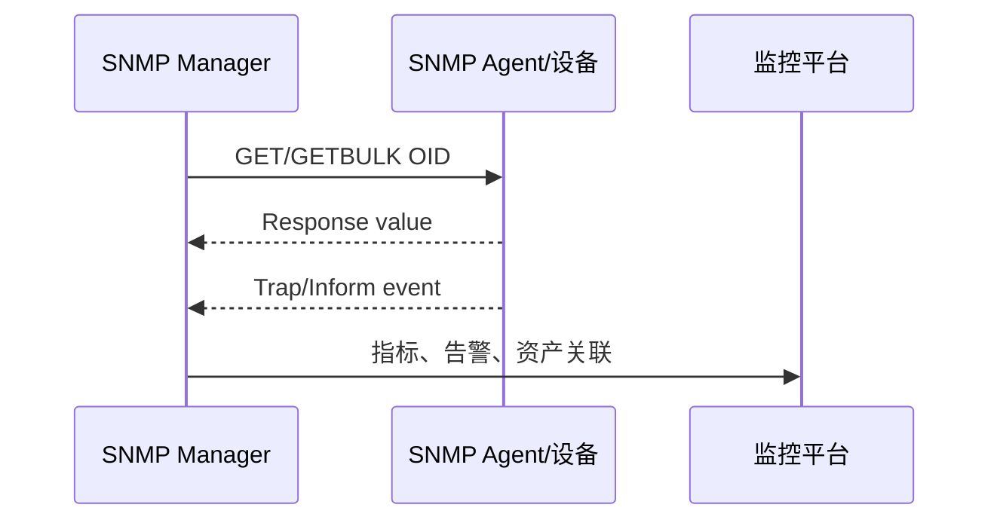

# 第5章　管理设计

> 管理设计把“网络会不会工作”变成“我们能否知道它正在怎样工作、能否在故障中做出正确改变”。时间、指标、事件、拓扑、命名、标签、凭据和备份共同构成运维的可恢复记忆。

## 本章主线：把网络变成可观察、可解释、可恢复的系统

如果设备的时间不一致，日志无法排序；如果没有指标，事件无法判断影响；如果没有拓扑，端口告警无法映射到业务；如果没有配置备份，恢复只能靠记忆。管理设计不是“多装一个监控系统”，而是让这些证据互相校验。

## 5.1　管理技术

### 5.1.1　用 NTP同步时间

分布式系统没有天然的共同时钟，但故障排查需要把客户端、交换机、防火墙、负载均衡、服务器和日志平台的事件排到同一时间线上。NTP 通过层级化时间源、时间戳交换和时钟驯服，把各节点的时钟偏差控制在可接受范围。

#### NTP 的工作原理非常简单

客户端和服务器交换四个时间戳：客户端发送 $t_1$，服务器收到 $t_2$，服务器发送 $t_3$，客户端收到 $t_4$。常见近似为：

$$
offset=\frac{(t_2-t_1)+(t_3-t_4)}{2}
$$

$$
delay=(t_4-t_1)-(t_3-t_2)
$$

客户端根据多次测量、延迟、抖动和服务器层级选择较可信的源，并逐步调整本地时钟，避免突然跳变破坏应用。RFC 5905 解释了 NTPv4 的层级、算法和容错目标；它也说明了为什么 NTP 选择基于时间戳的 UDP 交换，而不是简单套 TCP 重试（见 [RFC 5905](https://www.rfc-editor.org/rfc/rfc5905.html)）。

**工程实践。** 生产环境至少配置多个独立上游时间源，内部提供分层 NTP；监控 offset、root distance、stratum、reachability、频率调整和时间源切换。认证、访问控制和放大防护也要纳入设计；时间服务器本身应有冗余和独立供电。

**第一性原理洞见。** NTP 的目标不是让所有机器显示同一个数字，而是让“事件顺序和时间差”足够可信。对日志关联而言，稳定、可测量的偏差比偶尔跳到精确时间更有价值。

### 5.1.2　用 SNMP检测故障

SNMP 把设备的可管理对象组织成 MIB/OID，管理器读取指标或接收通知，代理负责把设备内部状态映射为这些对象。它适合接口状态、字节/包计数器、CPU、内存、温度、电源、风扇、BGP 邻居和错误计数等结构化监控。

#### 5.1.2.1　通过 SNMP管理器和SNMP代理交换信息

管理器发起查询，代理暴露设备的管理对象；MIB 规定对象的语义、类型、访问权限和单位。不要把原始 counter 当成速率，接口利用率通常需要两次采样：

$$
rate=\frac{counter(t_2)-counter(t_1)}{t_2-t_1}
$$

还要处理 counter 回绕、设备重启、32/64 位计数器和接口速率变化。RFC 3411 把 SNMP 框架拆成消息处理、安全、访问控制、管理器、代理和 MIB 等部分；这正是生产部署要分别治理的原因（见 [RFC 3411](https://www.rfc-editor.org/rfc/rfc3411.html)）。

#### 5.1.2.2　熟练掌握三种运作模式

可以把生产中最常用的三种运作模式理解为：

1. **轮询（polling）**：管理器定期 GET/GETBULK，适合趋势、容量和状态快照；优点是节奏可控，缺点是检测延迟和轮询压力。
2. **Trap**：设备主动发送事件通知，适合链路 down、温度过高、邻居变化；优点是及时，缺点是 UDP 通知可能丢失、重复或缺少上下文。
3. **Inform**：设备主动发送通知并等待管理器确认，可靠性更高但会占用更多状态和重试资源。

SNMP SET 可以远程改变配置，生产环境通常严格限制或关闭，避免把只读监控通道变成高权限变更通道。SNMPv3 提供认证、完整性、隐私和访问控制，优先于明文 community string 的 v1/v2c；RFC 3418 也提醒非安全环境下的读写操作可能对网络造成负面影响（见 [RFC 3418](https://www.rfc-editor.org/rfc/rfc3418.html)）。

#### 5.1.2.3　限制源 IP地址

SNMP 监听端口应只接受监控平台、自动化控制器或指定管理网段的源地址；出站 Trap/Inform 也应限制目标。源 IP 限制不是唯一安全措施，还需 SNMPv3 用户/认证/加密、视图（只允许访问必要 OID）、最小权限、速率限制和管理 VLAN/VRF 隔离。

**工程实践。** 为不同环境、团队和用途使用不同 SNMPv3 凭据；禁止把默认 community 写入模板；在监控平台上记录设备、SNMP 用户、视图和最后成功采集时间。

### 5.1.3　用 Syslog检测故障

Syslog 记录离散事件：接口 flap、STP 拓扑变化、BGP 邻居、认证失败、配置变更、温度/电源告警、策略命中和系统重启。它和 SNMP 的关系可以理解为：SNMP 更像“当前状态与连续指标”，Syslog 更像“状态发生改变时留下的叙述”。

#### Syslog 的工作原理非常简单

设备生成带 facility、severity、时间、主机、进程、消息和结构化字段的事件，发送到本地或集中日志接收器，再由平台解析、索引、告警和长期保存。RFC 5424 规定了更结构化的 Syslog 消息模型，并指出传统 UDP Syslog 缺少可靠性，生产上应考虑 TLS 传输（见 [RFC 5424](https://www.rfc-editor.org/rfc/rfc5424.html)）。

**工程实践。** 集中日志至少保留原始事件、接收时间、设备时间、设备 ID、接口/策略/OID/会话关联字段；用 NTP 统一时间；设置严重级别到告警动作的映射；对高频重复事件做聚合但保留计数和首次/最后时间。日志系统也要有容量、断链缓存、权限、加密和恢复设计。

**我的洞见。** 日志不是“越多越好”。没有上下文的海量消息会掩盖真正事件；好的日志能够让工程师在不登录设备的情况下回答“哪个对象、何时、发生了什么、影响范围、设备采取了什么动作”。

### 5.1.4　传递设备信息

邻居发现协议把设备/端口的本地事实传播给直接相邻设备。它对自动生成拓扑、验证端口映射、发现错误接线、核对设备能力很有帮助，但广播出去的设备名、管理地址、平台和能力也可能成为信息泄露。

#### 5.1.4.1　CDP

CDP 是 Cisco 设备常用的专有邻居发现协议，能够报告设备 ID、端口、平台、能力、地址和版本等。它适合 Cisco 环境中的快速排障，但跨厂商互操作性有限；不应把它当成安全认证或唯一资产来源。

**工程做法。** 只在可信管理/基础设施端口启用；终端、访客和不受控网络关闭或限制；把 CDP 结果与端口表、LLDP、交换机 MAC 表和资产系统交叉验证。

#### 5.1.4.2　LLDP

LLDP 是厂商无关的链路层发现协议，使用 TLV 传递 chassis ID、port ID、系统名、能力、管理地址、VLAN、PoE 和聚合信息等。Juniper 的英文文档明确说明 LLDP 基于 IEEE 802.1AB，是厂商中立的邻居发现方法（见 [Juniper LLDP overview](https://www.juniper.net/documentation/us/en/software/junos/multicast-l2/topics/concept/layer-2-services-lldp-overview.html)）。

**工程实践。** 用 LLDP 自动发现“设计端口 vs 实际端口”，但给邻居记录设置 TTL，并在设备重启、拓扑变化和链路聚合变更时刷新。对服务器、交换机、虚拟交换机的 LLDP 能力差异做好兼容测试。

#### 5.1.4.3　注意 CDP和LLDP的数据安全问题

邻居信息可能暴露主机名、管理地址、平台、软件版本、VLAN 和能力。攻击者在接入端口监听或伪造 TLV，可能获得侦察信息；因此要按信任边界启用，限制管理面访问，避免在不受控端口发布过多管理信息，并把发现数据视为辅助证据而非认证依据。

## 5.2　管理设计

### 5.2.1　确定主机名

主机名应让人一眼看出位置、角色、环境和编号，例如 `dc1-prod-core-a`、`dc2-stg-lb-02`。规则必须唯一、稳定、短且适合 DNS、日志、监控和自动化；不要把会频繁变化的业务名称写进设备身份。

**工程做法。** 同一资产在主机名、DNS、IPAM、监控、备份和工单中使用同一个资产 ID；变更主机名要考虑证书 SAN、日志解析、SNMP sysName、LLDP/CDP、自动化清单和告警规则。

### 5.2.2　通过标签管理连接

标签把不可见的“线缆空间关系”变成可读信息。它应同时支持实施、排障、迁移、回收和审计，不能只在新装时有用。

#### 5.2.2.1　线缆标签

线缆两端都应标注唯一编号、本端端口和远端端口；光纤还应标明纤芯/对、A/B、模块或配线架位置。标签要耐温、耐磨、不遮挡插拔，编号格式要能被扫描或录入资产系统。

**工程实践。** 标签内容不要只写“服务器1”，因为服务器可能搬迁；使用稳定资产 ID + 端口编号，并保存历史连接关系。

#### 5.2.2.2　本体标签

设备本体标签包含资产编号、主机名、机柜/U 位、管理地址、序列号、供电域、责任人和维护窗口。设备替换时复制“资产语义”，不要复制旧序列号或旧故障记录。

### 5.2.3　设计密码

密码设计应围绕身份、权限、秘密生命周期和紧急恢复：个人账号优先，集中认证与 RBAC；唯一强密码由密码管理器保管；启用 SSH/HTTPS/SNMPv3 等安全协议；禁用默认账号、Telnet、明文 community；对 break-glass 账号双人审批、密封存储和使用告警。

**第一性原理洞见。** 密码不是“记住的字符串”，而是一个可撤销的访问授权。设计的成功标准是：知道谁在什么时间以什么权限做了什么，人员离职/轮换时能快速撤销，设备故障时仍能安全恢复。

### 5.2.4　管理设置信息

配置文件包含地址、路由、策略、密钥引用、SNMP 用户、证书和设备特性，是生产资产的一部分。配置管理要区分“能重建系统的声明性配置”和“运行时状态”，并记录版本、来源、差异、审批和回滚。

#### 5.2.4.1　在备份设计中应定义时机、方式和保存地点

至少定义三个维度：

- **时机**：初始上线、重大变更前后、定期周期、版本升级前、故障后；
- **方式**：自动拉取/设备推送、加密、版本化、差异与完整备份、配置与状态分离；
- **地点**：与生产网络隔离的备份系统、不同可用区/机房、离线或不可变副本，并限制读取权限。

备份不是快照越多越好。应保留足够的版本、明确保留周期、验证文件可解密可解析，并定期做恢复演练。对于密码、私钥和 token，使用密钥管理系统或加密仓库，禁止把明文凭据提交到普通 Git 仓库。

#### 5.2.4.2　发生故障时执行恢复处理

恢复流程应可按清单执行：

1. 确认故障范围、业务优先级和安全边界；
2. 取得最后一个已验证的配置版本与设备兼容版本；
3. 选择替代设备/端口/电源/管理路径；
4. 先恢复基础连通、时间、管理和日志，再恢复路由、安全、NAT/LB 和业务策略；
5. 用正常流、故障流、监控和日志验证；
6. 记录临时偏差，完成回写、复盘和备份。

**工程实践。** 每种关键设备做“裸机/替代设备恢复”演练；验证不仅是配置能加载，还包括证书私钥、对象 ID、接口编号、VLAN、路由邻居、状态同步和告警是否恢复。恢复目标应由 RTO/RPO 约束，而不是由“备份文件存在”来定义。

## 章末：管理设计验收清单

- 所有设备时钟源、偏差、层级和 NTP 失败行为已验证；
- SNMP 轮询、Trap/Inform、SNMPv3 用户/视图/源 IP 限制已配置；
- counter 到速率的采样、回绕、重启和接口速率变化有处理；
- Syslog 有统一时间、结构化字段、加密传输、缓存、告警和保留策略；
- CDP/LLDP 发现结果能与端口表、资产和设计拓扑交叉验证；
- 主机名、资产 ID、端口/线缆/本体标签格式统一；
- 管理账号、密码、密钥、证书和 break-glass 访问可审计可撤销；
- 配置备份定义了时机、方式、地点、加密、版本、保留和恢复演练；
- 故障恢复步骤先恢复基础管理证据，再恢复业务路径，并有可验证的完成标准。

## 本章参考资料

- [RFC 5905: NTPv4](https://www.rfc-editor.org/rfc/rfc5905.html)：时间同步协议、层级与算法。
- [RFC 3411: SNMP architecture](https://www.rfc-editor.org/rfc/rfc3411.html)：管理器、代理、安全、访问控制与 MIB 的架构。
- [RFC 3418: SNMP MIB](https://www.rfc-editor.org/rfc/rfc3418.html)：管理对象与读写安全注意事项。
- [RFC 5424: Syslog](https://www.rfc-editor.org/rfc/rfc5424.html)：结构化事件、时间与传输安全。
- [Juniper LLDP overview](https://www.juniper.net/documentation/us/en/software/junos/multicast-l2/topics/concept/layer-2-services-lldp-overview.html)：LLDP 的厂商中立发现、TLV 与拓扑用途。
- [NIST TLS certificate management guide](https://csrc.nist.gov/pubs/sp/1800/16/final)：把证书/密钥库存、责任和持续监控纳入管理设计。
