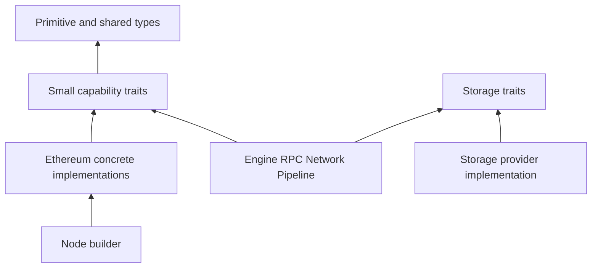

# 00. Workspace 与编译 crate 地图

## 1. Cargo package、crate 与 module

- **Package**：一个 `Cargo.toml` 定义的编译/发布单元。
- **Crate**：一次 Rust 编译的单元，可能是 library 或 binary target。
- **Module**：crate 内由 `mod` 组织的命名空间，不独立编译。
- **Feature**：选择性开启依赖和代码；会改变编译图，不能当运行时开关理解。

Reth 大量使用“小 crate + 明确 trait”控制架构侵蚀。代价是类型跳转和 feature 组合复杂。

## 2. 核心 crate 树

下面覆盖生产代码的编译模块；示例和测试 package 在文末单列。

```text
binary
├── reth
└── reth-bb

foundation
├── reth-ethereum-primitives
├── reth-ethereum-forks
├── reth-chainspec
├── reth-errors
├── reth-fs-util
└── reth-config

node composition
├── reth-node-types
├── reth-node-api
├── reth-node-core
├── reth-node-builder
├── reth-node-ethereum
├── reth-node-events
├── reth-node-metrics
├── reth-node-ethstats
├── reth-cli
├── reth-cli-commands
├── reth-cli-runner
├── reth-cli-util
└── reth-ethereum-cli

engine and chain state
├── reth-engine-primitives
├── reth-engine-tree
├── reth-engine-local
├── reth-engine-util
├── reth-execution-cache
├── reth-invalid-block-hooks
└── reth-chain-state

sync and historical import
├── reth-stages-types
├── reth-stages-api
├── reth-stages
├── reth-era
├── reth-era-utils
└── reth-era-downloader

execution and consensus
├── reth-evm
├── reth-evm-ethereum
├── reth-revm
├── reth-execution-types
├── reth-execution-errors
├── reth-consensus
├── reth-consensus-common
├── reth-consensus-debug-client
└── reth-ethereum-consensus

storage
├── reth-storage-api
├── reth-storage-errors
├── reth-db-api
├── reth-db-models
├── reth-db
├── reth-db-common
├── reth-provider
├── reth-storage-rpc-provider
├── reth-static-file-types
├── reth-static-file
├── reth-nippy-jar
├── reth-libmdbx
└── reth-mdbx-sys

trie
├── reth-trie-common
├── reth-trie
├── reth-trie-db
├── reth-trie-sparse
└── reth-trie-parallel

network
├── reth-network-types
├── reth-network-api
├── reth-network
├── reth-network-p2p
├── reth-network-peers
├── reth-net-banlist
├── reth-net-nat
├── reth-discv4
├── reth-discv5
├── reth-dns-discovery
├── reth-ecies
├── reth-eth-wire-types
├── reth-eth-wire
└── reth-downloaders

transaction and payload
├── reth-transaction-pool
├── reth-payload-primitives
├── reth-payload-builder-primitives
├── reth-payload-builder
├── reth-basic-payload-builder
├── reth-payload-validator
├── reth-payload-util
├── reth-ethereum-engine-primitives
└── reth-ethereum-payload-builder

rpc
├── reth-rpc-api
├── reth-rpc-server-types
├── reth-rpc-eth-types
├── reth-rpc-convert
├── reth-rpc-eth-api
├── reth-rpc-engine-api
├── reth-rpc-builder
├── reth-rpc-layer
├── reth-rpc
├── reth-ipc
└── reth-rpc-e2e-tests

extensions and operations
├── reth-exex-types
├── reth-exex
├── reth-exex-test-utils
├── reth-prune-types
├── reth-prune
├── reth-etl
├── reth-tasks
├── reth-tokio-util
├── reth-metrics
├── reth-tracing
└── reth-tracing-otlp
```

`reth-ethereum` 是方便下游使用的 meta crate，主要重导出常用 Ethereum/Reth 类型。它不是一个新的运行时子系统。

## 3. 依赖方向的意图



理想状态下，高层服务依赖 API crate，不依赖具体后端。现实中为了泛型、性能和历史演进会出现交叉，因此判断架构边界要同时看：

1. `Cargo.toml` dependencies；
2. `src/lib.rs` public exports；
3. trait 定义位置；
4. builder 中的 concrete impl 选择。

## 4. 常见拆 crate 理由

| 形式 | 示例 | 理由 |
|---|---|---|
| `*-types` | stages-types、static-file-types | 共享数据结构，不引入重实现依赖 |
| `*-api` | storage-api、network-api、rpc-api | 依赖倒置，让消费者只看能力 |
| `*-primitives` | engine/payload primitives | 稳定协议边界和 associated types |
| `*-common` | consensus-common、trie-common | 多实现共享的纯算法/类型 |
| `*-builder` | node-builder、rpc-builder | 集中装配和生命周期顺序 |
| `*-test-utils` | exex/e2e/testing utils | 避免生产 crate 普遍携带测试依赖 |
| meta crate | reth-ethereum | 改善下游 import 体验 |

语言无关思想：**按变化原因拆分**。协议类型、抽象接口、具体实现和装配代码变化频率不同，不应绑在一个巨型模块中。

## 5. Feature 的风险

- feature 是 additive；两个上层依赖启用的 feature 会合并。
- optional dependency 可能把 `std`、serde、test utilities 或昂贵后端带入构建。
- `cfg` 分支可能只在某些 CI job 编译，局部 `cargo check` 不足以证明全 feature 正确。
- 公共类型若随 feature 改变，会让下游组合爆炸。

Feature 组合可由下列命令展开：

```bash
cargo tree -p <package> -e features
cargo metadata --no-deps --format-version 1
```

然后辨认 default feature、no_std 边界、test-only dependency 和 native dependency。

## 6. 二进制并非架构中心

`bin/reth/src/main.rs` 只选择 EthereumNode 并启动 builder。真正架构中心是组合根：

```text
CLI config
  -> NodeBuilder
  -> EthereumNode component builders
  -> launch context
  -> handles/tasks/services
```

这使相同 library crate 可服务 custom node、测试节点、数据库工具和嵌入式用法。

## 7. Examples 和 testing packages

workspace 中约三十个 example package 分别演示 custom EVM、hardfork、engine types、payload builder、RPC/middleware、RLPx subprotocol、network、DB、ExEx、state root 和 beacon sidecar。它们不是玩具目录，而是最短集成契约。

测试基础设施包括：

- `reth-testing-utils`：共享 primitive/provider/generator helper；
- `reth-e2e-test-utils`：启动真实组件的 e2e harness；
- `ef-tests`、`ef-test-runner`：Ethereum Foundation fixture 执行；
- `reth-rpc-e2e-tests`：RPC 行为回归。

测试体系的源码分析见 [[16-testing-examples-workflow|测试、Benchmark、Fuzz 与 Examples]]。

### 7.1 Workspace 中的示例叶节点

这些也是独立 Cargo package，只是它们的职责是演示组合方式，而不是提供生产 library：

```text
custom-hardforks
example-beacon-api-sidecar-fetcher
example-beacon-api-sse
example-bsc-p2p
example-custom-auth-http-middleware
example-custom-beacon-withdrawals
example-custom-dev-node
example-custom-engine-types
example-custom-evm
example-custom-inspector
example-custom-node-components
example-custom-payload-builder
example-custom-rlpx-subprotocol
example-custom-rpc-middleware
example-custom-state-root
example-db-access
example-exex-test
example-full-contract-state
example-manual-p2p
example-network
example-network-proxy
example-network-txpool
example-node-builder-api
example-node-custom-rpc
example-node-event-hooks
example-polygon-p2p
example-precompile-cache
example-rpc-db
example-txpool-tracing
exex-subscription
```

测试叶节点是 `ef-tests`、`ef-test-runner` 和 `reth-testing-utils`/`reth-e2e-test-utils` 等前述测试 crate。至此，当前 141 个 workspace package 都能在本页的生产树、示例列表或测试列表中找到归属。

## 8. 源码切片：crate 边界怎样进入类型系统

```rust
// crates/node/types/src/lib.rs
pub trait NodeTypes: Clone + Debug + Send + Sync + Unpin + 'static {
    type Primitives: NodePrimitives;
    type ChainSpec: EthChainSpec<
        Header = <Self::Primitives as NodePrimitives>::BlockHeader,
    >;
    type Storage: Default + Send + Sync + Unpin + Debug + 'static;
    type Payload: PayloadTypes<
        BuiltPayload: BuiltPayload<Primitives = Self::Primitives>,
    >;
}
```

这段代码把四个独立 crate 族绑定起来：`ChainSpec::Header` 必须就是 primitives 的 header，built payload 使用的 primitives 也必须相同。若 custom chain 把 Ethereum header 与另一条链的 payload 拼接，错误会发生在编译期，而不是同步数小时后才在序列化处爆炸。

crate 拆分因此不是目录美学。`*-api` 负责声明能力，`*-types` 负责传递数据，具体 crate 实现能力，`node-builder` 用上述关联类型证明它们属于同一个协议族。
