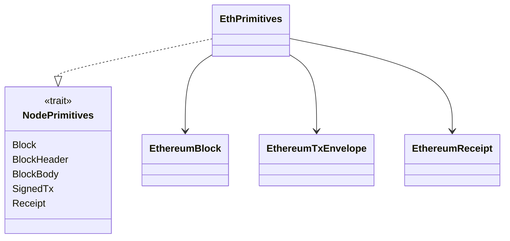
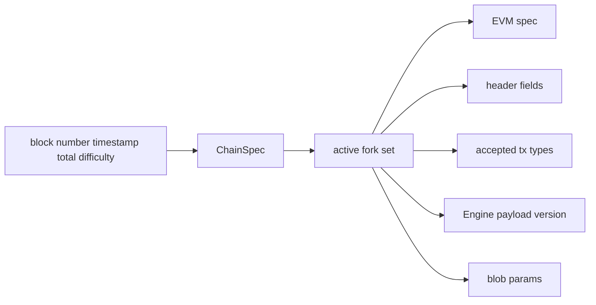

# 01. Primitives、ChainSpec 与 Hardfork

## 1. 模块边界

| Crate | 作用 |
|---|---|
| `reth-ethereum-primitives` | Ethereum block、transaction、receipt 与 `EthPrimitives` 类型族 |
| `reth-ethereum-forks` | hardfork 名称、激活条件、EIP-2124 fork id |
| `reth-chainspec` | genesis、chain identity、fork schedule、链参数查询 |
| `reth-ethereum-engine-primitives` | Engine API 下 Ethereum payload/attributes/built payload 类型 |
| `reth-engine-primitives` | 链无关 Engine trait、message、event、forkchoice tracker |
| `reth-payload-primitives` | payload job 共享类型与状态 |

## 2. 为什么需要“类型族”

`EthPrimitives` 实现 `NodePrimitives`，把 block/header/body/signed transaction/receipt 绑定成一致集合。高层泛型只携带 `N: NodePrimitives`，再用关联类型取出成员。



如果每个函数独立泛型化 `Block, Header, Tx, Receipt`，可能把不兼容链的类型拼在一起。类型族把兼容性约束提升到编译期。

其他语言中的等价思想：

- Go：一个包含构造/转换方法的 protocol family interface，但关联类型表达力较弱；
- TypeScript：带多个 type parameter 的统一 context；
- C++：concept + associated aliases；
- Java：密封接口或统一 generic context。

## 3. Sealed、Recovered 与普通数据

Ethereum 数据在处理过程中逐步获得保证：

```text
decoded header
  -> sealed header: 已计算/携带可信 hash 绑定
signed transaction
  -> recovered transaction: 已恢复 sender
block
  -> sealed block
  -> recovered block
  -> executed block: 附 execution outcome/trie data
```

使用不同 wrapper 类型的价值是防止重复计算以及误把“尚未验证/恢复”的值传给要求更强保证的函数。这是 **make invalid states unrepresentable**。

但要注意：`Sealed` 通常只说明对象与 hash 绑定，不等于通过共识验证；类型名提供局部保证，不能脑补额外性质。

## 4. Transaction envelope 与 EIP-2718

Ethereum transaction 是 typed envelope：legacy 与 EIP-2930、1559、4844 等类型有不同字段。统一 enum/envelope 允许：

- 解码时按 type byte 分派；
- 公共方法读取 nonce、gas limit、fee cap；
- 只有支持某能力的类型才返回 blob hashes/access list；
- 保留未知/未来类型的升级边界。

语言无关思想：协议持续演进时，使用带 discriminant 的封闭和可版本化 envelope，不要向一个永久增长的 struct 塞大量互斥 `optional` 字段。

## 5. ChainSpec 是规则上下文

ChainSpec 通常包含：

- chain id 与 genesis；
- hardfork schedule；
- terminal total difficulty / Merge 相关参数；
- base-fee、blob 等 fork 参数；
- bootnodes 或链级 metadata 的关联信息。

高层代码通过 `EthChainSpec`、`EthereumHardforks` 等 trait 查询，而不是匹配 `mainnet` 字符串。



## 6. Fork 激活的三个坐标

历史 Ethereum fork 可能按：

- block number；
- timestamp；
- total difficulty / Merge 条件。

因此不能抽象成单一 `height >= fork_height`。调用者必须提供正确上下文；尤其“构造下一块”时使用的是 next block timestamp/number。

### 边界测试模板

对每项 fork rule 至少测试：

```text
activation - 1: 新字段/交易/opcode 被拒绝或未启用
activation:     精确切换
activation + 1: 保持启用
```

还要测试 timestamp 与 block number 不一致的伪造上下文，防止调用错 API。

## 7. Fork ID 与网络兼容性

EIP-2124 fork id 让 peer 在握手时快速判断历史/未来 fork 兼容性。它是筛选协议兼容 peer 的摘要，不是区块有效性证明。

算法思想：把长版本历史压缩为 `fork_hash + next`，使节点既能识别共同历史，又能表达下一预期升级。类似滚动 schema fingerprint。

## 8. 编码边界

- P2P/交易/区块常涉及 RLP 和 typed envelope。
- Engine API 是 JSON/SSZ 语义映射。
- 数据库存储可使用 Compact/NippyJar，不等同网络编码。
- hash 必须针对规范规定的编码计算，不能对 Rust 内存布局求 hash。

任何优化编码前必须先回答：这是共识/网络格式还是内部格式？共识格式必须字节完全一致；内部格式可以迁移但需版本管理。

## 9. 源码切片：`EthPrimitives` 如何封闭协议类型族

```rust
// crates/ethereum/primitives/src/lib.rs
pub struct EthPrimitives;

impl reth_primitives_traits::NodePrimitives for EthPrimitives {
    type Block = crate::Block;
    type BlockHeader = alloy_consensus::Header;
    type BlockBody = crate::BlockBody;
    type SignedTx = crate::TransactionSigned;
    type Receipt = crate::Receipt;
}
```

`EthPrimitives` 本身没有字段，它是一个零大小的类型级配置。它的价值是建立等式约束：只要上层泛型参数是 `EthPrimitives`，block、header、transaction 和 receipt 就不可能来自不同协议实现。

这种设计比到处写五个泛型参数更强，因为五个独立参数只说明“各自满足 trait”，无法说明“彼此属于同一套链规则”。在 Go 中可用一个集中 factory/context 返回整套类型，在 C++ 中可用 traits class，在 TypeScript 中可用统一的泛型 protocol context 保留同一思想。

## 10. 源码切片：Hardfork 条件为何是 trait

`EthBeaconConsensus` 等调用者要求 `ChainSpec: EthereumHardforks`，然后使用类似 `is_shanghai_active_at_timestamp(header.timestamp())` 的方法。调用代码只依赖“能回答 fork 是否激活”的能力，不依赖 mainnet 常量。

这使规则选择满足两点：

1. 同一个 block timestamp 在 validator、EVM config、txpool 和 payload builder 中得到同一 fork 结论；
2. custom chain 可以替换激活计划，但不能绕过调用方要求的规则查询接口。

Hardfork trait 因而是规则上下文的依赖注入，不是为了泛型而泛型。
