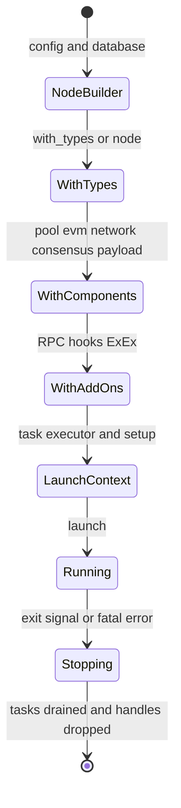
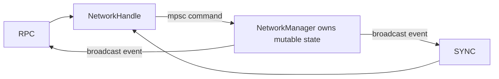

# 02. Node 类型、Builder 与生命周期

## 1. 相关 crate

`reth-node-types` 定义类型族，`reth-node-api` 聚合节点能力，`reth-node-core` 保存 CLI args/config/dirs，`reth-node-builder` 负责装配和启动，`reth-node-ethereum` 提供 Ethereum concrete builders。CLI crates 只负责把用户输入变成 `NodeConfig`。

## 2. 三层配置

```text
NodeTypes
  描述 Primitives / ChainSpec / Storage / Payload 是什么

NodeComponents
  描述 Pool / Evm / Consensus / Network / PayloadBuilder 的运行时实例

AddOns
  描述 RPC、Engine API、middleware、hooks、ExEx 等外围服务
```

类型定义与对象实例分开非常重要：前者用于编译期证明兼容，后者持有 socket、channel、DB handle 等运行时资源。

## 3. Builder 状态迁移



实际泛型名字会比图复杂，但核心是 type-state：只有处于完整状态的 builder 才具备 `launch()` 方法。

## 4. LaunchContext 是逐步累积的依赖容器

启动过程需要按顺序得到：

1. datadir/config/chain spec；
2. MDBX、RocksDB、static-file provider；
3. genesis 和数据库一致性检查；
4. blockchain provider/canonical in-memory state；
5. network、pool、EVM、consensus；
6. pipeline/backfill、engine tree、payload service；
7. RPC/Engine API/metrics/ExEx；
8. 统一 `NodeHandle`。

Launch context 的 attachment/type-state 使后续步骤只有在前置资源已存在时才能调用。

## 5. 组件 builder 而不是直接实例

`EthereumNode::components()` 返回 pool、executor、payload、network、consensus builder。原因是实例化需要启动期上下文：provider、task executor、head、chain spec、config 等此时才完整。

语言无关模式：保存 `Factory<Context, Component>`，到 composition root 中统一实例化。这比全局 singleton 或从任意模块读取配置更易测试。

## 6. Handle 与所有权

启动后，完整服务状态常由后台 task 拥有，对外暴露 cloneable handle：



优点：

- 状态修改串行化；
- handle clone 不复制底层状态；
- service 可以隐藏内部锁和状态机；
- 测试可替换为 noop/mock handle。

风险：channel 饱和、receiver 退出、请求取消和 shutdown 顺序必须明确。

## 7. Hooks 与 AddOns

Builder 提供不同生命周期 hook，例如组件初始化后、RPC 启动前后、节点启动完成等。Hook 应满足：

- 清楚是否可阻塞启动；
- 返回错误是否终止节点；
- 不持有短生命周期引用到后台；
- 不绕过共识/存储不变量直接修改内部状态。

AddOns 适合外围能力，替换共识关键组件则应通过 typed component builder，使编译器检查完整约束。

## 8. Shutdown 是架构的一部分

一个安全关闭大致需要：

1. 停止接收新外部工作；
2. 通知长期任务退出；
3. 完成或取消 payload/proof/download 子任务；
4. flush/commit 可恢复进度；
5. 停止 RPC/network listener；
6. 汇总 task error 并让 `NodeHandle` 完成。

仅 drop 顶层对象不一定安全，因为 `Arc` 和 clone handle 可能延长资源生命。Launch 实现因此把 exit future 和 critical task 失败统一传播给 `NodeHandle`。

## 9. 设计思想

- **Composition root**：具体实现选择集中在 `EthereumNode`。
- **Dependency inversion**：组件依赖 provider/network trait，不自己打开数据库或 socket。
- **Type-state**：非法初始化序列无法编译。
- **Structured lifecycle**：NodeHandle 聚合任务退出，而不是 detached task 无限存活。
- **Open core**：核心默认安全，扩展通过 add-ons/hooks/examples 注入。

## 10. 源码切片：Ethereum 组合根

```rust
// crates/ethereum/node/src/node.rs
ComponentsBuilder::default()
    .node_types::<Node>()
    .pool(EthereumPoolBuilder::default())
    .executor(EthereumExecutorBuilder::default())
    .payload(BasicPayloadServiceBuilder::default())
    .network(EthereumNetworkBuilder::default())
    .consensus(EthereumConsensusBuilder::default())
```

每个方法不仅保存值，还改变返回类型中的 builder 参数。最终类型完整记录了 pool、payload、network、executor 和 consensus 的具体实现。`launch()` 的 `where` 约束会继续证明这些 builder 产出的关联类型与 `Node::Types` 一致。

## 11. 源码切片：CLI 与组合根的断点

```rust
// crates/cli/commands/src/node.rs
let database = init_db(db_path.clone(), self.db.database_args())?
    .with_metrics_if(self.db.metrics_enabled());

let builder = NodeBuilder::new(node_config)
    .with_database(database)
    .with_launch_context(ctx.task_executor);

launcher.entrypoint(builder, ext).await
```

CLI 只做三件事：把文本参数变成 `NodeConfig`、打开外部数据库资源、提供 task executor。它不直接创建 network manager 或 txpool。具体组件选择留在 EthereumNode，启动顺序留在 launcher。

语言无关的关键不是链式 API，而是三个责任边界：**配置解析不拥有业务策略，组合根集中选择实现，生命周期控制器集中处理启动和退出**。
