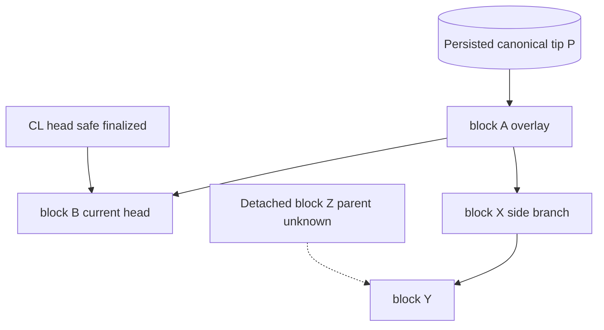
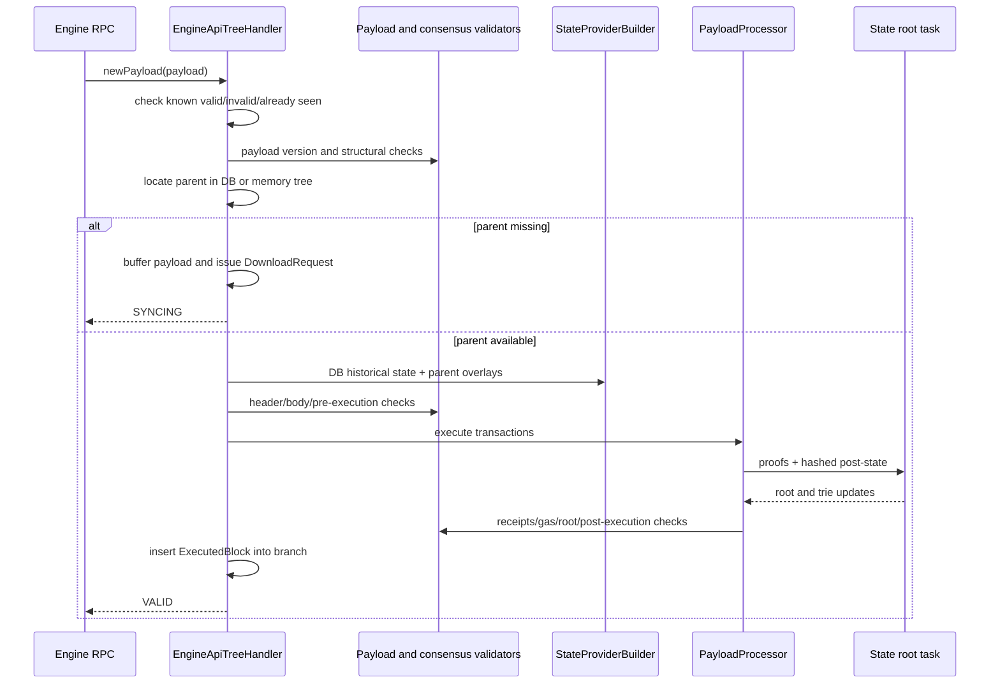
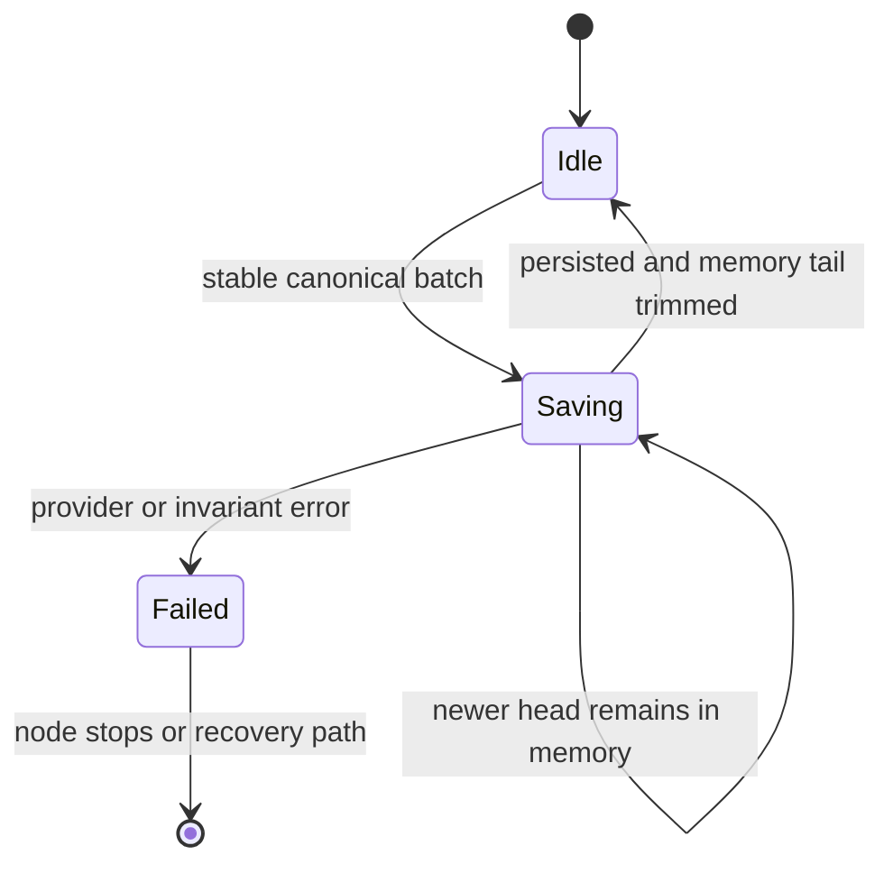

# 03. Engine Tree、Chain State 与持久化协调

## 1. 模块责任

| Crate | 核心责任 |
|---|---|
| `reth-engine-primitives` | EngineTypes、validator、message、event、forkchoice tracker |
| `reth-engine-tree` | `newPayload`/FCU 状态机、分叉树、backfill、download、persistence |
| `reth-chain-state` | canonical in-memory chain、notification、state overlay、preserved sparse trie |
| `reth-execution-cache` | payload 执行状态缓存与 cache metrics |
| `reth-engine-local` | 无外部 CL 场景的本地 payload attributes 驱动 |
| `reth-invalid-block-hooks` | 无效区块诊断扩展，不改变有效性结果 |

## 2. Engine API 是控制协议

CL 不把数据库交给 EL；它发送意图：

- `newPayload`：验证一个候选 payload，并报告 `VALID`、`INVALID` 或 `SYNCING`。
- `forkchoiceUpdated`：指定 head/safe/finalized，必要时要求基于 head 开始构块。
- `getPayload`：取回先前构块任务的当前最佳结果。

三种 payload status 是协议状态，不是普通错误码：

```text
VALID    = 已有完整上下文并完成执行层验证
INVALID  = 已证明违反执行层规则，可携带 latestValidHash
SYNCING  = 上下文不足，尚不能作有效性结论
```

把“未知”与“无效”分开是分布式系统的基本原则。错误地把 unknown 当 invalid 会破坏可用性；反过来会破坏安全性。

## 3. TreeState 的数据模型

Tree 同时维护：

- 已执行但可能尚未 canonical/persisted 的多个分支；
- canonical block 的内存尾部；
- detached block buffer；
- invalid header ancestry cache；
- forkchoice head/safe/finalized tracker；
- state trie overlays 与 changeset cache；
- persistence in-flight 状态。



区块号不足以标识状态；所有 overlay/cache 关键路径必须包含 block hash，因为同高度可有多个分支。

## 4. `newPayload` 深入流程



### 4.1 Already-seen 快路径

相同 payload 可能被重复提交。重复执行会浪费大量 CPU/IO，因此 tree 查询 known block/cache。但快路径必须返回与首次验证一致的 status，并维护 Engine API timing/metric 语义。

### 4.2 Parent state 组合

如果 parent 已持久化，直接取 historical/latest provider；如果 parent 位于内存分支，则：

```text
persisted base state
  + executed block overlay 1
  + executed block overlay 2
  = parent state view
```

这是 copy-on-write view，不应把 side branch 提前写进 canonical state。

### 4.3 Detached buffer

父块缺失时缓存 child，但必须有容量限制和淘汰策略，否则恶意 peer/CL 输入可以用随机 parent hash 耗尽内存。父块到达后再尝试连接 descendants。

## 5. Forkchoice 与 canonicalization

收到新 head 后，tree 找到旧 canonical head 与新 head 的共同祖先：

```text
old: A - B - C - D
new: A - B - X - Y
              ^ common ancestor B

revert: D, C
commit: X, Y
```

`NewCanonicalChain` 事件应携带 commit/revert 信息，而不仅是“新高度 Y”。下游交易池、ExEx、subscription 必须知道哪些旧块被撤销。

safe/finalized 是 CL 给出的标签；EL 要验证它们与已知 ancestry 一致。finalized 可驱动持久化/prune 决策，但不能自动等价为“所有历史服务都不再需要数据”。

## 6. Persistence 状态机

内存 tree 与 DB writer 速度不同。Persistence state 需要表达：

- 当前是否有 batch 正在写；
- 哪些 blocks 已提交给持久化任务；
- 完成结果对应哪个 tip；
- 失败是否 fatal；
- canonical head 在写入期间再次变化怎么办。



不能让两个 writer 无序提交重叠 canonical range。常见做法是单 in-flight persistence job，加明确 completed event。

## 7. Backfill 决策

Engine tree 擅长少量近头 blocks；大缺口逐块处理会扩大内存和 per-block overhead。超过阈值时发起 pipeline backfill：

1. 暂停/约束 tree 推进；
2. pipeline 同步到目标附近；
3. 接收 backfill completion/checkpoint；
4. 重建 canonical in-memory 基线；
5. 继续处理 buffer/新 FCU。

这是一种 **dual-mode state machine**：吞吐模式与低延迟模式共享同一持久化事实，但控制器不同。

## 8. Invalid ancestry cache

如果 block X 已证明 invalid，其 descendants 无需再次执行。Cache 将 hash 映射到 invalid ancestor/latest valid 信息。

必须限制容量，并避免仅因下载失败/状态缺失就写入 invalid cache。只有确定性 validation failure 才能污染该缓存。

## 9. Preserved sparse trie 与 execution cache

相邻区块触碰状态高度重叠，重复从 DB 构造 proof 很昂贵。Reth 可保留 sparse trie/cache 跨块复用，但 reorg 时必须：

- 确认 cache 属于正确 parent hash；
- 回滚或丢弃分叉污染；
- 对 changed prefix 精确失效；
- 设置容量/保留窗口。

缓存正确性优先于命中率。最危险 bug 是返回“格式合法但属于错误分支”的状态。

## 10. 语言无关设计思想

- speculative execution：先在隔离 overlay 执行，选择后 commit。
- tri-state validation：有效/无效/未知分离。
- single-writer state machine：复杂 tree 由一个 handler 拥有。
- explicit canonical diff：重组是一等事件，不是覆盖 head 指针。
- bounded orphan buffer：对失序输入容忍但资源有界。
- two-speed processing：历史吞吐与实时延迟采用不同算法。

## 11. 源码切片：历史状态与内存 overlay 的组合

```rust
// crates/engine/tree/src/tree/mod.rs
pub fn build(&self) -> ProviderResult<StateProviderBox> {
    let mut provider = self.provider_factory.state_by_block_hash(self.historical)?;
    if let Some(overlay) = self.overlay.clone() {
        provider = Box::new(MemoryOverlayStateProvider::new(provider, overlay))
    }
    Ok(provider)
}
```

`historical` 指向已经持久化、可按 hash 重建的祖先状态；`overlay` 是从该祖先到目标 parent 的 `ExecutedBlock` 序列。查询顺序由 overlay 覆盖底层 provider，因此 side branch 可以完整执行，却不会写 canonical DB。

这段代码是 engine tree 最核心的隔离机制：分叉状态不是数据库快照复制，而是共享稳定底座并叠加小差量。其空间成本与近期变化量相关，而不是与全局状态大小相关。

## 12. 源码切片：双速同步的明确边界

```rust
pub(crate) const MIN_BLOCKS_FOR_PIPELINE_RUN: u64 = EPOCH_SLOTS;
const CHANGESET_CACHE_RETENTION_BLOCKS: u64 = 64;
```

第一个常量让“大于一个 epoch 的缺口”进入 pipeline backfill；tree 保持对近期分叉的低延迟处理。第二个常量给 changeset cache 保留 reorg 缓冲，即使某些 L2 没有可靠 finalized 信号也不会立即失去回退材料。

这是两个控制面的分界：不是让同一个算法兼顾所有尺度，而是用共同 canonical checkpoint 在吞吐模式和低延迟模式间切换。
