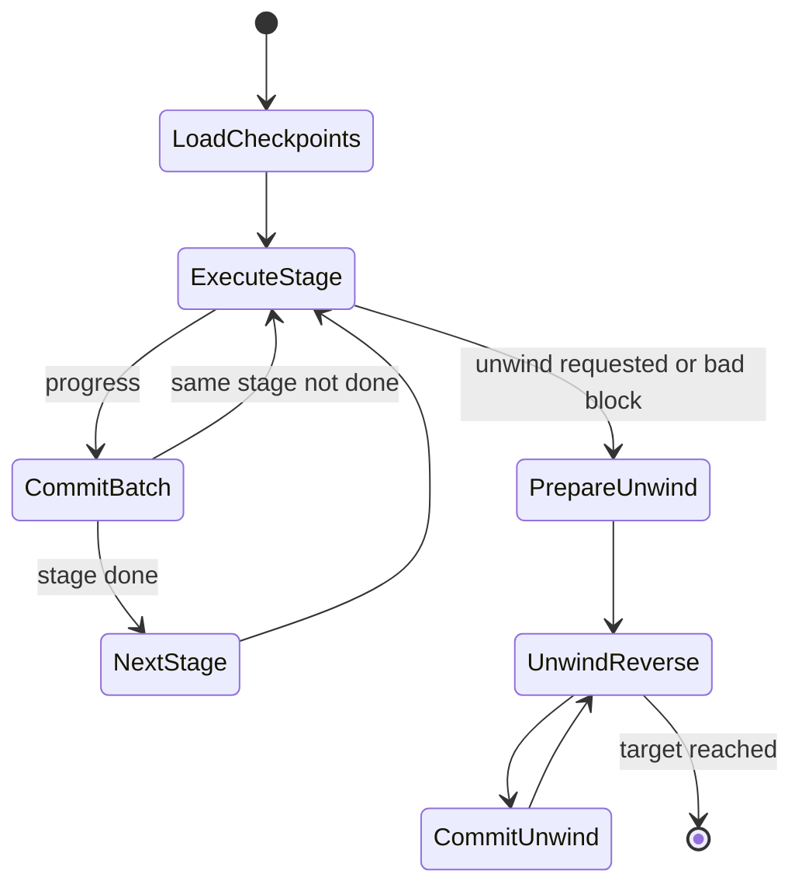

# 04. Staged Sync、Pipeline 与 ERA 历史导入

## 1. 相关 crate

- `reth-stages-types`：StageId、checkpoint、目标与进度类型。
- `reth-stages-api`：Stage trait、Pipeline、事件、错误和 metrics。
- `reth-stages`：headers、bodies、execution、hashing、merkle、history 等具体 stage。
- `reth-downloaders`：P2P/file header/body 下载实现。
- `reth-era`、`reth-era-utils`、`reth-era-downloader`：历史归档格式、校验和下载流。
- `reth-etl`：超内存批量排序/合并工具。

## 2. Stage 契约

一个 stage 不只是 `execute(input)`，还要表达：

```text
id()       唯一 checkpoint key
execute()  从 checkpoint 向目标推进有限工作
unwind()   回退自身产物到 unwind target
```

执行结果通常说明是否 done、实际推进到哪里、是否需要再次 poll。有限 batch 保证 pipeline 能在 stage 间让出控制并提交进度。

## 3. Pipeline 调度



Pipeline 负责控制流；具体 stage 负责数据语义。这避免每个 stage 自己实现重试、事件和 checkpoint 循环。

## 4. 进度为什么不是只有 block number

一个大 block 或批次可能只完成部分实体。Checkpoint 类型可携带：

- block range；
- 已处理 entities/总 entities；
- execution threshold；
- account/storage hashing 子进度；
- merkle 中间进度。

精细 checkpoint 降低崩溃重做成本，但增加 schema 和恢复复杂度。原则是 checkpoint 必须对应可验证的持久化边界，不能记录尚未 commit 的内存进度。

## 5. Headers 与 Bodies

### Headers

- 根据目标 hash/height 请求区间；
- 验证 parent linkage、编号、共识 header rule；
- 对乱序响应重新排序；
- 追踪 trusted target 与本地 canonical header chain。

### Bodies

- 根据已知 header 请求 body；
- 校验 tx root/ommers/withdrawals 等 body commitment；
- 把 block-to-tx-number 范围写入存储；
- 空 body 仍要正确推进。

将二者分离允许先获得小而关键的链骨架，并独立调节网络 batch。

## 6. Sender Recovery

ECDSA sender recovery 是纯 CPU 工作，输入 transaction signature，输出 address。它适合并行，因为每笔交易独立。

为什么缓存 sender：

- execution、RPC、pool/reorg 可能重复需要；
- 恢复成本明显高于读取 20-byte address；
- tx number 顺序存储便于批量写。

安全点：恢复失败必须使对应交易/区块无效，不能写零地址继续。

## 7. Execution Stage

Execution 按 canonical block 和 transaction 顺序读取 parent state，产出：

- 最新 state changes；
- receipts/logs；
- account/storage changesets；
- request/BAL 等 fork-specific output；
- execution checkpoint。

Stage 可以按 gas、block 或变化量阈值截断 batch，而不是只按固定块数，因为单块成本差异极大。

## 8. Hashing 与 Merkle

V1 典型 pipeline 将 plain state 变化映射到 hashed tables，再更新 trie；Storage V2 使用 hashed state 作为 canonical state，但仍要处理 prefix sets、trie nodes 和历史兼容路径。不要看到 stage 名就假设所有版本执行完全相同写入。

Merkle stage 核对计算根与 header root。不匹配意味着前序执行、状态数据或 trie 算法有错误，不能只记录 warning 后继续。

## 9. Lookup 与 History Index

这些 stage 主要提高查询效率：

- transaction hash -> tx number；
- address -> changed block list；
- address+slot -> changed block list。

它们不是决定 block validity 的原始数据，却影响 RPC 正确性和性能。索引可重建，因此崩溃恢复通常以 canonical data/checkpoint 为权威。

## 10. Unwind 顺序

正向 stage 的后置产物依赖前置产物，所以 unwind 通常逆序：先撤索引/trie/hash，再撤 execution/body/header。每个 stage 只能回滚自己拥有的数据。


语言无关类比：数据库 migration 的 down、Saga compensation、编译 pipeline 清理中间产物。

## 11. ERA 与 P2P 的关系

历史数据可来自实时 peer，也可来自预先生成的 ERA/ERA1/E2S 文件。文件导入改变数据来源，不改变最终验证责任：

- 校验文件结构和 checksum；
- 解码 headers/bodies/receipts；
- 仍按 chain spec 验证并建立本地索引；
- 网络失败支持 range/resume；
- 下载文件视为不可信输入。

ERA stream 将远程归档变成 downloader 可消费的有序流，是 **source adapter** 模式。

## 12. ETL 外部排序

当索引数据无法放入内存时：

1. 收集有限内存 chunk；
2. chunk 内排序并落临时文件；
3. 对多个有序 run 做 k-way merge；
4. 顺序写最终表；
5. 启动时清理上次异常退出的 ETL 临时目录。

复杂度通常为 `O(n log n)` 比较，但核心收益是把随机写变成顺序 I/O，并将内存控制为 `O(chunk_size + runs)`。

## 13. 源码切片：有限 batch 怎样从 checkpoint 推导

```rust
// crates/stages/api/src/stage.rs
pub fn next_block_range_with_threshold(&self, threshold: u64) -> BlockRangeOutput {
    let current_block = self.checkpoint();
    let start = current_block.block_number + 1;
    let target = self.target();
    let end = min(target, current_block.block_number.saturating_add(threshold));
    let is_final_range = end == target;
    BlockRangeOutput { block_range: start..=end, is_final_range }
}
```

这里使用 `saturating_add` 防止配置阈值导致整数溢出；`start` 永远是已提交 checkpoint 的下一块；`end` 同时受目标和 batch threshold 限制。返回 `is_final_range` 让 stage 区分“本轮预算用完”和“业务目标完成”。

Checkpoint 只在 batch 数据提交后推进，因此进程在任意两轮间崩溃，都只会重做尚未提交的范围，不会跳块。

## 14. 源码切片：unwind 为什么逆序

```rust
// crates/stages/api/src/pipeline/mod.rs
let unwind_pipeline = self.stages.iter_mut().rev();

for stage in unwind_pipeline {
    let stage_id = stage.id();
    let mut checkpoint =
        provider_rw.get_stage_checkpoint(stage_id)?.unwrap_or_default();
    // stage.unwind(...) 持续回退并保存新的 checkpoint
}
```

正向阶段形成依赖链：history index 依赖 execution，execution 依赖 body，body 依赖 header。若先删 header，后续 stage 就失去回滚依据。`.rev()` 不是实现细节，而是拓扑依赖的逆序补偿算法。
