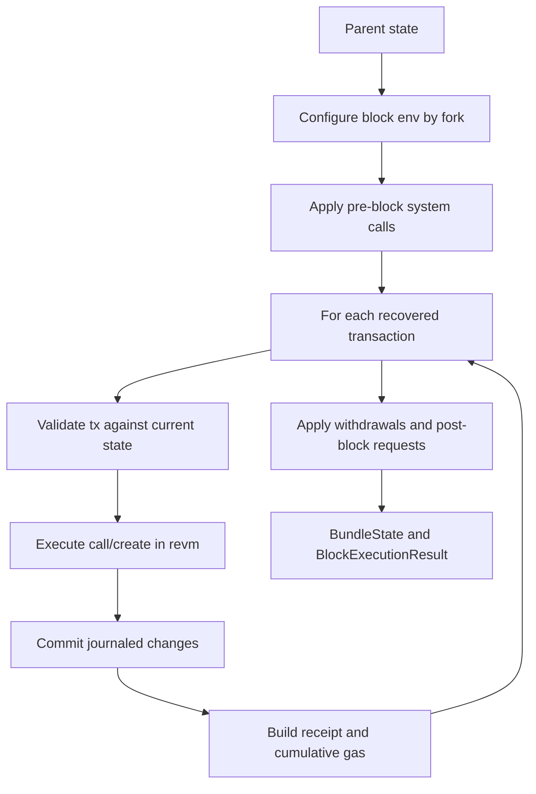

# 05. EVM、revm 与区块执行

## 1. Crate 分层

| Crate | 责任 |
|---|---|
| `reth-evm` | `ConfigureEvm`、factory、block executor 等链无关接口 |
| `reth-evm-ethereum` | Ethereum env/fork/spec/executor factory |
| `reth-revm` | Reth provider/state 与 revm database/context 适配 |
| `reth-execution-types` | execution outcome、receipt、request、state change 类型 |
| `reth-execution-errors` | EVM/block execution typed errors |

revm 是执行核心，Reth 提供链规则选择、状态后端、区块级前后处理和结果持久化。

## 2. EVM 上下文

一次执行的结果由多个上下文共同决定：

```text
CfgEnv: chain id, active spec, optional limits
BlockEnv: number, timestamp, coinbase, gas limit, base fee, randomness, blob price
TxEnv: caller, nonce, gas, fee, destination, value, input, access list, blob hashes
Database: account/basic, code by hash, storage, block hash
Journal: current call-frame state changes and checkpoints
```

同一 bytecode 在不同 hardfork、block env 或 state 下可能产生不同结果。因此缓存 EVM 结果必须把完整语义上下文纳入 key。

## 3. 区块执行骨架



区块内 transaction 顺序是共识语义。第 n 笔交易读取的是前 n-1 笔提交后的状态。

## 4. Journal 与 call-frame rollback

EVM 中内部调用可能 revert，但外层继续。Journal 记录可撤销变化并在 call frame 建 checkpoint：

```text
outer call checkpoint
  write A
  inner call checkpoint
    write B
    REVERT -> undo B only
  write C
outer success -> retain A and C
```

交易级 revert 与 invalid transaction 不同：成功进入 EVM 后的 REVERT 通常仍消耗 gas、产生失败 status receipt，但其可回滚状态变化不提交。

这种设计等价于嵌套 transaction/savepoint，比每层复制全状态高效得多。

## 5. Gas accounting

必须区分：

- intrinsic gas：交易数据、创建、access list 等固定起始成本；
- opcode dynamic gas：依赖操作和状态冷热；
- memory expansion：按最大访问范围非线性收费；
- refund：受 fork 规则和上限约束；
- effective gas price：由 base fee、max fee、priority fee 决定；
- blob gas：与 execution gas 独立的费用市场。

整数溢出、舍入方向、边界等都是共识规则，不能用浮点近似。

## 6. Warm/Cold access

EIP-2929 后首次访问 account/storage 成本更高，后续 warm。Access list 可预热。状态访问层必须让 revm 精确知道是否第一次访问，不能因本地 cache 命中就改变协议 gas；物理 cache 与语义 warm set 是两个概念。

## 7. Contract creation 与 code

CREATE/CREATE2 包含：

- 地址推导；
- collision/nonce 规则；
- init code 执行；
- runtime bytecode size/prefix 限制；
- code deposit gas；
- fork-specific init code limit。

`code_hash -> bytecode` 去重存储使相同代码可共享，但账户的 code hash 仍是状态承诺的一部分。

## 8. Precompile 与 system call

Precompile 是特定地址上的原生实现，输出必须与规范完全一致。它们绕过 bytecode interpreter 以实现密码学等高成本操作。

System call 由协议在区块边界触发，不是普通用户交易；可能处理 beacon root、withdrawal request 等。配置层负责在正确 fork、正确顺序调用。

性能优化 precompile 时必须用 differential/fixture 测试验证字节级结果和 gas，而不仅是功能输出。

## 9. State provider adapter

revm 期望按 account/code/storage/blockhash 查询的 database。Reth adapter 将请求映射到：

```text
memory journal/cache
  -> canonical in-memory overlay
  -> historical/latest provider
  -> MDBX/RocksDB/static files
```

读取顺序必须遵守最近写覆盖旧值。删除账户、wiped storage、零值和不存在是容易混淆的状态。

## 10. BlockExecutionResult 与 ExecutionOutcome

区块执行不仅返回 state：

- receipts；
- gas used；
- logs bloom 可推导数据；
- requests；
- bundle state / original values；
- 每块边界，供 persistence 和 reorg 使用。

保留 original value 是为了 changeset/unwind；只保存最终值无法恢复父状态。

## 11. JIT、Inspector 与 tracing

- Inspector 在 opcode/call 边界观察执行，用于 debug/trace，自身不应改变共识结果。
- JIT 是可选执行后端，必须与 interpreter differential-equivalent。
- Trace 可能极其昂贵，RPC 应限制并发/超时。

可观测能力最好通过 hook/inspector 注入，而不是在 interpreter hot loop 永久分配日志对象。

## 12. 语言无关思想

- deterministic state machine：输入上下文显式，不读本地隐式状态。
- journal + savepoint：细粒度嵌套回滚。
- semantic cache vs physical cache：性能 cache 不能改变协议计费。
- adapter boundary：执行引擎不依赖具体存储。
- differential testing：替代执行后端必须互相对拍。

## 13. 源码切片：EVM factory、receipt builder 与 block assembler

```rust
// crates/ethereum/evm/src/lib.rs
pub struct EthEvmConfig<C = ChainSpec, EvmFactory = EthEvmFactory> {
    pub executor_factory:
        EthBlockExecutorFactory<RethReceiptBuilder, Arc<C>, EvmFactory>,
    pub block_assembler: EthBlockAssembler<C>,
}

pub fn new_with_evm_factory(chain_spec: Arc<ChainSpec>, evm_factory: EvmFactory) -> Self {
    Self {
        block_assembler: EthBlockAssembler::new(chain_spec.clone()),
        executor_factory: EthBlockExecutorFactory::new(
            RethReceiptBuilder::default(),
            chain_spec,
            evm_factory,
        ),
    }
}
```

这三个对象分别负责不同阶段：

- `EvmFactory` 创建单次交易执行所需的 revm 实例；
- `RethReceiptBuilder` 把执行结果编码成 fork 正确的 receipt；
- `EthBlockAssembler` 把交易结果、withdrawals 和 fork-specific 字段组装为 block。

它们共享同一个 `Arc<ChainSpec>`。这避免解释器启用了 Cancun，而 receipt 或 block assembler 仍按旧 fork 编码的“横向规则漂移”。

`EvmFactory` 是泛型参数，说明执行后端可替换；receipt 和 assembler 仍固定在 Ethereum 语义上，说明可替换的是机制而不是共识输出。
