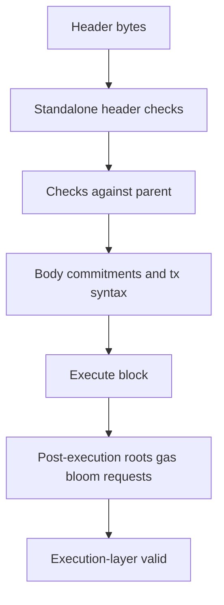

# 06. 执行层 Consensus Validation

## 1. Crate 边界

- `reth-consensus`：`HeaderValidator`、`Consensus`、`FullConsensus` 等抽象。
- `reth-consensus-common`：base fee、gas limit、4844、body/root 等共享算法。
- `reth-ethereum-consensus`：`EthBeaconConsensus<ChainSpec>` 的 Ethereum 规则组合。
- `reth-consensus-debug-client`：诊断/测试用 consensus client 工具。

这里的 consensus 是执行层有效性规则，不实现 PoS validator/finality。

## 2. 分层验证的原因



排序目标：

1. 尽早拒绝便宜可判定的垃圾输入；
2. 没有 parent 时不要错误判 invalid；
3. 只有执行后才能验证的承诺放最后；
4. 每层错误保留结构化原因。

## 3. Standalone header checks

典型规则：

- hash/seal 与 header 内容一致；
- extra data 长度；
- gas used 不超过 gas limit；
- base fee 字段出现时机和基本范围；
- Merge 后 difficulty=0、nonce=0、ommers root 为空；
- withdrawals/blob/requests/BAL 字段与 fork 激活匹配。

Standalone 意味着不读取 parent/state，不意味着检查完即可接收。

## 4. Parent-relative checks

- `number = parent.number + 1`；
- `parent_hash = hash(parent)`；
- timestamp 严格递增；
- gas limit 变化不超过协议 ramp；
- base fee 由 parent gas usage 精确推导；
- excess blob gas 从 parent 推导。

这些都是 transition invariant。只验证每个对象自身无法发现链关系错误。

## 5. Body commitments

区块头承诺 body 的摘要：

- transactions root；
- ommers hash；
- withdrawals root；
- blob gas 与交易 blob 数约束；
- 其他 fork-specific body fields。

算法模式是 `decode -> canonical encode/hash -> compare commitment`。不能信任 body 自带的缓存 root，验证端必须独立计算或使用可证明等价的计算结果。

## 6. Post-execution checks

执行后得到：

- state root；
- receipts root；
- logs bloom；
- gas used；
- requests hash；
- block access list hash 等未来/当前 fork 输出。

任何一个与 header 不同都使 block invalid。这形成“producer 可自由优化，validator 只认承诺”的边界。

## 7. Receipt root 与 logs bloom

Receipts 按交易顺序进入 ordered trie/root；typed receipt 编码必须包含正确 type envelope。Logs bloom 是 2048-bit 概率结构：对 address/topics 的 Keccak 摘取若干 bit 置位。

Bloom 只可证明“不包含”：若所需 bit 缺失则肯定无匹配；bit 全在仍可能是假阳性，必须扫描 logs。它是查询预过滤，不是认证 proof。

## 8. EIP-1559 base fee 边界

实现必须处理：

- parent gas used 等于 target：base fee 不变；
- 高于 target：按整数除法上升，并遵守最小上升量；
- 低于 target：下降但不负数；
- fork 激活首块使用特殊初始规则；
- chain spec 可提供参数。

测试应覆盖除法余数、极小 base fee 和最大整数附近，而不仅是主网常见值。

## 9. Blob/KZG 的责任切分

- Header/consensus 检查 blob gas 字段和 versioned hash commitment 等执行层规则。
- Txpool 对外来 sidecar 做 KZG 证明验证，保护本地资源和传播正确性。
- CL 负责其数据可用性采样/共识语义的部分。

同一 EIP 跨模块并不代表重复设计，而是不同信任边界上的检查。

## 10. Error taxonomy

好的错误 enum 应能区分：

- header 自身错误；
- parent transition 错误；
- body commitment 错误；
- post-execution mismatch；
- missing context/provider error。

只有前四类确定性错误能安全传播为 Engine `INVALID`。本地 DB I/O 错不能伪装成 peer 提交了无效块。

## 11. 可配置 skip flag 的风险

某些 builder/debug 环境允许跳过 gas ramp/blob/request 检查。它们只适合受控链或测试；在主网验证路径打开会改变安全性。配置项必须：

- 命名显式含 `skip`/`dangerous`；
- 默认关闭；
- 在组合根可追踪；
- 测试证明仅跳过目标规则。

## 12. 语言无关思想

- validation pipeline：按成本与依赖分层。
- commitment checking：producer 提交摘要，validator 独立重算。
- context absence is not invalidity：缺数据与坏数据分开。
- typed errors drive policy：error 类型决定 ban/sync/stop。
- rule context injection：fork 规则来自 ChainSpec，不从全局变量读取。

## 13. 源码切片：Merge 与 Shanghai 的分层检查

```rust
// crates/ethereum/consensus/src/lib.rs
let is_post_merge = self.chain_spec.is_paris_active_at_block(header.number());

if is_post_merge {
    if !header.difficulty().is_zero() {
        return Err(ConsensusError::TheMergeDifficultyIsNotZero)
    }
    if !header.nonce().is_some_and(|nonce| nonce.is_zero()) {
        return Err(ConsensusError::TheMergeNonceIsNotZero)
    }
    if header.ommers_hash() != EMPTY_OMMER_ROOT_HASH {
        return Err(ConsensusError::TheMergeOmmerRootIsNotEmpty)
    }
}

if self.chain_spec.is_shanghai_active_at_timestamp(header.timestamp()) &&
    header.withdrawals_root().is_none()
{
    return Err(ConsensusError::WithdrawalsRootMissing)
}
```

这段 standalone validation 不需要 parent state，因此在执行前就能拒绝结构错误。Paris 按 block 条件查询，Shanghai 按 timestamp 查询，源码没有把所有 fork 压成同一高度模型。

错误 variant 也保留了机器可判定的原因。Engine 层可以把确定性 `ConsensusError` 转为 `INVALID`；若失败来自 provider I/O，则不能经过这条路径伪装成区块无效。

## 14. 源码切片：相对 parent 的 4844 规则

```rust
if let Some(blob_params) =
    self.chain_spec.blob_params_at_timestamp(header.timestamp())
{
    validate_against_parent_4844(header.header(), parent.header(), blob_params)?;
}
```

Blob 参数由 child timestamp 选择，但校验同时读取 parent header，说明这是 transition rule 而非单对象约束。把它放到 parent-relative 层避免 standalone validator 在缺 parent 时作出错误结论。
