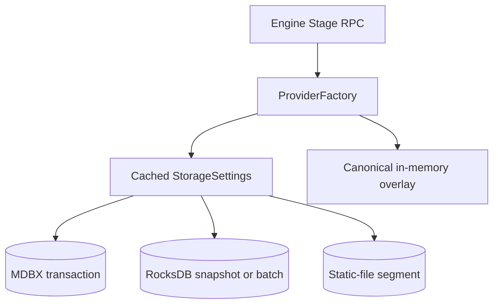
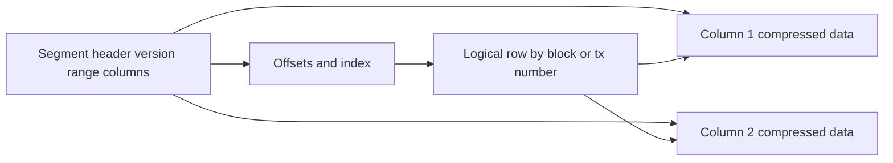
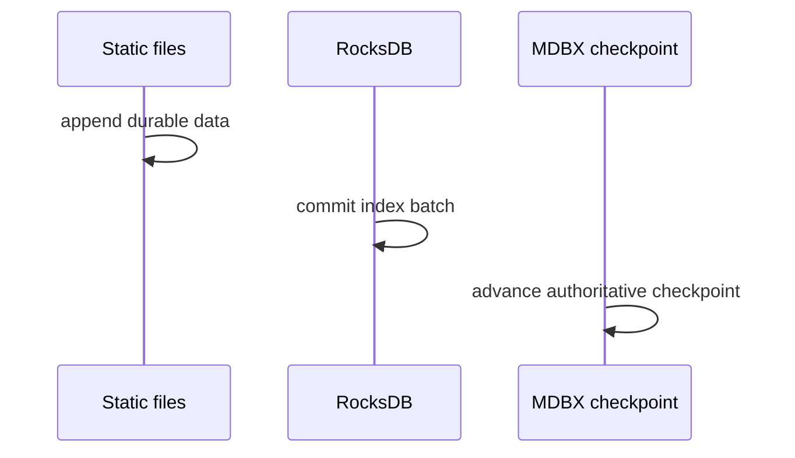

# 07. Storage API、Provider 与 Storage V2

## 1. Crate 分层

| 层 | Crate | 作用 |
|---|---|---|
| 逻辑 API | `reth-storage-api` | block/state/history/trie/checkpoint 等能力 trait |
| 错误 | `reth-storage-errors` | DB/provider typed errors，避免循环依赖 |
| 表与事务 API | `reth-db-api` | `Database`、`Transaction`、cursor、`Table`、models |
| 模型 | `reth-db-models` | on-disk key/value wrapper 和 compact model |
| MDBX 实现 | `reth-db` | `DatabaseEnv`、open/init、metrics、version |
| 高层路由 | `reth-provider` | `ProviderFactory`、RW/RO provider、state view、writers |
| 静态文件 | `reth-static-file-types`, `reth-static-file` | segment、jar/provider/writer、producer |
| 列式格式 | `reth-nippy-jar` | 多列压缩、offset/index、cursor、consistency checker |
| RocksDB | `reth-provider/providers/rocksdb` | history/lookup index、snapshot、batch、invariant |
| 工具 | `reth-db-common` | genesis、consistency、migration/init、DB tool |
| RPC 专用 | `reth-storage-rpc-provider` | 针对 RPC access pattern 的 provider |

## 2. 三层抽象不要混淆

```text
storage-api trait
  回答“调用者需要什么能力”

ProviderFactory / provider
  回答“从哪个逻辑视图和后端取得数据”

Database transaction / cursor / table
  回答“具体 KV 事务怎样读取物理表”
```

高层 Engine/RPC 通常依赖 storage/provider trait；stage/writer 才更接近 DB transaction。

## 3. `Table` 的类型安全

概念接口：

```rust
trait Table {
    type Key;
    type Value;
    const NAME: &'static str;
}
```

调用 `tx.get::<Headers>(number)` 时，编译器知道 key/value 类型。它避免字符串表名、手工 byte decode 和跨表类型误用。

DupSort 类表允许一个主 key 下多个 subkey/value，适合 address -> storage slots 等一对多有序关系。Cursor 暴露 seek/next/prev/range 行为，算法可利用物理排序。

## 4. 事务与 cursor 生命周期

MDBX 基于 memory map，返回值可能借用 transaction 页面，因此：

- transaction 必须活得比借用值久；
- 长读事务可能阻止页面回收或观察旧 snapshot；
- 写事务应有限、批量且有明确 commit；
- 不要跨 `.await` 持有不适合跨线程/长生命周期的 transaction/cursor。

Rust lifetime 将部分规则变成编译错误；其他语言要靠 scoped callback 或显式 close。

## 5. Storage V2 路由

`StorageSettings::v2()` 当前明确启用：

- receipts、transaction senders -> static files；
- account/storage changesets -> static files；
- account/storage history indices、transaction hash index -> RocksDB；
- hashed account/storage -> canonical state representation；
- 其余 metadata/checkpoint/热表继续由 MDBX/provider 管理。



逻辑 API 不应让调用者写 `if storage_v2`；分支集中在 provider/either writer。

## 6. 为什么用三种后端

### MDBX

优势：单 writer ACID、B+tree cursor、range/seek、mmap 读取。适合 metadata、checkpoint、热且需要事务一致性的 KV。

风险：mmap address space、长事务、单 writer contention、随机写布局。

### Static files

优势：append-oriented、按固定 block/tx range 分段、列式压缩、可 mmap/迁移、finalized 历史很少更新。

风险：不能任意原地修改；segment 边界、offset/index、文件原子发布和截断恢复复杂。

### RocksDB

优势：LSM 适合大型索引写入、column family、batch、snapshot 和后台 compaction。

风险：write amplification、compaction 抖动、跨后端非原子、block cache 配置。

选择数据库应从 workload 出发，而不是从品牌 benchmark 出发。

## 7. Static-file segment

一个 segment 通常覆盖固定 block range，并按列保存数据：



关键不变量：

- 文件声明范围与实际 row 一致；
- 每列 row count 一致；
- offset 单调且不越界；
- finalized segment 不被普通 writer 修改；
- writer 完成后再原子发布可见版本。

NippyJar/Compact 是内部可信格式，不能不加边界检查地用于公网恶意输入。

## 8. RocksDB snapshot 与 batch

读多个索引时使用 point-in-time snapshot，避免一次逻辑查询跨越两次写入看到混合版本。写入使用 batch 降低 WAL/lock 开销。

Provider 中 pending RocksDB batches 允许将 RocksDB 写延迟到 provider commit 协议。但 MDBX、static file、RocksDB 没有真正跨引擎 2PC，所以系统依赖 checkpoint 和恢复 invariant，而不是假装全局原子。

## 9. Commit 与故障窗口

假设逻辑 batch 需要写 A=static files、B=RocksDB、C=MDBX checkpoint。不同崩溃点：



恢复规则要明确：

- 后端超前于 checkpoint：多余数据是否可按 key/range裁掉；
- 后端落后于 checkpoint：是否可从 authoritative data 重建，还是必须 unwind；
- static file 已 append 但未发布：怎样识别临时/不完整 segment；
- checkpoint 已推进但索引缺失：不能静默返回 `None`。

RocksDB invariant 代码体现“ahead 可 heal、behind 需 unwind”的非对称性。

## 10. State view

Provider 可构造：

- latest state；
- historical state by block hash/number；
- pending/in-memory overlay state；
- state with bundle/changeset overlay。

查历史状态常使用 history index 定位目标高度之后最近变化，再由 changeset 还原旧值。不存在、已删除、零值必须区分。

## 11. History 算法

对地址 A 查询高度 H 的账户：

1. history index 找到 A 在 `> H` 的最早变化 block K；
2. 若存在 K，读取 K changeset 中“变化前值”，即 H 时应见值；
3. 若不存在，读取 latest canonical state；
4. 对 storage 使用 `(address, slot)` 同样处理。

分片 history list 需要：

- 有序 block numbers；
- shard boundary/sentinel；
- 插入与 prune 不产生重复/缺口；
- unwind 删除超过 target 的 entries。

## 12. 编码与 schema evolution

内部 Compact codec 用 bitfield、省略零值/可选字段压缩。任何 schema 修改都要回答：

- 旧数据库如何识别版本？
- 新 binary 能否读旧数据？
- downgrade 是否允许？
- migration 可否中断恢复？
- 编解码是否有 roundtrip/property/fuzz tests？

不要依赖 Rust struct field layout；持久格式必须显式编码。

## 13. Provider 能力拆分

`BlockReader`、`HeaderProvider`、`StateProviderFactory`、`StageCheckpointReader` 等小 trait 让函数只要求所需能力。`FullProvider` 是组合便利，不应成为所有函数的默认参数，否则隐藏依赖并增加 mock 成本。

## 14. 语言无关思想

- typed table：schema 进入类型系统。
- facade + routing：逻辑存储与物理后端分离。
- authoritative progress：跨后端用 checkpoint 和 invariant 恢复。
- immutable segmentation：冷数据转换为 append-only 分段。
- delta + index：用 changeset 和 history index 支持历史视图。
- snapshot consistency：一次逻辑读固定观察版本。

## 15. 源码切片：Storage V2 是持久化 schema，不是临时开关

```rust
// crates/storage/db-api/src/models/metadata.rs
pub struct StorageSettings {
    pub storage_v2: bool,
}

impl StorageSettings {
    pub const fn base() -> Self { Self::v2() }
    pub const fn v2() -> Self { Self { storage_v2: true } }
    pub const fn receipts_in_static_files(&self) -> bool { self.storage_v2 }
    pub const fn transaction_senders_in_static_files(&self) -> bool { self.storage_v2 }
    pub const fn use_hashed_state(&self) -> bool { self.storage_v2 }
}
```

`base()` 返回 V2，表明新节点默认采用该布局。所有路由方法都从同一个已持久化 setting 推导，避免 receipts 已按 V2 写 static file，而 state writer 仍按 V1 写 plain state 的部分升级。

## 16. 源码切片：RocksDB snapshot 与 deferred batch

```rust
// crates/storage/provider/src/traits/rocksdb_provider.rs
fn with_rocksdb_snapshot<F, R>(&self, f: F) -> ProviderResult<R>
where
    Self: StorageSettingsCache,
    F: FnOnce(RocksDBRefArg<'_>) -> ProviderResult<R>,
{
    if self.cached_storage_settings().storage_v2 {
        let rocksdb = self.rocksdb_provider();
        let snapshot = rocksdb.snapshot();
        return f(Some(snapshot))
    }
    f(None)
}

fn with_rocksdb_batch<F, R>(&self, f: F) -> ProviderResult<R> {
    let batch = self.rocksdb_provider().batch();
    let (result, raw_batch) = f(batch)?;
    if let Some(batch) = raw_batch {
        self.set_pending_rocksdb_batch(batch);
    }
    Ok(result)
}
```

Snapshot 固定一次逻辑读取的版本；batch 则先注册为 pending，而不是在任意 helper 中立即提交。这样顶层 provider commit 能协调 MDBX/static files/RocksDB 的顺序。

源码注释把它描述为跨后端原子性，但物理上并不存在单一事务管理器；真正的安全网仍是 authoritative checkpoint、启动 consistency check，以及“ahead 可裁剪、behind 要 unwind”的恢复协议。
