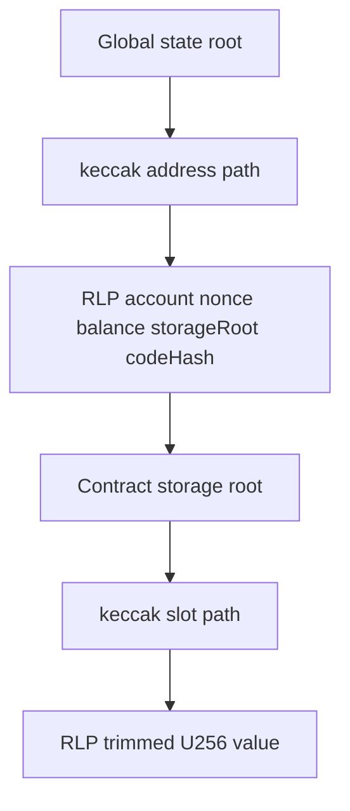
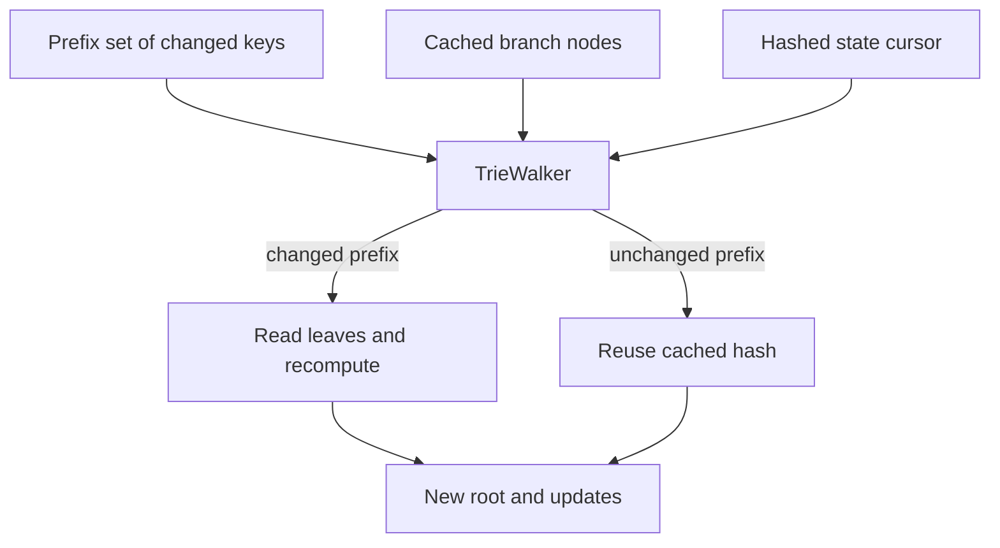
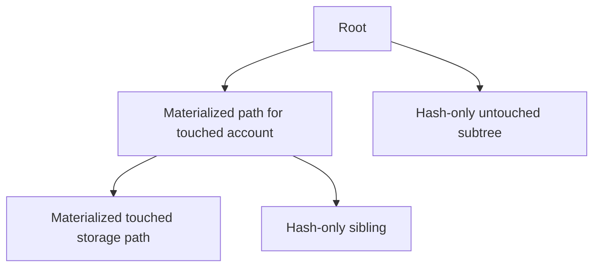
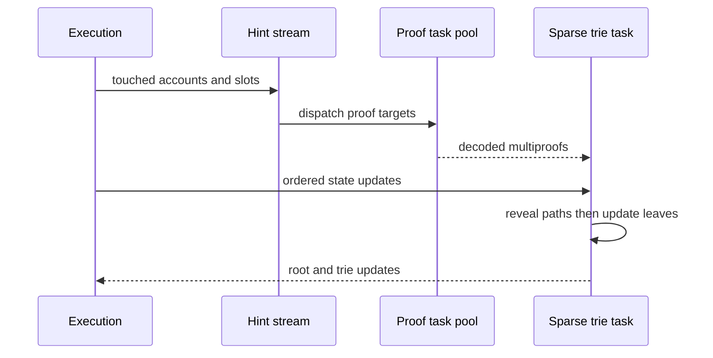

# 08. Trie、State Root、Proof 与 Sparse Trie

## 1. Crate 分层

| Crate | 责任 |
|---|---|
| `reth-trie-common` | nibble、node、hashed state、prefix set、proof/update 类型 |
| `reth-trie` | walker、root、proof/witness、ordered root 等纯算法 |
| `reth-trie-db` | DB cursor/factory 与 state/storage trie 访问 |
| `reth-trie-sparse` | 内存 sparse trie、更新、回滚、节点 provider |
| `reth-trie-parallel` | proof task pool、state-root background pipeline、value encoder |

## 2. MPT 节点与编码

Ethereum 使用十六叉 Patricia trie：key 先 Keccak，再拆成 nibble。

```text
Branch    = 16 children + optional value
Extension = compressed shared path + child
Leaf      = compressed remaining path + value
```

Extension/Leaf 的路径用 hex-prefix 编码，把“leaf or extension”和“奇偶 nibble 数”编码到高位 flag。节点再 RLP 编码；短节点可内联到 parent，长节点由 Keccak hash 引用。

这意味着 parent hash 依赖 child 的**规范编码**，不是只依赖 child value。

## 3. 插入算法

插入 key K 时递归比较现有节点路径：

- Empty：生成 Leaf(K, value)。
- Leaf 同 key：替换 value。
- Leaf 不同 key：拆公共前缀，建立 Branch，必要时外包 Extension。
- Extension 全匹配：递归 child。
- Extension 部分匹配：拆 extension 建 branch。
- Branch：按下一个 nibble 进入 child。

删除后要反向规范化：只剩一个 child 的 branch 可压成 extension/leaf；否则不同实现可能得到不同 root。

## 4. State trie 与 storage trie



账户删除/清空 storage 会同时影响账户树和 storage subtree。空 storage 使用规范 `EMPTY_ROOT_HASH`，不是零 hash。

## 5. Ordered transaction/receipt root

交易和 receipt root 也用 trie，但 key 是 `RLP(index)`，value 是规范 transaction/receipt encoding。因为 index 递增，可使用 ordered-root 专用算法，避免通用随机插入的额外成本。

Typed receipt 必须把 type byte 纳入 value 编码；遗漏会产生看似合理但错误的 root。

## 6. Trie walker 与缓存节点

数据库保存部分 branch node/hash 缓存。Walker 同时遍历：

- 已有 trie nodes；
- 当前 hashed leaves；
- changed prefix set。

未被 prefix set 覆盖的 cached subtree hash 可直接复用；覆盖路径必须下钻重算。



Prefix set 本质是精确的 cache invalidation description。

## 7. `HashedPostState`

执行结果以原始 address/slot 表达业务状态，trie key 需要 Keccak。HashedPostState 包含：

- `hashed_address -> account or deletion`；
- `hashed_address -> hashed slots`；
- storage wiped 标记；
- 可构造 trie prefix sets 和 proof targets。

Wiped 与“本次写了若干 slot”不同：wiped 表示旧 storage subtree 的未列出 slot 也应消失。

## 8. Proof

存在性 proof 给出 root 到 leaf 所需节点；不存在性 proof 给出路径在何处断开。验证者：

1. 从 root hash 开始；
2. 解码节点并检查 hash/reference；
3. 按 nibble 选择 child；
4. 到 leaf 比较 key/value，或证明路径缺失。

Proof 的安全依赖 hash collision resistance 和规范编码。

## 9. Multiproof

多个 key 的 proof 会共享祖先节点。Multiproof 返回共享子树一次：

```text
naive proofs cost ≈ sum(path_i)
multiproof cost   ≈ size(union of all paths)
```

目标越聚集，共享越多。Reth 的 account multiproof 还包含各账户 storage multiproof，需要维护 account root 与 storage roots 的对应关系。

## 10. Sparse trie

Sparse trie 不是“减少分叉因子”，而是只物化当前执行需要的路径，其余 subtree 用 hash 占位。



更新一个 hash-only subtree 前必须有 proof 展开相关路径，否则无法安全计算新 root。

## 11. 并行 state-root pipeline

执行可先产生/预测 access 和 update hint，proof task pool 并行读取 account/storage multiproof，再由单个受控 sparse-trie 更新流合并：



并行点在 proof I/O/计算；最终更新顺序与状态语义必须确定。

## 12. Proof target chunking

目标过小：task/channel overhead 高，重复公共节点；目标过大：延迟和内存峰值高、并行度不足。Chunk 策略需要基于地址/slot 数、估计 proof size 和 worker 数平衡。

这是通用的 parallel granularity 问题，不能只把 chunk size 调大称为优化。

## 13. Sparse trie rollback

Payload 执行或 root 检查失败时，sparse trie 不能留下半更新结构。实现可用 update transaction/checkpoint 或 clone-on-write 保证 atomic rollback。

测试必须同时检查：

- root 未变；
- node structure 未变；
- prefix set/retained cache 未污染；
- 下一次合法更新仍成功。

## 14. Trie updates 持久化

计算 root 同时收集：

- 新增/修改 branch node；
- 删除的旧 node；
- storage trie updates per account；
- root/hash metadata。

Root 正确但 updates 不完整会导致当前块验证通过、重启后无法复现，因此 root 与 updates 应来自同一计算结果并在一致 checkpoint 落盘。

## 15. 算法复杂度与真实性能

理论单 key 操作约 `O(key_nibbles)`，但真实性能主要受：

- DB random reads；
- RLP encode/Keccak；
- proof 重复节点；
- cache locality；
- changed key 排序；
- storage tries 数量；
- channel/task granularity。

Benchmark 应分别测 warm/cold cache、随机/集中 key、账户/slot 比例和更新/删除/wipe。

## 16. 语言无关思想

- authenticated data structure：数据与可验证摘要绑定。
- path compression：稀疏 key space 降低结构开销。
- incremental recomputation：changed prefix 精确失效。
- proof-carrying partial state：用 proof 安全展开 sparse view。
- shared-work elimination：multiproof 合并公共路径。
- atomic mutation：失败不污染 retained structure。

## 17. 源码切片：从状态差量构造精确失效集合

```rust
// crates/trie/common/src/hashed_state.rs
pub fn construct_prefix_sets(&self) -> TriePrefixSetsMut {
    let mut account_prefix_set = PrefixSetMut::with_capacity(self.accounts.len());
    let mut destroyed_accounts = HashSet::default();

    for (hashed_address, account) in &self.accounts {
        account_prefix_set.insert(Nibbles::unpack(hashed_address));
        if account.is_none() {
            destroyed_accounts.insert(*hashed_address);
        }
    }

    let mut storage_prefix_sets = HashMap::with_capacity_and_hasher(
        self.storages.len(), Default::default()
    );
    for (hashed_address, storage) in &self.storages {
        account_prefix_set.insert(Nibbles::unpack(hashed_address));
        storage_prefix_sets.insert(*hashed_address, storage.construct_prefix_set());
    }

    TriePrefixSetsMut { account_prefix_set, storage_prefix_sets, destroyed_accounts }
}
```

Storage 变化也会把所属 account 插入 account prefix set，因为账户 leaf 中包含 `storage_root`；即使余额和 nonce 不变，storage root 改变也必须重算账户路径。`destroyed_accounts` 单独记录，是因为删除账户意味着整棵旧 storage trie 失效，不能只重算本次列出的 slots。

## 18. 源码切片：并行 state-root 为何有 hint 与 authoritative 两条通道

```rust
// crates/trie/parallel/src/state_root_task.rs
pub enum StateRootMessage {
    PrefetchProofs(MultiProofTargetsV2),
    StateUpdate(EvmState),
    HashedStateUpdate(HashedPostState),
    FinishedStateUpdates,
}

pub struct StateRootComputeOutcome {
    pub state_root: B256,
    pub trie_updates: Arc<TrieUpdates>,
    pub hashed_state: Arc<HashedPostState>,
}
```

`PrefetchProofs` 是 best-effort hint，丢失只影响性能；`StateUpdate/HashedStateUpdate` 是权威状态流，不能重复或遗漏。最终 outcome 把 root、updates 和 hashed state 绑定在同一个返回值中，防止调用者把某次 root 与另一次 trie updates 混合持久化。

`FinishedStateUpdates` 是显式流终止标记。仅依赖 sender drop 会让多个 producer 的生命周期变得含糊，显式消息则让 state-root task 知道何时可以安全 finalize。
