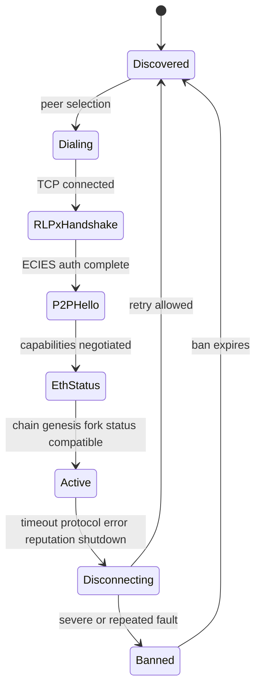
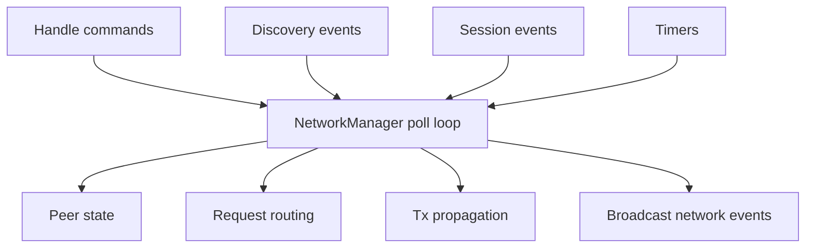
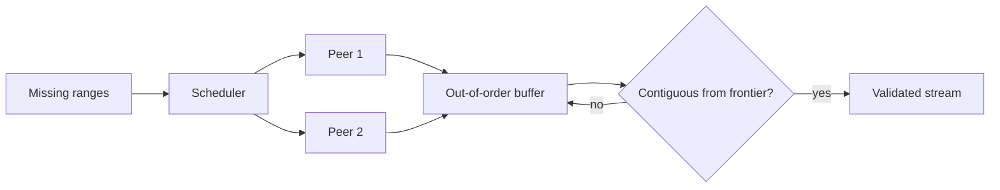

# 09. Discovery、RLPx、eth Wire 与 Downloader

## 1. Crate 地图

```text
reth-net-nat             外部地址发现
reth-discv4/discv5       节点发现协议
reth-dns-discovery       EIP-1459 DNS tree
reth-network-peers       peer set/reputation/persistence
reth-net-banlist         peer/IP ban
reth-ecies               RLPx 加密握手
reth-eth-wire-types      wire message/types/primitives
reth-eth-wire            framing/multiplex/p2p/eth handshake
reth-network-types       session/peer/config shared types
reth-network-api         consumers see traits/events only
reth-network-p2p         sync/block client helpers
reth-network             manager/swarm/session/request/tx propagation
reth-downloaders         header/body/file clients
```

## 2. 连接生命周期



Discovery record 只提供候选地址/public key；完成 status handshake 前不能把 peer 当作同链可用节点。

## 3. Discovery 算法

### discv4/discv5

底层是基于 node id 距离的分布式路由思想，使用 XOR distance 和分桶近似 Kademlia：

```text
distance(a,b) = a XOR b
bucket i ~= 与本节点最高不同 bit 位为 i 的节点集合
```

查找目标时并行询问当前最接近的若干节点，逐轮逼近。Bucket 既要保留稳定节点，又要探索新节点，防止单一恶意区域垄断。

### DNS discovery

通过签名/哈希链接的 DNS tree 发布节点集合，适合 bootstrapping，不负责持续 peer 健康。

## 4. RLPx 与 ECIES

RLPx auth handshake 用 secp256k1 身份、临时密钥和 ECIES 派生会话 secret；之后 frame 加密并带 MAC。其目标是会话机密性、完整性和 peer identity 绑定。

实现重点不是密码学公式本身，而是：

- nonce/ephemeral key 不复用；
- auth/ack 版本兼容；
- frame length 有界且先认证再使用；
- MAC state 收发方向独立；
- 解密/解析错误立即终止会话。

不要自行“简化”密码协议；优先复用经测试实现和官方向量。

## 5. Capability multiplex

p2p Hello 协商如 `eth/68`、`eth/69` 及自定义 subprotocol。每个 capability 获得 message-id range，同一 RLPx connection 上复用。

算法类似静态端口分配：双方按 capability 排序/版本协商得到一致 offset。任何一侧计算不同都会把消息解码为错误类型。

## 6. Eth status handshake

status 通常交换 protocol version、network id、total difficulty/head、genesis、fork id 等。验证：

- genesis/network 匹配；
- fork id 兼容；
- protocol version 在协商范围；
- status 必须在其他 eth 消息前完成。

Status 通过只说明可以交流，不说明 peer 提供的数据正确。

## 7. NetworkManager 单所有者模型

`NetworkManager`/swarm 驱动 listener、discovery、sessions、requests 和 transaction propagation。外部通过 `NetworkHandle` 发命令。



单 loop 避免 peer/session 多张表分别加锁后失去原子性。每次 poll 要有 work budget，防止大量某类事件饿死其他来源。

## 8. Request/response 匹配

请求需要：

- request id 或 connection-local FIFO 对应关系；
- deadline；
- peer/request kind；
- response validator；
- cancellation/peer disconnect 处理。

收到 response 后先做数量、范围、连续性和 commitment 检查，再交 downloader。错误响应影响 reputation，但本地超时不一定证明 peer 恶意。

## 9. Header downloader

目标是将未知 header interval 变成连续、验证后的序列：

1. 将 range 切成 request batches；
2. 选择有能力且未过载 peer；
3. 维护 in-flight ranges；
4. 响应乱序放入 buffer；
5. 只有从当前 frontier 连续的结果才能交付；
6. timeout/invalid range 重新入队。



## 10. Body downloader

Body 请求由 header hash 列表定位。响应可能省略 peer 不认识的 block，因此要正确把 body 与 request hash 对齐，并通过 tx root/ommers/withdrawals commitment 验证。

限制每次请求的 hash 数和最大 response bytes，避免单个巨块挤压 channel/memory。

## 11. Peer reputation

Reputation 是本地资源调度启发式：

- timeout、bad response、protocol violation 降分；
- useful response/稳定连接可升分；
- 超阈值 disconnect/ban；
- 分数可能衰减。

不要用 reputation 替代 cryptographic/consensus validation；高分 peer 仍不可信。还要防止新 peer 永久没有机会，形成 selection lock-in。

## 12. Transaction propagation

- 小交易可直接广播完整内容；
- 大量/大体积交易先发 hash announcement，再由 peer 拉取；
- 记录已向哪个 peer 宣告，抑制回声；
- ETH69 等版本可能改变 announcement/filter 行为；
- blob sidecar 通常采用更谨慎的 pull/custody 策略。

传播策略是可配置性能策略，交易有效性由 pool validator 决定。

## 13. Backpressure 与 DoS

逐边界设置：

- 最大 frame/message/transaction 数；
- 每 peer in-flight；
- 全局 pending requests；
- decode CPU budget；
- response channel 容量；
- orphan/announcement cache；
- connection rate 和 banlist。

只有每层都有限制，攻击者才不能在“合法小包 -> 巨大内部工作”的放大点耗尽节点。

## 14. 语言无关思想

- candidate discovery != trust establishment；
- scheduler owns work, workers are replaceable；
- single-owner event loop + poll budget；
- bounded reordering buffer；
- reputation guides resources, validation decides truth；
- protocol version negotiation before feature use。

## 15. 源码切片：NetworkManager 是协议事件的唯一分派者

```rust
// crates/net/network/src/manager.rs
fn on_peer_message(&mut self, peer_id: PeerId, msg: PeerMessage<N>) {
    match msg {
        PeerMessage::NewBlockHashes(hashes) => {
            self.within_pow_or_disconnect(peer_id, |this| {
                this.swarm.state_mut().on_new_block_hashes(peer_id, hashes.to_vec());
                this.block_import.on_new_block(peer_id, NewBlockEvent::Hashes(hashes));
            })
        }
        PeerMessage::PooledTransactions(msg) => {
            self.notify_tx_manager(
                NetworkTransactionEvent::IncomingPooledTransactionHashes { peer_id, msg }
            );
        }
        PeerMessage::EthRequest(req) => self.on_eth_request(peer_id, req),
        PeerMessage::ReceivedTransaction(msg) => {
            self.notify_tx_manager(
                NetworkTransactionEvent::IncomingTransactions { peer_id, msg }
            );
        }
        PeerMessage::Other(other) => {
            debug!(target: "net", message_id=%other.id, "Ignoring unsupported message");
        }
        // 其余发送侧/状态消息省略
    }
}
```

所有 session 消息先进入同一个 `&mut self` handler，所以 peer state、request routing 和 transaction notification 的更新顺序是串行确定的，不需要给每张表分别加锁。

`within_pow_or_disconnect` 体现协议升级后的负能力：Merge 后不只是“不处理”旧 PoW block propagation，而是按 EIP-3675 主动断开违规 peer。网络状态机必须显式删除已废弃行为，不能永远兼容所有旧消息。

未知扩展消息选择 debug 并忽略，而本实现理论上不应从 session 收到的发送侧 variant 使用 `unreachable!`。二者分别对应“合法但不支持的外部输入”和“内部状态机不变量被破坏”。
