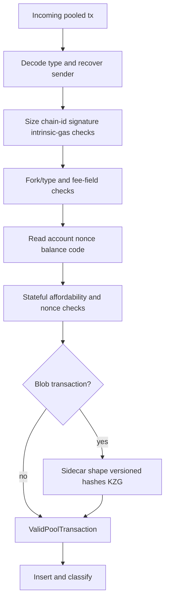
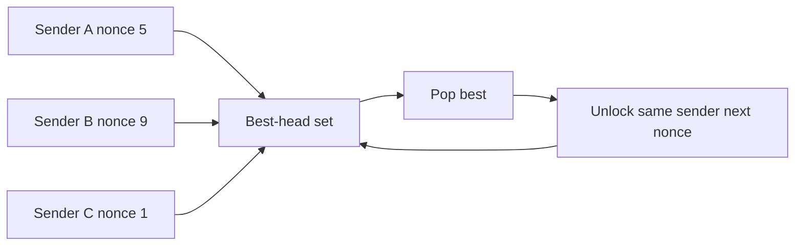

# 10. Transaction Pool 深入

## 1. 组件

`reth-transaction-pool` 内部主要包括：validator、pool/txpool、pending/parked/blob 子池、ordering、blobstore、maintenance、events/listener、batcher 和 metrics。

`EthTransactionPool` 是为 Ethereum transaction、validator、ordering、blob store 组合出的类型别名/实现。

## 2. 交易身份

两个常用 key：

- transaction hash：网络和用户可见身份；
- `(sender, nonce)`：replacement 和依赖链身份。

Pool 内部可给 sender 分配紧凑 `SenderId`，减少大量 20-byte address 重复存储和比较。内部 ID 是性能索引，不得泄漏为协议身份。

## 3. 验证流水线



Validation 可异步/批量执行，但 insertion 时 state head 可能已经变化，所以维护逻辑必须能重分类，而不能假设首次结果永久有效。

## 4. 永久无效与暂时不可执行

永久无效：错误签名、非法字段、超协议上限等，未来状态也不会修复。

暂时 parked：nonce gap、余额不足、base fee/blob fee 不足、祖先交易被阻塞等，未来 canonical state/新交易到来后可能变 pending。

分类错误的后果：丢弃可恢复交易影响可用性；保留永久垃圾导致 DoS。

## 5. TxState bitset 与四个子池

当前实现用多个条件 bit 表达 nonce gap、balance、gas、base fee、blob fee 等，再确定：

```text
Pending  所有当前执行条件满足
BaseFee  普通 fee cap 暂时不足
Blob     blob tx 的 fee/结构条件暂时不足
Queued   nonce gap、balance、ancestor、gas 等其他阻塞
```

Bitset 的好处是 canonical update 后只更新受影响条件，并知道 promotion/demotion 原因；比一串互斥 enum 更能表达多个同时失败的条件。

## 6. Sender nonce dependency graph

对 sender S：

```text
state nonce=5
tx 5 -> tx 6 -> tx 7
```

只有 tx5 是 ready head，但 6/7 可在 pending 链中，因为它们在前驱成功后连续可执行。若缺 tx6，则 tx7 queued。

这是一组按 sender 分区的有序 DAG（实际接近链），全局 best iterator 每次只比较各 sender 当前 unlocked head。

## 7. Best transaction iterator

概念算法：

1. 将每个 sender 的 ready head 放入有序集合/heap；
2. pop score 最高交易；
3. 若消费者标记成功，unlock 同 sender 下一 nonce；
4. 若交易因 block gas/blob limit 不可放入，可 skip sender 或 stash；
5. 池中新交易到来时迭代器可接收更新。



不能简单全量 sort，因为被 ancestor 阻塞的高价交易不可先执行。

## 8. Ordering score

默认收益通常关注 effective priority fee/coinbase tip，但 blob、local priority、自定义策略可改变 ordering。Score 比较必须：

- total order 或稳定处理 tie；
- 不因 base fee 更新而使用陈旧 score；
- 不溢出；
- 对同 sender 保留 nonce 约束。

Builder 最终仍要实际执行，pool score 只是候选启发式，不证明交易一定成功或最优组合。

## 9. Replacement policy

同 `(sender, nonce)` 新交易需达到 price bump。对 EIP-1559 不能只比较单一 gas price，通常要同时考虑 fee cap/tip；blob tx 还涉及 max blob fee。

策略目标：

- 防止零成本 replacement spam；
- 允许用户合理加速/取消；
- 不让某一字段大涨掩盖另一字段倒退；
- 替换成功后正确释放旧 blob sidecar/size accounting。

## 10. Pool limits 与 eviction

限制通常按 transaction count、总 bytes、各 subpool、per-account slots。满时淘汰最差 parked transaction 比淘汰 ready 高价值交易合理，但还要避免一个 sender 占满池。

Eviction 必须维护：hash index、sender chain、subpool ordered set、blob store、listener event、metrics 的一致性。

## 11. Blob store

Blob sidecar 大且验证昂贵，单独 `DiskFileBlobStore`/memory store：

- pool 主对象只持 transaction 与引用；
- KZG 验证后存储；
- reorg reinjection 可按 hash 找回已验证 sidecar；
- transaction 删除/替换时清理；
- crash 后孤儿 blob 需要 cleanup。

把大对象从 hot index 分离是 **metadata/payload separation**。

## 12. Canonical state update

新 canonical block 到来：

1. 删除已 mined transactions；
2. 更新受影响 sender 的 nonce/balance；
3. 重算 fee/blob fee conditions；
4. promotion/demotion 子池；
5. reorg 时把旧 canonical blocks 中未被新链包含的交易 reinject；
6. 发 pending/all transaction events。

Reinjection 仍需按新 canonical state 验证，不能无条件恢复原 subpool。

## 13. 并发模型

Pool 外层常用 lock 保护核心 indexes，validation 可在锁外并发。关键是避免：

- 持锁做 DB/KZG/ECDSA；
- insertion 与 canonical update 交错破坏 sender chain；
- listener 回调在锁内阻塞；
- clone 大 transaction 只为绕过 lifetime。

典型策略是先昂贵验证，短临界区原子插入所有索引。

## 14. 语言无关思想

- primary identity 与 dependency identity 双索引；
- bitset 表达多维资格；
- constrained priority queue；
- metadata/payload separation；
- canonical diff 驱动增量重分类；
- bounded admission + replacement pricing 防滥用。

## 15. 源码切片：bitset 如何映射到四个子池

```rust
// crates/transaction-pool/src/pool/state.rs
impl From<TxState> for SubPool {
    fn from(value: TxState) -> Self {
        if value.is_pending() {
            Self::Pending
        } else if value.is_blob() {
            Self::Blob
        } else if value.bits() < TxState::BASE_FEE_POOL_BITS.bits() {
            Self::Queued
        } else {
            Self::BaseFee
        }
    }
}
```

判断顺序本身有语义：全部资格满足优先进入 Pending；任何非 pending blob 统一放 Blob；普通交易再按 base-fee 所需 bit 是否满足区分 Queued/BaseFee。一个交易可同时缺余额和 fee，因此底层 `TxState` 保留多维事实，`SubPool` 只是用于物理组织的投影。

## 16. 源码切片：受 nonce 约束的 best iterator

```rust
// crates/transaction-pool/src/pool/best.rs
fn pop_best(&mut self) -> Option<PendingTransaction<T>> {
    self.independent.pop_last().inspect(|best| {
        self.all.remove(best.transaction.id());
    })
}

pub fn next_tx_and_priority(
    &mut self,
) -> Option<(
    Arc<ValidPoolTransaction<T::Transaction>>,
    Priority<T::PriorityValue>,
)> {
    loop {
        self.add_new_transactions();
        let best = self.pop_best()?;

        if let Some(unlocked) = self.all.get(&best.unlocks()) {
            self.independent.insert(unlocked.clone());
        }
        // 返回 best；无效 sender/blob 分支在源码中继续过滤
    }
}
```

`independent` 只保存每个 sender 当前没有未处理祖先的交易，`all` 保存完整 nonce 链。Pop 一个 head 后，只有它直接解锁的 successor 才进入候选集合。

因此算法不是全局 gas-price sort，而是“多条 sender 有序链的动态 k-way merge”。它同时满足收益优先和 nonce 拓扑顺序。
