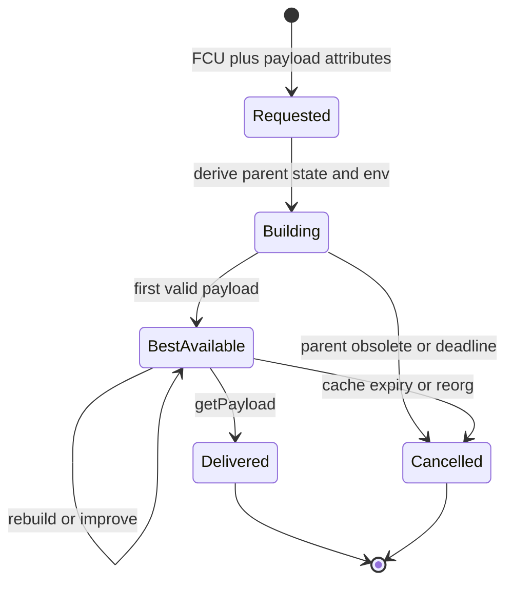
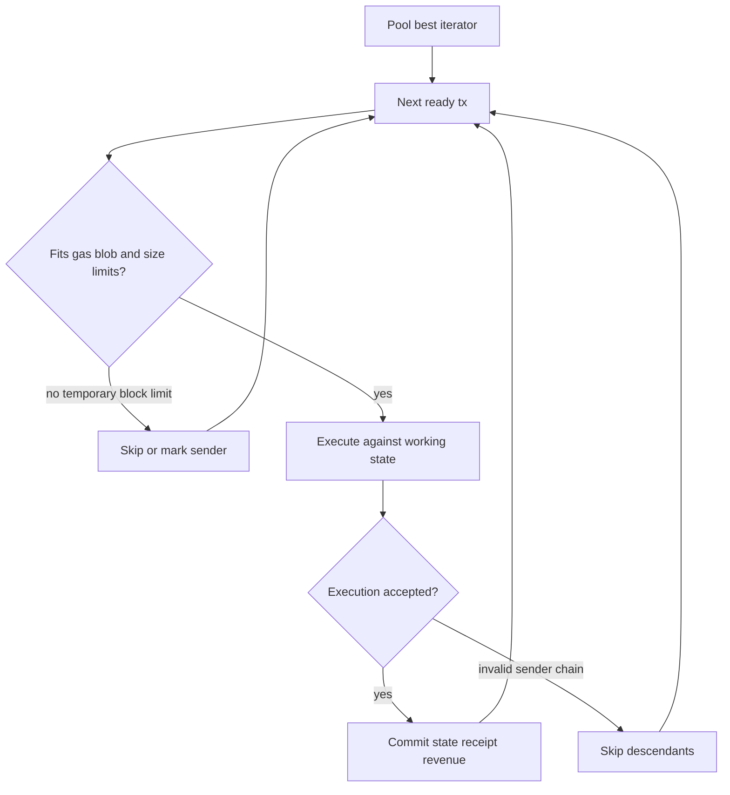

# 11. Payload Builder 与构块优化

## 1. Crate 分层

- `reth-payload-primitives`：payload id/kind、attributes、built payload 抽象。
- `reth-payload-builder-primitives`：builder error、build outcome/args 等。
- `reth-payload-builder`：service、job generator、job lifecycle、handle。
- `reth-basic-payload-builder`：通用 transaction selection/build 算法。
- `reth-ethereum-payload-builder`：Ethereum withdrawals、blob、requests、fork 规则。
- `reth-payload-validator`、`reth-payload-util`：payload 检查和共享辅助。

## 2. Payload job 生命周期



Payload service 按 payload id 管理 jobs；CL 可在 build 尚未结束时查询。实现必须尽快产生 first valid payload，再尝试提高收益。

## 3. Payload ID

Payload id 是 attributes/parent 等输入的短摘要，用于后续 `getPayload` 定位 job。它不是区块 hash，也不是安全认证 token。生成必须稳定，且输入变化不会错误复用旧 job。

## 4. 构造环境

Attributes 通常提供 timestamp、prevRandao、fee recipient、withdrawals、parent beacon root 等。Builder 结合 parent header/chain spec 推导：

- next block number；
- gas limit/base fee；
- blob excess gas/price；
- active EVM spec；
- fork-specific system call/request 环境。

所有字段必须与 validator 使用同一规则源，否则本节点会构造自己拒绝的块。

## 5. 交易选择循环



失败类型决定策略：

- block 剩余 gas 不够：该 tx 不放，但更小 tx 可能可放；
- nonce/state 不匹配：同 sender descendants 也可能不可用；
- blob limit：普通 tx 仍可继续；
- fatal EVM/provider error：整个 job 失败。

## 6. 这是带约束的在线装箱

目标近似最大化 builder value，约束包括 execution gas、blob gas、transaction dependencies、deadline 和协议必需操作。一般最优组合是 NP-hard 类 knapsack/packing 问题，生产 builder 使用启发式而非全局穷举。

Pool priority 是局部收益排序；实际执行后才知道 gas used、revert 和 coinbase transfer。因此 builder 可跟踪真实收益并保留 best payload。

## 7. Deadline-aware 设计

区块生产有严格 slot deadline。策略应分阶段：

1. 快速构造空/基础合法块；
2. 单遍高价值交易得到可交付块；
3. 若有余时，尝试新 pool transaction 或更优组合；
4. 截止前冻结结果，避免最后一轮计算导致无结果。

这是 anytime algorithm：运行越久结果可更好，但任意中断点都有合法结果。

## 8. Withdrawals、system calls 与 requests

这些不是普通 pool transaction，执行顺序由 fork 规范规定。Builder 与 block executor 必须共享顺序：pre-block call、transactions、withdrawals、post-block requests 的任何错位都会导致 state root 不同。

## 9. Blob 约束

Builder 同时维护：

- 每 tx blob 数；
- block max blob gas/count；
- blob base fee 与 tx max fee；
- sidecar 可用性；
- Engine API 返回 blob sidecars/versioned hashes 的版本要求。

不能用 execution gas remaining 推断 blob capacity，它们是独立资源维度。

## 10. State root 与并行预取

构块执行产生 state updates，最终要计算 roots。可在 execution 同时发 proof hint/预热 cache，但最终 payload 只有 root/receipts 等全部完成才可交付。

过早启动 root 任务可能对后来未采用的候选浪费 CPU；过晚则增加 getPayload latency。需要基于 deadline 和 candidate 稳定性权衡。

## 11. Cancellation

Parent 被新 FCU 替换时 job 应取消：

- 中断 proof/build task；
- 释放大 state/cache；
- payload id 后续返回规范错误；
- 不把已取消结果覆盖新 best；
- cancellation-safe channel 不泄漏 waiter。

异步取消不是“drop future 就结束所有子线程”，必须有 cancel guard/token 并 join/回收。

## 12. 语言无关思想

- anytime algorithm with first-valid result；
- constrained priority selection；
- shared rule source between producer and validator；
- typed failure controls skip scope；
- cancellation is a first-class state；
- multidimensional resource accounting。

## 13. 源码切片：`PayloadJob` 是 anytime algorithm 的接口

```rust
// crates/payload/builder/src/traits.rs
pub trait PayloadJob: Future<Output = Result<(), PayloadBuilderError>> {
    type PayloadAttributes: PayloadAttributes + Debug;
    type ResolvePayloadFuture: Future<Output = Result<Self::BuiltPayload, PayloadBuilderError>>
        + Send + 'static;
    type BuiltPayload: BuiltPayload + Clone + Debug;

    fn best_payload(&self) -> Result<Self::BuiltPayload, PayloadBuilderError>;
    fn payload_attributes(&self) -> Result<Self::PayloadAttributes, PayloadBuilderError>;
    fn resolve_kind(
        &mut self,
        kind: PayloadKind,
    ) -> (Self::ResolvePayloadFuture, KeepPayloadJobAlive);
}
```

Job 自己是一个最终会结束的 `Future`，但 CL 获取结果并不等待它结束，而是通过 `best_payload/resolve_kind` 取得当前最佳值。这使构块可以持续优化，同时保证任意时刻都有可交付结果。

`ResolvePayloadFuture` 与 job future 分离，避免 `getPayload` 被整个构块生命周期绑住。接口注释明确返回预算约 1 秒，所以实现应把昂贵工作提前做在后台，而不是收到 RPC 后才开始 state root。

`KeepPayloadJobAlive` 把交付后的保留策略显式返回：不同 builder 可以选择继续改进或立即释放资源，生命周期决策不会隐藏在一次 RPC 调用的副作用中。
