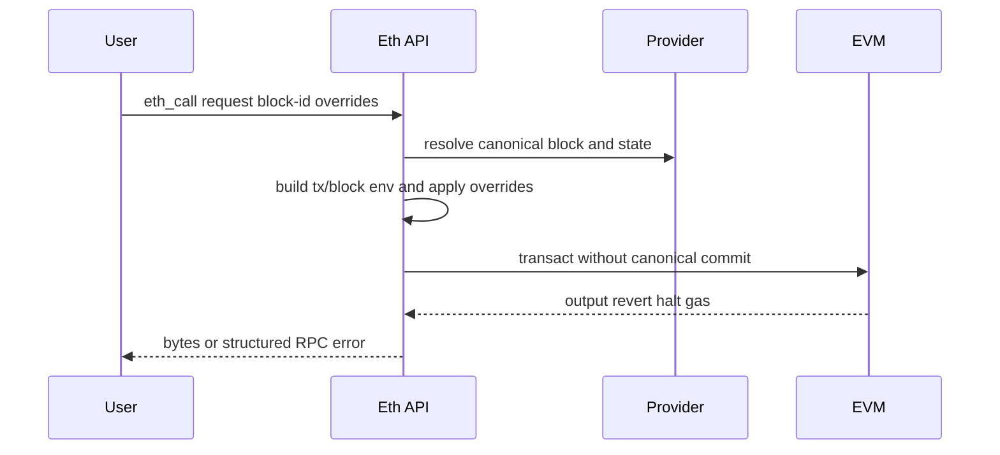

# 12. JSON-RPC、State Queries、Tracing 与 Engine API

## 1. Crate 地图

```text
reth-rpc-api           server/client trait definitions
reth-rpc-server-types  module/config/server shared types
reth-rpc-eth-types     eth implementation helpers/errors/cache types
reth-rpc-convert       internal primitives <-> Alloy RPC types
reth-rpc-eth-api       eth helper traits and execution/query logic
reth-rpc-engine-api    authenticated Engine endpoint handling
reth-rpc-builder       module and transport assembly
reth-rpc-layer         JWT/auth/middleware/limits
reth-rpc               admin/debug/eth/net/trace/txpool/web3/... implementations
reth-ipc               IPC transport
reth-rpc-e2e-tests     cross-module RPC regression
```

## 2. API trait 与实现分离

`rpc-api` 定义方法名、参数和返回类型；`rpc`/`rpc-eth-api` 实现。这允许：

- client/server 生成共享接口；
- 测试 mock API；
- 实现依赖 provider/pool/network，而接口 crate 保持轻量；
- transport HTTP/WS/IPC 复用同一方法语义。

## 3. 请求管线


错误需要从 provider/EVM/pool 类型映射为稳定 JSON-RPC code/message/data。不要把内部 debug 字符串直接暴露为公共契约。

## 4. Block ID 与 state view

RPC 可指定：

- number；
- hash，可能要求 canonical；
- `latest`、`earliest`、`pending`、`safe`、`finalized`。

解析后必须绑定到明确 block hash/state：如果先读 number->hash，再在 reorg 后按 number 读 state，可能混合两个分支。EIP-1898 的 hash+canonical 语义用于消除歧义。

## 5. `eth_call`



State/block overrides 只存在于此次模拟 overlay，绝不能写 canonical provider。

## 6. Gas estimation

估算不是简单执行一次。常见算法：

1. 先验证高上界是否成功；
2. 在 intrinsic gas 与上界之间二分；
3. 每次用相同初始 state 重新模拟；
4. 处理某些非单调 gas 行为和 allowance/balance cap；
5. 返回足够安全的最小/近似值。

理想二分复杂度 `O(log range)` 次 EVM 执行。实际必须防止恶意 call 让每次模拟都极慢，并设置总 cap/timeout。

## 7. Logs 与 filter

日志查询先用 block bloom 快速排除，再读取 receipts/logs 精确匹配 address/topics。Topic filter 的位置语义是 AND，各位置候选是 OR。

大范围查询可能扫描大量 blocks/static files，应设置最大 range/result，或分页。Bloom 假阳性只影响性能，不影响结果正确性。

## 8. PubSub 与 reorg

WS subscription 需要广播 newHeads/logs/pending tx。Reorg 时 logs 可能以 `removed=true` 再通知，订阅者必须能撤销先前结果。

慢订阅者不能阻塞 canonical state 主循环；使用有界 broadcast buffer，lag 后断开或报告丢失，让客户端重查。

## 9. Debug/Trace

Tracing 通过 revm inspector 收集 call/opcode/state diff。主要资源风险：

- 每 opcode 记录导致巨大内存；
- 历史 state reconstruction；
- 多交易/block trace 并行爆炸；
- JavaScript/custom tracer timeout；
- response serialization 巨大。

应限制并发、深度、步数、timeout、response bytes，并把 CPU 工作移出 async reactor。

## 10. Cache 正确性

RPC cache key 至少需要 chain/block hash 和完整请求语义。只按 block number 缓存会在 reorg 后返回旧链数据。Pending 查询还依赖 txpool snapshot，通常不能长缓存。

Negative cache 也要谨慎：当前不存在的 receipt/tx 可能稍后同步到达。

## 11. Engine API 特殊边界

Engine API：

- 使用 JWT authenticated HTTP；
- 面向本机/受控 CL，不应暴露公网；
- 方法版本与 fork/payload schema 严格绑定；
- response status 驱动 CL 行为，不能用普通 internal error 替代 `SYNCING/INVALID`；
- `getPayload` deadline/latency 比普通 RPC 更关键。

JWT 认证只证明共享 secret，不使 payload 自动有效，仍需全验证。

## 12. Middleware 次序

顺序会改变安全性：

```text
connection limit
 -> request body size
 -> auth
 -> rate/concurrency limit
 -> JSON decode
 -> method dispatch
 -> response size/logging
```

昂贵解析前先做便宜限制。Logging middleware 不应记录 JWT、raw signed tx 或超大 trace body。

## 13. RPC conversion

内部类型追求执行/存储效率，RPC 类型追求标准兼容。转换层处理：quantity hex、optional fork fields、transaction envelope、receipt status/root、block transaction mode。

转换不是无脑 `From`：部分转换需要 chain spec、sender、block context，失败应显式返回。

## 14. 语言无关思想

- transport/interface/implementation separation；
- bind query to immutable version/hash；
- simulation uses isolated overlay；
- query cost is not proportional to JSON size；
- slow consumer isolation；
- authentication and validation are independent boundaries。

## 15. 源码切片：Pending state 与 canonical state 的分派

```rust
// crates/rpc/rpc-eth-api/src/helpers/state.rs
fn state_at_block_id(
    &self,
    at: BlockId,
) -> impl Future<Output = Result<StateProviderBox, Self::Error>> + Send {
    async move {
        if at.is_pending() &&
            let Ok(Some(state)) = self.local_pending_state().await
        {
            return Ok(state)
        }

        self.provider()
            .state_by_block_id(at)
            .map_err(Self::Error::from_eth_err)
    }
}
```

Pending 优先读取本地构块产生的内存状态；其他 tag/hash/number 交给 provider，并且注释明确非 pending 只返回 canonical state。这样 side branch 不会因 RPC number 查询而泄漏。

这里故意对 `local_pending_state()` 使用 `Ok(Some(...))` 匹配：pending 构建不可用时仍可回退 provider 的 pending 语义，而不是让普通查询因临时 builder 状态失败。

## 16. 源码切片：通用异步二分

```rust
// crates/rpc/rpc-eth-types/src/utils.rs
pub async fn binary_search<F, Fut, E>(low: u64, high: u64, check: F) -> Result<u64, E>
where
    F: Fn(u64) -> Fut,
    Fut: Future<Output = Result<bool, E>>,
{
    let (mut low, mut high, mut num) = (low, high, high);
    while low <= high {
        let mid = (low + high) / 2;
        if check(mid).await? {
            high = mid - 1;
            num = mid;
        } else {
            low = mid + 1;
        }
    }
    Ok(num)
}
```

Gas estimation 等场景把一次 EVM 模拟包装成异步 `check(mid)`。`num` 保存目前已知最小成功值，循环结束返回边界。算法假设 predicate 近似单调；EVM 存在少数 gas-sensitive 行为，因此上层 estimate 代码还需要 allowance、失败类别和安全余量处理，不能把这个 helper 单独理解成完整估算器。
