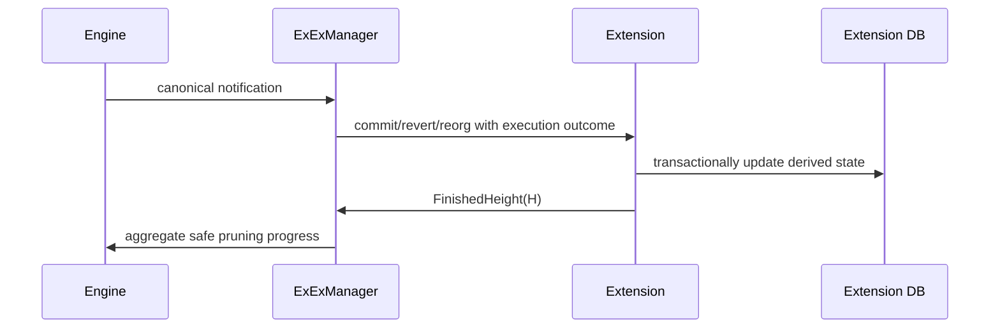

# 13. ExEx、Hooks 与扩展边界

## 1. Crate 与概念

- `reth-exex-types`：notification、event、finished-height 等轻量共享类型。
- `reth-exex`：context、manager、WAL、backfill、dynamic context。
- `reth-exex-test-utils`：notification 和 extension 测试工具。
- node builder hooks/add-ons：启动/RPC/组件扩展点，不等同 ExEx。

ExEx 是长期消费**已执行 canonical chain 变化**的服务，常用于索引、分析、证明生成。它不参与决定区块是否有效。

## 2. Notification 模型

```text
Commit(new_chain)
Revert(old_chain)
Reorg { old, new }
```

Reorg 不能压缩成“head 从 A 变 B”，因为扩展必须撤销旧链派生数据。



## 3. At-least-once 与幂等

节点/extension 在处理或确认之间崩溃，notification 可能重放。扩展必须：

- 用 block hash/number 记录自身 checkpoint；
- 同一 commit 重放不重复插入；
- revert 已撤销 block 时有明确行为；
- derived DB update 与 checkpoint 尽量同事务。

不要假设 channel “发过一次”就等于 exactly-once。Exactly-once 是 source offset 与 sink transaction 协调出的性质。

## 4. WAL

ExEx manager 的 WAL 缓冲 canonical notifications，使慢/重启扩展可追赶。WAL 需要：

- append 顺序与 canonical event 顺序一致；
- 校验 record framing/checksum；
- 截断只发生在所有相关扩展确认之后；
- 部分尾记录崩溃恢复；
- 容量和磁盘增长告警。

WAL 是 replay source，不替代扩展自己的业务事务。

## 5. Finished height 与 pruning

扩展报告 finished height 表示更早 notification 已处理完。若多个 ExEx：

```text
global_finished = min(each_extension_finished)
```

慢的扩展限制 WAL 清理/相关 pruning。这是消费者水位线算法，类似 Kafka consumer offset 或流处理 low watermark。

恶意/buggy extension 虚报高度会导致需要的数据被删；不报告则造成磁盘无限增长。该接口是安全与 liveness 边界。

## 6. Backfill

新安装扩展可能从历史高度开始：

1. 从 provider/pipeline 读取历史 executed chain；
2. 按 canonical 顺序生成通知；
3. 追到 live boundary；
4. 无缝切换实时 notification，不能丢块或重复未幂等处理。

切换点必须由 hash/checkpoint 定义，不能只比较“差不多同高度”。

## 7. Backpressure

如果 ExEx channel 有界，满时 engine 是否阻塞？如果无界，慢扩展会 OOM。Manager/WAL 将实时生产者与消费者解耦，但最终仍需：

- 最大 WAL/queue；
- slow consumer metric；
- operator policy：阻塞、停止节点、禁用扩展或丢数据；
- 明确一致性等级。

对索引器来说“静默丢 notification”通常最坏，因为结果看起来成功但不完整。

## 8. Hooks 与 ExEx 的区别

| 扩展点 | 生命周期 | 合适用途 |
|---|---|---|
| Builder hook | 启动某阶段一次 | 注入配置、观察组件、扩 RPC |
| AddOn | 节点外围服务 | RPC、middleware、auth |
| ExEx | 持续 canonical 事件流 | 索引、分析、派生数据库 |
| Invalid block hook | 验证失败事件 | dump/诊断，不改变判定 |

不要用启动 hook 注册一个无监督 detached task；优先纳入 node lifecycle 或 ExEx manager。

## 9. 扩展数据库事务

对 reorg：

```text
BEGIN
  delete derived rows for reverted hashes
  insert rows for committed hashes
  set checkpoint = new head hash
COMMIT
```

若数据量太大需分 batch，则中间 checkpoint 必须表达处理到 reorg 的哪一侧/哪个 block，保证恢复确定。

## 10. 语言无关思想

- canonical change as changelog；
- consumer watermark controls retention；
- replayable WAL + idempotent sink；
- live/backfill handoff at immutable cursor；
- extension failure isolation without silent data loss。

## 11. 源码切片：FinishedHeight 是 retention 承诺

```rust
// crates/exex/exex/src/event.rs
pub enum ExExEvent {
    /// Highest block processed by the ExEx.
    /// The ExEx must guarantee that it will not require all earlier blocks in the future,
    /// meaning that Reth is allowed to prune them.
    /// On reorgs, it's possible for the height to go down.
    FinishedHeight(BlockNumHash),
}
```

事件携带 `BlockNumHash` 而不是只有 number：同高度在 reorg 前后可能是不同 canonical block。注释说明它不只是“处理进度”，还是“以后不再需要更早数据”的承诺，Reth 可以据此 prune。

因此虚报会破坏安全，长期不报会破坏 liveness/磁盘上限。多个 ExEx 的全局水位线必须取最小值，因为只有所有消费者都越过的数据才可删除。

## 12. 源码切片：live/backfill 切换的显式状态

```rust
// crates/exex/exex/src/notifications.rs
enum ExExNotificationsInner<P, E>
where E: ConfigureEvm
{
    WithoutHead(ExExNotificationsWithoutHead<P, E>),
    WithHead(Box<ExExNotificationsWithHead<P, E>>),
    Invalid,
}

fn set_with_head(&mut self, exex_head: ExExHead) {
    let current = std::mem::replace(
        &mut self.inner,
        ExExNotificationsInner::Invalid,
    );
    self.inner = ExExNotificationsInner::WithHead(match current {
        ExExNotificationsInner::WithoutHead(n) => Box::new(n.with_head(exex_head)),
        ExExNotificationsInner::WithHead(n) => n,
        ExExNotificationsInner::Invalid => unreachable!(),
    });
}
```

`Invalid` 是移动所有权时的短暂哨兵：`replace` 先取出旧 enum，随后消费旧 variant 构造新 variant。Rust 禁止直接从 `&mut enum` 移出内部非 Copy 值，这种显式过渡既满足所有权规则，也使“不允许重入观察半转换状态”成为状态机不变量。
