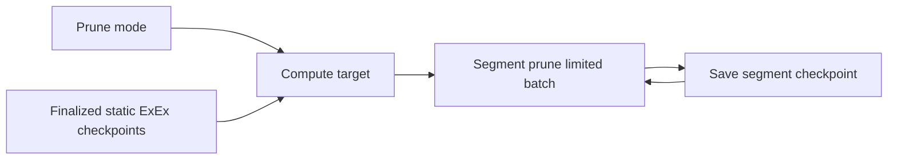
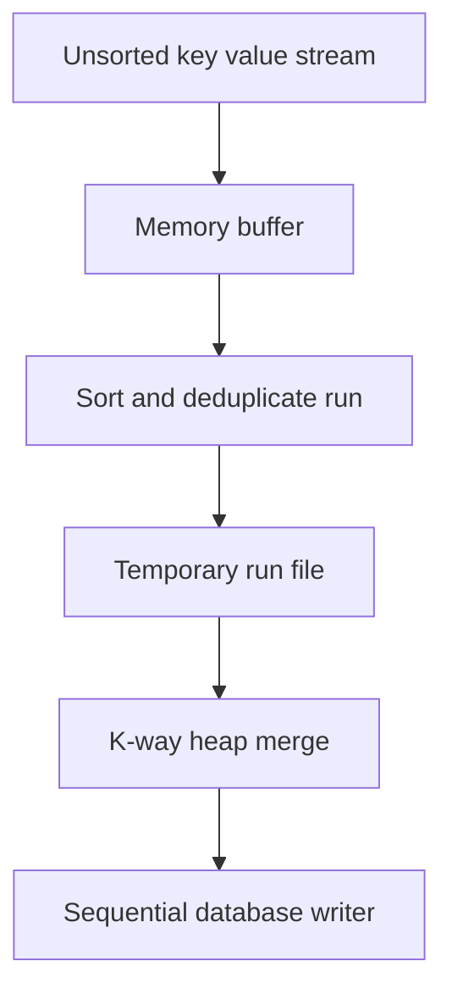

# 14. Pruning、ETL 与历史数据生命周期

## 1. Crate

- `reth-prune-types`：PruneMode、segment、checkpoint、target、event。
- `reth-prune`：pruner、limiter、segment 实现、DB extensions。
- `reth-etl`：外部排序/临时 collector。
- `reth-static-file`：finalized 历史迁移/segment producer。
- storage provider：真正删除/截断各后端数据。

## 2. Prune 不是简单删除旧 block

不同数据有不同保留需求：

```text
receipts / logs
transaction lookup
sender recovery
account history
storage history
changesets
trace-related historical state
```

用户可能要求 full archive、保留最近 N 块、保留到某高度、按合约地址保留日志。PruneMode 把策略转为确定 target。

## 3. Target 计算

若 tip 为 T，保留距离 D：

```text
prune_to = T - D
```

但还要受：

- finalized/safe 边界；
- stage checkpoint；
- static file 已安全复制高度；
- ExEx finished watermark；
- segment 上次 prune checkpoint；
- 最小保留窗口。

最终 target 通常取多个安全上界的最小值，而不是只看 head。

## 4. Segment 模型

每个 prune segment 拥有自己数据和 checkpoint：



单 segment 失败不应让其他 segment 的 checkpoint 假装完成。

## 5. PruneLimiter

删除量可能巨大，单 transaction 会长时间占 writer、产生大页面变化。Limiter 按 deleted entries、时间或 batch budget 中止，并返回 progress。

有限工作循环是 cooperative scheduling：保证节点继续处理 engine/RPC，不追求一次删完。

## 6. Static file producer 与 prune 的顺序

若某数据要从 DB 搬入 static files：

```text
copy range -> verify static segment durable/consistent -> advance static checkpoint -> prune source
```

绝不能先删后拷。若 static file 只覆盖到 S，source prune target 不得超过 S。

Storage V2 部分数据直接写 static files，但同样要遵守 segment durability 和 checkpoint。

## 7. Reorg 安全

通常只 prune 已足够稳定历史，changeset 又是深 reorg unwind 所需。过度 pruning 会使节点只能重同步而不能 unwind。

策略是业务选择：更小磁盘换更弱历史查询/深回滚能力。代码必须让这种取舍显式配置，而不是隐含在优化中。

## 8. Receipts log filter pruning

有些配置可删除大部分 receipts，但保留指定 contract 的 logs。这要求：

- 扫描 receipt logs 决定保留；
- 明确 receipt 其他字段是否还可返回；
- history/RPC 对“被配置 prune”返回规范错误/None；
- filter 规则变更不能自动恢复已删数据。

选择性保留是一种 predicate pushdown，但会改变数据完整性语义。

## 9. ETL 深入

外部排序 collector：



K-way merge heap 保存每个 run 当前最小 key，复杂度 `O(n log k)`，k 为 run 数。重复 key 决策必须明确：first/last/merge values，不能依赖文件遍历偶然顺序。

## 10. 临时文件恢复

ETL 临时文件不是权威状态：

- 进程崩溃后可删除重建；
- 路径必须限定在专用 ETL dir；
- 启动 cleanup 失败记录 warning/error；
- 不得把用户自定义任意目录递归删除；
- 磁盘空间要监控，避免与主 DB 互相挤满。

## 11. Tombstone 与物理空间

逻辑 delete 不一定立刻归还磁盘：MDBX 页面可能等待复用，RocksDB 需 compaction，static file 可能按 segment 重写/删除。Prune metric 应区分 logical entries 与 actual disk bytes。

## 12. 语言无关思想

- retention watermark = min of consumers/safety boundaries；
- copy-verify-delete migration；
- independent segment checkpoints；
- cooperative bounded maintenance；
- external sort converts memory pressure/random writes to sequential I/O；
- logical deletion != physical reclamation。

## 13. 源码切片：PruneMode 怎样计算安全目标

```rust
// crates/prune/types/src/mode.rs
pub fn prune_target_block_with_min(
    &self,
    tip: BlockNumber,
    segment: PruneSegment,
    purpose: PrunePurpose,
    min_blocks_override: Option<u64>,
) -> Result<Option<(BlockNumber, Self)>, PruneSegmentError> {
    let min_blocks = min_blocks_override.unwrap_or_else(|| segment.min_blocks());
    let result = match self {
        Self::Full if min_blocks == 0 => Some((tip, *self)),
        Self::Full if min_blocks <= tip => Some((tip - min_blocks, *self)),
        Self::Full => None,
        Self::Distance(distance) if *distance > tip => None,
        Self::Distance(distance) if *distance >= min_blocks => {
            Some((tip - distance, *self))
        }
        Self::Before(n) if *n == tip + 1 && purpose.is_static_file() => {
            Some((tip, *self))
        }
        Self::Before(n) if *n > tip => None,
        Self::Before(n) => {
            (tip - n >= min_blocks).then(|| ((*n).saturating_sub(1), *self))
        }
        _ => return Err(PruneSegmentError::Configuration(segment)),
    };
    Ok(result)
}
```

`Full` 仍受 segment 最小保留窗口约束，因此“全量 prune”不等于无条件删到 tip。`Distance` 大于 tip 时返回 `None` 而不是发生下溢。`Before(n)` 删除的是严格小于 n 的块，所以目标是 `n-1`。

Static-file purpose 对 `Before(tip+1)` 有特殊处理，是因为已归档到 static file 的 tip 可安全成为搬迁目标；普通 prune 则不能越过当前可证明安全的边界。

返回值同时携带实际 target 和 effective mode，避免调用者自己重复解释配置。语言无关上，这是把 retention policy 编译成一个经过边界校验的执行计划。

## 14. 源码切片：copy-then-delete

Pipeline 的 V1 迁移路径先调用 `copy_to_static_files()`，取已安全写入的最低高度，再用 pruner 删除源数据。V2 则直接返回，因为写入时已经路由到 static files/RocksDB。

这段分支把 storage schema migration 与普通 pruning 分开：删除决策依赖“目标副本已可验证”，而不是依赖“理论上应该已经复制”。
