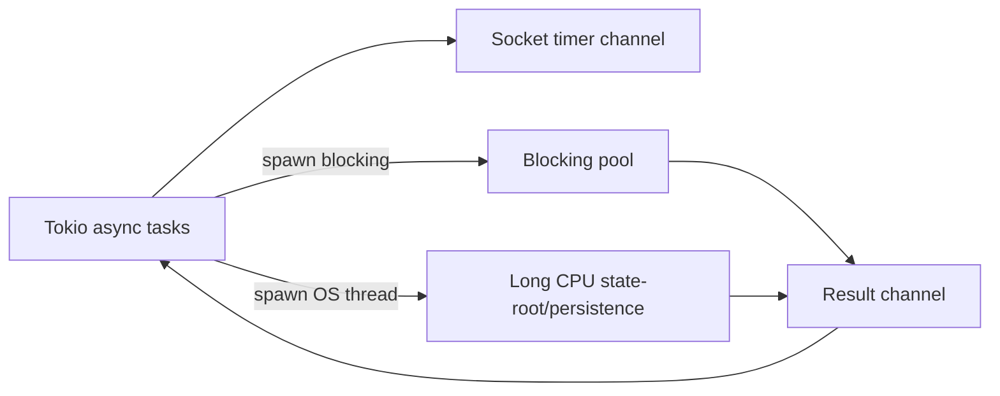
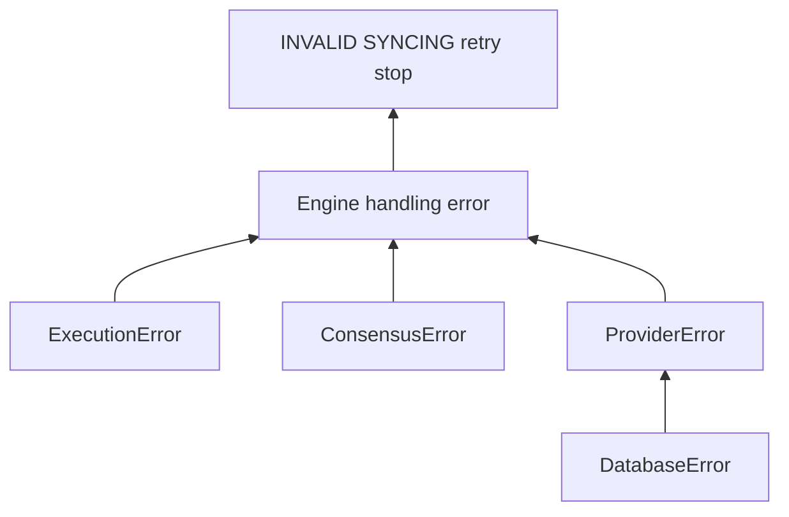

# 15. Runtime、Tasks、Metrics、Tracing 与错误治理

## 1. Crate

- `reth-tasks`：executor-agnostic spawn、critical/blocking task、panic handling。
- `reth-tokio-util`：Tokio 相关 future/stream/channel 辅助。
- `reth-metrics`：metric wrapper、metered channel、common instruments。
- `reth-tracing`：日志/formatter/filter 初始化。
- `reth-tracing-otlp`：OpenTelemetry export。
- `reth-errors`、各 `*-errors`：共享且分层的 typed error。
- `reth-node-events`、`reth-node-metrics`、`reth-node-ethstats`：节点事件汇总、运行指标、远端 ethstats。
- `reth-config`、node core args/dirs：配置与运行路径。

## 2. Task 分类

```text
critical task
  失败意味着节点核心不再正确，应传播到 NodeHandle 退出

background task
  可独立失败/重启，不能无意带倒节点

blocking task
  同步 I/O 或 CPU，放到 blocking pool/OS thread

scoped child task
  生命周期属于父任务，父取消时必须回收
```

分类应由业务语义决定，不是由代码作者觉得“重要”。

## 3. Async poll budget

一个 future 的 `poll` 应快速返回 `Pending/Ready`。如果循环一次处理完全部队列：

- 同 runtime worker 的 network timer/RPC 被饿死；
- latency 尾部变坏；
- watchdog 看似 runtime 活着但无公平性。

事件循环常设置 per-poll work budget，达到后主动 wake 并 yield。

## 4. Blocking 隔离



短 CPU 工作放 blocking pool；长期高占用任务可能用专用 OS thread，避免耗尽共享 blocking pool。线程数仍需有界。

## 5. Cancellation safety

Future 可在任意 `.await` 被 drop。若函数执行“取队列元素 -> await -> 写结果”，取消后元素可能永久丢失。解决：

- 在 await 前不做不可逆 take；
- 使用 guard，drop 时放回；
- 将不可取消事务放进独立 owner task；
- 显式状态机记录中间阶段。

对 DB transaction，取消点必须在事务外或确保 drop=rollback。

## 6. Channel 选择

| Channel | 用途 | 风险 |
|---|---|---|
| oneshot | 请求单响应 | receiver drop 后 sender 处理 |
| bounded mpsc | 命令/工作队列 | 正确 backpressure |
| unbounded mpsc | 低频控制事件 | burst 可 OOM |
| broadcast | 多订阅者事件 | lag/覆盖处理 |
| watch | 只关心最新状态 | 中间变化被合并 |
| crossbeam | 同步/OS thread | 不要阻塞 async worker |

选择 channel 实际是在选择丢失、顺序和背压语义。

## 7. Metrics 设计

### Counter

单调事件数：requests、invalid blocks、reorg count。

### Gauge

瞬时值：peer count、pool size、queue depth、stage height。

### Histogram

分布：execution duration、response bytes、DB commit latency。

避免把 block hash、tx hash、peer id 作为 label，基数无限会摧毁 metrics backend。错误类别用有限 enum label。

## 8. Metered channel

Channel wrapper 可记录 sent/received/capacity/queue length。它能揭示生产消费失衡，但 queue length=0 既可能健康，也可能消费者饿死无输入；必须与吞吐和 latency 一起判断。

## 9. Tracing span

一个有用 span 包含稳定上下文：component、method、block number/hash（日志字段可高基数）、duration、outcome。跨 async task 传播 span，才能把 Engine request 与 proof/persistence 子任务关联。

日志级别：

- error：需要 operator 行动/核心失败；
- warn：可恢复但异常；
- info：低频生命周期；
- debug/trace：诊断和 hot-path 细节。

## 10. Typed error 分层



`From` 转换应保留 cause 类型。顶层 `eyre` 适合 CLI report，不应过早把库错误擦成动态字符串。

## 11. Panic 策略

Panic 表示程序 invariant 被破坏，不用于 peer 发送坏数据。关键 task panic 应被 task executor 捕获并传播 node shutdown；静默丢失 JoinHandle 会让节点部分死亡却继续服务。

Unsafe 代码尤其需要 SAFETY 注释和 Miri/fuzz/边界测试，说明别名、对齐、生命周期不变量。

## 12. 配置优先级

常见来源：defaults < config file < CLI flags（精确规则看实现）。配置 merge 必须让 operator 能输出 effective config，并区分：

- 启动后不可变的 schema/chain setting；
- 可热更新策略；
- 危险 debug skip；
- secret（JWT、keys）不得写日志。

## 13. 可观测性不能改变 hot path

- metric update 应低开销、无分配或有限；
- tracing field 延迟格式化；
- profiler feature 不默认开启昂贵采样；
- exporter 网络失败不能阻塞 consensus/engine；
- telemetry queue 有界。

## 14. 语言无关思想

- structured concurrency and failure propagation；
- channel choice defines semantics；
- bounded work per scheduling turn；
- typed errors separate mechanism from policy；
- low-cardinality metrics, high-cardinality logs/traces；
- effective configuration is inspectable state。

## 15. 源码切片：Critical task 不允许静默死亡

```rust
// crates/tasks/src/lib.rs
#[must_use = "TaskManager must be polled to monitor critical tasks"]
pub struct TaskManager {
    task_events_rx: UnboundedReceiver<TaskEvent>,
    signal: Option<Signal>,
    graceful_tasks: Arc<AtomicUsize>,
}

impl Future for TaskManager {
    type Output = Result<(), PanickedTaskError>;

    fn poll(mut self: Pin<&mut Self>, cx: &mut Context<'_>) -> Poll<Self::Output> {
        match ready!(self.as_mut().get_mut().task_events_rx.poll_recv(cx)) {
            Some(TaskEvent::Panic(err)) => Poll::Ready(Err(err)),
            Some(TaskEvent::GracefulShutdown) | None => {
                if let Some(signal) = self.get_mut().signal.take() {
                    signal.fire();
                }
                Poll::Ready(Ok(()))
            }
        }
    }
}
```

Tokio task panic 默认只体现在 `JoinHandle`；若 handle 被丢弃，节点可能“网络还活着、Engine 核心已死”。Reth 让 critical task 把 panic 变成 `TaskEvent::Panic`，TaskManager 再以 future error 形式传播到节点生命周期。

`#[must_use]` 防止构造 TaskManager 后忘记 poll。`signal.take()` 保证 shutdown 只触发一次。Manager 被 drop 时持有的 Signal 也构成兜底关闭语义。

## 16. 源码切片：OS thread 继承 Tokio 上下文

```rust
pub fn spawn_os_thread<F, T>(name: &str, f: F) -> thread::JoinHandle<T>
where
    F: FnOnce() -> T + Send + 'static,
    T: Send + 'static,
{
    let handle = Handle::try_current().ok();
    thread::Builder::new()
        .name(name.to_string())
        .spawn(move || {
            let _guard = handle.as_ref().map(Handle::enter);
            f()
        })
        .unwrap_or_else(|e| panic!("failed to spawn thread {name:?}: {e}"))
}
```

State-root 等长期 CPU 工作需要专用 OS thread，但其中仍可能调用依赖 `Handle::current()` 的辅助逻辑。显式 `enter` 传播 runtime context，同时没有把 CPU 工作放回 async worker。线程名也进入 profiler 和崩溃诊断。
