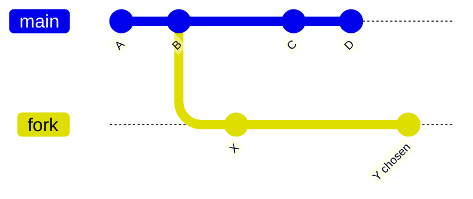

# 16. 测试、Benchmark、Fuzz 与 Examples

## 1. 测试金字塔不是只按数量分层

| 类型 | 证明什么 | 不能证明什么 |
|---|---|---|
| unit test | 局部规则/边界 | 组件接线和真实后端 |
| property test | 大输入空间不变量 | 与官方规范完全一致 |
| fuzz | parser/state machine 不崩溃、发现样例 | 没跑到的语义正确性 |
| integration | crate 间契约 | 主网规模/互操作 |
| EF tests | EVM/state transition 规范 fixture | P2P/RPC/长期运行 |
| e2e | 实际节点控制流 | 所有网络环境 |
| Hive/interop | 多客户端协议兼容 | 性能和长期稳定 |
| benchmark/profile | 特定条件性能 | 协议正确性 |

必须先声明要证明的性质，再选择测试。

## 2. Crate-local tests

Reth 常把 unit tests 与实现同模块，能访问 private helper；大型 suite 放 `tests/`。测试命名应表达条件和期望，不写泛化 `test_component_behavior`。

对状态机使用表驱动：

```text
given state + event -> expected state + outputs + side effects
```

同时断言“没有发生”的副作用，如 invalid payload 未写 DB。

## 3. Property tests

适合：

- codec roundtrip：`decode(encode(x)) == x`；
- trie updates 与从零重建 root 相同；
- unwind(execute(state)) 恢复原状态；
- history shard 有序无重复；
- txpool index/subpool size 一致；
- multiproof 可重建单 proofs。

Property generator 要覆盖删除、空值、最大整数、fork 边界，不只随机“正常值”。

## 4. Fuzz

高价值 target：RLP/wire/ERA/static-file decoder、transaction envelope、proof decoder、RPC input conversion。

Fuzz invariant：

- 不 panic/OOM/无限循环；
- 输入长度与分配有合理比例；
- 成功解码后 re-encode canonical；
- 两实现 differential 一致；
- 错误不污染持久状态。

内部 NippyJar/Compact 不承诺恶意安全，但 fuzz 仍可发现 corruption handling bug；不要因此把它公开为网络格式。

## 5. Differential testing

当存在两条实现：

- interpreter vs JIT；
- legacy trie root vs sparse/parallel root；
- Reth vs reference client/EF expected output；
- storage V1 vs V2 logical provider result。

对同一输入比较规范输出，而不是比较内部数据布局。这是优化高风险算法最强回归门之一。

## 6. Reorg 测试模板



断言：canonical head、state、receipts、pool reinjection、RPC notification、ExEx derived state、persistence checkpoint 全部一致。只断言 head hash 不足。

## 7. Crash consistency 测试

在多阶段写入的每个边界注入失败：

```text
before data write
after backend A
after backend B
before checkpoint
after checkpoint
```

重开数据库，运行 consistency/recovery，再比较 logical provider view。故障注入应可重复，不依赖真正 kill 的随机时机。

## 8. Benchmark

### Microbenchmark

测 codec/hash/cursor/proof 单操作，用 Criterion，控制 input distribution。

### Component benchmark

测一个 block execution/state root/pool batch/download scheduling。

### Macrobenchmark

真实历史区间 sync、RPC workload、reorg、snapshot import。

报告至少包含：commit hash、profile、CPU、RAM、disk、dataset、cache warm/cold、并发、样本分布。只报平均值会隐藏 tail latency。

## 9. Examples 是可编译文档

优先用下列示例学习扩展边界：

```text
node-builder-api          最小节点装配
custom-node-components   替换组件
custom-evm/inspector      执行配置与观察
custom-hardforks          规则上下文
custom-payload-builder    构块策略
custom-state-root         root hook/策略
node-custom-rpc           RPC 注入
custom-rpc-middleware     transport middleware
custom-rlpx-subprotocol   capability 扩展
db-access/rpc-db          provider 与数据库
exex-subscription/test    canonical 消费者
network/manual-p2p        网络栈
```

示例应保持最小，生产安全配置另行说明。不要直接复制 example 的无认证监听地址到生产。

## 10. 常用验证命令

```bash
cargo +nightly fmt --all --check
cargo nextest run -p <package>
cargo +nightly clippy -p <package> --all-features --tests
cargo check --workspace --all-features
cargo nextest run --workspace
make ef-tests
```

CLI 变化运行 `make update-book-cli`；依赖变化运行 `zepter` 和 `make lint-toml`。不要手改自动生成 CLI pages。

## 11. Test doubles

- Noop：合法但不做事，用于不关心的能力。
- Mock：可编程期望/返回。
- Fake：轻量真实实现，如内存 provider。
- Harness：启动多真实组件。

Mock 太深会复制实现逻辑并得到虚假安全感。存储/Engine 关键路径优先 fake temp DB 和 e2e harness。

## 12. 测试隔离

- 每测试独立 temp datadir/ports；
- RNG 可由 `SEED` 固定；
- 时间使用可控 clock/timeout；
- 不依赖测试执行顺序；
- async task 必须 shutdown/join；
- privilege/network-dependent test 明确 skip，而不是假 pass。

## 13. 贡献工作流

```text
复现失败
 -> 写最小回归测试
 -> 定位拥有不变量的模块
 -> 做聚焦修改
 -> 局部 fmt/test/clippy
 -> 扩展 workspace/EF/e2e 验证
 -> 检查 diff 和生成文档
```

性能改动还需 before/after benchmark；安全/共识改动需 reference fixture 或 differential evidence。

## 14. 源码分析：为什么测试也按能力拆 crate

Reth 将 `reth-testing-utils`、`reth-e2e-test-utils`、`reth-exex-test-utils` 和 `reth-rpc-e2e-tests` 分开，原因与生产 crate 相同：测试替身也有依赖成本和语义边界。

- primitive generator 不应为了启动 HTTP server 引入 Tokio/jsonrpsee；
- ExEx notification fake 不应依赖完整网络；
- RPC e2e 才需要把 node、transport、provider 和 response conversion 一起装配；
- EF runner 读取规范 fixture，比较的是 state transition 输出，不验证 P2P 生命周期。

## 15. 源码级验证模式拆解

### 同输入双实现对拍

```rust
let expected = reference_state_root(input.clone())?;
let actual = parallel_sparse_state_root(input)?;
assert_eq!(actual, expected);
```

关键不是这三行测试代码，而是比较边界：两边可以使用完全不同的 cache、thread 和 proof 算法，只比较共识输出。这样性能重构不会把旧实现的内部结构错误地固化为测试契约。

### Forward/unwind 对偶

```rust
let before = provider.snapshot()?;
stage.execute(&mut provider, input)?;
stage.unwind(&mut provider, unwind_input)?;
assert_eq!(provider.logical_state()?, before);
```

这里应比较 logical provider view，而不是底层页面或文件字节；MDBX/RocksDB/static files 在回滚后物理布局可以不同，但对上层暴露的状态必须相同。

### Crash point 矩阵

跨后端测试在每个持久化边界注入故障，再重新打开 provider 并运行 consistency check。最终断言是“恢复到旧 checkpoint”或“完成新 checkpoint”，不能出现介于两者之间、查询看似成功但索引缺失的状态。

这些测试模式分别证明确定性、可逆性和崩溃一致性，比要求读者自行设计练习更直接地揭示 Reth 的工程方法。
