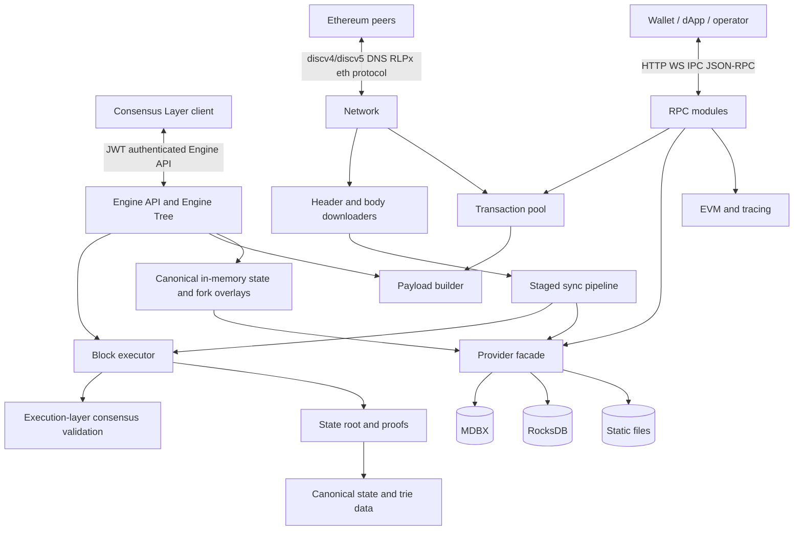
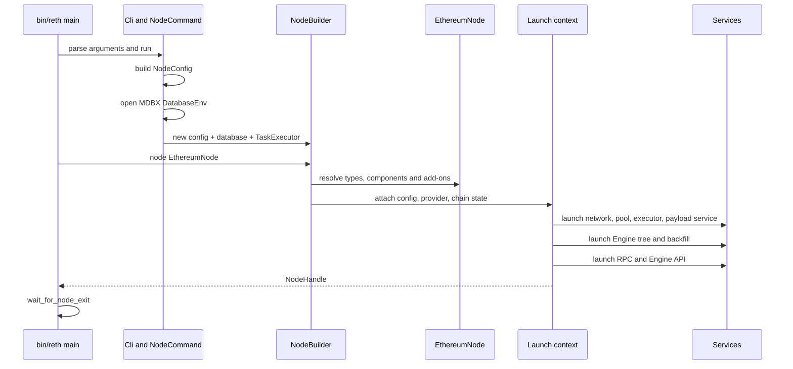
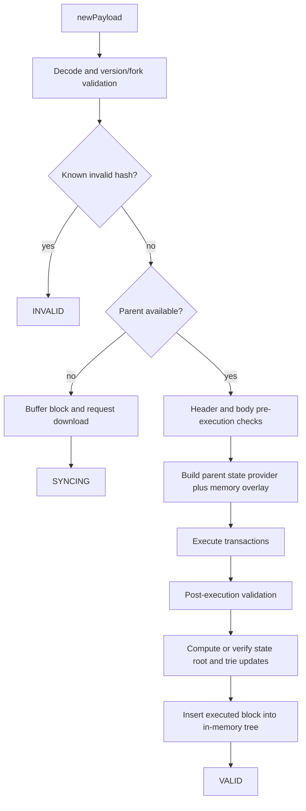
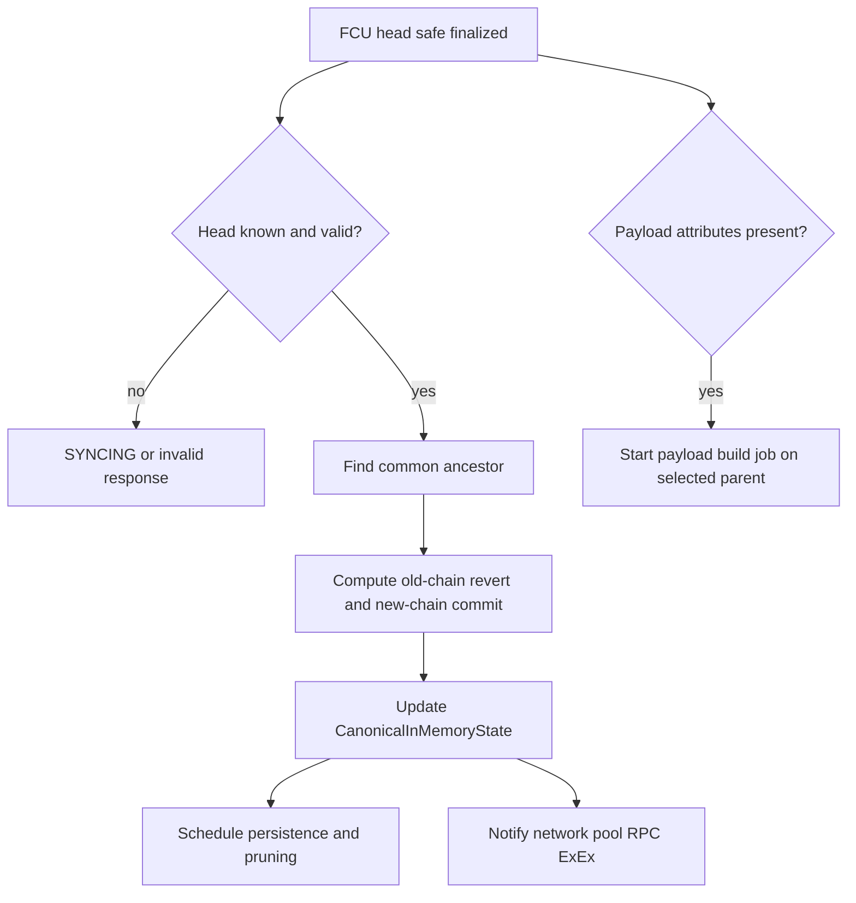
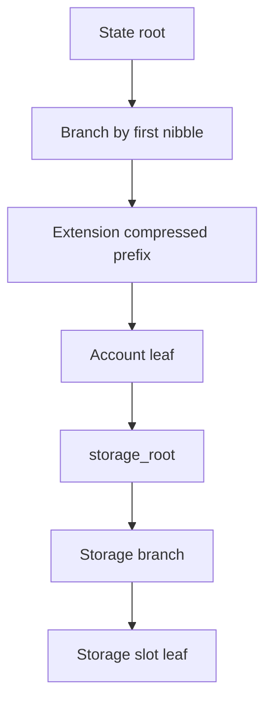
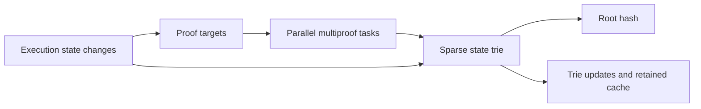
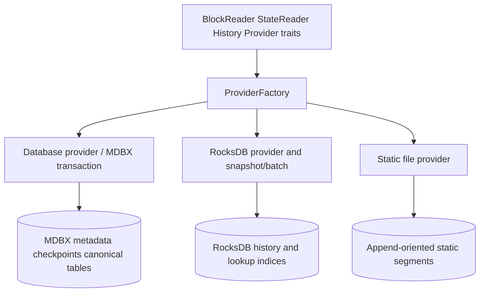
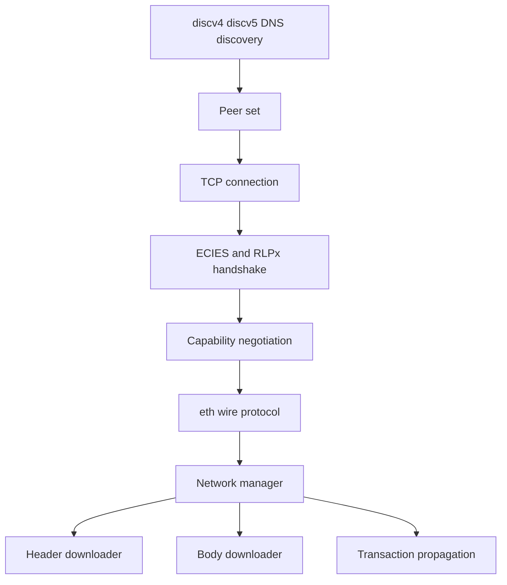
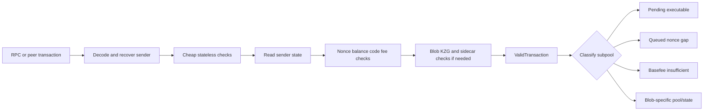
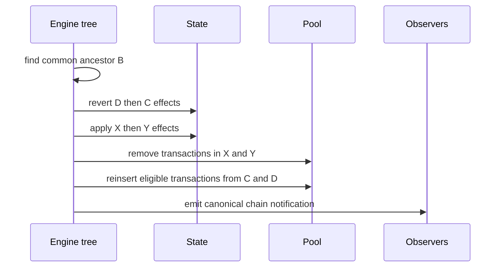

# Reth 全栈学习指南：从 BTC/Geth 经验到现代 Ethereum 执行客户端

> 面向读者：读过较多 Bitcoin Core 代码、只接触过少量 Geth 源码、刚开始系统学习 Rust 与 Ethereum 客户端。
>
> 源码基线：本仓库当前版本 `2.4.0`，Rust Edition 2024。本文以 2026-07-21 的本地源码为准。Reth 演进很快，本文直接解释当前关键源码与不变量，仓库源码和测试仍是最终事实。
>
> 深入学习：本文是根指南。逐子系统、逐 crate 的第二层资料见 [[reth-learning-index|Reth 深度模块学习树]]。

## 0. 先建立正确预期

“学完 Reth”不是记住每个 crate，而是建立五张能够互相切换的地图：

1. **协议地图**：区分 Ethereum 的执行规则、数据可用性、PoS 共识和 Engine API。
2. **数据地图**：一笔交易怎样从网络进入交易池，怎样进入区块、执行、计算根并落盘。
3. **控制流地图**：初始同步、实时跟头、分叉切换、回滚分别由谁驱动。
4. **依赖地图**：trait 是边界，具体类型是某条链的策略，builder 是装配点。
5. **性能地图**：CPU、磁盘、网络和内存分别在哪里成为瓶颈，Reth 如何把它们解耦。

本文以真实请求的纵向调用链组织内容，再横向拆开其经过的模块。第一条主链是：

```text
bin/reth/src/main.rs
  -> crates/cli/commands/src/node.rs
  -> crates/node/builder/
  -> crates/ethereum/node/src/node.rs
  -> crates/engine/tree/
  -> crates/ethereum/evm/
  -> crates/storage/provider/
```

## 1. 从 Bitcoin 的心智模型迁移到 Ethereum

### 1.1 相同之处

两者都需要解决：

- 不信任网络输入：所有网络数据最终都要经过本地验证。
- 区块链选择：本地必须区分 canonical chain、side chain 和 invalid chain。
- 可回滚状态：链重组时要撤销旧链影响，再应用新链影响。
- 内容寻址：交易、区块头、状态节点大量使用哈希建立不可篡改关系。
- 磁盘索引：共识数据布局和高效查询布局不是一回事。
- mempool 不是共识：交易池策略可以不同，但打包进块后的有效性必须一致。

### 1.2 最重要的不同

| 维度 | Bitcoin | Ethereum / Reth |
|---|---|---|
| 状态模型 | UTXO 集 | 账户、nonce、余额、代码、合约 storage |
| 执行 | Script，能力受限 | EVM，带 gas 的通用状态机 |
| 状态承诺 | 区块头主要承诺交易 Merkle root | 区块头还承诺全局 `state_root`、receipts root 等 |
| 共识 | 节点内含 PoW 链选择 | Merge 后 CL 与 EL 分离，Reth 是 EL |
| 组块驱动 | 矿工本地选择交易并挖矿 | CL/validator 经 Engine API 请求 EL 构造或验证 payload |
| 历史查询 | 主要围绕区块、交易、UTXO | 还包括任意历史高度的账户/storage、日志和 trace |
| 重组 | disconnect/connect blocks | 内存 fork tree + state overlay + 持久化/unwind |

最容易犯的错误是把 `EthBeaconConsensus` 当作完整 PoS 共识。它验证的是**执行层可检查的区块规则**；validator set、attestation、LMD-GHOST、Casper FFG 等属于 Lighthouse/Prysm/Teku/Lodestar 这样的共识层客户端。

## 2. 一张图看懂 Reth



可以把节点分成三层：

- **边缘层**：P2P、普通 RPC、认证 Engine API，负责接收不可信输入。
- **决策层**：consensus validation、EVM、fork tree、pipeline、txpool policy。
- **数据层**：provider 抽象、MDBX、RocksDB、static files、内存 overlay、trie。

语言无关的设计思想是：**让协议输入、确定性计算和物理存储彼此解耦**。这样换数据库、换链规则、换 RPC transport 时，不必改写整个节点。

## 3. Workspace 与 crate 边界

Reth 是一个大型 Cargo workspace。不要把“一个 crate”理解成一个独立进程；多数 crate 是编译期模块边界。

### 3.1 主要目录

| 路径 | 责任 | 初读入口 |
|---|---|---|
| `bin/reth/` | 最终 CLI 二进制 | `src/main.rs` |
| `crates/ethereum/` | Ethereum 特定类型、fork、EVM、consensus、node 装配 | `node/src/node.rs` |
| `crates/node/` | 通用节点 API、类型、builder、启动流程 | `builder/src/builder/mod.rs` |
| `crates/engine/` | Engine API 实时链树、backfill、持久化协调 | `tree/src/tree/mod.rs` |
| `crates/stages/` | 大范围历史同步 pipeline | `api/src/pipeline/mod.rs` |
| `crates/evm/`, `crates/revm/` | EVM 配置、执行接口、Reth 与 revm 适配 | 各 crate `src/lib.rs` |
| `crates/consensus/` | 通用执行层验证 trait | `consensus/src/lib.rs` |
| `crates/trie/` | MPT、proof、sparse trie、并行 state-root | `parallel/src/state_root_task.rs` |
| `crates/storage/` | DB trait、表、provider、编码与后端 | `provider/src/lib.rs` |
| `crates/static-file/` | 冷/不可变数据的列式静态文件 | `static_file/src/lib.rs` |
| `crates/net/` | discovery、RLPx、eth wire、peer、downloaders | `network/src/lib.rs` |
| `crates/transaction-pool/` | 验证、子池、排序、blob sidecar | `src/lib.rs` |
| `crates/payload/` | payload builder 服务和通用类型 | `builder/src/lib.rs` |
| `crates/rpc/` | API trait、实现、server、middleware | `rpc/src/lib.rs` |
| `crates/exex/` | Execution Extension | `exex/src/lib.rs` |
| `examples/` | 最小可运行的扩展示例 | 先读 `node-builder-api` |

### 3.2 为什么拆得这么细

- 缩小依赖面，避免网络 crate 随意依赖具体数据库。
- 独立测试和 benchmark。
- 通过 feature 控制最终二进制内容。
- 允许下游只复用 network、provider、EVM 或 node builder。
- 用编译器检查架构边界，而不是只靠团队约定。

代价是泛型类型很长、跳转多、编译时间高。本文先解释 trait 的语义，再给出 Ethereum 的具体实现，不展开与结论无关的全部泛型。

## 4. 节点如何启动

### 4.1 启动时序



### 4.2 关键代码

`bin/reth/src/main.rs` 很薄：

- 安装 allocator 和崩溃处理。
- 用 `clap` 解析 `Cli<EthereumChainSpecParser>`。
- 调用 `builder.node(EthereumNode::default())`。
- 启动 debug-capable node，等待退出。

`crates/cli/commands/src/node.rs` 把参数聚合成 `NodeConfig`，打开数据库，再创建 `NodeBuilder`。CLI 并不知道交易池或 EVM 的具体实现。

`crates/ethereum/node/src/node.rs` 是最重要的**组合根**：

```text
EthereumNode
  Primitives = EthPrimitives
  ChainSpec  = ChainSpec
  Storage    = EthStorage
  Payload    = EthEngineTypes

components()
  pool       = EthereumPoolBuilder
  executor   = EthereumExecutorBuilder
  payload    = BasicPayloadServiceBuilder<EthereumPayloadBuilder>
  network    = EthereumNetworkBuilder
  consensus  = EthereumConsensusBuilder
```

这种“薄 main + 组合根”是语言无关的好设计：业务对象不在入口函数中手工 `new` 成一团，而在一个显式装配层集中决定实现。

### 4.3 Type-state builder

Node builder 的不同阶段携带不同泛型类型。没有配置完组件的 builder 在类型上就不能 `launch()`。这把“运行时启动到一半才发现少了组件”的错误提前为编译错误。

可迁移思想：当初始化顺序复杂且错误昂贵时，让每一步返回不同的类型，而不是在一个对象里保存大量 `Option<T>`，最后运行时检查。

## 5. Reth 的类型系统怎样表达架构

### 5.1 Trait 是能力，不是继承树

例如高层代码通常只要求 provider 同时具备若干能力：

```text
BlockReader
+ StateProviderFactory
+ DatabaseProviderFactory
+ StageCheckpointReader
+ RocksDBProviderFactory
```

它不关心对象是否叫 `ProviderFactory`。这与 Go 的小 interface 类似，但 Rust 还可通过 associated type 精确约束 `Block`、`Receipt`、`ProviderRW` 等关联类型。

### 5.2 Associated type 与泛型参数

- 泛型参数表示“调用者可同时选择多个实现”。
- associated type 表示“实现某 trait 后，这个类型唯一决定其相关类型”。
- `where` 子句是在编译期声明组件兼容性。

超长签名可以还原成一句架构约束。例如：

```text
N 必须是一个完整节点；它的 chain spec 必须能回答 Ethereum hardfork；
它的 EVM 必须能为下一个区块构造环境。
```

### 5.3 `Arc`、handle 与 channel

- `Arc<T>`：跨线程共享所有权，不代表内部一定可变。
- `Arc<Mutex<T>>` / `RwLock`：共享可变状态，但要关注锁粒度。
- `Handle`：通常是服务的轻量命令入口，背后通过 channel 驱动单所有者 task。
- `oneshot`：一次请求一次响应。
- `mpsc`：多生产者事件流。
- `crossbeam_channel`：常用于同步/OS 线程和 CPU 工作流。

Reth 经常选择“一个 task 独占复杂状态，其他组件发消息”，因为它比让所有线程共同加锁修改 fork tree 更容易维护不变量。

## 6. 一笔区块从 Engine API 到 canonical chain

Merge 后，CL 主要通过两类调用驱动 EL：

- `engine_newPayloadV*`：这是一个候选执行 payload，请验证并返回状态。
- `engine_forkchoiceUpdatedV*`：告诉 EL head/safe/finalized，并可能附带 payload attributes 要求开始构块。

### 6.1 `newPayload` 概念流程



返回 `SYNCING` 不是“区块暂时有效”，而是本地缺少足够上下文，不能完成验证。无上下文时绝不能猜测有效性。

### 6.2 `forkchoiceUpdated` 概念流程



Engine tree 保存近期已执行分支、detached block buffer、invalid header cache、forkchoice tracker 和内存 state overlay。数据库中的 canonical state 是稳定底座，内存 overlay 表示尚未持久化的近期链。

### 6.3 为什么是 tree 而不是只写数据库

链头附近分叉频繁。如果每个候选 payload 都立刻改写 canonical DB：

- 无效/落选分支会制造大量随机写和回滚。
- 并发 payload 验证难以隔离。
- CL 尚未决定 head 时，EL 过早作出 canonical 决策。

所以 Reth 先执行到内存树，forkchoice 决定 canonical 后再协调持久化。这是通用的 **speculative execution + commit** 模式。

## 7. 两套同步控制流：pipeline 与 engine tree

### 7.1 为什么需要两套

- 距离链头很远：数据量大、分叉价值低，批处理吞吐最重要，使用 staged pipeline。
- 链头附近：单块延迟、分叉、CL 交互最重要，使用 engine tree。

当前 tree 代码以一个 epoch 的 slot 数作为默认分界思想：较大缺口更适合 pipeline backfill，而不是逐块塞入 tree。具体阈值以 `crates/engine/tree/src/tree/mod.rs` 为准。

### 7.2 Pipeline 阶段

典型正向顺序是：


还存在 ERA 下载/导入、prune 等路径，实际组装会依配置和存储版本变化。

各阶段的核心意义：

| Stage | 输入/输出 | 为什么独立 |
|---|---|---|
| Headers | 下载并验证 header 链 | 小数据先确定骨架与目标 |
| Bodies | 按 header 下载交易体 | 网络 I/O 与 header 解耦 |
| SenderRecovery | ECDSA 恢复发送者 | CPU 密集，可批量并行，后续反复复用 |
| Execution | 依序执行交易，产出 state changes/receipts | 必须尊重状态依赖 |
| Account/StorageHashing | plain key 转 Keccak key | 为 trie 的随机化 key space 准备 |
| Merkle | 更新 MPT 并核对 state root | 把昂贵承诺计算独立 checkpoint |
| TransactionLookup | tx hash 到内部编号索引 | RPC 查询优化，不是区块共识本身 |
| History Index | 地址/slot 到变更块索引 | 历史状态查询优化 |
| Finish | 发布完成进度 | 形成清晰提交边界 |

### 7.3 Checkpoint、batch 与 unwind

每个 stage 保存 checkpoint，并以有限 batch 前进。好处：

- 崩溃后从 checkpoint 恢复，而不是重来。
- 限制单事务大小和内存峰值。
- 用阶段进度暴露可观测性。
- 出现坏链或重组时按逆序 unwind。


通用思想：复杂批处理系统不应只有 `run()`，还应把进度、幂等性、补偿操作和恢复协议作为一等设计对象。

## 8. 执行与 revm

### 8.1 一笔交易的状态转换

高层可写成：

```text
pre-check
  -> 验证交易类型、签名恢复结果、nonce、余额、intrinsic gas、fork 条件
  -> 预扣最大 gas 成本并增加 nonce
  -> 执行 CALL/CREATE 和嵌套调用帧
  -> 记录 journaled state、logs、selfdestruct 等
  -> 退款规则与实际 gas 结算
  -> 给 coinbase 记账 priority fee
  -> 生成 receipt
```

Reth 不自己重写一套 EVM 解释器，而是通过 `crates/evm/` 和 `crates/ethereum/evm/` 配置 revm。分层大致为：

- revm：解释器、journal、precompile、数据库接口等执行核心。
- `reth-revm`：把 Reth provider/state 适配为 revm 可读取的 database。
- `reth-evm`：链无关的 EVM factory/configure/executor trait。
- `reth-evm-ethereum`：Ethereum fork 到 revm spec、block env、tx env 的映射。

### 8.2 Gas 的真正作用

Gas 同时解决三个问题：

1. 给每种计算和存储操作定价，约束最坏资源消耗。
2. 遇到异常或耗尽时提供确定性中止规则。
3. 形成区块容量市场。

`gas_limit` 是允许消耗的计算预算，`gas_used` 是实际消耗；它不是 CPU 时间。不同机器必须得到完全相同结果，所以共识代码不能读取不确定时钟、随机数或本地浮点状态。

### 8.3 EIP-1559 公式

在常见情形下，base fee 根据父块相对目标 gas 的偏差调整，单块最大变化受分母约束：

```text
target = parent_gas_limit / elasticity_multiplier
delta  ≈ parent_base_fee * (parent_gas_used - target)
         / target / base_fee_change_denominator
```

用户实际支付的每 gas 价格受 `max_fee_per_gas` 与 `base_fee + max_priority_fee_per_gas` 共同限制。base fee 被销毁，priority fee 给 fee recipient。对应实现分布在 consensus common 的 fee/validation 逻辑和 Ethereum EVM 环境构造中。

### 8.4 为什么顺序执行仍能并行优化

同一区块交易有读写依赖，语义上按顺序执行。但周边工作可以并行：

- sender recovery；
- proof/multiproof 获取；
- state-root 子任务；
- 历史索引构建；
- 网络下载；
- 不改变结果的预取和 cache。

关键原则是：**并行化数据准备和可证明独立的计算，不改变协议规定的提交顺序**。

## 9. 执行层共识验证

`crates/ethereum/consensus/src/lib.rs` 中的 `EthBeaconConsensus` 大致分三层验证：

### 9.1 Header standalone

- post-Merge difficulty 必须为零、nonce 为零、ommers root 为空。
- extra data 长度、gas 字段、base fee 合法。
- Shanghai 后 withdrawals root 必须出现，之前不得出现。
- Cancun 及后续 fork 的 blob gas 等字段必须符合激活条件。

### 9.2 相对 parent

- parent hash 与 number 连续。
- timestamp 单调。
- gas limit 变化范围。
- EIP-1559 base fee 从 parent 正确推导。
- EIP-4844 excess blob gas 等跨块规则。

### 9.3 Body 与 post-execution

- transaction root、ommers、withdrawals 等与 header 匹配。
- 执行后的 receipts root、logs bloom、gas used、requests hash 等与 header 匹配。
- state root 由状态计算路径核对。

设计思想：便宜、无需状态的检查尽量前置；昂贵执行后才能知道的检查放最后。对任何不可信输入系统都应采用 **cheap rejection before expensive work**。

## 10. Ethereum 状态与 Merkle Patricia Trie

### 10.1 账户模型

一个 Ethereum 账户的核心字段：

```text
nonce
balance
storage_root
code_hash
```

外部账户通常无代码；合约账户的 storage 是另一棵以 slot 为 key 的 trie。全局 state trie 的 leaf value 承诺账户字段，因此状态树是“账户树包含各合约 storage tree 根”的两层结构。

### 10.2 为什么 key 要 Keccak

trie 中使用 `keccak(address)` 和 `keccak(slot)`，使外部可控、可能拥有共同前缀的 key 均匀分布，避免构造病态深前缀。代价是失去原始 key 的自然顺序，所以数据库常同时需要业务友好的表示、hashed 表示或索引。

### 10.3 MPT 节点

- Branch：最多 16 个 nibble child，加可选 value。
- Extension：压缩只有一个孩子的公共路径。
- Leaf：压缩剩余路径并保存 value。
- 路径以半字节 nibble 表示，hex-prefix 编码区分 leaf/extension 和奇偶长度。
- RLP 编码后的节点若足够小可内联，否则由 Keccak hash 引用。



### 10.4 增量 state root

每块只修改很小一部分状态。重新扫描全状态不可接受。Reth 的关键数据结构包括：

- `HashedPostState`：本块修改后的 hashed accounts/storage。
- `TriePrefixSets`：标记哪些 trie 前缀受修改影响，缓存 hash 在这些路径上失效。
- trie updates：计算后要持久化的节点变化。
- multiproof：一次证明多个 account/slot，共享公共路径。
- sparse trie：只装入执行所需证明和被触碰路径，在内存中增量更新。

当前并行 state-root 路径可理解为流水线：



这里的精髓不是“多开线程”，而是通过 proof 切分读取工作、通过 sparse trie 限制工作集、通过 prefix set 精确失效缓存。

### 10.5 Proof 与 witness

- 单 proof：证明某 key 存在或不存在。
- multiproof：多个 key 共享路径节点，减少重复 I/O 和编码。
- witness：让另一方在没有完整状态的情况下重放/验证相关转换所需的数据集合。

对应源码职责依次是：`crates/trie/common` 定义数据模型，`trie/trie` 实现 walker/proof，`trie/sparse` 保存局部已展开状态，`trie/parallel/state_root_task.rs` 负责并行 proof 与有序更新的协调。

## 11. Storage V2：按访问模式分配后端

### 11.1 不要再用“所有东西都在 MDBX”理解当前 Reth

Storage V2 是新节点默认布局。`StorageSettings` 明确规定：

- receipts、transaction senders 进入 static files；
- account/storage changesets 进入 static files；
- account/storage history indices 与 transaction-hash index 路由到 RocksDB；
- hashed accounts/hashed storages 是 canonical state 表示；
- legacy V1 仍可存在，主要数据均在 MDBX。

此外 header、transaction 等不可变链数据本来就有 static-file 分段。精确路由应查 `StorageSettings`、table 定义和 provider writer，不要凭旧架构文章推断。



### 11.2 为什么混合存储

| 数据性质 | 合适布局 | 原因 |
|---|---|---|
| 热状态、小事务、checkpoint | 事务型 KV | 原子更新和 cursor 访问 |
| 大量不可变历史列 | static columnar files | 顺序写、压缩好、易 mmap/迁移 |
| 大型历史/反向索引 | RocksDB LSM | 写放大和大索引工作负载更合适 |
| 未稳定链头 | memory overlay | 避免频繁持久化和回滚 |

这是典型的 **polyglot persistence**：不是问“哪个数据库最好”，而是问“每类数据的写入、读取、生命周期和一致性要求是什么”。

### 11.3 Provider facade

上层不要直接知道某张逻辑表在哪个物理后端。Provider trait 提供：

- 按 hash/number 读 block、header、transaction、receipt；
- latest/historical/pending state provider；
- stage checkpoint；
- 写 block、state、trie、history；
- static file 和 RocksDB 工厂能力。

这样 storage migration 主要集中在 provider 路由，而不是污染 RPC、EVM 和 engine。

### 11.4 跨后端一致性

三个后端无法天然共享一个 ACID transaction。Reth 必须显式规定提交顺序、checkpoint 和恢复不变量。当前 RocksDB invariant 检查体现了两类修复：

- RocksDB 比可信 checkpoint 超前：裁掉多余索引，可自动 healing。
- RocksDB 落后：不能凭空补出已缺数据，需要触发 unwind/rebuild。

通用教训：跨存储一致性不能靠“尽量同时写”，必须定义权威进度、可检测的不变量和崩溃恢复方向。

### 11.5 编码与内部编号

- Ethereum 网络常用 RLP/SSZ 等协议编码。
- 数据库不必照抄网络编码；Reth 使用 Compact 等内部 codec 节省空间与 CPU。
- block number、tx number 让连续数据可范围扫描。
- hash -> number 是二级索引，避免主数据按 32-byte 随机 hash 排列。

协议格式与存储格式分离是一条重要原则：前者追求互操作和共识稳定，后者追求本地访问效率并允许迁移。

## 12. 网络栈

### 12.1 分层



- discovery 只解决“可能连接谁”，不代表信任。
- RLPx 建立加密复用会话并协商 capability。
- `eth` 子协议交换 status、headers、bodies、transactions 等。
- peer manager 维护 reputation、ban、连接方向和数量。
- downloader 把 request/response 调度、并发、重试和结果排序封装起来。

### 12.2 Downloader 的算法问题

header/body 下载不是简单循环：

- 请求要切片，控制单 peer in-flight 数量。
- 响应可能超时、乱序、缺失或恶意。
- peer 能力/延迟不同，要重新调度。
- header 链必须连续且满足共识验证。
- 网络并发不能让后端写入失控，需要 backpressure。

对应的语言无关设计：把“任务编号空间”与“连接”分离。调度器拥有待办范围，peer 只是可替换 worker；失败后范围重新入队，而不是让某个连接拥有业务进度。

### 12.3 安全边界

- 所有长度、数量、解码都必须有界。
- reputation 是资源保护策略，不是共识判断。
- 下载到的数据仍需完整本地验证。
- 不要在 async runtime 上执行大块同步解码/磁盘工作；使用 blocking/OS task 边界。

## 13. Transaction Pool

### 13.1 入池流程



### 13.2 为什么要分子池

交易“有效”不等于“现在可执行”。某 sender 的 nonce 5 只有在 nonce 4 已存在/执行后才 pending；fee cap 低于当前 base fee 的交易也可能未来重新可用。分池让状态变化后只做局部重分类。

### 13.3 Replacement 与排序

相同 sender+nonce 的新交易必须满足价格提升策略，否则攻击者可用微小差价不断替换，消耗验证与广播资源。构块排序不能只做全局 gas price sort，因为同一 sender 的 nonce 是依赖链：高价 nonce 6 不能越过 nonce 5。

可把问题理解为：

- 每个 sender 是一条有序链。
- 链头才是当前候选。
- 选择一个候选后，暴露该 sender 的下一个 nonce。
- ordering policy 比较可执行链头的收益。

这类似对多条已排序流做带约束的 k-way merge。

### 13.4 Blob 交易

EIP-4844 类交易除执行 payload 外还有大体积 sidecar 和 KZG 验证：

- 网络宣告/拉取策略不同；
- sidecar 可能单独落 blob store，避免交易池主结构膨胀；
- reorg reinjection 时可复用已验证 blob；
- fork tracker 决定当前时间戳允许的 blob 数和 sidecar 版本。

## 14. Payload Builder

CL 在 `forkchoiceUpdated` 附带 payload attributes 时，EL 开始基于指定 parent 构造候选块：

1. 构造下一块 block/EVM environment。
2. 从 pool 迭代当前可执行、收益较高的交易。
3. 逐笔执行；无效交易跳过或停止该 sender 链。
4. 遵守 block gas、blob gas、size、fork 特定约束。
5. 应用 withdrawals、system calls/requests 等 fork 规则。
6. 计算 receipts、logs bloom、state root，封装 built payload。
7. CL 用 payload id 获取当前最好结果。

Builder job 往往是可取消、可迭代改进的后台任务：在截止时间前可能不断产生更好 payload。这里体现 **deadline-aware optimization**：不是追求无限时间下的最优，而是在协议时限内最大化价值且始终保留一个可交付结果。

## 15. RPC

### 15.1 模块层次

- `rpc-api`：JSON-RPC trait/接口定义。
- `rpc-eth-api`、`rpc`：`eth_`、`debug_`、`trace_`、`txpool_` 等实现与 helper。
- `rpc-builder`：根据配置组装模块和 transport。
- `rpc-layer`：JWT、认证、middleware、限流相关层。
- HTTP/WS 基于 jsonrpsee，IPC 有独立 crate。
- Engine API 是认证接口，与公开 `eth_` RPC 的信任和可用性要求不同。

### 15.2 `eth_call` 与 trace

此类请求通常：

1. 解析 block id/tag，处理 EIP-1898 hash/number 语义。
2. 从 provider 取得对应历史或 pending state。
3. 构造 block env 与 tx env。
4. 在不提交 canonical state 的 overlay/cache 上运行 EVM。
5. 转换错误、返回值、日志或 inspector trace。

RPC 最危险的性能问题是“一个便宜的 JSON 请求触发极昂贵历史状态重建/trace”。因此要关注并发限制、超时、response size、cache 和 blocking task 隔离。

### 15.3 RPC 不是简单数据库查询

`eth_getBalance(latest)` 可能读内存 canonical overlay；历史高度可能走历史 state provider；`pending` 还可能需要基于交易池构建环境。Provider 抽象统一了来源，但调用者仍必须理解语义与成本。

## 16. Reorg、历史状态和 changeset

假设 canonical 是 `A-B-C-D`，CL 改选 `A-B-X-Y`：



changeset 通常保存“修改前的值”，因为 unwind 需要恢复旧值：

- 账户第一次在该 block/transaction 前的状态；
- storage slot 修改前的值；
- 新建则旧值为不存在，删除则旧值为原值。

历史索引回答“这个地址/slot 在哪些区块发生改变”，changeset 回答“当时的旧值是什么”。二者组合可从 latest 向历史高度回溯，而无需每个高度保存完整状态快照。

这是数据库里的 **delta + secondary index** 思想，与日志结构、MVCC undo record、event sourcing 有相似之处，但不要混淆：Reth 仍维护可直接查询的 canonical state，不是纯事件回放数据库。

## 17. Hardfork 与 ChainSpec

Ethereum 规则随 block number、timestamp 或 total difficulty 条件变化。散落 `if block > X` 会导致灾难，因此 Reth 将激活计划和能力集中在 chain spec / hardfork trait：

```text
ChainSpec
  -> 此 timestamp 是否 Shanghai/Cancun/Prague/... 激活
  -> 对应 blob 参数、base fee 参数、预编译和 EVM spec
  -> genesis 和 chain identity
```

同一 fork 条件必须一致影响：

- header 字段合法性；
- 交易类型和 intrinsic gas；
- EVM opcode/precompile；
- withdrawals/system calls/requests；
- payload/Engine API 版本；
- txpool 接纳策略。

好的设计不是消灭条件分支，而是让规则选择来自同一个显式上下文，并用 fork-boundary tests 覆盖激活前一块、激活块和激活后一块。

## 18. 并发与性能设计

### 18.1 区分三类工作

| 工作 | 例子 | 合适机制 |
|---|---|---|
| I/O-bound async | socket、RPC、等待 channel | Tokio task |
| CPU-bound | ECDSA recovery、proof、压缩 | Rayon、专用线程、blocking task |
| blocking I/O | MDBX cursor、大文件操作 | blocking/OS thread，避免卡 executor |

`async` 不是“自动并行”。如果 future 在 poll 中做 100ms CPU 工作，它会阻塞所在 runtime worker。

### 18.2 Backpressure

无界 channel 很方便，但生产速度长期高于消费速度时会把磁盘瓶颈转换为 OOM。每条数据管线都必须明确：

- channel 有界吗？
- 满了后谁等待、丢弃或降级？
- 单条消息是否携带巨大 block/state？
- shutdown 时 sender/receiver 谁先 drop？

### 18.3 Cache 的四个问题

任何 cache 都要回答：key 是什么、何时失效、容量上限、错误/重组时是否污染。Reth 的复杂 cache 往往与 block hash/canonical notification 绑定，而不能只用 block number；同一高度在分叉上有不同状态。

### 18.4 顺序 I/O 与批处理

Reth 的性能很多来自改变访问形态：

- 先聚合再写，减少事务和随机 cursor 移动。
- 历史数据分段顺序写入 static files。
- 连续 tx number 替代随机 hash 主键。
- stage checkpoint 限定 batch。
- prefix set 避免重算未改变 trie 子树。

优化前先测量是 CPU、随机 I/O、写放大、锁竞争还是内存峰值，不要只看函数耗时。

## 19. 错误处理、可观测性与安全

### 19.1 错误分类

至少区分：

- peer 输入无效：惩罚/断开 peer，但节点继续。
- payload 共识无效：返回 `INVALID`，缓存 invalid ancestry。
- 数据暂缺：返回 `SYNCING` 或发起下载。
- 本地可重试 I/O：重试或保持 checkpoint。
- 数据库不变量破坏：停止推进，避免扩大损坏。
- programmer invariant：assert/panic 只用于理论上不可达状态。

把所有错误装进字符串会丢失机器可判定信息；typed enum 允许上层决定 retry、ban、unwind 或 terminate。

### 19.2 Metrics 与 tracing

高价值指标包括：

- stage checkpoint/速率与剩余距离；
- Engine API 各阶段耗时；
- execution/state-root/persistence 时间；
- peer 数、请求超时、错误响应；
- pool 子池大小与淘汰；
- DB transaction、RocksDB operation、static-file segment；
- channel queue 和 cache 命中率。

日志应解释事件和关键 id/hash，不要在 hot path 每笔数据 `info!`。高基数字段不适合作 metrics label。

### 19.3 不可信输入与资源上限

网络包、RPC 参数、RLP、NippyJar 文件、snapshot 都可能触发长度分配、递归、解压或昂贵执行。特别注意仓库 README 已明确：内部 `NippyJar`/`Compact` 格式不是为恶意输入加固的，不能把“内部文件解析器”直接当公网协议解析器复用。

## 20. ExEx 与可扩展节点

Execution Extension 订阅 canonical chain 变化，用于索引、分析和自定义服务，而不必 fork 节点核心。它必须正确处理：

- commit：新 canonical blocks；
- revert：旧 canonical blocks 被移除；
- reorg：revert + commit；
- 自己的处理 checkpoint/finished height；
- 下游变慢时的 backpressure。

把扩展放在 canonical notification 边界的好处是，它消费经过验证的执行结果，不进入共识关键路径；但若扩展确认进度影响 pruning，就必须严肃对待其 liveness。

扩展示例与边界的对应关系：

```text
examples/exex-subscription
examples/exex-test
examples/node-builder-api
examples/custom-evm
examples/custom-payload-builder
examples/custom-node-components
examples/node-custom-rpc
```

## 21. Rust 中值得迁移到其他语言的设计思想

### 21.1 Newtype 防止“同为整数/哈希”的误用

Block number、transaction number、gas、timestamp 即使底层都是 `u64`，语义也不同。通过新类型或明确别名减少参数顺序错误。其他语言可用 value object、opaque type 或 branded type 实现。

### 21.2 Capability-oriented API

函数只要求它真正需要的 trait，不接收一个万能 `Node`。这降低测试替身成本，也阻止函数偷偷访问不相关组件。

### 21.3 RAII 表达事务和资源生命周期

锁 guard、DB transaction、temporary directory 在离开作用域时释放。语言无关版本是：让资源生命周期结构化，不依赖调用者记住远处的 cleanup。

### 21.4 Enum 表达封闭状态机

`Valid | Invalid | Syncing` 比三个 bool 更准确；compiler 强迫处理新状态。Go 可用接口/常量加穷尽测试，TypeScript 可用 discriminated union。

### 21.5 数据拥有者单一化

复杂 tree/pool 状态由一个 actor/task 修改，外部通过 handle/channel 请求。它用消息顺序替代大面积共享锁，适用于任何语言。

### 21.6 把恢复路径与正常路径一起设计

Stage 同时有 execute/unwind；storage 同时有 commit/invariant healing；service 同时有 launch/shutdown。真正成熟的系统不是只实现 happy path。

### 21.7 类型顺序也是可读性设计

本仓库约定文件主类型优先，然后 public supporting types/traits，最后 private helper。读者打开文件先看到“它存在的理由”，而不是被辅助类型埋没。

## 22. 节点装配源码串讲

入口没有直接构造几十个服务，而是把具体类型选择集中在组合根：

```rust
// crates/ethereum/node/src/node.rs
ComponentsBuilder::default()
    .node_types::<Node>()
    .pool(EthereumPoolBuilder::default())
    .executor(EthereumExecutorBuilder::default())
    .payload(BasicPayloadServiceBuilder::default())
    .network(EthereumNetworkBuilder::default())
    .consensus(EthereumConsensusBuilder::default())
```

这段链式调用并非普通 setter。每一步都会把 builder 的泛型类型从“尚未配置该组件”变成“已经携带具体 builder 类型”。最终 `launch()` 的 trait bound 只有在所有组件互相兼容时才成立。它把运行时依赖缺失转成了编译错误。

CLI 则只负责建立外部资源和启动上下文：

```rust
// crates/cli/commands/src/node.rs
let database = init_db(db_path.clone(), self.db.database_args())?
    .with_metrics_if(self.db.metrics_enabled());

let builder = NodeBuilder::new(node_config)
    .with_database(database)
    .with_launch_context(ctx.task_executor);

launcher.entrypoint(builder, ext).await
```

这里的边界非常清楚：CLI 解析和打开资源，EthereumNode 选择策略，launcher 决定生命周期。任何语言都可以保留这种“入口薄、组合根集中、业务组件不读取全局配置”的结构。

## 23. 实时区块处理源码串讲

Engine tree 用常量明确区分近头低延迟模式和远距离吞吐模式：

```rust
// crates/engine/tree/src/tree/mod.rs
pub(crate) const MIN_BLOCKS_FOR_PIPELINE_RUN: u64 = EPOCH_SLOTS;
const CHANGESET_CACHE_RETENTION_BLOCKS: u64 = 64;
```

第一项表示超过一个 epoch 量级的缺口交给 pipeline backfill；第二项确保近期 changeset 即使没有 finalized 信号也不会立即丢失。它们不是随意的性能参数，而是 tree/pipeline 控制权切换和 reorg 能力的边界。

Parent state 通过“持久状态 + 内存已执行分支”组合：

```rust
pub fn build(&self) -> ProviderResult<StateProviderBox> {
    let mut provider = self.provider_factory.state_by_block_hash(self.historical)?;
    if let Some(overlay) = self.overlay.clone() {
        provider = Box::new(MemoryOverlayStateProvider::new(provider, overlay))
    }
    Ok(provider)
}
```

因此 side branch 的执行不会提前污染 canonical DB。`historical` 是稳定底座，`overlay` 是从底座到目标 parent 的有序差量，这就是 speculative execution 的实际落点。

## 24. 诊断与验证机制

### 24.1 调用链定位机制

仓库中的调用链可以用下列命令机械定位：

```bash
rg "struct TypeName|enum TypeName|trait TypeName" crates bin
rg "impl.*TraitName.*for.*TypeName" crates
rg "method_name\(" crates bin
```

`struct/trait` 定义给出状态和抽象边界，`impl Trait for Type` 给出具体策略，方法调用点则确定运行时所有者。本文的拆分文档已经按这三层组织源码片段。

### 24.2 验证命令的证明范围

文档或小改动不应一上来跑整个 workspace。先局部，再扩大：

```bash
cargo +nightly fmt --all --check
cargo nextest run -p <affected-package>
cargo +nightly clippy -p <affected-package> --all-features --tests
```

提交前再按改动风险执行 workspace 检查。依赖变化还要运行 `zepter` 和 `make lint-toml`；CLI 变化必须运行 `make update-book-cli`，不要手改生成的 CLI 文档。

### 24.3 性能证据链

```text
症状 -> 可观测指标 -> 假设 -> profile/benchmark -> 最小改动 -> A/B -> 回归门
```

必须固定 chain/data、缓存冷热、硬件、编译 profile 和并发度，否则数字不可比较。

## 25. 常见误区

1. **“Engine 是 PoS 共识实现”**：不是；它是 EL 与 CL 的边界及 EL 侧 fork/payload 处理。
2. **“共识验证等于执行”**：执行产生结果，consensus validation 检查输入和结果是否符合协议。
3. **“交易签名有效就能 pending”**：还受 nonce、余额、base fee、blob、依赖链影响。
4. **“state root 就是把所有账户 hash 一遍”**：实际是 MPT 的增量失效、proof 和节点重用问题。
5. **“Storage V2 就是 RocksDB 替换 MDBX”**：不是；它是 MDBX、RocksDB、static files 的路由组合。
6. **“async 会让 CPU 工作并行”**：不会；长 CPU/blocking I/O 必须显式隔离。
7. **“RPC 只是读 DB”**：许多 RPC 会构造历史状态并运行 EVM/trace。
8. **“mempool 排序就是按 gas price sort”**：sender nonce 形成依赖约束。
9. **“finalized 后所有数据都可马上删除”**：RPC 历史需求、ExEx checkpoint、prune 配置都会影响保留。
10. **“测试通过说明客户端与主网一致”**：单元测试只证明有限样例；还需要 EF tests、e2e、互操作与实际同步验证。

## 26. 术语速查

| 术语 | 含义 |
|---|---|
| EL | Execution Layer，Reth 所属层 |
| CL | Consensus Layer，负责 PoS fork choice/finality |
| Engine API | CL 与 EL 间的认证 JSON-RPC |
| Payload | 执行层区块内容在 Engine API 中的表示 |
| FCU | `forkchoiceUpdated` |
| canonical | 当前被选择的主链 |
| safe | CL 认为高度安全但未最终确定的块 |
| finalized | CL 已最终确定的块 |
| overlay | 叠加在持久状态上的内存变化 |
| backfill | 填补本地稳定高度到远端目标之间的大缺口 |
| unwind | 按 checkpoint/changeset 回滚数据 |
| MPT | Merkle Patricia Trie |
| nibble | 半字节，0 到 15，hexary trie 的边 |
| receipt | 交易执行状态、累计 gas、logs/bloom 等结果 |
| bloom | 用于快速排除“不可能包含某日志”的概率索引 |
| ExEx | Execution Extension，消费 canonical execution notification |
| provider | 屏蔽物理存储与内存来源的读取/写入能力层 |
| static file | 面向不可变历史数据的压缩分段存储 |

## 27. 全局不变量总结

| 子系统 | 必须保持的不变量 |
|---|---|
| Engine | 缺少上下文返回 `SYNCING`，确定性规则失败才返回 `INVALID` |
| 执行 | 交易按块内顺序提交，内部调用按 journal checkpoint 回滚 |
| Trie | root 与 trie updates 来自同一状态版本和同一计算结果 |
| Storage V2 | checkpoint 决定跨 MDBX/RocksDB/static files 的恢复方向 |
| Pipeline | forward checkpoint 只记录已提交数据，unwind 按依赖逆序 |
| Network | reputation 只调度资源，不能替代本地共识验证 |
| TxPool | 全局收益排序不得越过 sender nonce 依赖 |
| RPC | 查询绑定不可变 block hash，模拟状态不得提交 canonical DB |
| ExEx | canonical reorg 必须表达 revert 与 commit，水位线取最慢消费者 |

这些不变量共同解释了 Reth 的架构：类型系统防止组件错误组合，状态机处理未知与失败，overlay/checkpoint 处理暂态和崩溃，增量算法负责把正确性约束下的成本降到可运行范围。
