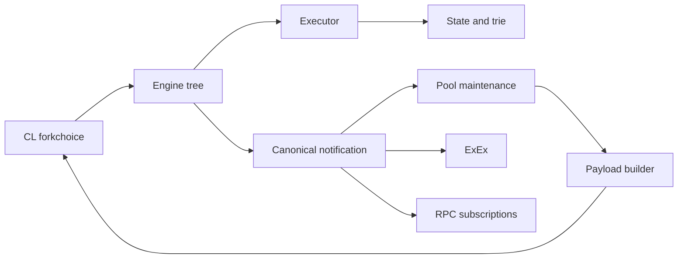

# Reth 深度模块学习树

本文档树是 [[reth-learning-guide|Reth 全栈学习指南]] 的下一层。根指南回答“Reth 是什么、整体怎样协作”；这里回答“每个编译模块为什么存在、内部算法怎样工作、边界和不变量是什么”。

源码基线为本仓库 Reth 2.4.0。workspace 当前包含 141 个 Cargo package，其中包括核心 crate、二进制、测试和示例。这里按架构责任组织，而不是按字母顺序罗列。

## 1. 文档树

```mermaid
flowchart TD
    ROOT[reth-learning-guide.md 根心智模型] --> MAP[00 workspace 与 crate 地图]
    ROOT --> FOUNDATION[基础层]
    ROOT --> CONTROL[控制流层]
    ROOT --> DATA[数据层]
    ROOT --> EDGE[边缘服务层]
    ROOT --> OPS[工程层]

    FOUNDATION --> P[01 primitives chainspec hardfork]
    FOUNDATION --> N[02 node types builder lifecycle]
    CONTROL --> E[03 engine tree chain state]
    CONTROL --> S[04 staged sync era]
    CONTROL --> X[05 EVM execution]
    CONTROL --> C[06 consensus validation]
    DATA --> D[07 storage provider V2]
    DATA --> T[08 trie state root proof]
    EDGE --> W[09 networking]
    EDGE --> M[10 transaction pool]
    EDGE --> B[11 payload building]
    EDGE --> R[12 RPC Engine API]
    OPS --> EX[13 ExEx hooks extensions]
    OPS --> PR[14 prune ETL static history]
    OPS --> RT[15 runtime metrics errors]
    OPS --> TS[16 testing examples workflow]
```



## 2. 源码分析的依赖层次

| 编号 | 深度文档 |
|---|---|
| 00 | [[00-workspace-crate-map|Workspace 与编译 crate 地图]] |
| 01 | [[01-primitives-chainspec-hardfork|Primitives、ChainSpec 与 Hardfork]] |
| 02 | [[02-node-builder-lifecycle|Node 类型、Builder 与生命周期]] |
| 03 | [[03-engine-tree-chain-state|Engine Tree、Chain State 与持久化]] |
| 04 | [[04-staged-sync-era|Staged Sync、Pipeline 与 ERA]] |
| 05 | [[05-evm-execution|EVM、revm 与区块执行]] |
| 06 | [[06-consensus-validation|执行层 Consensus Validation]] |
| 07 | [[07-storage-provider-v2|Storage API、Provider 与 Storage V2]] |
| 08 | [[08-trie-state-root-proof|Trie、State Root、Proof 与 Sparse Trie]] |
| 09 | [[09-networking|Discovery、RLPx、eth Wire 与 Downloader]] |
| 10 | [[10-transaction-pool|Transaction Pool]] |
| 11 | [[11-payload-building|Payload Builder]] |
| 12 | [[12-rpc-engine-api|JSON-RPC、Tracing 与 Engine API]] |
| 13 | [[13-exex-hooks-extensions|ExEx、Hooks 与扩展边界]] |
| 14 | [[14-prune-etl-static-history|Pruning、ETL 与历史生命周期]] |
| 15 | [[15-runtime-metrics-errors|Runtime、Metrics、Tracing 与错误治理]] |
| 16 | [[16-testing-examples-workflow|测试、Benchmark、Fuzz 与 Examples]] |

### 正确性主链

```text
01 -> 02 -> 03 -> 05 -> 06 -> 08 -> 07
```

这条依赖链从协议类型和装配开始，沿新区块验证直到 state root 和落盘。各文档已经直接给出对应源码切片，不要求再自行追踪才能理解正文。

### 性能主链

```text
04 -> 07 -> 08 -> 09 -> 10 -> 11 -> 15
```

这条依赖链聚焦批处理、混合存储、增量 trie、网络调度和构块 deadline。

### 扩展与工程主链

```text
00 -> 02 -> 16 -> 目标子系统 -> 15
```

这条依赖链说明编译边界、生命周期、扩展点与验证基础设施之间的关系。

## 3. 每篇文档直接给出的分析维度

每篇模块文档都直接回答下列内容：

1. 状态的所有者和唯一写入者。
2. 输入的信任边界。
3. 编译期与运行时不变量。
4. 正常、重试、回滚和关闭路径。
5. CPU、内存、磁盘和网络成本。
6. 可配置策略与不可更改的共识行为。
7. 关键源码片段的逐层解释。
8. 可迁移到 Go/C++/Java 等语言的设计思想。

## 4. 分层不等于单向调用

Reth 的编译依赖尽量从具体实现指向抽象，但运行时是事件环：



因此“依赖 A”与“运行时由 A 驱动”不是同一概念。Cargo.toml 描述编译依赖；channel、callback、trait object 和 handle 描述运行时控制流。

## 5. 文档中的源码引用约定

文档中路径有三类：

- `src/lib.rs`：公共 API 和模块边界。
- 主状态机文件：例如 engine tree 的 `tree/mod.rs`、pipeline 的 `pipeline/mod.rs`。
- tests/bench/examples：用于验证你对行为和性能的理解。

正文中的源码片段按“public trait → Ethereum implementation → 状态机调用点”排列，并注明文件路径。省略的泛型约束或错误分支会明确说明，不用读者自行补齐才能理解结论。

## 6. 这套文档提供的结果

每个模块最终收敛为：数据/状态流图、关键类型与所有者清单、不变量、失败恢复时序、关键源码分析，以及性能和语言无关设计推导。
